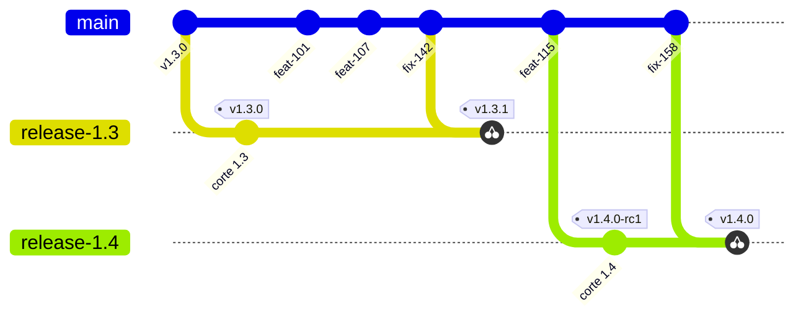
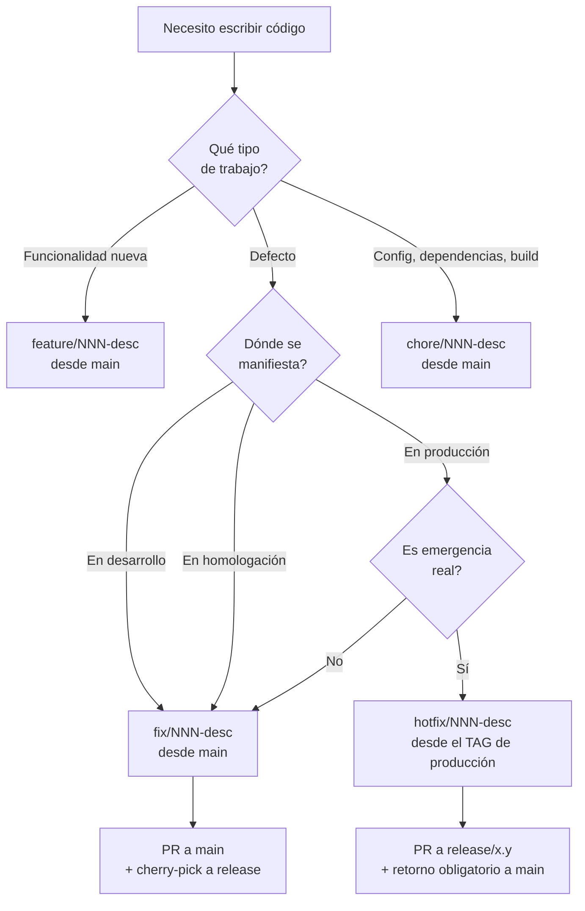

# Modelo adoptado

El equipo trabaja sobre una línea principal única a la que se integra por pull request, y corta ramas
de release cuando necesita estabilizar una versión. Las correcciones nacen siempre en la línea
principal y viajan a la release por cherry-pick, nunca al revés. Este documento fija las reglas; los
procedimientos que se derivan de ellas están en [07](07-Integracion-Y-Versionado.md) y
[08](08-Pull-Requests-Y-Pruebas.md).

Cada afirmación lleva una marca: **[F]** cuando está respaldada por una fuente externa listada en
[Anexos/Fuentes.md](Anexos/Fuentes.md), **[C]** cuando es una convención de este equipo. La
separación es deliberada: un documento de proceso pierde autoridad cuando presenta preferencias
propias como si fueran estándares.

## Inventario de ramas

Tres tipos. No hay un cuarto.

| Rama | Vida | Nace de | Quién escribe |
|---|---|---|---|
| `main` | permanente | — | nadie directamente: solo merges de pull request |
| `feature/*`, `fix/*`, `chore/*` | 1–2 días **[C]** | `main` | el desarrollador asignado |
| `release/x.y` | semanas, después se borra | `main`, o un commit anterior elegido | solo cherry-picks |

**No existe** una rama `develop`, ni `homologacion`, ni `produccion`. **[C]** Homologación y
producción son ambientes; lo que se mueve entre ellos son artefactos.



El desarrollo nunca se detiene en `main`; las ramas de release son ventanas de estabilización; las
correcciones viajan del tronco hacia las releases, jamás en sentido contrario.

## Las siete reglas

Todo el resto del procedimiento es consecuencia de estas siete.

1. **Toda rama nace de `main` actualizado. [C]** Única excepción: emergencia en producción.
2. **`main` está protegida. [C]** Sin push directo: se entra por pull request con verificación
   automática en verde y al menos una aprobación.
3. **Un issue → una rama → un pull request → un commit en `main`. [C]** Si un issue necesita dos
   ramas, estaba mal escrito.
4. **Los defectos se reproducen y corrigen en el tronco, con una prueba, y recién después se
   cherry-pickean a la rama de release. [F: TBD-1, SRE-2, GL-1]**
5. **No se corrigen defectos en la rama de release esperando llevarlos de vuelta al tronco. [F: TBD-2]**
6. **Se construye una sola vez; se promociona el artefacto, no se recompila por ambiente. [F: SRE-1]**
7. **La configuración depende del ambiente por variable de entorno, nunca de la rama ni de
   compilación condicional. [C]**

### Por qué las reglas 4 y 5 son el corazón del modelo

Tres organizaciones independientes documentan la misma práctica:

- **[F: TBD-1]** La recomendación para equipos de desarrollo basado en tronco es reproducir el
  defecto en el tronco, corregirlo ahí con una prueba, dejar que el servidor de integración lo
  verifique, y después cherry-pickearlo a la rama de release, esperando que la verificación dedicada
  a esa rama lo confirme también.
- **[F: SRE-2]** Google describe que la mayoría de sus proyectos grandes ramifica desde el tronco en
  una revisión específica y **nunca** mergea esa rama de vuelta; las correcciones se envían al tronco
  y se cherry-pickean a la rama de release.
- **[F: GL-1]** GitLab documenta arreglar hacia adelante y después cherry-pickear a la rama de patch
  release, porque el problema clásico es corregir en la versión recién liberada y olvidarse de
  corregir en la principal.

El contrapunto existe y no conviene ocultarlo: **[F: NVIE-1]** GitFlow propone exactamente lo
contrario —estabilizar sobre la rama de release y mergear después hacia la rama de desarrollo—. El
desacuerdo es real y se resuelve por contexto, no por autoridad: el contexto de una aplicación web
con despliegue frecuente y una sola versión viva apunta al modelo de este documento, y el de un
producto instalable con varias versiones soportadas apunta al otro.

## De dónde nace cada rama



### Nomenclatura **[C]**

| Prefijo | Uso | Nace de | Ejemplo |
|---|---|---|---|
| `feature/` | Funcionalidad nueva | `main` | `feature/107-filtro-por-partida` |
| `fix/` | Corrección de defecto | `main` | `fix/142-superficie-con-fraccion` |
| `chore/` | Dependencias, build, configuración | `main` | `chore/119-actualizar-sdk` |
| `hotfix/` | Emergencia en producción | tag de producción | `hotfix/199-timeout-consulta` |

El número de issue adelante permite rastrear cualquier commit hasta su ticket sin abrir el tablero.

## La única excepción: emergencia en producción

Se activa **solo** si se cumple alguna de estas condiciones:

- el servicio está caído o degradado para los usuarios;
- hay una vulnerabilidad de seguridad siendo explotada;
- el cherry-pick desde `main` no aplica limpio porque el tronco divergió demasiado.

```bash
# Desde el TAG, no desde la punta de release/1.3:
# la punta puede tener correcciones ya mergeadas pero todavía no liberadas.
git checkout -b hotfix/199-timeout-consulta v1.3.2
# ... corrección mínima + prueba que la cubre ...
git push -u origin hotfix/199-timeout-consulta
# PR contra release/1.3 → tag v1.3.3 → despliegue
# Y EL MISMO DÍA: PR de retorno a main
```

Si la corrección no vuelve a `main`, el defecto reaparece en la próxima versión. Es el único error de
este modelo que sale realmente caro, y por eso la auditoría de convergencia del
[anexo de workflows](Anexos/workflows/) lo detecta de forma automática. **[C]**

## Aplicación por escenario

| Escenario | Contexto C-1 (sin release abierta) | Contexto C-2 (con release abierta) |
|---|---|---|
| **E-01** Funcionalidad | Rama corta → PR → `main`. Viaja en la próxima versión | Igual, y **no** se cherry-pickea salvo que estuviera en el alcance de la release |
| **E-02** Defecto | Rama corta → PR → `main` | Igual, más cherry-pick `-x` a `release/x.y` y nueva candidata |
| **E-05** Emergencia | No aplica: no hay release viva que parchear | Rama desde el tag → PR a `release/x.y` → retorno a `main` |
| **E-07** Mantenimiento | Rama `chore/` → PR → `main` | Igual; entra a la release solo si es condición de la liberación |

## Guardarraíles

Sin estos controles el modelo se degrada solo en un par de meses.

**Protección de rama.** `main` y `release/*` sin push directo; pull request obligatorio con
verificación en verde y aprobación registrada; archivo `CODEOWNERS` que asigne revisor por carpeta.
Las migraciones de base de datos y los archivos de pipeline conviene que tengan dueño explícito: son
los dos lugares donde un error no se resuelve con un revert. **[C]**

**Auditoría de convergencia.** Un chequeo automático verifica que todo commit en `release/*` tenga su
equivalente en `main`. Como `cherry-pick -x` deja el SHA original en el mensaje, la verificación es
directa; un commit de release sin origen en el tronco es un hotfix sin retorno y hay que alertarlo.
**[C]**

**Higiene de ramas.** Las ramas cortas se borran al mergear **[F: TBD-2]**; las de release se borran
cuando caen en desuso **[F: TBD-1]**; una rama corta con más de una semana de vida se revisa en la
reunión de equipo **[C]**.

## Antipatrones

| Antipatrón | Por qué falla |
|---|---|
| Ramas de ambiente (`homologacion`, `produccion` como ramas) | El código de cada ambiente diverge y deja de ser cierto que se probó lo que se libera |
| Recompilar por ambiente | Se libera un binario distinto del que se probó **[F: SRE-1]** |
| Corregir en la release y prometer el retorno | El retorno se olvida y el defecto regresa **[F: TBD-2]** |
| Pull requests de más de mil líneas | La revisión se vuelve simbólica **[F: GOOG-1]** |
| Cerrar el issue al mergear | Se pierde la trazabilidad de la verificación |
| Enviar todo cambio al comité de cambios | Identificado explícitamente como antipatrón **[F: ITIL-1]** |
| Tres o más releases vivas | Cherry-picks a la rama equivocada **[F: TBD-1]** |
| Refactor oportunista dentro de una corrección | Imposible de revertir sin perder el arreglo |

## Preguntas guía

1. ¿Qué regla se está rompiendo cuando alguien dice «lo arreglo directo en la release, es más rápido»?
2. Si hay dos releases vivas y llega una corrección, ¿a cuál va? ¿Quién lo decide?
3. ¿Qué evidencia queda de que un hotfix volvió al tronco?
4. ¿Cuál de las siete reglas es la más difícil de sostener en el equipo propio, y qué la haría fácil?

## Criterios de calidad

El modelo está funcionando si se cumplen tres condiciones observables: no hay ramas cortas de más de
una semana, toda rama de release tiene su equivalencia completa en `main`, y nadie necesita preguntar
de dónde ramar. Cuando alguna de las tres falla, la causa está casi siempre en el tamaño de los pull
requests, no en el modelo.

---

Sigue: [07 — Integración y versionado](07-Integracion-Y-Versionado.md).
