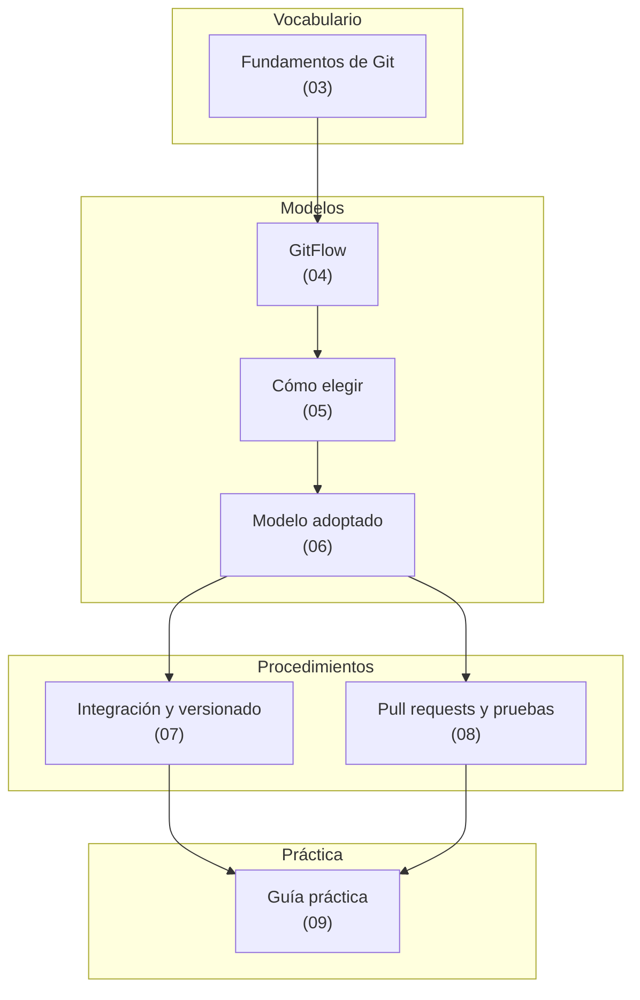

# Mapa conceptual

Este documento no explica nada: enruta. Sirve para entrar por donde uno está parado —un escenario,
un rol o un artefacto— y llegar al documento que lo trata. Las definiciones de `E-*`, `C-*` y `A-*`
están en [01 — Marco de referencia](01-Marco-De-Referencia.md).

## El dominio de un vistazo

## Entrada por escenario

| Escenario | Qué se hace primero | Documento |
|---|---|---|
| **E-01** Funcionalidad nueva | Rama corta desde la línea principal, PR en borrador | [08](08-Pull-Requests-Y-Pruebas.md) · práctica [E-01](../GitFlow-Practice-Guide/01-Funcionalidad-Nueva.md) |
| **E-02** Defecto antes de liberar | Reproducir con una prueba que falle, arreglar en la línea principal | [06](06-Modelo-Adoptado.md) · práctica [E-02](../GitFlow-Practice-Guide/02-Defecto-Con-Release-Abierta.md) |
| **E-03** Corte de versión | Cortar `release/x.y` lo más tarde posible y numerar la candidata | [07](07-Integracion-Y-Versionado.md) · práctica [E-03](../GitFlow-Practice-Guide/03-Corte-De-Release.md) |
| **E-04** Estabilización | Admitir por cherry-pick solo lo que corresponde, regenerar la candidata | [07](07-Integracion-Y-Versionado.md) |
| **E-05** Emergencia | Ramar desde el **tag** de producción y planificar el retorno del arreglo | [06](06-Modelo-Adoptado.md) · práctica [E-05](../GitFlow-Practice-Guide/05-Emergencia-En-Produccion.md) |
| **E-06** Versión de demostración | Construir un artefacto identificable y desechable | [07](07-Integracion-Y-Versionado.md) · práctica [E-06](../GitFlow-Practice-Guide/06-Version-De-Demostracion.md) |
| **E-07** Mantenimiento | `chore/`, mismo circuito que cualquier cambio | [08](08-Pull-Requests-Y-Pruebas.md) |
| **E-08** Rechazo de un cambio | Leer el reporte del pipeline antes que el código | [08](08-Pull-Requests-Y-Pruebas.md) · práctica [E-08](../GitFlow-Practice-Guide/04-PR-Que-Rompe-La-Regresion.md) |

## Entrada por rol

| Actor | Lo primero que necesita | Después |
|---|---|---|
| **A-DEV** que recién entra | [03](03-Fundamentos-De-Git.md) y [06](06-Modelo-Adoptado.md) | [08](08-Pull-Requests-Y-Pruebas.md), y practicar E-01 y E-02 |
| **A-QA** | [01](01-Marco-De-Referencia.md) y [07](07-Integracion-Y-Versionado.md): qué se prueba en cada ambiente | Práctica E-02 y E-08 |
| **A-OPS** | [07](07-Integracion-Y-Versionado.md) y los [workflows](Anexos/workflows/) | Práctica E-03 y E-05 |
| **A-PO** | [07](07-Integracion-Y-Versionado.md), sección de ambientes y versiones | [Anexos/Preguntas-Frecuentes.md](Anexos/Preguntas-Frecuentes.md) |
| **A-AUT** | [07](07-Integracion-Y-Versionado.md), autorización y tags | — |
| Quien evalúa cambiar de modelo | [04](04-GitFlow.md) y [05](05-Como-Elegir-El-Modelo.md) | — |

## Entrada por artefacto

Qué se produce en el circuito, quién lo produce y dónde está descripto.

| Artefacto | Produce | Se verifica con | Documento |
|---|---|---|---|
| Rama corta | A-DEV | Nombre según convención; objetivo de vida ≤ 2 días, umbral normativo > 7 días | [06](06-Modelo-Adoptado.md) |
| Pull request | A-DEV | Plantilla completa y CI en verde | [08](08-Pull-Requests-Y-Pruebas.md) · [plantilla](Anexos/Plantillas.md) |
| Commit en la línea principal | Merge del PR | Uno por issue, mensaje convencional | [08](08-Pull-Requests-Y-Pruebas.md) |
| Rama de release | A-OPS | Existe una sola candidata activa | [07](07-Integracion-Y-Versionado.md) |
| Candidata (`v1.4.0-rc2`) | Pipeline | Artefacto construido una sola vez | [07](07-Integracion-Y-Versionado.md) |
| Tag de versión | A-OPS tras autorización | Inmutable, apunta al commit liberado | [07](07-Integracion-Y-Versionado.md) |
| Reporte de pruebas E2E | Pipeline | Artefacto de la corrida | [08](08-Pull-Requests-Y-Pruebas.md) |
| Registro de autorización | A-AUT | Antes del despliegue a producción | [07](07-Integracion-Y-Versionado.md) |

## Ruta de lectura sugerida

Para alguien sin experiencia previa, en este orden: **03 → 04 → 05 → 06 → 07 → 08 → 09**. Los
documentos 04 y 05 se pueden saltear si el equipo ya decidió su modelo y solo hace falta operarlo;
lo que no conviene saltear es 06, porque es el que fija las reglas que después la práctica ejercita.

---

Sigue: [03 — Fundamentos de Git](03-Fundamentos-De-Git.md).
