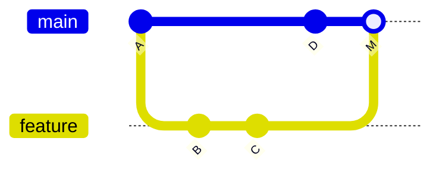
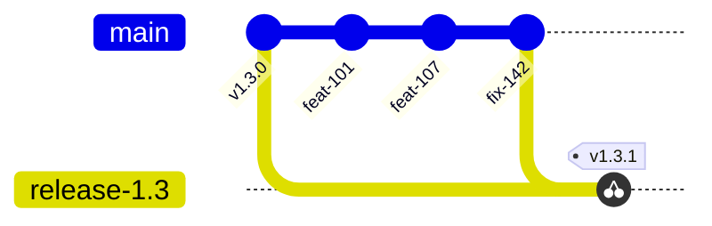

# Fundamentos de Git

Un modelo de ramas es un conjunto de acuerdos sobre cinco operaciones de Git. Quien no distingue un
merge de un cherry-pick no puede evaluar por qué un modelo elige uno u otro, y termina siguiendo el
procedimiento de memoria. Este documento cubre solo lo necesario para leer el resto de la guía.

## Definición

Git guarda **instantáneas completas** del árbol de archivos, no diferencias. Cada commit apunta a su
padre —o a sus dos padres, si es un merge—, y de esa cadena sale toda la historia. Una **rama** no es
una copia de nada: es un puntero móvil a un commit, y por eso crear una rama cuesta lo mismo que
escribir cuarenta bytes. Esa baratura es la que habilita todos los modelos que vienen después.

> **[F: NVIE-1]** El autor de GitFlow describe el punto con precisión: Git cambió la manera en que
> los desarrolladores piensan el merge y el branching. Viniendo de CVS/Subversion, ramar y mergear
> se consideraba algo temible que se hacía cada tanto; en Git son baratos y simples, y forman parte
> del flujo de trabajo diario.

Lo que **no** es una rama: un ambiente, una versión ni una garantía de calidad. Un ambiente es
infraestructura donde corre un artefacto; una versión es un tag; la calidad es el resultado de una
verificación. Confundir estas cuatro cosas con ramas es el origen de la mayoría de los modelos que
se degradan.

## Las cinco operaciones que importan

### `merge`

Une dos historias creando un commit con dos padres. Conserva todo: los commits originales quedan en
la historia y se ve de dónde vino cada uno.



Con `--no-ff` el commit de merge se crea aun cuando Git podría avanzar el puntero sin más. GitFlow lo
exige por una razón concreta: **[F: NVIE-1]** sin ese commit es imposible ver en la historia qué
commits implementaron juntos una funcionalidad, y revertir la funcionalidad completa pasa de ser
trivial a ser un dolor de cabeza.

### `squash merge`

Aplana todos los commits de la rama en **uno solo** sobre el destino. La historia de la rama se
pierde; lo que queda es un commit por unidad de trabajo. Es lo contrario de la decisión anterior, y
la contrapartida es la que se explica en [06 — Modelo adoptado](06-Modelo-Adoptado.md): un solo SHA
por issue hace que llevar ese cambio a otra rama sea una operación de un paso.

### `rebase`

Reescribe los commits de una rama como si hubieran nacido de otro punto. Produce una historia lineal
y limpia, al precio de cambiar los identificadores de los commits. Regla práctica: se rebasa lo que
todavía es privado; no se rebasa lo que otros ya bajaron.

### `cherry-pick`

Aplica **un commit específico** sobre otra rama, salteando todo lo que ocurrió entre el punto de
corte y ese commit. Es la operación central de los modelos con rama de release: permite llevar una
corrección a una versión estable sin arrastrar las funcionalidades que entraron después.



La rama `release-1.3` recibe `fix-142` **sin** recibir `feat-101` ni `feat-107`. Esta es la respuesta
técnica a la objeción más frecuente contra arreglar en la línea principal: no, no se arrastran las
funcionalidades nuevas, porque no se mergea la rama, se traslada un commit.

La variante `cherry-pick -x` agrega al mensaje del commit nuevo el SHA del original. Ese rastro es lo
que hace auditable la convergencia entre ramas, y de él depende el chequeo automático del
[anexo de workflows](Anexos/workflows/).

### `tag`

Un puntero **inmutable** a un commit. Una rama se mueve cuando llegan commits; un tag no se mueve
nunca. Ante la pregunta «qué hay en producción», la respuesta correcta es un tag —o el artefacto
construido desde él—, jamás un nombre de rama.

## Aplicación por escenario

| Escenario | Operación protagonista | Por qué |
|---|---|---|
| **E-01** Funcionalidad nueva | `merge` del PR (squash o `--no-ff` según el modelo) | Incorpora trabajo completo a la línea de integración |
| **E-02** Defecto con release abierta | `cherry-pick -x` | Lleva la corrección sin arrastrar lo que entró después |
| **E-03** Corte de versión | `branch` desde un commit elegido | La rama de release es una foto de un punto del tronco |
| **E-05** Emergencia | `branch` desde el **tag** | La punta de la rama de release puede tener cambios no liberados |
| **E-06** Demostración | `tag` con sufijo de precedencia | Identifica un artefacto sin comprometerse a soportarlo |

En contexto **C-4** —varias versiones vivas— la operación protagonista deja de ser el cherry-pick y
pasa a ser el merge entre ramas de larga vida; es exactamente la diferencia que trata
[05 — Cómo elegir el modelo](05-Como-Elegir-El-Modelo.md).

## Ejemplo concreto

Una corrección que ya está en la línea principal como `a3f9c21` y debe llegar a la release abierta:

```bash
git checkout release/1.4
git pull --ff-only
git cherry-pick -x a3f9c21
git push
```

El `--ff-only` es deliberado: si la copia local divergió del remoto, conviene que la operación falle
de manera ruidosa en lugar de generar un merge silencioso que nadie pidió. El commit resultante en
`release/1.4` tiene contenido idéntico al original pero **otro SHA**, y su mensaje incluye la línea
`(cherry picked from commit a3f9c21)` que deja el rastro.

## Preguntas guía

1. ¿Por qué el SHA cambia al hacer cherry-pick, y qué consecuencia tiene para comparar ramas?

   El SHA es el hash del commit entero: árbol, padre, autor y fecha. Cambiado el padre, cambia el
   identificador aunque el diff sea idéntico. Comparar ramas por SHA reporta entonces como faltantes
   correcciones que ya están aplicadas; por eso la auditoría de convergencia usa `git cherry`, que
   compara por contenido del cambio.

2. Si una rama de release recibe un cherry-pick, ¿sigue siendo cierto que la rama es «estable»? ¿Qué
   es lo verdaderamente inmutable?

   Cada cherry-pick mueve la punta de `release/1.4`, así que «estable» nombra un criterio de
   admisión, no una propiedad del puntero. Lo inmutable es el tag. De ahí que la emergencia (E-05)
   rame desde el tag y no desde la punta de la release: ahí puede haber correcciones todavía no
   liberadas.

3. ¿En qué caso conviene `--no-ff` y en cuál `squash`? ¿Qué gana y qué pierde cada uno?

   `--no-ff` conserva los commits originales y deja ver qué conjunto implementó una funcionalidad,
   lo que vuelve trivial revertirla completa **[F: NVIE-1]**; el costo es una línea principal con
   commits intermedios. `squash` resigna esa historia y gana un SHA por issue, que es lo que hace el
   cherry-pick a una release de un solo paso **[C]**.

4. ¿Qué información se pierde si se hace cherry-pick sin `-x`?

   Se pierde la línea `(cherry picked from commit a3f9c21)`, o sea el puente entre el commit de la
   release y su original en la línea principal, con el pull request y el issue que cuelgan de él. La
   detección de divergencias no se resiente, porque compara contenido. Lo que se degrada es la
   lectura humana de la historia.

## Criterios de calidad

Una historia de repositorio bien llevada permite responder, sin abrir el tablero de tickets: qué
cambio introdujo cada commit de la línea principal, a qué issue corresponde, y si ese cambio está o
no en cada release viva. Si para responder eso hay que preguntarle a alguien, el modelo no está
funcionando, por más que las ramas tengan los nombres correctos.

---

Sigue: [04 — GitFlow](04-GitFlow.md).
