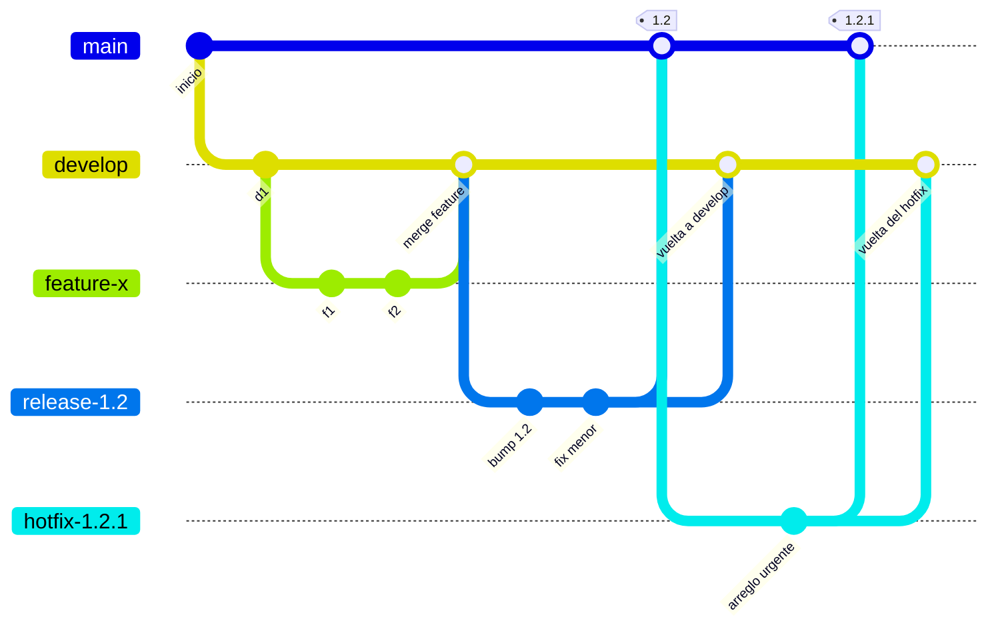

# GitFlow

GitFlow es el modelo de ramas publicado por Vincent Driessen en enero de 2010. Se volvió tan
difundido que buena parte de la industria usa «gitflow» como sinónimo de «trabajar con ramas», lo
cual es un problema, porque GitFlow es **un** modelo concreto con reglas concretas y con un contexto
de aplicación que su propio autor acotó diez años después.

Todo lo que sigue está tomado del artículo original y de la nota de reflexión que el autor le agregó
en marzo de 2020. **[F: NVIE-1]**

## Definición

GitFlow organiza el repositorio alrededor de **dos ramas de vida infinita** y **tres tipos de rama de
soporte**.

| Rama | Vida | Qué garantiza |
|---|---|---|
| `master` | infinita | Su `HEAD` refleja siempre un estado listo para producción. **Cada merge a `master` es, por definición, una nueva liberación** |
| `develop` | infinita | Su `HEAD` refleja los últimos cambios entregados para la próxima liberación. Es la rama de integración, de donde salen las compilaciones nocturnas |

Las tres ramas de soporte tienen vida limitada y reglas estrictas sobre de dónde nacen y a dónde
deben volver:

| Rama | Nace de | Debe volver a | Nombre |
|---|---|---|---|
| Funcionalidad | `develop` | `develop` | cualquiera salvo `master`, `develop`, `release-*`, `hotfix-*` |
| Release | `develop` | `develop` **y** `master` | `release-*` |
| Hotfix | `master` | `develop` **y** `master` | `hotfix-*` |



## Cómo funciona cada pieza

### Ramas de funcionalidad

Nacen de `develop` y existen mientras la funcionalidad se desarrolla. Al terminar se mergean de
vuelta a `develop` —o se descartan, si el experimento no prosperó—. El artículo original señala que
estas ramas viven típicamente **solo en el repositorio del desarrollador**, no en `origin`.

El merge se hace con `--no-ff` y el motivo es explícito: sin el commit de merge se pierde la
información de que un grupo de commits formó una funcionalidad, y revertirla completa se vuelve muy
difícil.

### Ramas de release

Nacen de `develop` **cuando `develop` ya refleja el estado deseado de la nueva versión**: todas las
funcionalidades que van en esa liberación tienen que estar mergeadas antes del corte, y las que
apuntan a versiones futuras deben esperar.

Es en el corte donde la versión **recibe su número**, no antes. Hasta ese momento `develop` reflejaba
«la próxima versión» sin que estuviera decidido si sería 0.3 o 1.0.

Durante la vida de la rama se aplican correcciones menores y se prepara la metadata de la versión.
Agregar funcionalidades grandes ahí está estrictamente prohibido. Al cerrar: merge a `master`, tag, y
merge de vuelta a `develop` para que las correcciones no se pierdan —paso que el propio artículo
advierte que suele generar conflicto, típicamente por el número de versión—.

### Ramas de hotfix

Nacen del tag de `master` que marca la versión en producción, y sirven para actuar de inmediato sobre
un estado indeseado de esa versión. Vuelven a `master` —con nuevo tag— y a `develop`. La razón de ser
es que el trabajo del resto del equipo sobre `develop` pueda continuar mientras alguien prepara el
arreglo.

## Aplicación por escenario

| Escenario | En GitFlow |
|---|---|
| **E-01** Funcionalidad nueva | Rama desde `develop`, merge `--no-ff` a `develop` |
| **E-02** Defecto antes de liberar | Se corrige **en la rama de release**, y vuelve a `develop` al cerrarla |
| **E-03** Corte de versión | Rama desde `develop` cuando el alcance está completo; ahí se asigna el número |
| **E-04** Estabilización | Correcciones menores sobre la rama de release; nada de funcionalidades |
| **E-05** Emergencia | Rama desde el tag de `master`; vuelve a `master` y a `develop` |
| **E-06** Demostración | No está previsto en el modelo original; se resuelve con un tag sobre `develop` |

En **C-4** —varias versiones soportadas en paralelo— el modelo encaja de forma natural: `master`
representa lo liberado, y las ramas de hotfix atienden cada versión desde su tag. En **C-2** —una
sola versión viva, despliegue frecuente— el modelo agrega una rama de vida infinita cuyo trabajo
consiste en ser un intermediario entre las ramas cortas y `master`.

## La nota de 2020, que cambia cómo hay que leer el modelo

Diez años después de publicarlo, el autor agregó una advertencia al artículo. **[F: NVIE-1]** Sus
puntos, resumidos sin interpretación:

- El modelo fue concebido en 2010, poco después de la aparición de Git, y se volvió tan popular que
  se lo empezó a tratar como un estándar, y también como dogma o panacea.
- En esos diez años el tipo de software más desarrollado con Git se corrió hacia las aplicaciones
  web, que se entregan de forma continua, no se revierten, y no requieren soportar múltiples
  versiones corriendo en el mundo.
- Esa **no** es la clase de software que tenía en mente al escribirlo. Para un equipo que hace
  entrega continua sugiere adoptar un flujo mucho más simple, como GitHub Flow, en lugar de forzar
  GitFlow.
- Si en cambio el software está explícitamente versionado o hay que soportar varias versiones en
  producción, GitFlow puede seguir siendo tan buen encaje como lo fue durante esos diez años.

Esta guía toma esa nota literalmente: GitFlow no es el modelo por defecto ni el modelo equivocado; es
el modelo **de un contexto**, y el contexto es C-4.

## Ejemplo concreto

Cierre de la versión 1.2, tal como aparece en el artículo original:

```bash
git checkout -b release-1.2 develop   # corte: acá se decide que será 1.2
# ... se fija el número de versión en los archivos que corresponda, se commitea ...
git checkout master
git merge --no-ff release-1.2
git tag -a 1.2
git checkout develop
git merge --no-ff release-1.2         # para no perder las correcciones de la release
git branch -d release-1.2
```

El doble merge es la firma del modelo: toda rama de soporte que toca `master` tiene que volver
también a `develop`, y ese es a la vez su mayor virtud —nada se pierde— y su mayor costo operativo
—nadie se puede olvidar—.

## Preguntas guía

1. ¿Qué garantiza `master` en GitFlow y qué garantiza `develop`? ¿Cuál de las dos se parece a la
   línea principal de un modelo sin `develop`?

   `master` garantiza que su `HEAD` es un estado liberable, y cada merge ahí es una liberación;
   `develop` garantiza lo último integrado para la versión que viene. Conviene mirar la función y
   no el nombre: la línea principal de un modelo sin `develop` es donde todos integran a diario,
   así que se parece a `develop`. El papel de `master` lo cumplen ahí los tags de versión.

2. Si una corrección se hace en la rama de release y esa rama se borra sin mergear a `develop`, ¿qué
   pasa con la próxima versión?

   Razonarlo por alcance: el commit existe en la rama de release y llegó a `master` con el merge
   de cierre, pero ningún ancestro de `develop` lo contiene. La versión liberada sale corregida y
   la siguiente nace sin el arreglo, de modo que el defecto reaparece como regresión y sin rastro
   de que alguna vez se resolvió. El escenario **E-02** depende entero de ese segundo merge.

3. ¿Cuántos merges necesita un hotfix para quedar completo? ¿Qué falla si falta uno?

   Dos: a `master`, con tag nuevo, y a `develop`. Preguntarse qué queda descubierto en cada
   omisión ordena el análisis. Sin el primero, producción nunca recibe el arreglo. Sin el segundo,
   la próxima release lo pisa, porque el hotfix nació del tag y `develop` jamás lo vio. Nada
   avisa: el olvido se descubre cuando el defecto vuelve.

4. ¿El equipo propio está en el contexto para el que el autor lo recomienda hoy?

   La nota de 2020 fija el criterio **[F: NVIE-1]**: software explícitamente versionado o varias
   versiones en producción. Hay que contar cuántas versiones reciben correcciones hoy y con qué
   cadencia se libera. Una respuesta fundada nombra esos números; una vaga invoca la costumbre o
   lo que hace otro equipo. Tres o más versiones soportadas ubican al equipo en **C-4**; una sola
   deja a `develop` sin trabajo que hacer.

## Criterios de calidad

Un GitFlow bien implementado se reconoce en que **ninguna rama de soporte se borra sin haber vuelto a
sus dos destinos**, y en que el número de versión aparece en el corte de la release y no antes. Un
GitFlow mal implementado se reconoce en `develop` y `master` divergiendo durante semanas: cuando eso
pasa, `master` dejó de significar «producción» y el modelo ya no describe la realidad.

---

Sigue: [05 — Cómo elegir el modelo](05-Como-Elegir-El-Modelo.md).
