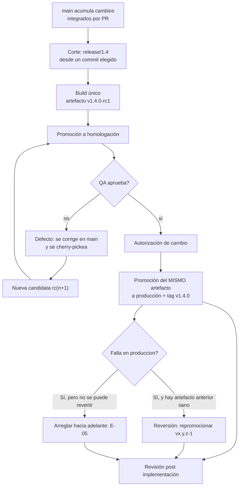

# Integración, versionado y ciclo de vida

Un modelo de ramas no dice nada sobre qué corre en cada ambiente ni sobre qué significa «la versión
1.4». Ese es el trabajo de este documento: definir qué se construye, cómo se numera, cómo se mueve
entre ambientes y quién autoriza cada paso.

## Definición: los cuatro objetos que no hay que confundir

| Objeto | Qué es | Qué **no** es |
|---|---|---|
| **Rama** | Puntero móvil a un commit | Un ambiente, ni una versión |
| **Tag** | Puntero inmutable a un commit; `v1.4.0` | Un artefacto: es su origen, no su binario |
| **Artefacto** | Resultado compilado y versionado del build | Algo que se rehace por ambiente |
| **Ambiente** | Infraestructura donde corre un artefacto | Una rama |

La confusión típica —«producción es la rama `produccion`»— hace que el código de cada ambiente
diverja y destruye la propiedad que justifica todo el proceso: que lo que se libera sea exactamente
lo que se probó.

### Desplegar no es liberar

**Desplegar** es una operación técnica: poner un artefacto a correr en un ambiente. **Liberar** es una
decisión de negocio: exponer una funcionalidad a los usuarios. Los feature flags son lo que permite
separarlos, y esa separación es la que evita que la rama larga sea el único mecanismo disponible para
ocultar trabajo incompleto.

## Correspondencia ambiente–contenido–tag

Cada ambiente se registra con los campos que pide **[F: ISO-29119]** —identificador, responsable de
proveerlo, período y fidelidad—, más quién puede desplegar en él. Sin esos campos instanciados, un
ambiente no existe como pieza del procedimiento: se negocia de cero cada vez.

| Ambiente | Contenido | Tag típico | Cómo se actualiza | Responsable de proveerlo | Quién puede desplegar | Fidelidad |
|---|---|---|---|---|---|---|
| Integración | punta de `main` | ninguno | automática en cada merge | A-OPS | solo el pipeline | Datos de prueba sembrados por sesión; sin integraciones externas |
| Homologación | candidata activa | `v1.4.0-rc2` | promoción del artefacto | A-OPS | A-OPS | Misma configuración que producción salvo datos, anonimizados |
| Producción | último liberado | `v1.3.2` | promoción previa autorización | A-OPS | A-OPS, con autorización de A-AUT registrada | — |
| Efímero / demostración | lo que se quiera mostrar | `v1.5.0-demo.3` | se levanta desde el artefacto y se destruye | quien pide la demo, con apoyo de A-OPS | quien lo levantó | Sin datos reales; no soportado |

En la [guía práctica](../GitFlow-Practice-Guide/README.md) estos cuatro ambientes se representan con
contenedores locales levantados desde el mismo binario publicado, y así queda declarado en el
[escenario 00](../GitFlow-Practice-Guide/00-Preparacion.md): la promoción se ejercita de verdad sobre el
artefacto, aunque el «ambiente» sea un contenedor en la máquina de un integrante. **[C]**

Ante la pregunta «qué hay en producción», la respuesta correcta es un tag. El nombre de una rama no
es respuesta, porque la rama se mueve.

## Versionado

Se usa versionado semántico `MAJOR.MINOR.PATCH` **[F: SEMVER-1]** y mensajes de commit según
Conventional Commits **[F: CC-1]**, lo que permite derivar el registro de cambios del historial en
lugar de mantenerlo a mano.

| Cambio | Qué incrementa | Ejemplo |
|---|---|---|
| Corrección compatible | PATCH | `v1.3.1` → `v1.3.2` |
| Funcionalidad compatible | MINOR | `v1.3.2` → `v1.4.0` |
| Cambio incompatible | MAJOR | `v1.4.0` → `v2.0.0` |
| Candidata | sufijo de precedencia | `v1.4.0-rc1`, `v1.4.0-rc2` |
| Demostración **[C]** | sufijo propio, nunca soportado | `v1.5.0-demo.3` |

El sufijo de precedencia no es decorativo: en versionado semántico una versión con sufijo tiene menor
precedencia que la versión limpia, de modo que `v1.4.0-rc2` es anterior a `v1.4.0` para cualquier
herramienta que compare versiones.

## Ciclo de vida de una versión

### Reversión de un pase a producción **[C]**

«Revertir» en este modelo significa **repromocionar el artefacto anterior**, no revertir commits: los
commits ya están en `main` y en la release, y ahí se quedan. La operación es la misma promoción, con
el artefacto de la versión previa y su digest registrado.

| Punto | Definición |
|---|---|
| Quién decide | A-AUT, a pedido de A-OPS o de A-QA |
| Umbral | Impacto en usuarios que no se resuelve con un parche dentro de la ventana del incidente |
| Qué se registra | Decisión, hora, versión de la que se vuelve y a la que se vuelve, y digest del artefacto repuesto |
| Qué pasa con el tag | El tag de la versión fallida **no se borra ni se reutiliza**: se anota como retirada en la publicación de GitHub |
| Qué pasa con el issue | Se reabre el issue del defecto y se abre uno de emergencia; la revisión posterior a la implementación es obligatoria **[F: ITIL-1]** |

**Casos que no admiten reversión:** migraciones de datos ya aplicadas y cambios de esquema no
compatibles hacia atrás. Ahí la única salida es arreglar hacia adelante por la vía de excepción del
[modelo adoptado](06-Modelo-Adoptado.md), y por eso las migraciones tienen dueño explícito en
`CODEOWNERS`.

### Cuándo se corta la release

Lo más tarde posible. **[F: TBD-1]** La rama se crea *just in time* —unos días antes de liberar— para
que sea un lugar estable mientras el resto sigue integrando al tronco a máxima velocidad. Y admite
**corte retroactivo**: quien la crea puede alcanzar un commit anterior, un SHA conocido como bueno o
simplemente el último antes del trabajo no deseado, y ramar desde ahí.

Esto elimina la ansiedad del corte: no hace falta congelar nada ni correr para «entrar en la
release». Si entró al tronco algo que no se quiere liberar, el corte retroactivo y el cherry-pick
selectivo resuelven el caso.

### Cuántas releases vivas

Dos como máximo: la que está en producción y la candidata. **[F: TBD-1]** Con tres, el riesgo de
cherry-pickear a la rama equivocada deja de ser hipotético.

### Criterios de admisión a una release

Una vez cortada la rama, **no todo lo que entra a `main` entra a esa release**. Conviene tener el
criterio por escrito antes de necesitarlo.

> **[F: PYT-1]** El equipo de release de PyTorch usa el proceso de cherry-pick para gestionar el
> riesgo de calidad, portando a la rama de release un conjunto mínimo de commits considerados
> imprescindibles; en la fase tardía solo admite arreglos críticos que bloquean la liberación
> —corrupción silenciosa de datos, compatibilidad hacia atrás, caídas, deadlocks y fugas grandes de
> memoria—, y exige que el cambio ya haya aterrizado en el tronco antes de crear el PR contra la
> rama de release.

Adaptación de este equipo **[C]**. Los tramos se anclan a **hitos observables**, no a duraciones
relativas, y forman una partición del intervalo entre el corte y el pase: cada día cae en un tramo y
en uno solo.

| Tramo | Desde (inclusive) | Hasta (exclusive) | Qué se admite |
|---|---|---|---|
| Estabilización | el **corte** de `release/x.y` | el **congelamiento** | Cualquier defecto reportado por A-QA sobre la candidata |
| Congelamiento | el **congelamiento** | el **pase** a producción | Solo bloqueantes |

El **congelamiento** es una fecha que A-OPS y A-PO fijan y escriben en el registro de release al
cortar, junto con la fecha de pase prevista. No es «la primera semana» ni «los últimos días»: es un
hito con fecha, porque una rama de release dura semanas y con tramos relativos los días del medio
quedaban sin criterio, que es justo la ventana donde se discute cada cherry-pick.

## Build hermético y promoción

**Se construye una sola vez.** El artefacto que aprueba QA en homologación es el mismo binario que se
despliega en producción; lo único que cambia entre ambientes es la configuración, inyectada por
variable de entorno.

### La promoción, como operación concreta **[C]**

Sin estos cuatro puntos «promocionar» es una palabra y el equipo termina recompilando por ambiente
sin darse cuenta:

| Qué | Cómo se resuelve en este modelo |
|---|---|
| Qué identifica al artefacto | Nombre `movilidad-urbana-<tag>-linux-x64.tar.gz` **y** su digest SHA-256, registrado en el registro de release |
| Dónde vive entre ambientes | Como artefacto de la corrida que lo construyó y adjunto a la publicación de GitHub de la candidata; los ambientes lo descargan de ahí, nunca lo recompilan |
| Quién lo mueve | A-OPS; a producción, solo con la autorización de A-AUT registrada |
| Cómo se verifica la identidad | `sha256sum` del binario desplegado contra el digest registrado para la candidata que aprobó A-QA |

Consecuencia sobre el corte de versión: el tag final `vx.y.z` se pone **sobre el mismo commit** que
la candidata aprobada, y la publicación de la versión **reutiliza** el artefacto de esa candidata en
lugar de construir uno nuevo. Si por cualquier motivo se reconstruye, la promoción no ocurrió: hubo
una recompilación, y la verificación de A-QA dejó de aplicar al binario liberado.

> **[F: SRE-1]** Un build hermético es insensible a las bibliotecas y herramientas instaladas en la
> máquina que lo ejecuta: dos personas que construyen la misma revisión en máquinas distintas
> obtienen resultados idénticos. La ingeniería de releases se apoya en cuatro principios —modelo de
> autoservicio, alta velocidad, builds herméticos, y aplicación de políticas y procedimientos— y
> **[F: SRE-3]** se describe como una disciplina propia, con conocimiento específico de gestión de
> código fuente, configuración de build, herramientas automatizadas, gestores de paquetes e
> instaladores.

Recompilar por ambiente rompe la cadena: se libera un binario distinto del que se probó, y la
verificación de QA deja de aplicar al artefacto liberado.

## Qué prueba QA en cada ambiente

| Ambiente | Tipo de prueba | Ejecutor |
|---|---|---|
| Integración | Regresión automatizada y humo | Pipeline, sin intervención manual |
| Homologación | Exploratorio, casos nuevos, aceptación con el PO | A-QA + A-PO. Es el grueso del trabajo manual |
| Producción | Humo posterior al despliegue, validación de hotfixes | A-QA, alcance acotado |

El trabajo normal de A-QA es sobre **la candidata activa**; la versión ya liberada solo se toca cuando
hay un hotfix que validar.

### Requisitos formales del ambiente de homologación

> **[F: ISO-29119]** Para cada elemento del ambiente de prueba, el estándar de documentación de
> pruebas pide registrar: identificador único para trazabilidad, descripción, responsable de
> proveerlo, período durante el cual se necesita, y **fidelidad**, entendida como en qué medida se
> parece o se desvía del ambiente de producción.

Ese último punto es el que evita la discusión de «en homologación andaba»: si está documentado que
los datos son anonimizados y que la integración con un sistema externo está simulada, nadie se
sorprende después.

### Conflicto de ambiente

Homologación está ocupada con `v1.4.0-rc2` y aparece un hotfix urgente para `v1.3.2`. Dónde se valida:

| Opción | Cuándo | Costo |
|---|---|---|
| Ambiente efímero desde el artefacto del hotfix | Preferida, si hay infraestructura como código | Minutos de cómputo |
| Pausar la candidata y usar homologación | Si no hay ambientes efímeros | Horas de retraso en la candidata |
| Despliegue progresivo en producción con monitoreo | Si hay observabilidad madura y capacidad de revertir | Riesgo controlado |

La cuarta opción —desplegar sin probar porque «es urgente y es chico»— es la que se elige por defecto
cuando esto no está decidido de antemano. Decidirlo antes de que ocurra es el punto de esta sección.
**[C]**

## Versiones de demostración

Escenario **E-06**: hay que mostrar trabajo que todavía no está liberado, sin comprometer el
calendario de la versión en curso. **[C]**

1. Se identifica el commit de `main` que se quiere mostrar.
2. Se etiqueta con sufijo propio, `v1.5.0-demo.3`, que por precedencia queda por debajo de `v1.5.0`.
3. Se construye el artefacto **una sola vez**, como cualquier otro, y se despliega en un ambiente
   efímero o en el de demostración.
4. Se registra explícitamente que **no está soportado**: no recibe hotfix, no se promociona a
   producción, y su tag no se reutiliza.

Lo que no hay que hacer: cortar una rama para la demo. Una rama de demostración sobrevive a la demo,
acumula cambios propios y termina siendo una tercera línea que nadie audita.

## Autorización y cierre

> **[F: ITIL-1]** La autoridad de aprobación se asigna en función del riesgo del cambio, en lugar de
> rutear todo cambio por un comité central; los cambios estándar son de bajo riesgo y están
> preaprobados. La revisión posterior a la implementación forma parte del ciclo, no es opcional.

> **[F: ISO-12207]** La gestión de configuración es responsable de líneas base, control de cambios y
> trazabilidad. **[F: SWEBOK-1]** Es un área de conocimiento propia del cuerpo de conocimiento de la
> ingeniería de software, no una tarea administrativa.

En este modelo esa responsabilidad se materializa en tags, protección de ramas y el registro de qué
artefacto está en qué ambiente. **[C]** La elección de esos mecanismos es de este equipo: ninguna de
las dos fuentes prescribe ramas ni tags, como aclara
[Anexos/Fuentes.md](Anexos/Fuentes.md).

Un issue se cierra cuando A-QA lo valida en el ambiente que corresponde, no cuando se mergea el pull
request. Mergeado no es verificado.

## Preguntas guía

1. ¿Qué artefacto está hoy en producción y desde qué commit se construyó? ¿Se puede responder sin
   preguntarle a nadie?

   La respuesta válida es un tag —`v1.3.2`, no «la rama de producción»— y el artefacto con el
   digest SHA-256 que el registro de release le asocia. El commit sale del tag, que es inmutable.
   Si hace falta consultar a quien desplegó, lo que falta es trazabilidad, no memoria: hay que
   reconstruir la historia a mano y la verificación de A-QA ya no se puede atar a ningún binario.

2. Si QA aprueba `v1.4.0-rc2` y después entra una corrección, ¿qué se despliega a producción?

   Nada todavía. A-QA aprobó un binario concreto, identificado por su digest; sumar una corrección
   produce otro binario, y sobre ese no hay verificación. Lo aprobado dejó de ser lo que se
   desplegaría. Corresponde cherry-pickear el arreglo a `release/1.4`, construir `v1.4.0-rc3`,
   promocionarla a homologación y revalidar. El tag final irá sobre el commit de la candidata que
   efectivamente se apruebe.

3. ¿Qué diferencia hay entre `v1.4.0-rc1` y `v1.4.0` en términos de precedencia y de soporte?

   El sufijo de precedencia ubica a `v1.4.0-rc1` por debajo de `v1.4.0` para cualquier herramienta
   que compare versiones. En soporte la distancia es mayor: la candidata vive en homologación y es
   material de trabajo de A-QA, mientras que la versión limpia es la liberada y la única que
   recibe hotfix. Una candidata superada por `rc2` queda fuera del ciclo: no se promociona.

4. ¿Dónde se valida un hotfix si homologación está ocupada?

   Hay tres caminos previstos, cada uno con su precio. Con infraestructura como código, la opción
   preferida es un ambiente efímero levantado desde el artefacto del hotfix: minutos de cómputo.
   Si no los hay, pausar la candidata cuesta horas de retraso. Con observabilidad madura y
   reversión disponible, sirve el despliegue progresivo en producción. Lo que se cierra de
   antemano es la cuarta opción: desplegar sin probar. **[C]**

## Criterios de calidad

El versionado funciona si tres preguntas tienen respuesta inmediata y verificable: qué hay en cada
ambiente, desde qué commit se construyó, y quién autorizó que llegara ahí. Si alguna requiere
reconstruir la historia a mano, falta trazabilidad, no disciplina.

---

Sigue: [08 — Pull requests y pruebas automatizadas](08-Pull-Requests-Y-Pruebas.md).
