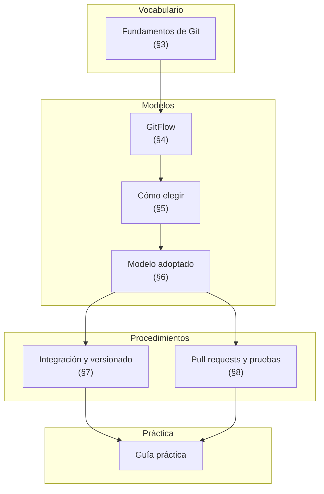
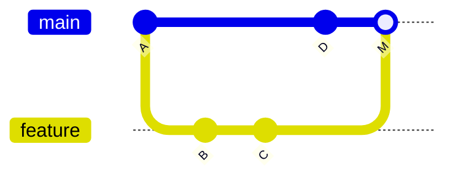
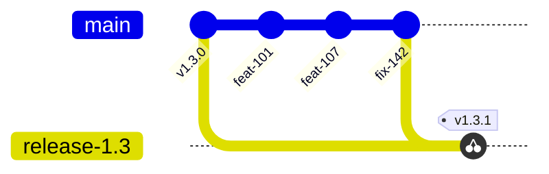
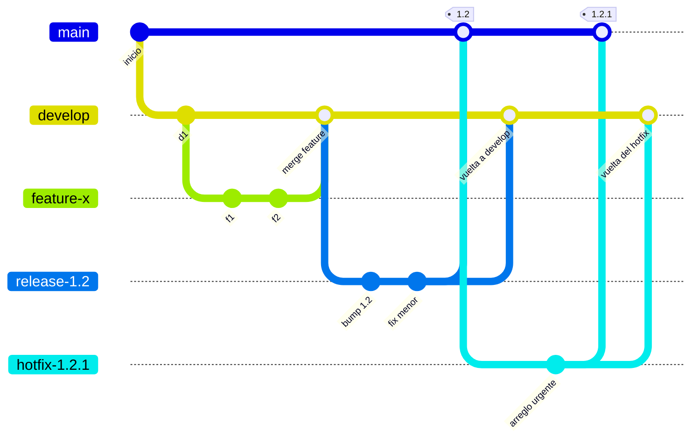
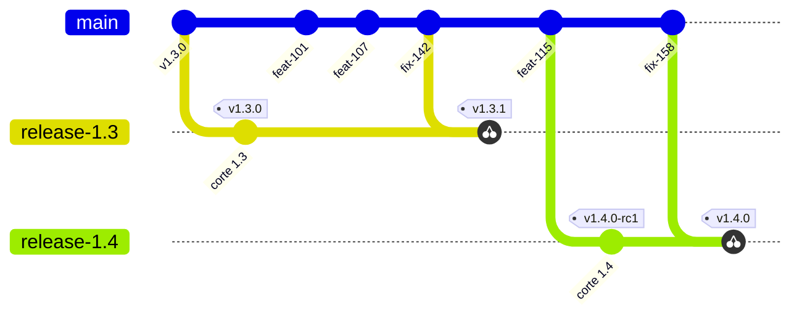
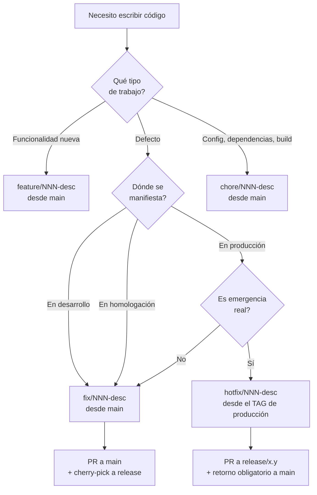
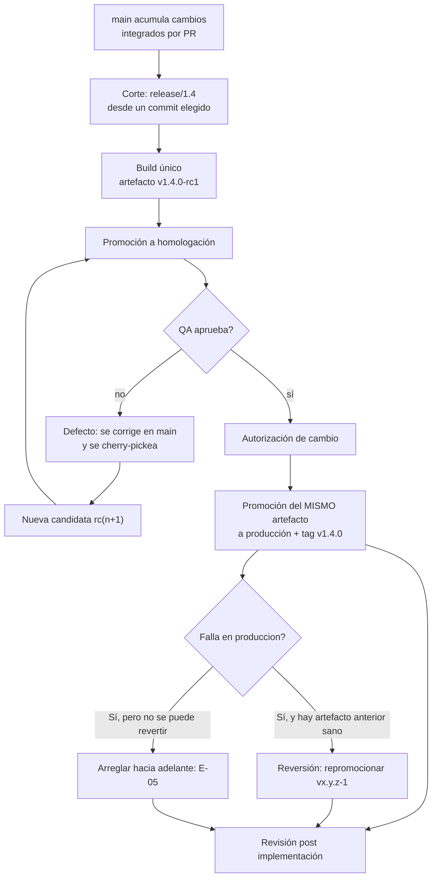

# Estándares de modelo de ramas

Cuerpo documental para que un equipo de desarrollo entienda los modelos de ramas, adopte uno con
criterio, y opere el ciclo de vida de sus versiones con pull requests verificados automáticamente.
Todo el contenido de estudio está acá: el vocabulario, los modelos comparados, el modelo adoptado,
los procedimientos de integración y de pull request, y los anexos de glosario, plantillas, listas de
verificación, preguntas y fuentes. Fuera de este documento quedan solo dos cosas: los tres archivos
de workflow listos para copiar, en [`Anexos/workflows/`](Anexos/workflows/README.md), y las dos guías
prácticas ejecutables sobre un repositorio real —la del modelo adoptado y la de GitHub Flow, que
sirve de línea de base para medirlo—.

## Convención de marcas

Cada afirmación lleva una de estas dos marcas:

| Marca | Significado |
|---|---|
| **[F]** | Fundamentada en una fuente externa verificable, listada en el [Anexo E — Fuentes](#anexo-e--fuentes) |
| **[C]** | Convención de este equipo. No está respaldada por ningún estándar: es una elección deliberada, discutible y cambiable |

Un documento de proceso pierde autoridad cuando presenta preferencias del autor como si fueran
estándares de la industria. Por eso la separación es explícita en todo el documento.

## Tabla de contenido

- [1. Marco de referencia](#1-marco-de-referencia)
  - [1.1 Escenarios](#11-escenarios)
  - [1.2 Contextos](#12-contextos)
  - [1.3 Actores](#13-actores)
  - [1.4 Preguntas guía del marco](#14-preguntas-guía-del-marco)
- [2. Mapa conceptual](#2-mapa-conceptual)
  - [2.1 El dominio de un vistazo](#21-el-dominio-de-un-vistazo)
  - [2.2 Entrada por escenario](#22-entrada-por-escenario)
  - [2.3 Entrada por rol](#23-entrada-por-rol)
  - [2.4 Entrada por artefacto](#24-entrada-por-artefacto)
  - [2.5 Rutas de lectura](#25-rutas-de-lectura)
- [3. Fundamentos de Git](#3-fundamentos-de-git)
  - [3.1 Definición](#31-definición)
  - [3.2 Las cinco operaciones que importan](#32-las-cinco-operaciones-que-importan)
  - [3.3 Aplicación por escenario](#33-aplicación-por-escenario)
  - [3.4 Ejemplo concreto](#34-ejemplo-concreto)
  - [3.5 Preguntas guía](#35-preguntas-guía)
  - [3.6 Criterios de calidad](#36-criterios-de-calidad)
- [4. GitFlow](#4-gitflow)
  - [4.1 Definición](#41-definición)
  - [4.2 Cómo funciona cada pieza](#42-cómo-funciona-cada-pieza)
  - [4.3 Aplicación por escenario](#43-aplicación-por-escenario)
  - [4.4 La nota de 2020, que cambia cómo hay que leer el modelo](#44-la-nota-de-2020-que-cambia-cómo-hay-que-leer-el-modelo)
  - [4.5 Ejemplo concreto](#45-ejemplo-concreto)
  - [4.6 Preguntas guía](#46-preguntas-guía)
  - [4.7 Criterios de calidad](#47-criterios-de-calidad)
- [5. Cómo elegir el modelo](#5-cómo-elegir-el-modelo)
  - [5.1 Los cuatro modelos que conviene conocer](#51-los-cuatro-modelos-que-conviene-conocer)
  - [5.2 Comparación](#52-comparación)
  - [5.3 Aplicación por contexto](#53-aplicación-por-contexto)
  - [5.4 El criterio de decisión, en tres preguntas](#54-el-criterio-de-decisión-en-tres-preguntas)
  - [5.5 Qué dice la evidencia, y qué no dice](#55-qué-dice-la-evidencia-y-qué-no-dice)
  - [5.6 Ejemplo concreto](#56-ejemplo-concreto)
  - [5.7 Preguntas guía](#57-preguntas-guía)
  - [5.8 Criterios de calidad](#58-criterios-de-calidad)
- [6. Modelo adoptado](#6-modelo-adoptado)
  - [6.1 Inventario de ramas](#61-inventario-de-ramas)
  - [6.2 Las siete reglas](#62-las-siete-reglas)
  - [6.3 De dónde nace cada rama](#63-de-dónde-nace-cada-rama)
  - [6.4 La única excepción: emergencia en producción](#64-la-única-excepción-emergencia-en-producción)
  - [6.5 Aplicación por escenario](#65-aplicación-por-escenario)
  - [6.6 Guardarraíles](#66-guardarraíles)
  - [6.7 Antipatrones](#67-antipatrones)
  - [6.8 Preguntas guía](#68-preguntas-guía)
  - [6.9 Criterios de calidad](#69-criterios-de-calidad)
- [7. Integración y versionado](#7-integración-y-versionado)
  - [7.1 Los cuatro objetos que no hay que confundir](#71-los-cuatro-objetos-que-no-hay-que-confundir)
  - [7.2 Correspondencia ambiente–contenido–tag](#72-correspondencia-ambientecontenidotag)
  - [7.3 Versionado](#73-versionado)
  - [7.4 Ciclo de vida de una versión](#74-ciclo-de-vida-de-una-versión)
  - [7.5 Build hermético y promoción](#75-build-hermético-y-promoción)
  - [7.6 Qué prueba QA en cada ambiente](#76-qué-prueba-qa-en-cada-ambiente)
  - [7.7 Versiones de demostración](#77-versiones-de-demostración)
  - [7.8 Autorización y cierre](#78-autorización-y-cierre)
  - [7.9 Preguntas guía](#79-preguntas-guía)
  - [7.10 Criterios de calidad](#710-criterios-de-calidad)
- [8. Pull requests y pruebas automatizadas](#8-pull-requests-y-pruebas-automatizadas)
  - [8.1 Ciclo de vida de un pull request](#81-ciclo-de-vida-de-un-pull-request)
  - [8.2 Tamaño del pull request](#82-tamaño-del-pull-request)
  - [8.3 Estados del issue](#83-estados-del-issue)
  - [8.4 Qué verifica el pipeline y cuándo](#84-qué-verifica-el-pipeline-y-cuándo)
  - [8.5 Protección de rama](#85-protección-de-rama)
  - [8.6 Aplicación por escenario](#86-aplicación-por-escenario)
  - [8.7 Ejemplo concreto](#87-ejemplo-concreto)
  - [8.8 Preguntas guía](#88-preguntas-guía)
  - [8.9 Criterios de calidad](#89-criterios-de-calidad)
- [Anexo A — Glosario](#anexo-a--glosario)
- [Anexo B — Plantillas](#anexo-b--plantillas)
- [Anexo C — Listas de verificación](#anexo-c--listas-de-verificación)
- [Anexo D — Preguntas que forman criterio](#anexo-d--preguntas-que-forman-criterio)
- [Anexo E — Fuentes](#anexo-e--fuentes)

---

## 1. Marco de referencia

Todo el resto del documento se apoya en tres listas cerradas: los **escenarios** en los que un equipo
toca el control de versiones, los **contextos** que cambian la respuesta correcta dentro de un mismo
escenario, y los **actores** que intervienen. Cuando una sección posterior dice «en el escenario
E-03, contexto C-2, el actor A-QA hace tal cosa», se refiere a estas tablas y a ninguna otra.

Fijar este vocabulario primero no es una formalidad. La mayoría de las discusiones sobre ramas se
traban porque dos personas usan la misma palabra para cosas distintas: uno llama «release» a una
rama y el otro a un tag, uno llama «estable» a lo que compila y el otro a lo que QA aprobó.

### 1.1 Escenarios

Un escenario es una situación de trabajo que arranca con un disparador reconocible y termina con un
cambio incorporado —o descartado— de manera verificable.

| ID | Escenario | Disparador | Termina cuando |
|---|---|---|---|
| **E-01** | Funcionalidad nueva | Un issue con criterio de aceptación escrito | QA valida la funcionalidad en el ambiente correspondiente |
| **E-02** | Corrección de defecto detectado antes de liberar | Reporte de QA sobre la candidata o sobre integración | El caso que fallaba pasa, y la corrección viaja a la versión que corresponde |
| **E-03** | Corte de una versión | Decisión de liberar el alcance acumulado | Existe una rama de release y una candidata numerada |
| **E-04** | Estabilización de la candidata | La candidata está en el ambiente de prueba | La versión se libera con su tag, o se descarta |
| **E-05** | Emergencia en producción | Servicio caído, degradado o vulnerabilidad explotada | La versión de parche está desplegada **y** la corrección volvió a la línea principal |
| **E-06** | Versión de demostración | Pedido de mostrar trabajo todavía no liberado | Existe un artefacto identificable y desechable, sin comprometer el calendario |
| **E-07** | Mantenimiento sin efecto funcional | Dependencia vencida, cambio de build o de configuración | Integrado sin alterar el comportamiento observable |
| **E-08** | Rechazo de un cambio | La verificación automática o la revisión encuentran un problema | El cambio se corrige y vuelve a la cola, o se descarta con su motivo registrado |

Un escenario que no aparece acá no está previsto por el procedimiento; ante uno nuevo, conviene
razonar con las preguntas del [Anexo D](#anexo-d--preguntas-que-forman-criterio) antes de inventar
una regla.

### 1.2 Contextos

El contexto es lo que hace que la respuesta cambie dentro de un mismo escenario. Son cuatro y
conviene tenerlos presentes porque son la fuente habitual del «depende» que frustra a quien recién
entra al equipo.

| ID | Contexto | Pregunta que lo determina | Qué cambia |
|---|---|---|---|
| **C-1** | Sin release abierta | ¿Existe hoy una `release/x.y` viva? | El cambio viaja solo por la línea principal; no hay cherry-pick que decidir |
| **C-2** | Con release abierta | Ídem | Cada cambio requiere una decisión explícita de admisión a esa release |
| **C-3** | Producción comprometida | ¿Hay usuarios afectados ahora? | Se habilita la vía de excepción: ramar desde el tag, aprobación de emergencia |
| **C-4** | Producto con varias versiones vivas | ¿Se **soportan** hoy **tres o más** versiones en paralelo, es decir, versiones que reciben parches? | Cambia el modelo de ramas completo: es el contexto donde GitFlow sigue siendo razonable |

Las dos magnitudes que conviene no confundir: **releases vivas simultáneas** —la que está en
producción y la candidata: dos como máximo, y es la operación normal de C-2, ver
[§7](#7-integración-y-versionado)— y **versiones soportadas en paralelo**, las que siguen
recibiendo parches. El disparador de cambio de modelo es esta segunda, con el mismo operador en todo
el cuerpo documental: **tres o más**. Dos versiones soportadas siguen dentro de C-2.

La distinción entre **C-2** y **C-4** es la que decide qué modelo de ramas conviene, y está tratada
en [§5 — Cómo elegir el modelo](#5-cómo-elegir-el-modelo).

### 1.3 Actores

Cada actor se define por lo que **decide**, no por su cargo. Una misma persona puede cubrir dos
funciones en un equipo chico; lo que no puede es cubrir las dos en el mismo cambio.

| ID | Actor | Decide | No decide |
|---|---|---|---|
| **A-PO** | Product owner / analista | Qué se construye, con qué criterio de aceptación, y la prioridad | Cómo se implementa; cuándo está probado |
| **A-DEV** | Desarrollo | Cómo se implementa; qué pruebas automatizadas acompañan al cambio | Si el cambio está verificado; si entra a una release |
| **A-REV** | Revisión de código | Si el cambio es comprensible, revertible y de tamaño razonable | Si cumple el criterio funcional |
| **A-QA** | Prueba y verificación | Si lo construido cumple el criterio; cuándo se cierra el issue | Qué se construye; cuándo se despliega |
| **A-OPS** | Devops / ingeniería de releases | Cómo se construye, versiona, promociona y despliega el artefacto | Si el contenido funcional es correcto |
| **A-SEC** | Seguridad | Qué controles corren en el pipeline y qué hallazgo bloquea | La prioridad funcional |
| **A-AUT** | Autoridad de cambio | Si un cambio se autoriza a producción según su riesgo | El detalle técnico de la implementación |

La tabla de actores es una convención de este equipo **[C]**: los nombres, los códigos y el reparto
de decisiones no provienen de ningún estándar.

Sobre esa tabla, dos separaciones que el documento sostiene en todos los escenarios, ambas también
convención de este equipo **[C]** —son segregación de funciones, y renunciar a ellas no rompe ningún
estándar citado acá, pero sí el control interno que el procedimiento se propone instalar—:

**Quien escribe el cambio no declara que está verificado. [C]** El desarrollador cierra su parte con
el merge; el issue lo cierra A-QA cuando lo valida. Mergeado no es verificado.

**Quien construye el artefacto no autoriza su liberación. [C]** A-OPS produce y promociona; A-AUT
autoriza. En un equipo de tres personas estas funciones se reparten entre esas tres personas, pero
no se colapsan en una sola para el mismo cambio.

Ninguna de las dos está respaldada por las citas que siguen: ISTQB distingue funciones dentro de QA
e ITIL asigna autoridad según riesgo, pero ninguno prescribe estas dos separaciones.

> **[F: ISTQB-1]** El esquema de certificación de pruebas distingue funciones diferenciadas dentro
> de lo que un organigrama suele llamar «QA» —gestión de pruebas, análisis de pruebas y análisis
> técnico orientado a riesgo, técnicas de caja blanca y automatización—, además de una certificación
> específica de pruebas de aceptación centrada en la colaboración entre product owners y testers.

De ahí este equipo deriva que **A-QA nombra la función, no un puesto [C]**: es una decisión de
composición propia, no parte de lo que dice la fuente.

> **[F: ITIL-1]** La autoridad de aprobación se asigna en función del riesgo del cambio, no
> enviando todo cambio a un comité central: los cambios estándar son de bajo riesgo y están
> preaprobados.

Que rutear todo cambio por el comité sea un «antipatrón» es la etiqueta de este equipo **[C]**, no
una cita del literal de la fuente: el texto completo de ITIL 4 requiere licencia y en esta ejecución
no se abrió, de modo que ninguna afirmación sobre lo que dice *explícitamente* puede sostenerse.
Ver [Anexo E — Fuentes](#anexo-e--fuentes).

### 1.4 Preguntas guía del marco

Antes de seguir, conviene poder responder estas cuatro sobre el propio equipo:

1. ¿Cuál de los cuatro contextos describe la situación de hoy? ¿Cuántas versiones se sostienen vivas?

   Son dos preguntas distintas y se contestan con datos, no con impresiones: contá las versiones
   que hoy **reciben parches** —no las que el equipo dice sostener— y fijate si existe una
   `release/x.y` viva. Tres o más soportadas es **C-4**; con dos o menos estás en **C-1** o
   **C-2**, y **C-3** se superpone a cualquiera de ellos cuando hay usuarios afectados ahora.

2. ¿Qué persona cubre cada actor, y qué pares de funciones quedan en la misma persona?

   Escribí los siete IDs y al lado el nombre propio; las casillas que quedan vacías informan tanto
   como las llenas. Que una persona cubra dos funciones es normal en un equipo chico. Los dos
   pares que sí importan son **A-DEV** con **A-QA** y **A-OPS** con **A-AUT** sobre el mismo
   cambio: ahí se pierde la segregación de funciones que este documento sostiene **[C]**.

3. ¿Quién cierra hoy los issues, y en qué momento?

   El dato está en el historial del gestor de issues, no en el procedimiento escrito. Compará la
   marca de cierre con la del merge: si coinciden, y las hace la misma persona, el equipo está
   declarando verificado lo que apenas está integrado. La respuesta buena nombra persona y
   momento; la vaga dice «lo cierra quien lo tomó».

4. ¿Qué escenario de la tabla ocurrió la última vez que algo salió mal, y qué faltó?

   Un episodio se clasifica con evidencia —tags, ramas, pull requests, fechas—, no de memoria;
   recién con eso a la vista se le pone el ID: **E-02**, **E-05**, **E-08**. Lo que faltó suele
   ser un paso del propio escenario: la corrección que nunca volvió a la línea principal, el
   motivo del rechazo que nadie registró. Si el episodio no se puede reconstruir, ese es el
   hallazgo.

---

## 2. Mapa conceptual

Esta sección no explica nada: enruta. Sirve para entrar por donde uno está parado —un escenario, un
rol o un artefacto— y llegar a la sección que lo trata. Las definiciones de `E-*`, `C-*` y `A-*`
están en [§1 — Marco de referencia](#1-marco-de-referencia).

### 2.1 El dominio de un vistazo



### 2.2 Entrada por escenario

| Escenario | Qué se hace primero | Dónde |
|---|---|---|
| **E-01** Funcionalidad nueva | Rama corta desde la línea principal, PR en borrador | [§8](#8-pull-requests-y-pruebas-automatizadas) · práctica [E-01](../GitFlow-Practice-Guide/Guia-Practica-GitFlow.md#3-escenario-01--funcionalidad-nueva-e-01) |
| **E-02** Defecto antes de liberar | Reproducir con una prueba que falle, arreglar en la línea principal | [§6](#6-modelo-adoptado) · práctica [E-02](../GitFlow-Practice-Guide/Guia-Practica-GitFlow.md#4-escenario-02--defecto-con-release-abierta-e-02) |
| **E-03** Corte de versión | Cortar `release/x.y` lo más tarde posible y numerar la candidata | [§7](#7-integración-y-versionado) · práctica [E-03](../GitFlow-Practice-Guide/Guia-Practica-GitFlow.md#5-escenario-03--corte-de-release-e-03-y-e-04) |
| **E-04** Estabilización | Admitir por cherry-pick solo lo que corresponde, regenerar la candidata | [§7](#7-integración-y-versionado) |
| **E-05** Emergencia | Ramar desde el **tag** de producción y planificar el retorno del arreglo | [§6](#6-modelo-adoptado) · práctica [E-05](../GitFlow-Practice-Guide/Guia-Practica-GitFlow.md#7-escenario-05--emergencia-en-producción-e-05) |
| **E-06** Versión de demostración | Construir un artefacto identificable y desechable | [§7](#7-integración-y-versionado) · práctica [E-06](../GitFlow-Practice-Guide/Guia-Practica-GitFlow.md#8-escenario-06--versión-de-demostración-e-06) |
| **E-07** Mantenimiento | `chore/`, mismo circuito que cualquier cambio | [§8](#8-pull-requests-y-pruebas-automatizadas) |
| **E-08** Rechazo de un cambio | Leer el reporte del pipeline antes que el código | [§8](#8-pull-requests-y-pruebas-automatizadas) · práctica [E-08](../GitFlow-Practice-Guide/Guia-Practica-GitFlow.md#6-escenario-04--pull-request-que-rompe-la-regresión-e-08) |

### 2.3 Entrada por rol

| Actor | Lo primero que necesita | Después |
|---|---|---|
| **A-DEV** que recién entra | [§3](#3-fundamentos-de-git) y [§6](#6-modelo-adoptado) | [§8](#8-pull-requests-y-pruebas-automatizadas), y practicar E-01 y E-02 |
| **A-QA** | [§1](#1-marco-de-referencia) y [§7](#7-integración-y-versionado): qué se prueba en cada ambiente | Práctica E-02 y E-08 |
| **A-OPS** | [§7](#7-integración-y-versionado) y los [workflows](Anexos/workflows/) | Práctica E-03 y E-05 |
| **A-PO** | [§7.2](#72-correspondencia-ambientecontenidotag) y [§7.3](#73-versionado) | [Anexo D](#anexo-d--preguntas-que-forman-criterio) |
| **A-AUT** | [§7.8](#78-autorización-y-cierre), autorización y tags | — |
| Quien evalúa cambiar de modelo | [§4](#4-gitflow) y [§5](#5-cómo-elegir-el-modelo) | — |

### 2.4 Entrada por artefacto

Qué se produce en el circuito, quién lo produce y dónde está descripto.

| Artefacto | Produce | Se verifica con | Dónde |
|---|---|---|---|
| Rama corta | A-DEV | Nombre según convención; objetivo de vida ≤ 2 días, umbral normativo > 7 días | [§6](#6-modelo-adoptado) |
| Pull request | A-DEV | Plantilla completa y CI en verde | [§8](#8-pull-requests-y-pruebas-automatizadas) · [plantilla](#anexo-b--plantillas) |
| Commit en la línea principal | Merge del PR | Uno por issue, mensaje convencional | [§8](#8-pull-requests-y-pruebas-automatizadas) |
| Rama de release | A-OPS | Existe una sola candidata activa | [§7](#7-integración-y-versionado) |
| Candidata (`v1.4.0-rc2`) | Pipeline | Artefacto construido una sola vez | [§7](#7-integración-y-versionado) |
| Tag de versión | A-OPS tras autorización | Inmutable, apunta al commit liberado | [§7](#7-integración-y-versionado) |
| Reporte de pruebas E2E | Pipeline | Artefacto de la corrida | [§8](#8-pull-requests-y-pruebas-automatizadas) |
| Registro de autorización | A-AUT | Antes del despliegue a producción | [§7](#7-integración-y-versionado) |

### 2.5 Rutas de lectura

Toda ruta empieza por **§1**: es la única sección que define los códigos `E-nn` (escenarios), `C-n`
(contextos) y `A-XXX` (actores) que §3, §6, §7 y §8 usan sin volver a explicarlos. Saltearla deja
tablas enteras escritas en un código irresoluble.

**Quien recién entra al equipo:** §1 → §3 → §6 → §8, y después practicar los escenarios **00, 01 y
03** —en ese orden: el 02 exige una release abierta que solo el 03 crea—. Las secciones §4 y §5 se
pueden dejar para más adelante.

**Quien va a operar releases:** §1 → §7 y los anexos de listas de verificación y workflows, y después
los escenarios 03, 05 y 07.

**Quien tiene que decidir el modelo:** §4 → §5, y la sección de fuerza de la evidencia del
[Anexo E](#anexo-e--fuentes).

**Como capacitación completa:** §1 → §2 → §3 → §4 → §5 → §6 → §7 → §8 → guía práctica en su orden de
ejecución (00 → 01 → 03 → 02 → 04 → 05 → 06 → 07). Los escenarios 00 a 05 llevan una jornada si se
hacen con las esperas reales de revisión.

Para alguien sin experiencia previa, §4 y §5 se pueden saltear si el equipo ya decidió su modelo y
solo hace falta operarlo; lo que no conviene saltear es §6, porque es la que fija las reglas que
después la práctica ejercita.

---

## 3. Fundamentos de Git

Un modelo de ramas es un conjunto de acuerdos sobre cinco operaciones de Git. Quien no distingue un
merge de un cherry-pick no puede evaluar por qué un modelo elige uno u otro, y termina siguiendo el
procedimiento de memoria. Esta sección cubre solo lo necesario para leer el resto del documento.

### 3.1 Definición

Git guarda **instantáneas completas** del árbol de archivos, no diferencias. Cada commit apunta a su
padre —o a sus dos padres, si es un merge—, y de esa cadena sale toda la historia. Una **rama** no es
una copia de nada: es un puntero móvil a un commit, y por eso crear una rama cuesta lo mismo que
escribir cuarenta bytes. Esa baratura es la que habilita todos los modelos que vienen después.

> **[F: NVIE-1]** El autor de GitFlow describe el punto con precisión: Git cambió la manera en que
> los desarrolladores piensan el merge y el branching. Viniendo de CVS/Subversion, ramar y mergear
> se consideraba algo temible que se hacía cada tanto; en Git son baratos y simples, y forman parte
> del flujo de trabajo diario.

Lo que **no** es una rama: un ambiente, una versión ni una garantía de calidad. Un ambiente es
infraestructura donde corre un artefacto; una versión es un tag; la calidad es el resultado de una
verificación. Confundir estas cuatro cosas con ramas es el origen de la mayoría de los modelos que
se degradan.

### 3.2 Las cinco operaciones que importan

#### `merge`

Une dos historias creando un commit con dos padres. Conserva todo: los commits originales quedan en
la historia y se ve de dónde vino cada uno.



Con `--no-ff` el commit de merge se crea aun cuando Git podría avanzar el puntero sin más. GitFlow lo
exige por una razón concreta: **[F: NVIE-1]** sin ese commit es imposible ver en la historia qué
commits implementaron juntos una funcionalidad, y revertir la funcionalidad completa pasa de ser
trivial a ser un dolor de cabeza.

#### `squash merge`

Aplana todos los commits de la rama en **uno solo** sobre el destino. La historia de la rama se
pierde; lo que queda es un commit por unidad de trabajo. Es lo contrario de la decisión anterior, y
la contrapartida es la que se explica en [§6 — Modelo adoptado](#6-modelo-adoptado): un solo SHA
por issue hace que llevar ese cambio a otra rama sea una operación de un paso.

#### `rebase`

Reescribe los commits de una rama como si hubieran nacido de otro punto. Produce una historia lineal
y limpia, al precio de cambiar los identificadores de los commits. Regla práctica: se rebasa lo que
todavía es privado; no se rebasa lo que otros ya bajaron.

#### `cherry-pick`

Aplica **un commit específico** sobre otra rama, salteando todo lo que ocurrió entre el punto de
corte y ese commit. Es la operación central de los modelos con rama de release: permite llevar una
corrección a una versión estable sin arrastrar las funcionalidades que entraron después.



La rama `release-1.3` recibe `fix-142` **sin** recibir `feat-101` ni `feat-107`. Esta es la respuesta
técnica a la objeción más frecuente contra arreglar en la línea principal: no, no se arrastran las
funcionalidades nuevas, porque no se mergea la rama, se traslada un commit.

La variante `cherry-pick -x` agrega al mensaje del commit nuevo el SHA del original. Ese rastro es lo
que hace auditable la convergencia entre ramas, y de él depende el chequeo automático del
[anexo de workflows](Anexos/workflows/).

#### `tag`

Un puntero **inmutable** a un commit. Una rama se mueve cuando llegan commits; un tag no se mueve
nunca. Ante la pregunta «qué hay en producción», la respuesta correcta es un tag —o el artefacto
construido desde él—, jamás un nombre de rama.

### 3.3 Aplicación por escenario

| Escenario | Operación protagonista | Por qué |
|---|---|---|
| **E-01** Funcionalidad nueva | `merge` del PR (squash o `--no-ff` según el modelo) | Incorpora trabajo completo a la línea de integración |
| **E-02** Defecto con release abierta | `cherry-pick -x` | Lleva la corrección sin arrastrar lo que entró después |
| **E-03** Corte de versión | `branch` desde un commit elegido | La rama de release es una foto de un punto del tronco |
| **E-05** Emergencia | `branch` desde el **tag** | La punta de la rama de release puede tener cambios no liberados |
| **E-06** Demostración | `tag` con sufijo de precedencia | Identifica un artefacto sin comprometerse a soportarlo |

En contexto **C-4** —varias versiones vivas— la operación protagonista deja de ser el cherry-pick y
pasa a ser el merge entre ramas de larga vida; es exactamente la diferencia que trata
[§5 — Cómo elegir el modelo](#5-cómo-elegir-el-modelo).

### 3.4 Ejemplo concreto

Una corrección que ya está en la línea principal como `a3f9c21` y debe llegar a la release abierta:

```bash
git checkout release/1.4
git pull --ff-only
git cherry-pick -x a3f9c21
git push
```

El `--ff-only` es deliberado: si la copia local divergió del remoto, conviene que la operación falle
de manera ruidosa en lugar de generar un merge silencioso que nadie pidió. El commit resultante en
`release/1.4` tiene contenido idéntico al original pero **otro SHA**, y su mensaje incluye la línea
`(cherry picked from commit a3f9c21)` que deja el rastro.

### 3.5 Preguntas guía

1. ¿Por qué el SHA cambia al hacer cherry-pick, y qué consecuencia tiene para comparar ramas?

   El SHA es el hash del commit entero: árbol, padre, autor y fecha. Cambiado el padre, cambia el
   identificador aunque el diff sea idéntico. Comparar ramas por SHA reporta entonces como faltantes
   correcciones que ya están aplicadas; por eso la auditoría de convergencia usa `git cherry`, que
   compara por contenido del cambio.

2. Si una rama de release recibe un cherry-pick, ¿sigue siendo cierto que la rama es «estable»? ¿Qué
   es lo verdaderamente inmutable?

   Cada cherry-pick mueve la punta de `release/1.4`, así que «estable» nombra un criterio de
   admisión, no una propiedad del puntero. Lo inmutable es el tag. De ahí que la emergencia (E-05)
   rame desde el tag y no desde la punta de la release: ahí puede haber correcciones todavía no
   liberadas.

3. ¿En qué caso conviene `--no-ff` y en cuál `squash`? ¿Qué gana y qué pierde cada uno?

   `--no-ff` conserva los commits originales y deja ver qué conjunto implementó una funcionalidad,
   lo que vuelve trivial revertirla completa **[F: NVIE-1]**; el costo es una línea principal con
   commits intermedios. `squash` resigna esa historia y gana un SHA por issue, que es lo que hace el
   cherry-pick a una release de un solo paso **[C]**.

4. ¿Qué información se pierde si se hace cherry-pick sin `-x`?

   Se pierde la línea `(cherry picked from commit a3f9c21)`, o sea el puente entre el commit de la
   release y su original en la línea principal, con el pull request y el issue que cuelgan de él. La
   detección de divergencias no se resiente, porque compara contenido. Lo que se degrada es la
   lectura humana de la historia.

### 3.6 Criterios de calidad

Una historia de repositorio bien llevada permite responder, sin abrir el tablero de tickets: qué
cambio introdujo cada commit de la línea principal, a qué issue corresponde, y si ese cambio está o
no en cada release viva. Si para responder eso hay que preguntarle a alguien, el modelo no está
funcionando, por más que las ramas tengan los nombres correctos.

---

## 4. GitFlow

GitFlow es el modelo de ramas publicado por Vincent Driessen en enero de 2010. Se volvió tan
difundido que buena parte de la industria usa «gitflow» como sinónimo de «trabajar con ramas», lo
cual es un problema, porque GitFlow es **un** modelo concreto con reglas concretas y con un contexto
de aplicación que su propio autor acotó diez años después.

Conviene ser preciso con el término desde el principio: **GitFlow es un modelo concreto** —el de
Vincent Driessen, 2010— con `master`, `develop` y tres tipos de rama de soporte, no un sinónimo de
«trabajar con ramas». Por eso este cuerpo documental se llama `Estandares-Modelo-Ramas-Guide` y no
«Procedimiento GitFlow»: lo que documenta es la elección entre modelos y el que este equipo
sostiene. GitFlow es uno de los comparados, y tiene además su propia guía práctica al lado.

Todo lo que sigue está tomado del artículo original y de la nota de reflexión que el autor le agregó
en marzo de 2020. **[F: NVIE-1]**

### 4.1 Definición

GitFlow organiza el repositorio alrededor de **dos ramas de vida infinita** y **tres tipos de rama de
soporte**.

| Rama | Vida | Qué garantiza |
|---|---|---|
| `master` | infinita | Su `HEAD` refleja siempre un estado listo para producción. **Cada merge a `master` es, por definición, una nueva liberación** |
| `develop` | infinita | Su `HEAD` refleja los últimos cambios entregados para la próxima liberación. Es la rama de integración, de donde salen las compilaciones nocturnas |

Las tres ramas de soporte tienen vida limitada y reglas estrictas sobre de dónde nacen y a dónde
deben volver:

| Rama | Nace de | Debe volver a | Nombre |
|---|---|---|---|
| Funcionalidad | `develop` | `develop` | cualquiera salvo `master`, `develop`, `release-*`, `hotfix-*` |
| Release | `develop` | `develop` **y** `master` | `release-*` |
| Hotfix | `master` | `develop` **y** `master` | `hotfix-*` |



### 4.2 Cómo funciona cada pieza

#### Ramas de funcionalidad

Nacen de `develop` y existen mientras la funcionalidad se desarrolla. Al terminar se mergean de
vuelta a `develop` —o se descartan, si el experimento no prosperó—. El artículo original señala que
estas ramas viven típicamente **solo en el repositorio del desarrollador**, no en `origin`.

El merge se hace con `--no-ff` y el motivo es explícito: sin el commit de merge se pierde la
información de que un grupo de commits formó una funcionalidad, y revertirla completa se vuelve muy
difícil.

#### Ramas de release

Nacen de `develop` **cuando `develop` ya refleja el estado deseado de la nueva versión**: todas las
funcionalidades que van en esa liberación tienen que estar mergeadas antes del corte, y las que
apuntan a versiones futuras deben esperar.

Es en el corte donde la versión **recibe su número**, no antes. Hasta ese momento `develop` reflejaba
«la próxima versión» sin que estuviera decidido si sería 0.3 o 1.0.

Durante la vida de la rama se aplican correcciones menores y se prepara la metadata de la versión.
Agregar funcionalidades grandes ahí está estrictamente prohibido. Al cerrar: merge a `master`, tag, y
merge de vuelta a `develop` para que las correcciones no se pierdan —paso que el propio artículo
advierte que suele generar conflicto, típicamente por el número de versión—.

#### Ramas de hotfix

Nacen del tag de `master` que marca la versión en producción, y sirven para actuar de inmediato sobre
un estado indeseado de esa versión. Vuelven a `master` —con nuevo tag— y a `develop`. La razón de ser
es que el trabajo del resto del equipo sobre `develop` pueda continuar mientras alguien prepara el
arreglo.

### 4.3 Aplicación por escenario

| Escenario | En GitFlow |
|---|---|
| **E-01** Funcionalidad nueva | Rama desde `develop`, merge `--no-ff` a `develop` |
| **E-02** Defecto antes de liberar | Se corrige **en la rama de release**, y vuelve a `develop` al cerrarla |
| **E-03** Corte de versión | Rama desde `develop` cuando el alcance está completo; ahí se asigna el número |
| **E-04** Estabilización | Correcciones menores sobre la rama de release; nada de funcionalidades |
| **E-05** Emergencia | Rama desde el tag de `master`; vuelve a `master` y a `develop` |
| **E-06** Demostración | No está previsto en el modelo original; se resuelve con un tag sobre `develop` |

En **C-4** —varias versiones soportadas en paralelo— el modelo encaja de forma natural: `master`
representa lo liberado, y las ramas de hotfix atienden cada versión desde su tag. En **C-2** —una
sola versión viva, despliegue frecuente— el modelo agrega una rama de vida infinita cuyo trabajo
consiste en ser un intermediario entre las ramas cortas y `master`.

### 4.4 La nota de 2020, que cambia cómo hay que leer el modelo

Diez años después de publicarlo, el autor agregó una advertencia al artículo. **[F: NVIE-1]** Sus
puntos, resumidos sin interpretación:

- El modelo fue concebido en 2010, poco después de la aparición de Git, y se volvió tan popular que
  se lo empezó a tratar como un estándar, y también como dogma o panacea.
- En esos diez años el tipo de software más desarrollado con Git se corrió hacia las aplicaciones
  web, que se entregan de forma continua, no se revierten, y no requieren soportar múltiples
  versiones corriendo en el mundo.
- Esa **no** es la clase de software que tenía en mente al escribirlo. Para un equipo que hace
  entrega continua sugiere adoptar un flujo mucho más simple, como GitHub Flow, en lugar de forzar
  GitFlow.
- Si en cambio el software está explícitamente versionado o hay que soportar varias versiones en
  producción, GitFlow puede seguir siendo tan buen encaje como lo fue durante esos diez años.

Este documento toma esa nota literalmente: GitFlow no es el modelo por defecto ni el modelo
equivocado; es el modelo **de un contexto**, y el contexto es C-4. De ahí las dos decisiones que
conviene tener presentes al leer: **GitFlow se documenta en serio**, en esta sección, porque es el
vocabulario que el equipo va a encontrar en la industria y es el modelo al que habría que migrar si
algún día hay que soportar dos versiones en paralelo; y **el modelo que se adopta es otro** —tronco
con ramas de release, [§6](#6-modelo-adoptado)—, con el criterio de elección en
[§5](#5-cómo-elegir-el-modelo), para que la decisión se pueda revisar cuando cambie el contexto.
Presentar el modelo adoptado como «GitFlow» habría sido cómodo y falso.

### 4.5 Ejemplo concreto

Cierre de la versión 1.2, tal como aparece en el artículo original:

```bash
git checkout -b release-1.2 develop   # corte: acá se decide que será 1.2
# ... se fija el número de versión en los archivos que corresponda, se commitea ...
git checkout master
git merge --no-ff release-1.2
git tag -a 1.2
git checkout develop
git merge --no-ff release-1.2         # para no perder las correcciones de la release
git branch -d release-1.2
```

El doble merge es la firma del modelo: toda rama de soporte que toca `master` tiene que volver
también a `develop`, y ese es a la vez su mayor virtud —nada se pierde— y su mayor costo operativo
—nadie se puede olvidar—.

### 4.6 Preguntas guía

1. ¿Qué garantiza `master` en GitFlow y qué garantiza `develop`? ¿Cuál de las dos se parece a la
   línea principal de un modelo sin `develop`?

   `master` garantiza que su `HEAD` es un estado liberable, y cada merge ahí es una liberación;
   `develop` garantiza lo último integrado para la versión que viene. Conviene mirar la función y
   no el nombre: la línea principal de un modelo sin `develop` es donde todos integran a diario,
   así que se parece a `develop`. El papel de `master` lo cumplen ahí los tags de versión.

2. Si una corrección se hace en la rama de release y esa rama se borra sin mergear a `develop`, ¿qué
   pasa con la próxima versión?

   Razonarlo por alcance: el commit existe en la rama de release y llegó a `master` con el merge
   de cierre, pero ningún ancestro de `develop` lo contiene. La versión liberada sale corregida y
   la siguiente nace sin el arreglo, de modo que el defecto reaparece como regresión y sin rastro
   de que alguna vez se resolvió. El escenario **E-02** depende entero de ese segundo merge.

3. ¿Cuántos merges necesita un hotfix para quedar completo? ¿Qué falla si falta uno?

   Dos: a `master`, con tag nuevo, y a `develop`. Preguntarse qué queda descubierto en cada
   omisión ordena el análisis. Sin el primero, producción nunca recibe el arreglo. Sin el segundo,
   la próxima release lo pisa, porque el hotfix nació del tag y `develop` jamás lo vio. Nada
   avisa: el olvido se descubre cuando el defecto vuelve.

4. ¿El equipo propio está en el contexto para el que el autor lo recomienda hoy?

   La nota de 2020 fija el criterio **[F: NVIE-1]**: software explícitamente versionado o varias
   versiones en producción. Hay que contar cuántas versiones reciben correcciones hoy y con qué
   cadencia se libera. Una respuesta fundada nombra esos números; una vaga invoca la costumbre o
   lo que hace otro equipo. Tres o más versiones soportadas ubican al equipo en **C-4**; una sola
   deja a `develop` sin trabajo que hacer.

### 4.7 Criterios de calidad

Un GitFlow bien implementado se reconoce en que **ninguna rama de soporte se borra sin haber vuelto a
sus dos destinos**, y en que el número de versión aparece en el corte de la release y no antes. Un
GitFlow mal implementado se reconoce en `develop` y `master` divergiendo durante semanas: cuando eso
pasa, `master` dejó de significar «producción» y el modelo ya no describe la realidad.

---

## 5. Cómo elegir el modelo

La pregunta «¿cuál es el mejor modelo de ramas?» no tiene respuesta, y quien la contesta sin
preguntar por el contexto está vendiendo algo. La pregunta con respuesta es otra: **cuántas versiones
del producto tienen que estar vivas al mismo tiempo, y con qué frecuencia se libera**. De esas dos
variables sale casi todo lo demás.

### 5.1 Los cuatro modelos que conviene conocer

#### GitHub Flow

El más simple de los modelos vigentes. Una sola rama de larga vida —la rama por defecto— y ramas
cortas que entran por pull request. **[F: GH-1]** El ciclo documentado tiene seis pasos: crear una
rama con nombre corto y descriptivo, hacer los cambios y commitearlos, abrir un pull request —que
puede marcarse como borrador si se busca opinión temprana—, atender los comentarios de la revisión,
mergear una vez aprobado, y borrar la rama. La documentación señala además que la configuración de
protección de rama puede impedir el merge si no se cumplen los requisitos definidos, por ejemplo una
cantidad mínima de aprobaciones.

No define nada sobre versiones ni ambientes: asume que lo mergeado se despliega.

#### GitFlow

Dos ramas infinitas y tres de soporte, tratado en [§4](#4-gitflow). Su contexto de aplicación,
según su autor, es el software explícitamente versionado o con varias versiones en producción.
**[F: NVIE-1]**

#### GitLab Flow

Agrega a GitHub Flow lo que le falta para operar versiones: ramas de ambiente o de release aguas
abajo de la principal. Su regla de propagación es la relevante acá. **[F: GL-1]** GitLab documenta
arreglar **hacia adelante**, empujando el cambio a la rama principal y después llevándolo por
cherry-pick a la rama de patch release, y explica el motivo: el problema clásico es arreglar el bug
en la versión recién liberada y olvidarse de arreglarlo en la rama principal.

#### Desarrollo basado en tronco con rama de release

Una sola línea principal a la que todo el mundo integra al menos una vez por día, y ramas de release
creadas *just in time* para estabilizar. **[F: TBD-1]** La rama de release se crea justo antes de
necesitarla —unos días antes de liberar— para que se convierta en un lugar estable mientras el resto
sigue integrando al tronco a máxima velocidad; se puede además **cortar retroactivamente** desde un
commit anterior conocido como bueno; y conviene tener a lo sumo un par de releases vivas a la vez
para que nadie lleve una corrección a la rama equivocada.

### 5.2 Comparación

| | GitHub Flow | GitFlow | GitLab Flow | Tronco + release |
|---|---|---|---|---|
| Ramas de vida larga | 1 | 2 | 1 + ambientes | 1 |
| Versiones vivas que soporta | 1 | varias | 1–2 | 1–2 |
| Dónde se corrige un defecto de producción | rama principal | rama de release / hotfix | rama principal, luego cherry-pick | rama principal, luego cherry-pick |
| Costo de coordinación | bajo | alto | medio | medio |
| Necesita feature flags | sí | no | sí | sí |
| Necesita automatización de pruebas fuerte | sí | menos | sí | sí |

### 5.3 Aplicación por contexto

| Contexto | Modelo que encaja | Por qué |
|---|---|---|
| **C-1** Sin release abierta, despliegue continuo | GitHub Flow | No hay nada que estabilizar en paralelo |
| **C-2** Con release abierta, una versión viva | Tronco + release, o GitLab Flow | Hace falta una ventana de estabilización sin frenar la integración |
| **C-3** Producción comprometida | El que ya esté en uso, con su vía de excepción | La emergencia no es el momento de cambiar de modelo |
| **C-4** Varias versiones vivas | GitFlow | Es el contexto para el que fue diseñado **[F: NVIE-1]** |

### 5.4 El criterio de decisión, en tres preguntas

1. **¿Cuántas versiones hay que soportar en simultáneo?** Más de dos empuja a GitFlow o a un modelo
   con ramas de mantenimiento por versión. Una sola vuelve innecesaria la rama `develop`.
2. **¿Qué tan seguido se libera?** Con liberaciones diarias, una rama de integración intermedia
   agrega latencia sin agregar seguridad. Con liberaciones mensuales sujetas a autorización, la
   ventana de estabilización se paga sola.
3. **¿Qué tan buena es la regresión automatizada?** Los modelos de tronco descansan en que la
   verificación automática detecte lo que la rama larga ocultaba. Sin esa red, mover el equipo a
   tronco expone el problema en lugar de resolverlo.

### 5.5 Qué dice la evidencia, y qué no dice

> **[F: DORA-1]** El análisis de datos de DORA de 2016 y 2017 asocia mejor desempeño de entrega con
> mantener tres o menos ramas activas en el repositorio, integrar al tronco al menos una vez por día,
> y no tener *code freezes* ni fases de integración separadas.

Esa asociación es real y conviene tomarla en serio, pero tiene un límite metodológico que no hay que
esconder: los estudios de DORA son transversales y basados en encuesta autorreportada, de modo que
muestran correlación, no causalidad. Es igualmente plausible que los equipos de alto desempeño puedan
trabajar así **porque** ya tienen buena automatización de pruebas, y no al revés.

La conclusión honesta es más modesta que el eslogan: pocas ramas activas e integración frecuente son
un buen objetivo, y la automatización de pruebas es la condición que lo hace posible. Mover un equipo
a tronco sin esa condición no produce el desempeño de los equipos medidos.

### 5.6 Ejemplo concreto

El equipo de esta guía trabaja sobre una aplicación web con un ambiente de homologación formal, una
sola versión viva en producción y liberaciones sujetas a autorización de cambio. Aplicando las tres
preguntas: una versión viva descarta C-4 y con ello GitFlow como modelo cotidiano; las liberaciones
con autorización justifican una ventana de estabilización, lo que descarta GitHub Flow puro; y la
regresión automatizada existe y corre en cada PR, que es la condición del modelo de tronco.

El resultado es el modelo que documenta [§6 — Modelo adoptado](#6-modelo-adoptado): tronco con
ramas de release cortadas *just in time*. GitFlow queda documentado acá por dos motivos —es el
vocabulario que el equipo va a encontrar en la industria, y es el modelo al que habría que migrar si
alguna vez hay que soportar dos versiones en paralelo—.

### 5.7 Preguntas guía

1. ¿Cuántas versiones del producto están vivas hoy? ¿Y en un año?

   Contá las que tienen usuarios encima, no las que el equipo dice sostener: la respuesta es una
   lista de tags desplegados, no una impresión. Una sola habilita el modelo de tronco con release
   cortada *just in time*; con **tres o más** ya estás en **C-4**, el contexto donde GitFlow sigue
   siendo razonable. Para el año que viene, la evidencia es el compromiso de soporte asumido, no el
   optimismo del roadmap.

2. Si mañana hay que corregir la versión liberada hace tres meses, ¿desde dónde se rama?

   Desde el tag que marca esa versión en producción, nunca desde la punta de una rama, porque la
   rama se mueve y el tag no. Si ese tag sigue siendo lo último liberado, la corrección entra por
   pull request a `release/x.y` y vuelve a `main` el mismo día. Si además hay una versión más nueva
   viva, la pregunta 1 ya quedó contestada: son dos, y el modelo cambia.

3. ¿La regresión automatizada actual alcanza para confiar en un merge sin verificación manual?

   El pipeline corre hoy compilación con advertencias como errores, descubrimiento de pruebas y
   regresión de extremo a extremo; análisis estático, escaneo de dependencias y pruebas unitarias o
   de integración no. **[C]** La comprobación no admite opinión: señalá job por job en el workflow y
   preguntá qué defectos recientes de producción habría atrapado esa suite. Lo que quede afuera es
   trabajo de homologación, y hay que decirlo en voz alta.

4. ¿Qué de lo que hoy resuelve una rama larga podría resolver un feature flag?

   Un flag separa desplegar de liberar, así que reemplaza a la rama larga justo en lo que ésta
   oculta: trabajo incompleto que todavía no se quiere exponer. Mirá qué guarda cada rama de vida
   larga; si es código a medio hacer, va integrado y apagado. No resuelve, en cambio, un cambio de
   esquema ya aplicado ni la coexistencia de dos versiones con usuarios.

### 5.8 Criterios de calidad

Una decisión de modelo bien tomada se puede explicar en dos frases, nombra el contexto que la
justifica, y define de antemano qué cambio de contexto la invalidaría. Una decisión mal tomada se
justifica por lo que hace otra empresa.

---

## 6. Modelo adoptado

El equipo trabaja sobre una línea principal única a la que se integra por pull request, y corta ramas
de release cuando necesita estabilizar una versión. Las correcciones nacen siempre en la línea
principal y viajan a la release por cherry-pick, nunca al revés. Esta sección fija las reglas; los
procedimientos que se derivan de ellas están en [§7](#7-integración-y-versionado) y
[§8](#8-pull-requests-y-pruebas-automatizadas).

### 6.1 Inventario de ramas

Tres tipos. No hay un cuarto.

| Rama | Vida | Nace de | Quién escribe |
|---|---|---|---|
| `main` | permanente | — | nadie directamente: solo merges de pull request |
| `feature/*`, `fix/*`, `chore/*` | objetivo de diseño: ≤ 2 días; **umbral normativo: > 7 días incumple** **[C]** | `main` | el desarrollador asignado |
| `release/x.y` | semanas, después se borra | `main`, o un commit anterior elegido | nadie directamente: cherry-picks y hotfixes entran por pull request |

Sobre la vida de las ramas cortas hay **dos magnitudes distintas y no intercambiables [C]**:

| Magnitud | Valor | Qué implica |
|---|---|---|
| Objetivo de diseño | vida ≤ 2 días | Es la meta al partir el trabajo; superarla no es un incumplimiento |
| Umbral normativo | vida > 7 días (estrictamente) | Es incumplimiento: la rama se revisa en la reunión de equipo y es alertable automáticamente |

El tramo intermedio —de 2 a 7 días inclusive— está en regla y no requiere acción. Un único operador,
un único umbral: así la revisión semanal y una alerta automática miden lo mismo.

**No existe** una rama `develop`, ni `homologacion`, ni `produccion`. **[C]** Homologación y
producción son ambientes; lo que se mueve entre ellos son artefactos.



El desarrollo nunca se detiene en `main`; las ramas de release son ventanas de estabilización; las
correcciones viajan del tronco hacia las releases, jamás en sentido contrario.

### 6.2 Las siete reglas

Todo el resto del procedimiento es consecuencia de estas siete.

1. **Toda rama nace de `main` actualizado. [C]** Salvo bajo la vía de excepción, definida más
   abajo en [§6.4](#64-la-única-excepción-emergencia-en-producción).
2. **`main` está protegida. [C]** Sin push directo: se entra por pull request con verificación
   automática en verde y al menos una aprobación.
3. **Un issue → una rama → un pull request → un commit en `main`. [C]** Si un issue necesita dos
   ramas, estaba mal escrito. Salvo bajo la vía de excepción, donde un mismo issue produce
   deliberadamente dos ramas —la de hotfix y la de retorno— y dos pull requests.
4. **Los defectos se reproducen y corrigen en el tronco, con una prueba, y recién después se
   cherry-pickean a la rama de release. [F: TBD-1, SRE-2, GL-1]**
5. **No se corrigen defectos en la rama de release esperando llevarlos de vuelta al tronco. [F: TBD-2]**
   Salvo bajo la vía de excepción, que sí escribe primero en la release y obliga al retorno; lo que
   la regla prohíbe es *esperar* llevarlo después sin plazo ni control, no el retorno mismo.
6. **Se construye una sola vez; se promociona el artefacto, no se recompila por ambiente. [F: SRE-1]**
7. **La configuración depende del ambiente por variable de entorno, nunca de la rama ni de
   compilación condicional. [C]**

#### Por qué las reglas 4 y 5 son el corazón del modelo

Tres organizaciones independientes documentan la misma práctica:

- **[F: TBD-1]** La recomendación para equipos de desarrollo basado en tronco es reproducir el
  defecto en el tronco, corregirlo ahí con una prueba, dejar que el servidor de integración lo
  verifique, y después cherry-pickearlo a la rama de release, esperando que la verificación dedicada
  a esa rama lo confirme también.
- **[F: SRE-2]** Google describe que la mayoría de sus proyectos grandes ramifica desde el tronco en
  una revisión específica y **nunca** mergea esa rama de vuelta; las correcciones se envían al tronco
  y se cherry-pickean a la rama de release.
- **[F: GL-1]** GitLab documenta arreglar hacia adelante y después cherry-pickear a la rama de patch
  release, porque el problema clásico es corregir en la versión recién liberada y olvidarse de
  corregir en la principal.

El contrapunto existe y no conviene ocultarlo: **[F: NVIE-1]** GitFlow propone exactamente lo
contrario —estabilizar sobre la rama de release y mergear después hacia la rama de desarrollo—. El
desacuerdo es real y se resuelve por contexto, no por autoridad: el contexto de una aplicación web
con despliegue frecuente y una sola versión viva apunta al modelo de esta sección, y el de un
producto instalable con varias versiones soportadas apunta al otro.

### 6.3 De dónde nace cada rama



#### Nomenclatura **[C]**

| Prefijo | Uso | Nace de | Ejemplo |
|---|---|---|---|
| `feature/` | Funcionalidad nueva | `main` | `feature/107-filtro-por-partida` |
| `fix/` | Corrección de defecto | `main` | `fix/142-superficie-con-fraccion` |
| `chore/` | Dependencias, build, configuración | `main` | `chore/119-actualizar-sdk` |
| `hotfix/` | Emergencia en producción | tag de producción | `hotfix/199-timeout-consulta` |

El número de issue adelante permite rastrear cualquier commit hasta su ticket sin abrir el tablero.

### 6.4 La única excepción: emergencia en producción

#### Cuándo se activa

Se activa **solo** si se cumple alguna de estas dos condiciones, y ambas se responden con sí o no a
partir de un hecho registrado —incidente abierto, alerta, aviso de seguridad—:

- el servicio está caído o degradado **para los usuarios, ahora** (es el contexto C-3 de
  [§1.2](#12-contextos): «¿hay usuarios afectados ahora?»);
- hay una vulnerabilidad de seguridad **siendo explotada**.

Un cherry-pick que no aplica limpio **no** activa nada: es un problema técnico de portabilidad del
arreglo, y su procedimiento es resolver el conflicto puntualmente en el pull request contra la
release —[escenario 02](../GitFlow-Practice-Guide/Guia-Practica-GitFlow.md#4-escenario-02--defecto-con-release-abierta-e-02)— y anotar que la ventana
de estabilización se está haciendo larga. Confundir «cuesta portarlo» con «es una emergencia»
convierte la excepción en el camino habitual, porque saltea la aprobación normal.

#### Qué suspende, y a cambio de qué

Es el único lugar donde las reglas 1, 3 y 5 se suspenden, y solo estas tres:

| Regla | Qué se suspende | Obligación compensatoria |
|---|---|---|
| 1 — toda rama nace de `main` | La rama nace del **tag** de producción | Queda registrado el tag de origen en el pull request |
| 3 — un issue, una rama, un commit | El issue produce dos ramas y dos pull requests | Ambas referencian el mismo número de issue |
| 5 — no se corrige en la release | El arreglo se escribe primero contra `release/x.y` | **Retorno a `main` el mismo día**, con `cherry-pick -x`, antes de cerrar el incidente |

Las reglas 2, 4, 6 y 7 **no** admiten excepción: el pull request, la verificación automática y la
aprobación —de emergencia, pero registrada— siguen siendo obligatorios. **[C]**

```bash
# Desde el TAG, no desde la punta de release/1.3:
# la punta puede tener correcciones ya mergeadas pero todavía no liberadas.
git checkout -b hotfix/199-timeout-consulta v1.3.2
# ... corrección mínima + prueba que la cubre ...
git push -u origin hotfix/199-timeout-consulta
# PR contra release/1.3 → tag v1.3.3 → despliegue
# Y EL MISMO DÍA: PR de retorno a main
```

Si la corrección no vuelve a `main`, el defecto reaparece en la próxima versión. Es el único error de
este modelo que sale realmente caro, y por eso la auditoría de convergencia del
[anexo de workflows](Anexos/workflows/) lo detecta de forma automática. **[C]**

### 6.5 Aplicación por escenario

La matriz está cerrada: los ocho escenarios de [§1.1](#11-escenarios) por los dos contextos que
dependen del estado de las ramas. **C-3** (producción comprometida) no es una columna sino un
modificador: se superpone a C-1 o a C-2 y es lo que habilita la vía de excepción; **C-4** (varias
versiones vivas) queda fuera del alcance de este modelo por definición —es el disparador para volver
a [§5](#5-cómo-elegir-el-modelo) y cambiar de modelo, no una celda de esta tabla—.

| Escenario | Contexto C-1 (sin release abierta) | Contexto C-2 (con release abierta) |
|---|---|---|
| **E-01** Funcionalidad | Rama corta → PR → `main`. Viaja en la próxima versión | Igual, y **no** se cherry-pickea salvo que estuviera en el alcance de la release |
| **E-02** Defecto | Rama corta → PR → `main` | Igual, más cherry-pick `-x` a `release/x.y` por pull request, y nueva candidata |
| **E-03** Corte | Es el escenario que crea la release y hace pasar de C-1 a C-2 | No se corta una segunda release con una viva salvo que la primera esté por borrarse (máximo dos) |
| **E-04** Estabilización | No aplica: no hay candidata que estabilizar | Ciclo candidata → prueba → defecto → nueva candidata, hasta la liberación con tag y autorización |
| **E-05** Emergencia | La rama nace igual del **tag** de producción; como no hay `release/x.y` viva, A-OPS crea `release/x.y` desde ese mismo tag, recibe ahí el PR del hotfix, se etiqueta `vx.y.z+1` y la rama queda viva hasta que se borre por desuso. Nunca se parchea con push directo a `main` ni se resucita una rama borrada | Rama desde el tag → PR a `release/x.y` → retorno a `main` |
| **E-06** Demostración | Tag `-demo.n` sobre un commit de `main` y artefacto desechable; nunca una rama | Igual; la demo no toca la release ni su calendario |
| **E-07** Mantenimiento | Rama `chore/` → PR → `main` | Igual; entra a la release solo si es condición de la liberación |
| **E-08** Rechazo | El pipeline o la revisión bloquean el merge; el cambio vuelve a la cola o se descarta con motivo registrado | Igual, y además puede rechazarse la *admisión* a la release aun con el cambio ya en `main` |

### 6.6 Guardarraíles

Sin estos controles el modelo se degrada solo en un par de meses.

**Protección de rama.** `main` y `release/*` sin push directo; pull request obligatorio con
verificación en verde y aprobación registrada; archivo `CODEOWNERS` que asigne revisor por carpeta,
con la revisión de propietarios **exigida**, no solo sugerida.

**Una sola vía de escritura sobre `release/*` [C].** No hay excepción de push directo para nadie,
tampoco para los cherry-picks: el cherry-pick se aplica sobre una rama corta
`cherry/NNN-desc` cortada desde la propia `release/x.y`, y entra por pull request contra ella. Es la
misma vía que usa el hotfix. La consecuencia es observable en la configuración del repositorio: si
*Do not allow bypassing* está activo sobre `release/*` y alguien pudo empujar directo, la
configuración está mal, no el procedimiento.
Las migraciones de base de datos y los archivos de pipeline conviene que tengan dueño explícito: son
los dos lugares donde un error no se resuelve con un revert. **[C]**

**Auditoría de convergencia.** Un chequeo automático verifica que todo commit en `release/*` tenga su
equivalente en `main`. El criterio observable es la **equivalencia por contenido del cambio**, no el
mensaje del commit: se implementa con `git cherry origin/main <rama>`, que compara el cambio y no el
SHA —el SHA siempre difiere tras un cherry-pick, y un hotfix escrito en la release nunca lleva línea
`cherry picked from`—. El `-x` es una ayuda de trazabilidad para quien lee la historia, no el
mecanismo de verificación. Un commit marcado `+` es un cambio de release sin equivalente en el
tronco y hay que alertarlo. **[C]**

Un `+` legítimo existe: cuando el retorno se hizo resolviendo un conflicto a mano, el contenido
difiere y el commit queda marcado para siempre. Esos casos se declaran de una sola forma —una línea
`Convergencia: <sha-en-main> (retorno con conflicto resuelto)` en el mensaje del commit de la
release— y la auditoría los excluye. Sin ese mecanismo el control queda en rojo permanente y el
equipo aprende a ignorarlo, que es la única manera real de perderlo. **[C]**

**Higiene de ramas.** Las ramas cortas se borran al mergear **[F: TBD-2]**; las de release se borran
cuando caen en desuso **[F: TBD-1]**; una rama corta con más de una semana de vida se revisa en la
reunión de equipo **[C]**.

### 6.7 Antipatrones

| Antipatrón | Por qué falla |
|---|---|
| Ramas de ambiente (`homologacion`, `produccion` como ramas) | El código de cada ambiente diverge y deja de ser cierto que se probó lo que se libera |
| Recompilar por ambiente | Se libera un binario distinto del que se probó **[F: SRE-1]** |
| Corregir en la release y prometer el retorno | El retorno se olvida y el defecto regresa **[F: TBD-2]** |
| Pull requests de más de mil líneas | La revisión se vuelve simbólica **[F: GOOG-1]** |
| Cerrar el issue al mergear | Se pierde la trazabilidad de la verificación |
| Enviar todo cambio al comité de cambios | La autoridad de aprobación se asigna según el riesgo, y los cambios estándar están preaprobados **[F: ITIL-1]**; llamarlo «antipatrón» es la lectura de este equipo **[C]** |
| Tres o más releases vivas | Cherry-picks a la rama equivocada **[F: TBD-1]** |
| Refactor oportunista dentro de una corrección | Imposible de revertir sin perder el arreglo |

### 6.8 Preguntas guía

1. ¿Qué regla se está rompiendo cuando alguien dice «lo arreglo directo en la release, es más rápido»?

   La 5: «No se corrigen defectos en la rama de release esperando llevarlos de vuelta al tronco.
   **[F: TBD-2]**». Conviene mirar qué se ahorra realmente. El arreglo no se escribió más rápido:
   se salteó el orden que fija la regla 4 —tronco, prueba, después cherry-pick— y lo que queda
   pendiente es el retorno, que nadie agenda.

2. Si hay dos releases vivas y llega una corrección, ¿a cuál va? ¿Quién lo decide?

   Primero a ninguna. La regla 4 manda reproducir y corregir «en el tronco, con una prueba, y
   recién después» cherry-pickear **[F: TBD-1, SRE-2, GL-1]**. Recién ahí cada release se evalúa
   por separado, contra el tramo en que esté —estabilización o congelamiento—. La decisión no es
   de quien escribió el arreglo: el criterio y la fecha los fijaron A-OPS y A-PO al cortar.

3. ¿Qué evidencia queda de que un hotfix volvió al tronco?

   La que produce `git cherry origin/main <rama>`: el commit queda marcado `-`, porque la
   comparación es por contenido y el SHA siempre cambia tras un cherry-pick. `auditoria-convergencia.yml`
   corre esa comparación sin que nadie la pida. Si el retorno se resolvió a
   mano, el contenido difiere y la única declaración admitida es la línea `Convergencia:` en el
   mensaje. El `-x` se lee, no se audita.

4. ¿Cuál de las siete reglas es la más difícil de sostener en el equipo propio, y qué la haría fácil?

   No hace falta opinar: el repositorio lo delata. Ramas cortas pasando los siete días, la
   auditoría de convergencia en rojo dos mañanas seguidas, un `push` que entró sin pull request.
   Cada síntoma señala una regla. Y lo que la vuelve sostenible es configuración —check
   obligatorio, *Do not allow bypassing*, alerta automática—, porque una regla que depende de
   acordarse ya falló.

### 6.9 Criterios de calidad

El modelo está funcionando si se cumplen tres condiciones observables: no hay ramas cortas de más de
una semana, toda rama de release tiene su equivalencia completa en `main`, y nadie necesita preguntar
de dónde ramar. Cuando alguna de las tres falla, la causa está casi siempre en el tamaño de los pull
requests, no en el modelo.

---

## 7. Integración y versionado

Un modelo de ramas no dice nada sobre qué corre en cada ambiente ni sobre qué significa «la versión
1.4». Ese es el trabajo de esta sección: definir qué se construye, cómo se numera, cómo se mueve
entre ambientes y quién autoriza cada paso.

### 7.1 Los cuatro objetos que no hay que confundir

| Objeto | Qué es | Qué **no** es |
|---|---|---|
| **Rama** | Puntero móvil a un commit | Un ambiente, ni una versión |
| **Tag** | Puntero inmutable a un commit; `v1.4.0` | Un artefacto: es su origen, no su binario |
| **Artefacto** | Resultado compilado y versionado del build | Algo que se rehace por ambiente |
| **Ambiente** | Infraestructura donde corre un artefacto | Una rama |

La confusión típica —«producción es la rama `produccion`»— hace que el código de cada ambiente
diverja y destruye la propiedad que justifica todo el proceso: que lo que se libera sea exactamente
lo que se probó.

#### Desplegar no es liberar

**Desplegar** es una operación técnica: poner un artefacto a correr en un ambiente. **Liberar** es una
decisión de negocio: exponer una funcionalidad a los usuarios. Los feature flags son lo que permite
separarlos, y esa separación es la que evita que la rama larga sea el único mecanismo disponible para
ocultar trabajo incompleto.

### 7.2 Correspondencia ambiente–contenido–tag

Cada ambiente se registra con los campos que pide **[F: ISO-29119]** —identificador, responsable de
proveerlo, período y fidelidad—, más quién puede desplegar en él. Sin esos campos instanciados, un
ambiente no existe como pieza del procedimiento: se negocia de cero cada vez.

| Ambiente | Contenido | Tag típico | Cómo se actualiza | Responsable de proveerlo | Quién puede desplegar | Fidelidad |
|---|---|---|---|---|---|---|
| Integración | punta de `main` | ninguno | automática en cada merge | A-OPS | solo el pipeline | Datos de prueba sembrados por sesión; sin integraciones externas |
| Homologación | candidata activa | `v1.4.0-rc2` | promoción del artefacto | A-OPS | A-OPS | Misma configuración que producción salvo datos, anonimizados |
| Producción | último liberado | `v1.3.2` | promoción previa autorización | A-OPS | A-OPS, con autorización de A-AUT registrada | — |
| Efímero / demostración | lo que se quiera mostrar | `v1.5.0-demo.3` | se levanta desde el artefacto y se destruye | quien pide la demo, con apoyo de A-OPS | quien lo levantó | Sin datos reales; no soportado |

En la [guía práctica](../GitFlow-Practice-Guide/README.md) estos cuatro ambientes se representan con
contenedores locales levantados desde el mismo binario publicado, y así queda declarado en el
[escenario 00](../GitFlow-Practice-Guide/Guia-Practica-GitFlow.md#2-escenario-00--preparación): la promoción se ejercita de verdad sobre el
artefacto, aunque el «ambiente» sea un contenedor en la máquina de un integrante. **[C]**

Ante la pregunta «qué hay en producción», la respuesta correcta es un tag. El nombre de una rama no
es respuesta, porque la rama se mueve.

### 7.3 Versionado

Se usa versionado semántico `MAJOR.MINOR.PATCH` **[F: SEMVER-1]** y mensajes de commit según
Conventional Commits **[F: CC-1]**, lo que permite derivar el registro de cambios del historial en
lugar de mantenerlo a mano.

| Cambio | Qué incrementa | Ejemplo |
|---|---|---|
| Corrección compatible | PATCH | `v1.3.1` → `v1.3.2` |
| Funcionalidad compatible | MINOR | `v1.3.2` → `v1.4.0` |
| Cambio incompatible | MAJOR | `v1.4.0` → `v2.0.0` |
| Candidata | sufijo de precedencia | `v1.4.0-rc1`, `v1.4.0-rc2` |
| Demostración **[C]** | sufijo propio, nunca soportado | `v1.5.0-demo.3` |

El sufijo de precedencia no es decorativo: en versionado semántico una versión con sufijo tiene menor
precedencia que la versión limpia, de modo que `v1.4.0-rc2` es anterior a `v1.4.0` para cualquier
herramienta que compare versiones.

### 7.4 Ciclo de vida de una versión



#### Reversión de un pase a producción **[C]**

«Revertir» en este modelo significa **repromocionar el artefacto anterior**, no revertir commits: los
commits ya están en `main` y en la release, y ahí se quedan. La operación es la misma promoción, con
el artefacto de la versión previa y su digest registrado.

| Punto | Definición |
|---|---|
| Quién decide | A-AUT, a pedido de A-OPS o de A-QA |
| Umbral | Impacto en usuarios que no se resuelve con un parche dentro de la ventana del incidente |
| Qué se registra | Decisión, hora, versión de la que se vuelve y a la que se vuelve, y digest del artefacto repuesto |
| Qué pasa con el tag | El tag de la versión fallida **no se borra ni se reutiliza**: se anota como retirada en la publicación de GitHub |
| Qué pasa con el issue | Se reabre el issue del defecto y se abre uno de emergencia; la revisión posterior a la implementación es obligatoria **[F: ITIL-1]** |

**Casos que no admiten reversión:** migraciones de datos ya aplicadas y cambios de esquema no
compatibles hacia atrás. Ahí la única salida es arreglar hacia adelante por la vía de excepción del
[modelo adoptado](#64-la-única-excepción-emergencia-en-producción), y por eso las migraciones tienen
dueño explícito en `CODEOWNERS`.

#### Cuándo se corta la release

Lo más tarde posible. **[F: TBD-1]** La rama se crea *just in time* —unos días antes de liberar— para
que sea un lugar estable mientras el resto sigue integrando al tronco a máxima velocidad. Y admite
**corte retroactivo**: quien la crea puede alcanzar un commit anterior, un SHA conocido como bueno o
simplemente el último antes del trabajo no deseado, y ramar desde ahí.

Esto elimina la ansiedad del corte: no hace falta congelar nada ni correr para «entrar en la
release». Si entró al tronco algo que no se quiere liberar, el corte retroactivo y el cherry-pick
selectivo resuelven el caso.

#### Cuántas releases vivas

Dos como máximo: la que está en producción y la candidata. **[F: TBD-1]** Con tres, el riesgo de
cherry-pickear a la rama equivocada deja de ser hipotético.

#### Criterios de admisión a una release

Una vez cortada la rama, **no todo lo que entra a `main` entra a esa release**. Conviene tener el
criterio por escrito antes de necesitarlo.

> **[F: PYT-1]** El equipo de release de PyTorch usa el proceso de cherry-pick para gestionar el
> riesgo de calidad, portando a la rama de release un conjunto mínimo de commits considerados
> imprescindibles; en la fase tardía solo admite arreglos críticos que bloquean la liberación
> —corrupción silenciosa de datos, compatibilidad hacia atrás, caídas, deadlocks y fugas grandes de
> memoria—, y exige que el cambio ya haya aterrizado en el tronco antes de crear el PR contra la
> rama de release.

Adaptación de este equipo **[C]**. Los tramos se anclan a **hitos observables**, no a duraciones
relativas, y forman una partición del intervalo entre el corte y el pase: cada día cae en un tramo y
en uno solo.

| Tramo | Desde (inclusive) | Hasta (exclusive) | Qué se admite |
|---|---|---|---|
| Estabilización | el **corte** de `release/x.y` | el **congelamiento** | Cualquier defecto reportado por A-QA sobre la candidata |
| Congelamiento | el **congelamiento** | el **pase** a producción | Solo bloqueantes |

El **congelamiento** es una fecha que A-OPS y A-PO fijan y escriben en el registro de release al
cortar, junto con la fecha de pase prevista. No es «la primera semana» ni «los últimos días»: es un
hito con fecha, porque una rama de release dura semanas y con tramos relativos los días del medio
quedaban sin criterio, que es justo la ventana donde se discute cada cherry-pick.

### 7.5 Build hermético y promoción

**Se construye una sola vez.** El artefacto que aprueba QA en homologación es el mismo binario que se
despliega en producción; lo único que cambia entre ambientes es la configuración, inyectada por
variable de entorno.

#### La promoción, como operación concreta **[C]**

Sin estos cuatro puntos «promocionar» es una palabra y el equipo termina recompilando por ambiente
sin darse cuenta:

| Qué | Cómo se resuelve en este modelo |
|---|---|
| Qué identifica al artefacto | Nombre `movilidad-urbana-<tag>-linux-x64.tar.gz` **y** su digest SHA-256, registrado en el registro de release |
| Dónde vive entre ambientes | Como artefacto de la corrida que lo construyó y adjunto a la publicación de GitHub de la candidata; los ambientes lo descargan de ahí, nunca lo recompilan |
| Quién lo mueve | A-OPS; a producción, solo con la autorización de A-AUT registrada |
| Cómo se verifica la identidad | `sha256sum` del binario desplegado contra el digest registrado para la candidata que aprobó A-QA |

Consecuencia sobre el corte de versión: el tag final `vx.y.z` se pone **sobre el mismo commit** que
la candidata aprobada, y la publicación de la versión **reutiliza** el artefacto de esa candidata en
lugar de construir uno nuevo. Si por cualquier motivo se reconstruye, la promoción no ocurrió: hubo
una recompilación, y la verificación de A-QA dejó de aplicar al binario liberado.

> **[F: SRE-1]** Un build hermético es insensible a las bibliotecas y herramientas instaladas en la
> máquina que lo ejecuta: dos personas que construyen la misma revisión en máquinas distintas
> obtienen resultados idénticos. La ingeniería de releases se apoya en cuatro principios —modelo de
> autoservicio, alta velocidad, builds herméticos, y aplicación de políticas y procedimientos— y
> **[F: SRE-3]** se describe como una disciplina propia, con conocimiento específico de gestión de
> código fuente, configuración de build, herramientas automatizadas, gestores de paquetes e
> instaladores.

Recompilar por ambiente rompe la cadena: se libera un binario distinto del que se probó, y la
verificación de QA deja de aplicar al artefacto liberado.

### 7.6 Qué prueba QA en cada ambiente

| Ambiente | Tipo de prueba | Ejecutor |
|---|---|---|
| Integración | Regresión automatizada y humo | Pipeline, sin intervención manual |
| Homologación | Exploratorio, casos nuevos, aceptación con el PO | A-QA + A-PO. Es el grueso del trabajo manual |
| Producción | Humo posterior al despliegue, validación de hotfixes | A-QA, alcance acotado |

El trabajo normal de A-QA es sobre **la candidata activa**; la versión ya liberada solo se toca cuando
hay un hotfix que validar.

#### Requisitos formales del ambiente de homologación

> **[F: ISO-29119]** Para cada elemento del ambiente de prueba, el estándar de documentación de
> pruebas pide registrar: identificador único para trazabilidad, descripción, responsable de
> proveerlo, período durante el cual se necesita, y **fidelidad**, entendida como en qué medida se
> parece o se desvía del ambiente de producción.

Ese último punto es el que evita la discusión de «en homologación andaba»: si está documentado que
los datos son anonimizados y que la integración con un sistema externo está simulada, nadie se
sorprende después.

#### Conflicto de ambiente

Homologación está ocupada con `v1.4.0-rc2` y aparece un hotfix urgente para `v1.3.2`. Dónde se valida:

| Opción | Cuándo | Costo |
|---|---|---|
| Ambiente efímero desde el artefacto del hotfix | Preferida, si hay infraestructura como código | Minutos de cómputo |
| Pausar la candidata y usar homologación | Si no hay ambientes efímeros | Horas de retraso en la candidata |
| Despliegue progresivo en producción con monitoreo | Si hay observabilidad madura y capacidad de revertir | Riesgo controlado |

La cuarta opción —desplegar sin probar porque «es urgente y es chico»— es la que se elige por defecto
cuando esto no está decidido de antemano. Decidirlo antes de que ocurra es el punto de esta sección.
**[C]**

### 7.7 Versiones de demostración

Escenario **E-06**: hay que mostrar trabajo que todavía no está liberado, sin comprometer el
calendario de la versión en curso. **[C]**

1. Se identifica el commit de `main` que se quiere mostrar.
2. Se etiqueta con sufijo propio, `v1.5.0-demo.3`, que por precedencia queda por debajo de `v1.5.0`.
3. Se construye el artefacto **una sola vez**, como cualquier otro, y se despliega en un ambiente
   efímero o en el de demostración.
4. Se registra explícitamente que **no está soportado**: no recibe hotfix, no se promociona a
   producción, y su tag no se reutiliza.

Lo que no hay que hacer: cortar una rama para la demo. Una rama de demostración sobrevive a la demo,
acumula cambios propios y termina siendo una tercera línea que nadie audita.

### 7.8 Autorización y cierre

> **[F: ITIL-1]** La autoridad de aprobación se asigna en función del riesgo del cambio, en lugar de
> rutear todo cambio por un comité central; los cambios estándar son de bajo riesgo y están
> preaprobados. La revisión posterior a la implementación forma parte del ciclo, no es opcional.

> **[F: ISO-12207]** La gestión de configuración es responsable de líneas base, control de cambios y
> trazabilidad. **[F: SWEBOK-1]** Es un área de conocimiento propia del cuerpo de conocimiento de la
> ingeniería de software, no una tarea administrativa.

En este modelo esa responsabilidad se materializa en tags, protección de ramas y el registro de qué
artefacto está en qué ambiente. **[C]** La elección de esos mecanismos es de este equipo: ninguna de
las dos fuentes prescribe ramas ni tags, como aclara el [Anexo E](#anexo-e--fuentes).

Un issue se cierra cuando A-QA lo valida en el ambiente que corresponde, no cuando se mergea el pull
request. Mergeado no es verificado.

### 7.9 Preguntas guía

1. ¿Qué artefacto está hoy en producción y desde qué commit se construyó? ¿Se puede responder sin
   preguntarle a nadie?

   La respuesta válida es un tag —`v1.3.2`, no «la rama de producción»— y el artefacto con el
   digest SHA-256 que el registro de release le asocia. El commit sale del tag, que es inmutable.
   Si hace falta consultar a quien desplegó, lo que falta es trazabilidad, no memoria: hay que
   reconstruir la historia a mano y la verificación de A-QA ya no se puede atar a ningún binario.

2. Si QA aprueba `v1.4.0-rc2` y después entra una corrección, ¿qué se despliega a producción?

   Nada todavía. A-QA aprobó un binario concreto, identificado por su digest; sumar una corrección
   produce otro binario, y sobre ese no hay verificación. Lo aprobado dejó de ser lo que se
   desplegaría. Corresponde cherry-pickear el arreglo a `release/1.4`, construir `v1.4.0-rc3`,
   promocionarla a homologación y revalidar. El tag final irá sobre el commit de la candidata que
   efectivamente se apruebe.

3. ¿Qué diferencia hay entre `v1.4.0-rc1` y `v1.4.0` en términos de precedencia y de soporte?

   El sufijo de precedencia ubica a `v1.4.0-rc1` por debajo de `v1.4.0` para cualquier herramienta
   que compare versiones. En soporte la distancia es mayor: la candidata vive en homologación y es
   material de trabajo de A-QA, mientras que la versión limpia es la liberada y la única que
   recibe hotfix. Una candidata superada por `rc2` queda fuera del ciclo: no se promociona.

4. ¿Dónde se valida un hotfix si homologación está ocupada?

   Hay tres caminos previstos, cada uno con su precio. Con infraestructura como código, la opción
   preferida es un ambiente efímero levantado desde el artefacto del hotfix: minutos de cómputo.
   Si no los hay, pausar la candidata cuesta horas de retraso. Con observabilidad madura y
   reversión disponible, sirve el despliegue progresivo en producción. Lo que se cierra de
   antemano es la cuarta opción: desplegar sin probar. **[C]**

### 7.10 Criterios de calidad

El versionado funciona si tres preguntas tienen respuesta inmediata y verificable: qué hay en cada
ambiente, desde qué commit se construyó, y quién autorizó que llegara ahí. Si alguna requiere
reconstruir la historia a mano, falta trazabilidad, no disciplina.

---

## 8. Pull requests y pruebas automatizadas

El problema que originó este cuerpo documental es concreto: un pull request contra una rama estable
puede romper funcionalidad que andaba, porque no se dispara ninguna verificación automática que lo
detecte. Alrededor de eso aparecen tres huecos más: no está escrito qué entra a una versión una vez
cortada, no está claro quién cierra un issue ni cuándo, y no hay una definición compartida de qué
significa «estable». Un procedimiento de pull request sin pipeline es una conversación entre dos
personas sobre un diff; lo que convierte esa conversación en un control es que **el pipeline corra
antes del merge y que el merge esté bloqueado si el pipeline no está en verde**.

### 8.1 Ciclo de vida de un pull request

1. Se abre **en borrador** con el primer commit. **[C]** La verificación automática empieza a correr
   temprano y quien revisa el diseño puede mirar el resultado mientras el trabajo avanza.
2. La descripción vincula el issue (`Closes #142`), lo que lo cierra automáticamente al mergear.
3. El pipeline ejecuta lo que está implementado en los workflows del anexo, y nada más: compilación
   de la solución con las advertencias como errores, descubrimiento de las pruebas, y la regresión
   de extremo a extremo. **[C]** Análisis estático, escaneo de dependencias y pruebas unitarias o de
   integración **no** corren hoy: son controles pendientes, no cubiertos. Cada fila de esta lista
   tiene que poder señalarse job por job en
   [Anexos/workflows/ci.yml](Anexos/workflows/ci.yml); si no se puede, no se enuncia.
4. Se marca como listo para revisión.
5. Revisión: una aprobación para cambios normales; dos cuando el pull request toca alguna de las
   rutas sensibles declaradas en `CODEOWNERS` —hoy `.github/workflows/**` y
   `src/**/Persistencia/**`—. El criterio es la ruta tocada, no una apreciación sobre el cambio, y
   se configura como regla del repositorio, no como acuerdo verbal. **[C]** Con un equipo de tres
   personas y el autor excluido, «dos aprobaciones» significa unanimidad de los otros dos: es una
   consecuencia operativa deliberada, no un descuido.
6. **Squash merge**, y la rama se borra automáticamente.

#### Por qué squash

Deja **un solo commit por issue en `main`**, lo que hace que el cherry-pick a una release sea de un
único SHA y no falle por commits intermedios. No es una preferencia estética: es lo que sostiene
mecánicamente la regla 4 del [modelo adoptado](#62-las-siete-reglas). **[C]** El borrado de la rama
tras el merge funciona además como prueba de convergencia. **[F: TBD-2]**

### 8.2 Tamaño del pull request

Es la variable con más impacto sobre la calidad de la revisión, y la que el equipo controla sin
comprar nada.

> **[F: GOOG-1]** El fundamento para preferir cambios chicos: se revisan más rápido y más a fondo,
> tienen menos probabilidad de introducir defectos, desperdician menos trabajo si son rechazados,
> generan menos conflictos al mergear y son más simples de revertir. El tamaño correcto es un cambio
> autocontenido, y quien revisa tiene la potestad de rechazar un pull request únicamente por ser
> demasiado grande.

> **[F: GOOG-2]** La contrapartida del lado de quien revisa es el tiempo de respuesta: un día hábil
> es el máximo para responder a un pedido de revisión, sin interrumpir una tarea de concentración en
> curso. Y si un pull request es tan grande que no se sabe cuándo habrá tiempo de revisarlo, la
> respuesta correcta es pedir que se parta en varios chicos encadenados.

La consecuencia práctica es que «la revisión es el cuello de botella» casi nunca se resuelve
revisando más rápido: se resuelve achicando los cambios.

### 8.3 Estados del issue

**[C]** **Backlog → Listo para tomar → En curso → En revisión → En homologación → Cerrado**

Dos reglas sobre las transiciones:

- Un issue pasa a *Listo para tomar* solo si tiene criterio de aceptación escrito.
- Un issue pasa a *Cerrado* cuando A-QA lo valida, no cuando se mergea el pull request.

### 8.4 Qué verifica el pipeline y cuándo

El principio es que **el costo de la verificación crezca con la importancia de la rama**: en un pull
request importa la velocidad de la respuesta, y en la línea principal y en las ramas de release
importa la cobertura.

| Disparador | Alcance de la verificación | Por qué |
|---|---|---|
| `pull_request` a `main` o `release/*` | Comprobaciones rápidas + regresión en **un solo navegador** (chromium) | Respuesta en minutos; es el control que impide romper lo estable. El recorte de latencia es la matriz, no el reparto en shards: el workflow reutilizable de la aplicación no ofrece sharding |
| `push` a `main` | Matriz completa de navegadores | Lo ya integrado se verifica a fondo |
| `push` a `release/*` | Matriz completa | Un cherry-pick que aplica limpio no garantiza que funcione **[F: TBD-1]** |
| `merge_group` | Igual que `push` | La cola de merge verifica la combinación real |
| `schedule` | Matriz completa nocturna | Detecta intermitencias y degradaciones lentas |
| `workflow_dispatch` | A pedido, parametrizado | Diagnóstico y verificación de entornos |

> **[F: TBD-1]** El pipeline que protege al tronco se duplica para proteger también a las ramas de
> release activas. Un cherry-pick que aplica sin conflicto no es garantía de que el resultado
> funcione: hay que verificarlo en el contexto de la release.

#### Verificación rápida primero

Antes de gastar un runner con navegadores conviene un job barato que falle en segundos. Sobre esta
aplicación —.NET, con la suite E2E en `tests/MovilidadUrbana.E2ETests`— eso es: restaurar, compilar
la solución con las advertencias tratadas como errores, y listar las pruebas, que detecta pruebas
rotas y filtros de ejecución olvidados. Un pull request que no compila no merece una matriz de
cuatro navegadores.

#### Una sola definición de «cómo se corren las pruebas»

La definición vive en un **workflow reutilizable** invocado por los demás. **[F: GHA-1]** GitHub
documenta la reutilización de workflows: uno se declara con el disparador `workflow_call`, recibe
entradas y secretos, devuelve salidas, y otro lo invoca con `uses:`; el llamado puede además estar en
otro repositorio.

El beneficio no es ahorrar líneas: es que la verificación de un pull request, la de `main`, la de una
rama de release y la de un entorno desplegado sean **la misma**, con distintos parámetros. Cuando son
tres definiciones distintas, tarde o temprano una queda atrás y aparece el «en CI pasaba».

Los workflows concretos, listos para copiar, están en
[Anexos/workflows/](Anexos/workflows/README.md).

#### Runner

Todos los jobs corren en el runner autoalojado del equipo:

```yaml
runs-on: [self-hosted, i7infra-dev]
```

Los jobs que ejecutan las pruebas lo hacen **dentro del contenedor oficial de Playwright**, que trae
los navegadores y sus dependencias del sistema. **[F: PW-1]** La documentación de integración
continua de Playwright ofrece esa imagen precisamente para eso. Sobre un runner autoalojado la
decisión pesa más que sobre uno alojado: sin contenedor, la máquina acumula versiones de navegadores
que nadie recuerda haber instalado, y la corrida deja de ser reproducible.

### 8.5 Protección de rama

La configuración es lo que convierte al procedimiento en un control efectivo:

| Control | Ramas | Efecto |
|---|---|---|
| Prohibir push directo | `main`, `release/*` | Todo entra por pull request |
| Verificaciones obligatorias | `main`, `release/*` | Sin pipeline en verde no hay merge |
| Aprobaciones mínimas | `main`, `release/*` | 1 aprobación **[C]** |
| Revisión obligatoria de propietarios | `main`, `release/*` | *Require review from Code Owners*: sin la aprobación del dueño de la ruta no hay merge |
| Segunda aprobación por ruta sensible | `.github/workflows/**`, `src/**/Persistencia/**` | La categoría «infraestructura, seguridad o migraciones» se define por **ruta**, no por juicio: son exactamente las rutas de `CODEOWNERS`. Se instrumenta con una regla adicional (*ruleset*) que exige 2 aprobaciones sobre ese patrón **[C]** |
| Borrado automático de rama | todas | Higiene, y evidencia de convergencia |

Conviene exigir **un único check** en la regla de protección —un job final que resuma a los demás— en
lugar de listar cada job: así la regla no hay que actualizarla cada vez que cambia la matriz. El
check solo puede dar verde si los jobs que resume **efectivamente corrieron**: un job salteado no es
un job aprobado, y tratarlo como tal es la forma silenciosa en que este control se vaciaría.

#### Protección del espacio de nombres de tags

La protección de rama no alcanza. El tag `v*` es el disparador de
[`release.yml`](Anexos/workflows/release.yml), que construye y publica el artefacto con permiso de
escritura sobre el repositorio: quien pueda empujar un tag `v*` publica una versión desde cualquier
commit, sin pull request, sin revisión y sin protección de rama. Como según este documento el tag es
la respuesta a «qué hay en producción», eso corta la cadena de custodia del artefacto liberado.

| Control | Alcance | Efecto |
|---|---|---|
| Regla de protección de tags | patrón `v*` | Solo el rol A-OPS puede crear tags de versión **[C]** |
| Tag únicamente sobre commit integrado | `v*` | El commit etiquetado tiene que ser alcanzable desde `main` o desde una `release/*`, nunca desde una rama personal |
| Autorización previa a la versión final | tags sin sufijo (`v1.0.0`) | Registro de A-AUT antes de crear el tag; las candidatas `-rc` no la requieren |

Si el equipo decide no configurar esto, la decisión hay que escribirla como riesgo aceptado y decir
por qué la verificación previa del workflow se considera suficiente. **[C]**

### 8.6 Aplicación por escenario

| Escenario | Qué agrega el pipeline |
|---|---|
| **E-01** Funcionalidad | Regresión que confirma que lo que andaba sigue andando |
| **E-02** Defecto | La prueba que reproduce el defecto queda como regresión permanente |
| **E-04** Estabilización | Verificación dedicada de la rama de release tras cada cherry-pick |
| **E-05** Emergencia | Verificación acotada; la matriz completa corre después, no bloquea |
| **E-08** Rechazo | El TRX de la corrida fallida como evidencia de por qué se rechazó |

### 8.7 Ejemplo concreto

Un pull request de corrección sobre `fix/142` contra `main`, en un repositorio con este esquema:

1. Primer commit y apertura en borrador. Arranca la verificación rápida —que corre también en
   borrador— y falla en 40 segundos porque la prueba nueva todavía no compila. Nadie perdió un
   runner con navegadores.
2. Se corrige. La verificación rápida pasa y arranca la regresión en chromium, un solo navegador.
   Falla una prueba de la encuesta: el TRX y los resultados quedan como artefactos de la corrida.
3. Se corrige la causa. Pipeline en verde, revisión aprobada, squash merge. En `main` queda un solo
   commit, `a3f9c21`.
4. `push` a `main` dispara la matriz completa: cuatro navegadores.
5. Con la release abierta, `cherry-pick -x a3f9c21` a `release/1.4` dispara la misma verificación
   sobre esa rama, que es la que confirma que el arreglo funciona **ahí**.

### 8.8 Preguntas guía

1. ¿Qué pasa hoy si alguien abre un pull request contra una rama de release? ¿Corre algo?

   Conviene comprobarlo en el archivo y no de memoria: abrir el `ci.yml` que trae la aplicación
   sembrada y leer su bloque `on:`. Ahí figuran `push` a `main`, `pull_request` hacia `main` o
   `develop`, y `merge_group`: ninguno alcanza a `release/*`, así que ese pull request no dispara
   corrida alguna y la protección de rama no tiene check que exigir. El
   [`ci.yml`](Anexos/workflows/ci.yml) de este anexo es el que agrega `release/**`.

2. ¿Cuál es el check obligatorio de la regla de protección, y qué jobs resume?

   `CI aprobada` —el job `ci-ok` de [`ci.yml`](Anexos/workflows/ci.yml)—, y resume exactamente dos:
   `verificacion-rapida` y `e2e`. Corre con `if: always()` y recorre ambos resultados; solo
   `success` pasa. Un `skipped` lo hace fallar, que es la parte que sostiene el control: un job
   salteado no verificó este commit.

3. Si la matriz completa tarda demasiado en un pull request, ¿qué se recorta primero y por qué?

   Primero cae la matriz: en el evento `pull_request`, `ci.yml` le pasa a `e2e.yml` la entrada
   `navegadores: chromium`, y reserva los cuatro para lo ya integrado. El reparto en shards no está
   disponible: `e2e.yml` declara cuatro entradas de `workflow_call` y ninguna es `cantidad-shards`;
   pasarla haría que GitHub rechace la corrida como inválida.

4. ¿Dónde queda la evidencia de una corrida que falló, y cuánto tiempo se conserva?

   En la corrida misma: el TRX que `e2e.yml` sube como artefacto. No hay reporte HTML ni trazas de
   Playwright —la suite es el proyecto .NET `tests/MovilidadUrbana.E2ETests`—. El plazo depende de
   quién invoque: [`release.yml`](Anexos/workflows/release.yml) fija `retencion-dias: 30`, mientras
   que `ci.yml` no pasa esa entrada y hereda el valor por omisión de `e2e.yml`.

### 8.9 Criterios de calidad

Un pipeline de pull request sirve cuando cumple tres cosas: falla rápido y por el motivo correcto,
deja evidencia suficiente para diagnosticar sin reproducir a mano, y no se puede saltear. Si el
equipo aprendió a mergear «igual» porque el pipeline es intermitente, el control ya no existe aunque
el archivo YAML siga ahí.

---

## Anexo A — Glosario

Términos que este documento usa con un significado preciso. Cuando dos personas discuten un modelo de
ramas sin haber acordado estas definiciones, la discusión no es sobre ramas.

### Vocabulario codificado

Los códigos que las tablas usan sin volver a explicarlos. Las listas completas están en
[§1 — Marco de referencia](#1-marco-de-referencia); acá está lo mínimo para resolver una tabla sin
salir del recorrido.

| Prefijo | Qué nombra | Valores |
|---|---|---|
| **E-nn** | Escenario: situación de trabajo con disparador reconocible y final verificable | E-01 funcionalidad nueva · E-02 defecto antes de liberar · E-03 corte de versión · E-04 estabilización de la candidata · E-05 emergencia en producción · E-06 versión de demostración · E-07 mantenimiento sin efecto funcional · E-08 rechazo de un cambio |
| **C-n** | Contexto: lo que cambia la respuesta correcta dentro de un mismo escenario | C-1 sin release abierta · C-2 con release abierta · C-3 producción comprometida · C-4 varias versiones soportadas en paralelo |
| **A-XXX** | Actor: se define por lo que decide, no por el cargo | A-PO product owner · A-DEV desarrollo · A-REV revisión de código · A-QA prueba y verificación · A-OPS devops e ingeniería de releases · A-SEC seguridad · A-AUT autoridad de cambio |
| **I1, I2, I3** | Los tres integrantes del equipo de la guía práctica, que rotan por los actores | Ver la tabla de rotación de la [guía práctica](../GitFlow-Practice-Guide/README.md) |

### Objetos del control de versiones

| Término | Definición | Dónde se trata |
|---|---|---|
| **Tronco** (`main`) | Rama única de larga vida donde converge todo el trabajo. Garantiza *integrable*: compila y la verificación está en verde. No garantiza *probado por QA* | [§6](#6-modelo-adoptado) |
| **Rama corta** | Rama de vida breve para un cambio autocontenido. Nace del tronco y muere al mergear | [§6](#6-modelo-adoptado) |
| **Rama de release** | Rama creada desde un punto elegido del tronco para estabilizar y liberar una versión | [§7](#7-integración-y-versionado) |
| **Tag** | Puntero inmutable a un commit. Una rama se mueve; un tag no | [§3](#3-fundamentos-de-git) |
| **Línea base** | Configuración formalmente revisada y aprobada que sirve de referencia para el desarrollo posterior; su modificación pasa por control de cambios formal **[F: ISO-12207]** | [§7](#7-integración-y-versionado) |

### Objetos del despliegue

| Término | Definición |
|---|---|
| **Artefacto** | Resultado compilado y versionado del build. Es lo que se despliega |
| **Ambiente** | Infraestructura donde corre un artefacto. **Un ambiente no es una rama** |
| **Promoción** | Mover el *mismo artefacto ya construido* de un ambiente al siguiente. No implica recompilar |
| **Build hermético** | Build insensible a las bibliotecas y herramientas de la máquina que lo ejecuta: dos personas que construyen la misma revisión obtienen resultados idénticos **[F: SRE-1]** |
| **Candidata (RC)** | Artefacto propuesto para liberación, todavía no aprobado. `v1.4.0-rc2` |
| **Versión de demostración** | Artefacto etiquetado para mostrar trabajo no liberado. No soportado, no promocionable **[C]** |

### Operaciones

| Término | Definición |
|---|---|
| **Merge** | Une dos historias creando un commit con dos padres |
| **Squash merge** | Aplana todos los commits de una rama en uno solo sobre el destino |
| **Rebase** | Reescribe commits como si hubieran nacido de otro punto; cambia sus identificadores |
| **Cherry-pick** | Aplica un commit específico sobre otra rama, salteando los que ocurrieron antes de él pero después del corte |
| **Fix forward** | Política de corregir siempre primero en el tronco y propagar hacia las releases, nunca al revés |
| **Retorno** (*backport*) | Traer a la línea principal un cambio hecho primero en una rama de release. En este modelo es la excepción |
| **Feature flag** | Interruptor de configuración que permite integrar código incompleto al tronco manteniéndolo inactivo |

### Proceso

| Término | Definición |
|---|---|
| **Desplegar** | Operación técnica: poner un artefacto a correr en un ambiente |
| **Liberar** | Decisión de negocio: exponer una funcionalidad a los usuarios |
| **Criterio de aceptación** | Condición verificable, escrita antes del desarrollo, que define cuándo un issue está cumplido |
| **Criterios de admisión** | Reglas escritas sobre qué cambios entran a una release ya cortada |
| **Fidelidad del ambiente** | En qué medida un ambiente de prueba se parece o se desvía del de producción **[F: ISO-29119]** |
| **Autoridad de cambio** | Rol que autoriza un cambio a producción según su riesgo **[F: ITIL-1]** |
| **Auditoría de convergencia** | Control que verifica que todo cambio de una rama de release tenga equivalente en la línea principal |

### Alias

Sinónimos que circulan en el equipo y su término canónico en este documento:

| Se dice | Acá se llama |
|---|---|
| «rama estable» | rama de release, o mejor: el tag |
| «subir a homologación» | promocionar el artefacto al ambiente de homologación |
| «backport» | retorno |
| «la rama de producción» | no existe: producción es un ambiente |
| «pasar a QA» | promocionar la candidata |

---

## Anexo B — Plantillas

Cuatro plantillas, cada una con las preguntas que guían sus campos. Copiarlas sin entender qué
resuelve cada bloque las convierte en formulario, que es como mueren los procedimientos.

### Issue

```markdown
## Contexto
Qué problema o necesidad origina este trabajo.

## Criterio de aceptación
Dado <estado inicial>, cuando <acción>, entonces <resultado verificable>.
(Uno o varios. Sin este bloque el issue no pasa a "Listo para tomar".)

## Fuera de alcance
Lo que explícitamente no entra, para que no se discuta en la revisión.
```

**Preguntas que guían el criterio de aceptación:** ¿alguien que no participó de la conversación
podría verificarlo sin preguntar nada? ¿Incluye el caso vacío y el caso de error, o solo el feliz?

### Pull request

```markdown
Closes #142

## Qué cambia
Una o dos líneas.

## Cómo probarlo
Pasos concretos, escritos para quien va a verificar.

## Checklist
- [ ] Pruebas agregadas o actualizadas
- [ ] Sin configuración dependiente del ambiente en el código
- [ ] Migración de datos reversible (o no aplica)
- [ ] El cambio es autocontenido y revertible por sí solo
```

El bloque **cómo probarlo** es el de mayor rendimiento de toda la plantilla: es literalmente el caso
que A-QA va a ejecutar en homologación, escrito por quien más sabe del cambio y en el momento en que
más fresco lo tiene.

**Preguntas que guían el checklist:** si este pull request se revierte mañana, ¿queda algo roto? ¿La
configuración nueva funciona en los tres ambientes sin recompilar?

### Mensaje de commit

Según Conventional Commits **[F: CC-1]**, que es lo que permite derivar el registro de cambios del
historial:

```
fix: contemplar fracción en el cálculo de superficie

La superficie se calculaba sobre el total sin aplicar el porcentaje
de fracción del inmueble, de modo que los lotes fraccionados
informaban una superficie mayor a la real.

Refs #142
```

El cuerpo explica **por qué**; el *qué* ya está en el diff. Tipos en uso: `feat`, `fix`, `chore`,
`docs`, `refactor`, `test`, `ci`.

### Registro de release

Se escribe al cortar la rama, no al liberar:

```markdown
# Release 1.4

**Corte:** commit a3f9c21 del 2026-08-20
**Congelamiento:** 2026-08-28
**Pase previsto:** 2026-08-31
**Alcance:** #107, #115, #119
**Criterios de admisión:** del corte (20/08) al congelamiento (28/08, exclusive),
cualquier defecto reportado por QA; del congelamiento al pase, solo bloqueantes.
**Responsable de release:** <quien cumple A-OPS>
**Plan de pruebas:** <enlace>

## Cherry-picks aplicados
| SHA en main | Issue | Motivo | Candidata |
|---|---|---|---|
| a3f9c21 | #142 | Defecto bloqueante reportado por QA | rc2 |
```

Esa última tabla es la que vuelve trivial la auditoría de convergencia y la conversación de «por qué
esto entró y aquello no».

---

## Anexo C — Listas de verificación

Una lista por momento del proceso. Sirven para lo que sirven las listas: que lo importante no dependa
de acordarse. No reemplazan el criterio; lo liberan para los casos que sí lo requieren.

### Antes de abrir un pull request — A-DEV

- [ ] La rama nació de `main` actualizado y su nombre sigue la convención.
- [ ] El cambio corresponde a **un solo** issue.
- [ ] Hay pruebas que cubren el criterio de aceptación, incluidos el caso vacío y el de error.
- [ ] Si es una corrección: la prueba **fallaba** antes del arreglo.
- [ ] No hay refactores oportunistas mezclados con el cambio.
- [ ] Ninguna configuración depende del ambiente dentro del código.
- [ ] El bloque «cómo probarlo» está escrito para alguien que no participó del desarrollo.

### Al revisar — A-REV

- [ ] El tamaño permite una revisión real; si no, se pide partirlo **[F: GOOG-1]**.
- [ ] El cambio se entiende sin preguntarle a quien lo escribió.
- [ ] Se puede revertir solo, sin arrastrar nada más.
- [ ] Las pruebas verifican comportamiento, no implementación.
- [ ] La respuesta llega dentro del día hábil **[F: GOOG-2]**.

### Antes de cortar una release — A-OPS + A-PO

- [ ] El alcance está definido y escrito.
- [ ] El punto de corte es un commit elegido, no «la punta porque sí».
- [ ] No quedan más de dos releases vivas contando la nueva **[F: TBD-1]**.
- [ ] Los criterios de admisión están escritos antes del primer pedido de cherry-pick.
- [ ] La protección de rama aplica al patrón `release/*`.
- [ ] El plan de pruebas de A-QA existe.

### Antes de un cherry-pick — A-OPS

- [ ] El cambio **ya está en `main`** —no al revés—.
- [ ] Cumple los criterios de admisión de esa release.
- [ ] Se usa `-x` para dejar el rastro del SHA original —trazabilidad para quien lea la historia; la
      auditoría automática compara por contenido, no por ese rastro—.
- [ ] El cherry-pick entra por **pull request** desde una rama cortada de la propia release: no hay
      push directo a `release/*` para nadie.
- [ ] Tras el cherry-pick, la verificación completa corre sobre la rama de release.
- [ ] Queda registrado en la tabla de cherry-picks del registro de release.

### Antes de promocionar a producción — A-OPS + A-AUT

- [ ] Es **el mismo artefacto** que aprobó A-QA, no una recompilación: el `sha256sum` del binario a
      desplegar coincide con el digest registrado para esa candidata.
- [ ] A-QA emitió el reporte de pruebas sobre esa candidata.
- [ ] La autorización está registrada, con su criterio de riesgo.
- [ ] El tag de versión existe y apunta **al mismo commit que la candidata aprobada**:
      `git rev-list -n1 vX.Y.Z` = `git rev-list -n1 vX.Y.Z-rcN`.
- [ ] La versión anterior sigue disponible como artefacto, con su digest, para poder repromocionarla.
- [ ] Este pase admite reversión; si no la admite —migración de datos aplicada, esquema no
      compatible hacia atrás—, está escrito y A-AUT lo sabe al autorizar.

### Durante una emergencia — A-DEV + A-OPS

- [ ] Se confirmó que califica como emergencia contra el predicado de dos condiciones de
      [§6.4](#64-la-única-excepción-emergencia-en-producción) —usuarios afectados ahora, o
      vulnerabilidad siendo explotada—, con el hecho registrado a la vista. Un cherry-pick que no
      aplica limpio **no** califica.
- [ ] Si hubo que levantar alguna protección de rama porque el pipeline no podía correr: quedó
      registrado quién, qué regla y hasta cuándo, y la regla se reactivó el mismo día.
- [ ] La rama nació del **tag** de producción, no de la punta de la release.
- [ ] La corrección es la mínima que resuelve el incidente.
- [ ] Hay una prueba que cubre el caso.
- [ ] **El retorno a `main` se hizo el mismo día.**
- [ ] Se agendó la revisión posterior a la implementación **[F: ITIL-1]**.

### Semanal — todo el equipo

- [ ] Ninguna rama corta supera el umbral normativo de 7 días de vida **[C]**. El objetivo de diseño
      son 2 días; entre 2 y 7 la rama está en regla y no requiere acción.
- [ ] La auditoría de convergencia pasó en verde.
- [ ] No hay ramas de release en desuso sin borrar.
- [ ] No hay pruebas salteadas para desbloquear un merge.

---

## Anexo D — Preguntas que forman criterio

Este anexo existe para que, ante una situación no prevista, el equipo pueda razonar en lugar de
buscar una regla. Las respuestas son cortas a propósito: si hace falta más, el enlace lleva a la
sección que lo desarrolla.

**¿Por qué no puedo ramar desde la rama en la que ya estaba parado?**
Porque arrastrás cambios ajenos sin querer: el pull request va a mostrar archivos que no tocaste y
quien revisa no va a poder distinguir tu trabajo del que viene de atrás. Además el cherry-pick
posterior deja de ser de un solo commit.

**Si la corrección nace de `main`, ¿no arrastro funcionalidades nuevas a la release?**
No, porque no se mergea `main` a la release: se cherry-pickea solo el commit de la corrección. El
cherry-pick saltea justamente los commits anteriores a él y posteriores al corte. La objeción es
válida contra el *merge* de rama a rama, no contra el cherry-pick. Ver
[§3](#3-fundamentos-de-git).

**¿Y si el cherry-pick no aplica limpio?**
Es una señal, no un accidente: el tronco divergió mucho de la release, o sea que la release lleva
demasiado tiempo abierta. Se resuelve puntualmente, pero el aprendizaje es acortar la ventana de
estabilización.

**¿Por qué no corregir directamente en la rama de release, que es más rápido?**
Porque la corrección queda solo ahí y el defecto reaparece en la próxima versión. **[F: GL-1, TBD-2]**
El ahorro de cinco minutos se paga con un defecto que vuelve dentro de tres meses sin que nadie
entienda por qué.

**¿`main` está siempre lista para producción?**
Está siempre lista para *desplegar*, que no es lo mismo que *aprobada para liberar*. La diferencia la
marcan la validación de A-QA y la autorización de cambio, no el estado del pipeline.

**¿Necesito una rama estable?**
Ya la tenés: es `release/x.y`. Y lo verdaderamente estable no es ni siquiera esa rama —que se mueve
al recibir cherry-picks— sino el tag y su artefacto, que son inmutables.

**¿Qué hago con una funcionalidad que tarda tres semanas?**
Se parte en incrementos que entren al tronco cada uno o dos días, ocultos tras un feature flag. Si no
se puede partir, el problema es de diseño de la solución, no del modelo de ramas.

**¿Cuándo corto la rama de release?**
Lo más tarde posible, unos días antes de liberar. **[F: TBD-1]** Y si te olvidaste de cortarla en el
momento justo, podés cortarla retroactivamente desde el commit que corresponda: no hace falta que
nadie congele nada.

**¿Qué pasa si entra al tronco un commit que no quiero en la release?**
Nada: el corte retroactivo y el cherry-pick selectivo existen para eso. Lo que queda afuera puede
venir después por el mismo mecanismo. **[F: TBD-1]**

**¿A-QA mira la versión lanzada o la candidata?**
La candidata, salvo cuando hay un hotfix de la versión lanzada que validar. Ver
[§7](#7-integración-y-versionado).

**¿Quién cierra el issue?**
Quien lo validó, cuando lo validó. Nunca quien lo programó, al mergear.

**¿Puedo saltear la revisión si el cambio es de una línea?**
No, pero la revisión de una línea toma un minuto. El problema real no es la revisión: es que se
acumulen cambios grandes que la vuelven costosa. **[F: GOOG-2]**

**¿Cuántas ramas de release puedo tener abiertas?**
Dos. Con más, aumenta el riesgo de cherry-pickear a la equivocada. **[F: TBD-1]**

**¿Este modelo sirve para cualquier equipo?**
No. Está pensado para una aplicación con despliegue frecuente y un ambiente de homologación formal.
Un producto instalable con cinco versiones soportadas en paralelo necesita ramas de larga vida, y ahí
GitFlow sigue siendo razonable. **[F: NVIE-1]** Ver [§5](#5-cómo-elegir-el-modelo).

**Entonces, ¿este documento está a favor o en contra de GitFlow?**
Ninguna de las dos. GitFlow resuelve un problema —varias versiones soportadas en paralelo— que este
equipo hoy no tiene. Si algún día lo tiene, [§4](#4-gitflow) es la sección a la que hay que volver.

---

## Anexo E — Fuentes

Todo el documento marca sus afirmaciones con **[F]** —fundamentada en una fuente de esta tabla— o
**[C]** —convención de este equipo, discutible y cambiable—. La separación es lo que permite discutir
una decisión propia sin tener que discutir el estándar que la rodea, y viceversa.

### Verificables en línea

Las URL se comprobaron accesibles el **2026-08-23**; se registra el código de respuesta obtenido.

| ID | Fuente | URL | Estado |
|---|---|---|---|
| DORA-1 | DORA — *Trunk-based development* | https://dora.dev/capabilities/trunk-based-development/ | 200 |
| TBD-1 | Trunk Based Development — *Branch for release* | https://trunkbaseddevelopment.com/branch-for-release/ | 200 |
| TBD-2 | Trunk Based Development — *You're doing it wrong* | https://trunkbaseddevelopment.com/youre-doing-it-wrong/ | citada por el insumo |
| GOOG-1 | Google Engineering Practices — *Small CLs* | https://google.github.io/eng-practices/review/developer/small-cls.html | 200 |
| GOOG-2 | Google Engineering Practices — *Speed of Code Reviews* | https://google.github.io/eng-practices/review/reviewer/speed.html | citada por el insumo |
| SRE-1 · SRE-2 · SRE-3 | Google SRE Book — *Release Engineering* | https://sre.google/sre-book/release-engineering/ | citada por el insumo |
| GL-1 | GitLab — *GitLab Flow best practices* | https://about.gitlab.com/topics/version-control/what-are-gitlab-flow-best-practices/ | 200 |
| NVIE-1 | Vincent Driessen — *A successful Git branching model*, con la nota de reflexión de marzo de 2020 | https://nvie.com/posts/a-successful-git-branching-model/ | 200, texto leído |
| GH-1 | GitHub Docs — *GitHub flow* | https://docs.github.com/en/get-started/using-github/github-flow | 200, texto leído |
| GHA-1 | GitHub Docs — *Reusing workflows* | https://docs.github.com/en/actions/using-workflows/reusing-workflows | 200 |
| PW-1 | Playwright — *Continuous Integration* | https://playwright.dev/docs/ci | 200 |
| PYT-1 | PyTorch — Release tracker con criterios de cherry-pick | https://github.com/pytorch/pytorch/issues/113962 | citada por el insumo |
| NIST-1 | NIST SP 800-218 — Secure Software Development Framework | https://www.cisa.gov/resources-tools/resources/nist-sp-800-218-secure-software-development-framework-v11-recommendations-mitigating-risk-software | citada por el insumo |
| ISO-9241 | ISO 9241-210 — Diseño centrado en el ser humano | https://www.iso.org/standard/77520.html | citada por el insumo |
| SWEBOK-1 | IEEE Computer Society — SWEBOK v4.0 | https://www.computer.org/education/bodies-of-knowledge/software-engineering | citada por el insumo |
| SEMVER-1 | Semantic Versioning | https://semver.org/ | 200 |
| CC-1 | Conventional Commits | https://www.conventionalcommits.org/ | 200 |

«Citada por el insumo» significa que la afirmación proviene del documento
`Flujo-De-Trabajo-Ramas.md` del equipo, que la respalda con esa fuente, y que en esta ejecución **no**
se volvió a abrir la fuente original. Quien necesite apoyarse fuerte en una de esas afirmaciones
debería verificarla de primera mano.

### Referencias normativas de acceso pago

| ID | Norma | Uso en el documento |
|---|---|---|
| ISO-12207 | ISO/IEC/IEEE 12207 — Procesos del ciclo de vida del software | Gestión de configuración, líneas base, control de cambios |
| ISO-29119 | ISO/IEC/IEEE 29119 parte 3 — Documentación de pruebas | Requisitos del ambiente de prueba, incluida la fidelidad |
| ITIL-1 | ITIL 4 — Práctica de habilitación de cambios | Autoridad según riesgo, cambios estándar preaprobados, revisión posterior |
| ISTQB-1 | Esquema de certificación ISTQB | Diferenciación de funciones dentro de QA |

De estas cuatro solo son públicamente accesibles el alcance y el índice; el texto completo requiere
licencia. Las afirmaciones que se apoyan en ellas provienen del documento del equipo, no de una
lectura directa de la norma en esta ejecución.

### Sobre la fuerza de la evidencia

Las fuentes no son homogéneas y conviene no tratarlas como si lo fueran.

**DORA** aporta datos empíricos de encuesta, con diseño transversal y autorreporte: establece
correlación, no causalidad. Sirve para orientar, no para zanjar una discusión.

**Google, GitLab, PyTorch y Trunk Based Development** aportan práctica documentada de organizaciones
concretas. Es experiencia validada a escala, no investigación controlada, y viene con el contexto de
esas organizaciones pegado.

**ISO, IEEE, NIST e ITIL** aportan marcos normativos de proceso: definen qué debe existir y quién
responde, no qué modelo de ramas usar. Ninguno prescribe ramas.

**SWEBOK** aporta consenso académico sobre las áreas de conocimiento de la disciplina.

Ninguna de ellas prescribe literalmente el modelo de este documento. Lo que el documento hace es
componer un modelo concreto a partir de ellas, y las decisiones de esa composición están marcadas
**[C]** para que se puedan discutir por separado de su fundamento.

### Insumo del equipo

| Documento | Rol acá |
|---|---|
| `Flujo-De-Trabajo-Ramas.md` | Propuesta de flujo del equipo. Es el origen del modelo de [§6](#6-modelo-adoptado), de los criterios de [§7](#7-integración-y-versionado) y de buena parte del [Anexo D](#anexo-d--preguntas-que-forman-criterio) |
| `Lab-E2E.WebBlazor` | Aplicación bajo prueba y origen del pipeline de E2E que usa la [guía práctica](../GitFlow-Practice-Guide/README.md) |
