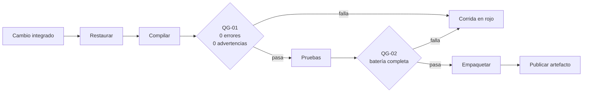
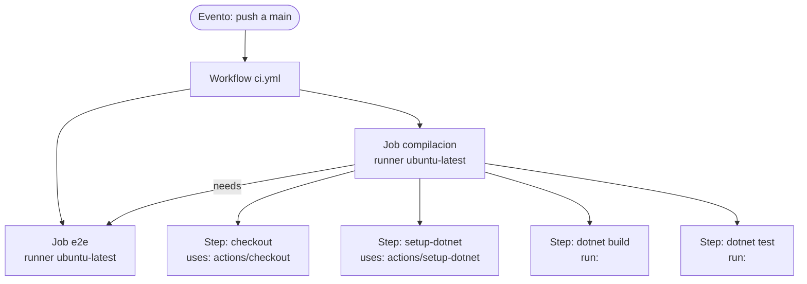
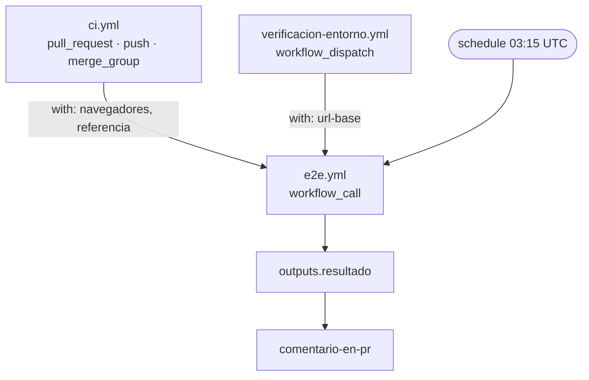
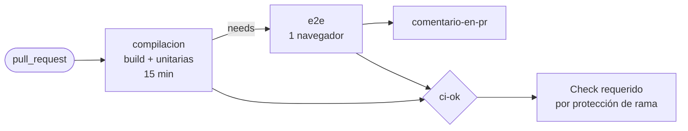
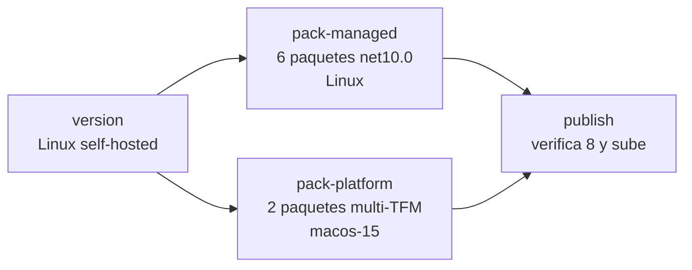
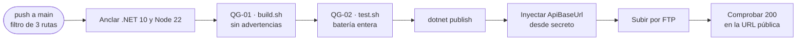

# GitHub Actions — guía de estudio

Quien nunca escribió un workflow suele empezar copiando uno que funciona y cambiándole nombres hasta
que deja de fallar. Funciona una vez y no enseña nada: el siguiente problema vuelve a ser opaco.
Esta guía recorre el camino inverso. Primero fija el vocabulario —qué es un pipeline, qué es una
puerta, qué significa que algo sea «continuo»—, después desarma la sintaxis sección por sección, y
recién entonces muestra escenarios completos: compilar y probar, correr pruebas de extremo a extremo,
publicar un paquete NuGet, subir un sitio por FTP, construir una imagen de contenedor, compilar una
app móvil.

Todos los ejemplos salen de workflows que existen y corren en este workspace. No hay YAML inventado
para ilustrar: cuando algo no está implementado en ningún repositorio propio, se dice, y el ejemplo
se marca como ilustrativo con su fuente externa.

## Para quién es y qué deja

| Si sos… | La guía te deja en condiciones de… |
|---|---|
| Desarrollo | Leer el workflow que bloquea tu pull request, entender por qué falló y escribir uno para tu proyecto |
| QA | Decidir qué se verifica en cada disparador, y por qué una regresión completa no va en cada push |
| DevOps | Elegir runner, secretos, permisos, caché y estrategia de publicación con criterio de costo y riesgo |
| Product Owner | Entender qué garantiza y qué no garantiza el pipeline antes de aprobar una versión |
| Seguridad | Revisar permisos del token, manejo de secretos, procedencia de las acciones de terceros y SBOM |

## Convención de marcas

Cada afirmación no trivial lleva una marca que dice de dónde sale. Es la convención del repositorio
([README](../../README.md)) y acá se usa igual, con una tercera marca que este cuerpo documental usa
mucho porque casi todo se comprobó leyendo archivos del workspace.

| Marca | Significado |
|---|---|
| **[F: ID]** | Fundamentada en una fuente externa verificable, listada en el [anexo de fuentes](#anexo-e--fuentes) |
| **[C]** | Convención de este equipo: deliberada, discutible y cambiable |
| **[E: ID]** | Comprobada leyendo un archivo del workspace el **2026-08-31**; el ID resuelve en el [catálogo de evidencia](#anexo-f--catálogo-de-evidencia) |
| **[E: OBS-n]** | Hecho negativo comprobado al recorrer el workspace —algo que ningún repositorio hace—; el número resuelve en las [observaciones](#observaciones-registradas-durante-la-lectura) del mismo catálogo |

Un ejemplo etiquetado **[E]** no es una recomendación automática: es lo que hoy hace un repositorio
concreto. Varias secciones marcan explícitamente cuando el ejemplo real tiene un defecto o una deuda,
porque ahí es donde más se aprende.

## Ruta de lectura

**Nunca vi Actions:** §1 → §2 → §3 → §4 → escenario §7.1 → anexo de plantillas. Con eso podés
escribir tu primer `ci.yml` y entender lo que escribiste.

**Ya escribí workflows y quiero ordenarlos:** §5 (sintaxis completa) → §6 (composición y reutilización)
→ §9 (operación, costo y seguridad).

**Tengo que decidir qué verifica el pipeline:** §3 (marco de referencia) → §4 (mapa conceptual) →
§7.3 (puertas de calidad) → §9.4 (protección de rama).

**Vengo por un escenario puntual:** andá directo a §7 y volvé a §5 cuando una sección de sintaxis no
te cierre.

## Contenido

| § | Tema |
|---|---|
| [1](#1-automatización-de-la-construcción-el-marco-conceptual) | Automatización de la construcción: CI, CD, pipeline, stage, puerta |
| [2](#2-qué-es-github-actions) | Qué es GitHub Actions y cuál es su modelo de ejecución |
| [3](#3-marco-de-referencia-escenarios-contextos-y-actores) | Marco de referencia: escenarios, contextos y actores |
| [4](#4-mapa-conceptual-estoy-acá--qué-aplico) | Mapa conceptual: «estoy acá → qué aplico» |
| [5](#5-anatomía-de-un-workflow-sección-por-sección) | Anatomía de un workflow, sección por sección |
| [6](#6-composición-reutilización-y-acciones-propias) | Composición: workflows reutilizables, acciones y matrices |
| [7](#7-escenarios-de-automatización) | Escenarios: CI, unitarias, E2E, puertas, NuGet, FTP, contenedores, móvil, releases |
| [8](#8-cadena-de-suministro-y-evidencia) | Cadena de suministro: SCA, SBOM, artefactos y trazabilidad |
| [9](#9-operación-runners-costo-seguridad-y-diagnóstico) | Operación: runners, costo, seguridad, protección de rama, diagnóstico |
| [A](#anexo-a--glosario) | Glosario |
| [B](#anexo-b--plantillas-comentadas) | Plantillas comentadas |
| [C](#anexo-c--listas-de-verificación) | Listas de verificación |
| [D](#anexo-d--preguntas-que-forman-criterio) | Preguntas que forman criterio |
| [E](#anexo-e--fuentes) | Fuentes |
| [F](#anexo-f--catálogo-de-evidencia) | Catálogo de evidencia del workspace |

---

# 1. Automatización de la construcción: el marco conceptual

## 1.1 El problema que resuelve

Un equipo de tres personas trabaja sobre un mismo repositorio. Cada una compila en su máquina, con su
versión del kit de desarrollo, y prueba lo que tocó. El lunes alguien integra un cambio que compila
en su máquina y rompe una funcionalidad que nadie volvió a probar porque «esa parte no se tocó». El
defecto aparece el jueves, en una demostración.

Nada de eso se arregla con más disciplina. Se arregla moviendo la verificación a un lugar que no
depende de la máquina ni de la memoria de nadie: un servidor que, ante cada cambio, construye desde
cero y ejecuta todo lo que hay que ejecutar. Eso es la **integración continua**, y GitHub Actions es
una de las herramientas que la implementan.

## 1.2 Integración continua (CI)

**Definición.** Práctica en la que cada integrante integra su trabajo a la línea principal con alta
frecuencia —al menos a diario—, y cada integración se verifica con una construcción automatizada que
incluye pruebas, de modo que los errores de integración se detecten rápido. **[F: FOWLER-1]**

Tres partes, y las tres son necesarias:

1. **Integrar seguido.** Si una rama vive dos semanas, el pipeline la verifica recién al final,
   cuando la corrección ya es cara.
2. **Construir automáticamente.** Desde cero, en un entorno reproducible, con un solo comando.
3. **Probar en esa construcción.** Una compilación exitosa no dice nada sobre el comportamiento.

**Qué no es CI.** No es «tener un servidor de builds». Si el equipo trabaja en ramas largas y el
servidor solo compila `main` una vez por semana, hay un servidor de builds y no hay integración
continua. **[F: FOWLER-1]** Y no es un sinónimo de «tener tests»: un repositorio con mil pruebas que
nadie corre automáticamente no tiene CI.

DORA identifica la integración continua como una capacidad asociada a mejor rendimiento en entrega de
software, junto con la construcción automatizada y las pruebas automatizadas. **[F: DORA-1]** Es
evidencia de encuesta, correlacional: orienta la decisión, no la zanja.

## 1.3 Entrega continua y despliegue continuo (CD)

Las dos siglas comparten letras y se confunden todo el tiempo.

| Término | Qué garantiza | Quién decide desplegar |
|---|---|---|
| **Entrega continua** (*continuous delivery*) | El software está **siempre en estado desplegable**: cada cambio produce un artefacto candidato, verificado y listo | Una persona, cuando quiere |
| **Despliegue continuo** (*continuous deployment*) | Además, **todo cambio que pasa las verificaciones se despliega solo** a producción | Nadie: el pipeline |

La entrega continua exige que el software esté desplegable en todo momento a lo largo de su ciclo de
vida, y que el equipo priorice mantenerlo así por encima de trabajar en funcionalidad nueva.
**[F: FOWLER-2]**

En los repositorios de referencia de esta guía **no hay despliegue continuo a producción**
**[E: OBS-10]**. El caso más
cercano es la publicación del front de Geometría, que sube por FTP en cada push a `main` que toque
las rutas declaradas **[E: W-GEO-FTP]**; el resto termina en un artefacto, un paquete o una imagen, y
el acto de desplegar es manual. En Geometría eso está escrito como decisión: la canalización termina
en un artefacto verificado, no en un servicio corriendo, y desplegar es del Product Owner.
**[E: IDX-GEO-08]**

## 1.4 Pipeline, stage y puerta

**Pipeline** (canalización): la secuencia ordenada de etapas por las que pasa un cambio desde que se
integra hasta que queda listo para entregar. No es un archivo ni una herramienta: es el proceso. Un
mismo pipeline puede estar repartido en tres workflows.

**Stage** (etapa): un tramo del pipeline con un propósito único —restaurar dependencias, compilar,
probar, empaquetar, publicar—. Las etapas se ordenan por costo creciente: lo que falla barato va
primero.

**Gate** (puerta de calidad): una condición que el cambio debe cumplir para seguir avanzando. Una
puerta **bloqueante** detiene el pipeline; una **informativa** deja constancia y no frena. La
diferencia no es técnica sino de política: el mismo paso puede ser una u otra según si su fallo corta
la corrida.

El pipeline del bot de moderación nombra sus puertas explícitamente —formato canónico, compilación
sin advertencias, batería de pruebas, umbral de cobertura, ausencia de vulnerabilidades altas o
críticas— y cada paso del YAML lleva escrito a qué stage y a qué gate del documento de proceso
corresponde. **[E: W-BOT-CI]** Es una convención cara de mantener y valiosa: hace que la pregunta
«¿dónde se verifica esto?» tenga una respuesta señalable.



*Orden genérico de un pipeline con dos puertas bloqueantes: lo barato falla primero y nada se publica
sin haber pasado por las dos. El flujo real de Geometría, con sus nombres propios, está en
[§7.5](#75-e-05--publicación-por-ftp-a-un-hosting).* **[C]**

El caso de Geometría vale como advertencia sobre el orden. Hasta el 2026-08-18 ese flujo publicaba
sin correr ninguna de las dos puertas: `dotnet publish` compila, así que un error de compilación
frenaba la publicación, pero **una advertencia y la batería entera en rojo pasaban igual**. La
comprobación final tampoco lo veía, porque la página carga y responde 200 con el producto roto por
dentro. **[E: W-GEO-FTP]** Una verificación de disponibilidad no es una puerta de calidad.

## 1.5 Pruebas: qué nivel corre dónde

| Nivel | Qué verifica | Costo típico | Dónde conviene correrlo |
|---|---|---|---|
| **Unitaria** | Una unidad de código aislada, sin red, disco ni interfaz | Milisegundos | En cada push y cada pull request, siempre |
| **Integración** | Varias unidades juntas, con sus dependencias reales o simuladas | Segundos | En cada pull request |
| **Extremo a extremo (E2E)** | El sistema completo, por la misma vía que lo usa una persona | Minutos | Reducida en el pull request, completa en la línea principal |
| **De humo** (*smoke*) | Que un entorno ya desplegado responde y hace lo básico | Segundos a minutos | Después de cada despliegue |

El criterio que ordena esta tabla es el **costo de la señal**: una prueba lenta que se ejecuta en cada
push convierte el pipeline en el cuello de botella y el equipo empieza a esquivarlo.

En `Lab-E2E.WebBlazor` ese criterio está implementado como una expresión de una línea: en un pull
request se corre un solo navegador; en `main` y en la cola de merge, los cuatro. **[E: W-E2E-CI]**

```yaml
navegadores: ${{ github.event_name == 'pull_request' && 'chromium' || 'chromium,firefox,webkit,mobile-chrome' }}
```

El mismo repositorio ordena las etapas por costo dentro de la corrida: el job de compilación y
unitarias se declara con el comentario «comprobaciones baratas: fallan en segundos y evitan gastar un
runner con navegadores», y el job de E2E depende de él. **[E: W-E2E-CI]**

## 1.6 Preguntas guía de esta sección

**¿Un repositorio con workflows tiene integración continua?**
No necesariamente. Tiene automatización. Hay CI si además el equipo integra a la línea principal con
alta frecuencia y esa integración dispara la verificación. Un repositorio donde las ramas viven
semanas tiene workflows y no tiene CI. **[F: FOWLER-1]**

**¿Cuál es la diferencia práctica entre entrega continua y despliegue continuo?**
Quién aprieta el botón. En entrega continua el artefacto queda listo y alguien decide; en despliegue
continuo no hay botón. La consecuencia es organizativa antes que técnica: el despliegue continuo
exige confiar en el pipeline lo suficiente como para no mirar.

**¿Una comprobación de que el sitio responde 200 es una puerta de calidad?**
Es una verificación de disponibilidad. Detecta que la subida se completó y que el servidor sirve
algo. No detecta que ese algo esté roto. Geometría lo tiene documentado por haberlo sufrido.
**[E: W-GEO-FTP]**

**¿Por qué no correr toda la regresión en cada push?**
Porque el costo de la señal empieza a superar su valor. Si esperar el pipeline cuesta veinte minutos,
el equipo integra menos seguido, que es exactamente lo contrario de lo que la CI busca.

---

# 2. Qué es GitHub Actions

## 2.1 Definición

GitHub Actions es la plataforma de integración y entrega continua integrada en GitHub: permite
automatizar la construcción, la prueba y el despliegue, y también otras tareas del repositorio como
etiquetar issues o comentar pull requests. Ejecuta **workflows** disparados por eventos del
repositorio. **[F: GHDOC-19]**

Dos consecuencias de que esté integrada al repositorio, y las dos importan:

- El **evento** que dispara el workflow es un hecho del repositorio —un push, un pull request, un
  tag—, no una configuración externa que puede quedar desincronizada.
- La definición del workflow **vive versionada junto al código**, en `.github/workflows/`. Un cambio
  de pipeline se revisa como cualquier otro cambio. Esa es también la razón por la que
  `.github/workflows/**` suele ser una ruta sensible en `CODEOWNERS`. **[C]**

## 2.2 El modelo de ejecución

Cinco piezas, de mayor a menor:

| Pieza | Qué es | Dónde se declara |
|---|---|---|
| **Evento** | El hecho que dispara la ejecución | `on:` |
| **Workflow** | Un proceso automatizado completo. Un archivo YAML | `.github/workflows/*.yml` |
| **Job** | Un conjunto de pasos que corren **en la misma máquina** | `jobs.<id>` |
| **Step** | Una unidad de trabajo: un comando o una acción | `jobs.<id>.steps[]` |
| **Action** | Una pieza reutilizable empaquetada, propia o de terceros | `uses:` |

Y transversal a todo: el **runner**, la máquina que ejecuta un job.



Cuatro reglas del modelo que explican la mayoría de los tropiezos iniciales:

1. **Los jobs corren en paralelo salvo que se declare lo contrario** con `needs:`.
2. **Cada job arranca en una máquina limpia.** Lo que un job deja en disco no está en el siguiente.
   Para pasar archivos entre jobs se usan **artefactos**; para pasar valores, **outputs**.
3. **Los steps de un job comparten la máquina y el sistema de archivos**, pero **no el shell**: una
   variable exportada en un `run:` no existe en el siguiente. Para eso está `$GITHUB_ENV`.
4. **El repositorio no está descargado** hasta que un step lo descarga. Por eso casi todos los
   workflows empiezan con `actions/checkout`.

La regla 2 se ve completa en el workflow reutilizable de E2E: un job publica la aplicación una sola
vez y la sube como artefacto; los jobs de la matriz la bajan. **[E: W-E2E-E2E]** Y trae una
consecuencia que no es obvia y está anotada en el propio archivo: los artefactos de Actions se
empaquetan en zip y **pierden el bit de ejecución**, así que después de bajarlos hay que devolverlo
con `chmod +x`.

## 2.3 Dónde vive un workflow

```text
mi-repositorio/
├── .github/
│   └── workflows/
│       ├── ci.yml                  ← se ejecuta: está en la carpeta correcta
│       ├── release.yml
│       └── notas.md                ← no se ejecuta: no es .yml/.yaml
├── src/
└── tests/
```

El nombre del archivo es libre; lo que lo hace ejecutable es la ubicación y la extensión `.yml` o
`.yaml`. **[F: GHDOC-19]**, **[F: GHDOC-1]** La convención `ci.yml`, `cd-<destino>.yml` que usan varios repositorios de
este workspace es propia, no una regla de la plataforma. **[C]**

Cuando hay muchos workflows conviene que el nombre diga qué dispara y qué produce. En
`Ejemplos_Maui_Devices` hay dieciocho archivos con el patrón `cd-ios-<categoria>.<Proyecto>.yml`,
donde la categoría coincide con la carpeta del proyecto bajo la solución. **[E: IDX-DEV-09]**

## 2.4 Qué se ve en la interfaz

| Elemento | Dónde | Para qué |
|---|---|---|
| **Corrida** (*workflow run*) | Pestaña Actions | El historial: quién la disparó, con qué commit, cuánto tardó |
| **Registro** (*log*) | Dentro de la corrida, por step | Diagnóstico. Se puede descargar completo |
| **Artefactos** | Al pie de la corrida | Los archivos que la corrida decidió conservar |
| **Resumen** (*job summary*) | Encabezado de la corrida | Markdown que el propio workflow escribió en `$GITHUB_STEP_SUMMARY` |
| **Check** | En el pull request | El resultado que la protección de rama puede exigir |

El resumen es la pieza más subestimada. `Lab-E2E.WebBlazor` arma con él una tabla de contadores por
navegador leyendo los TRX de cada configuración, de modo que el resultado se lee sin abrir un
artefacto. **[E: W-E2E-E2E]**

## 2.5 Preguntas guía de esta sección

**¿Por qué mi workflow no aparece en la pestaña Actions?**
Las tres causas habituales, en orden de frecuencia: no está en `.github/workflows/`; el YAML tiene un
error de sintaxis (GitHub lo reporta en la propia pestaña); o el evento declarado en `on:` no ocurrió
—por ejemplo, `push` con un filtro `paths` que el cambio no toca—.

**¿Puedo pasar un archivo de un job a otro?**
Solo por artefacto. Los jobs no comparten disco. Si el archivo es chico y es un valor, conviene un
`output` en lugar de un artefacto.

**¿Y entre dos steps del mismo job?**
El disco sí se comparte; el shell no. Un archivo escrito en un step está en el siguiente; una
variable exportada con `export`, no. Se propaga escribiéndola en `$GITHUB_ENV`.

**¿Un workflow puede modificar el repositorio?**
Sí, si el token tiene permiso de escritura, pero es una decisión de riesgo. El principio general es
declarar `permissions:` con lo mínimo necesario, y elevarlo solo en el job que lo precisa
(§[9.3](#93-secretos-permisos-y-acciones-de-terceros)).

---

# 3. Marco de referencia: escenarios, contextos y actores

Las secciones que siguen usan este vocabulario sin volver a explicarlo. Son tres ejes: **qué situación
estoy automatizando** (escenario), **en qué entorno** (contexto) y **quién decide qué** (actor). Los
tres se instancian acá para el dominio de la automatización con GitHub Actions.

## 3.1 Escenarios

| ID | Escenario | Pregunta que responde | Se desarrolla en |
|---|---|---|---|
| **E-01** | Verificación de un cambio propuesto | ¿Este pull request rompe algo? | [§7.1](#71-e-01--verificación-de-un-cambio-propuesto) |
| **E-02** | Verificación de la línea principal | ¿Lo ya integrado sigue sano? | [§7.2](#72-e-02--verificación-de-la-línea-principal) |
| **E-03** | Puertas de calidad sobre el cambio | ¿Cumple los umbrales acordados? | [§7.3](#73-e-03--puertas-de-calidad) |
| **E-04** | Publicación de un paquete reutilizable | ¿Cómo llega la librería a quien la consume? | [§7.4](#74-e-04--publicación-de-un-paquete-nuget) |
| **E-05** | Publicación de una aplicación a un hosting | ¿Cómo llega el sitio a producción? | [§7.5](#75-e-05--publicación-por-ftp-a-un-hosting) |
| **E-06** | Construcción y publicación de una imagen de contenedor | ¿Cómo se empaqueta el servicio? | [§7.6](#76-e-06--construcción-y-publicación-de-una-imagen-de-contenedor) |
| **E-07** | Construcción de una aplicación móvil | ¿Cómo se compila y firma sin una Mac en el escritorio? | [§7.7](#77-e-07--construcción-de-una-aplicación-móvil) |
| **E-08** | Corte de versión y release | ¿Qué versión es ésta y qué lleva adentro? | [§7.8](#78-e-08--corte-de-versión-y-release) |
| **E-09** | Verificación de un entorno ya desplegado | ¿Lo que está corriendo allá funciona? | [§7.9](#79-e-09--verificación-de-un-entorno-desplegado) |
| **E-10** | Regresión programada | ¿Algo se rompió sin que nadie tocara nada? | [§7.10](#710-e-10--regresión-programada) |

Un escenario que no aparece en esta tabla y que sí conviene nombrar para descartarlo: **E-00,
automatización de tareas del repositorio** —etiquetar issues, cerrar los inactivos, dar la bienvenida
a quien contribuye por primera vez—. Actions sirve para eso y no es CI/CD; la guía no lo desarrolla.

## 3.2 Contextos

Los contextos cambian la respuesta dentro de un mismo escenario.

| ID | Contexto | Qué cambia |
|---|---|---|
| **C-1** | Runner alojado por GitHub | La máquina arranca limpia cada vez: hay que instalar y cachear todo. Se paga por minuto en repositorios privados **[F: GHDOC-10]** |
| **C-2** | Runner autoalojado | La máquina es del equipo y conserva estado entre corridas: más rápido y más barato, con la contrapartida de que hay que mantenerlo y aislarlo **[F: GHDOC-9]** |
| **C-3** | Repositorio público | Los minutos de los runners estándar no se facturan **[F: GHDOC-10]**; las corridas y sus registros quedan a la vista de cualquiera **[C]** |
| **C-4** | Repositorio privado | Se consume la cuota de minutos de la cuenta; los multiplicadores por sistema operativo importan **[F: GHDOC-10]** |
| **C-5** | Plataforma de destino ≠ plataforma del runner | Aparecen restricciones duras: por ejemplo, el workload `ios` de .NET no existe para Linux **[E: IDX-PT-08]** |

C-5 no es un detalle de nicho: es el contexto que determina la forma completa del pipeline de NuGet
de `PrintThermal_Motor_Maui`, que necesita dos runners de sistemas operativos distintos para producir
un único conjunto de paquetes ([§7.4](#74-e-04--publicación-de-un-paquete-nuget)).

## 3.3 Actores

| ID | Actor | Qué decide | Qué no decide |
|---|---|---|---|
| **A-DEV** | Desarrollo | Qué pruebas escribe, cómo divide el cambio | Los umbrales de las puertas |
| **A-QA** | Calidad | Qué nivel de prueba corre en cada disparador, y qué evidencia exige | El diseño del código |
| **A-DEVOPS** | Plataforma | Runners, secretos, permisos, caché, estrategia de publicación | Si una versión sale |
| **A-PO** | Product Owner | Si una versión sale y cuándo se despliega | Cómo se implementa la puerta |
| **A-SEC** | Seguridad | Permisos del token, procedencia de acciones de terceros, política de secretos | Los tiempos de entrega |

En Geometría el reparto está escrito y es un buen ejemplo de frontera clara: la canalización termina
en un artefacto verificado y **el acto de desplegar es manual y del Product Owner**. **[E: IDX-GEO-08]**

## 3.4 La regla de reparto que evita la mitad de las discusiones

Geometría formula un criterio que se generaliza bien más allá de su caso: **si para cambiarlo hay que
conocer el fuente, es del fuente; si hay que conocer el host, es del proyecto de contenedor.**
**[E: IDX-GEO-08]** Aplicado a workflows: la definición de cómo se construye y se prueba vive con el
código; la dirección de la LAN, la IP, el techo de memoria y las claves viven donde se despliega. Por
eso ninguna dirección real aparece en el YAML del front: todas llegan como secretos del repositorio.
**[E: W-GEO-FTP]**

---

# 4. Mapa conceptual: «estoy acá → qué aplico»

## 4.1 Entrada por escenario

| Estoy acá | Evento a declarar | Qué corre | Sección |
|---|---|---|---|
| Quiero verificar cada pull request | `pull_request` | Compilar + unitarias + subconjunto de E2E | [§7.1](#71-e-01--verificación-de-un-cambio-propuesto) |
| Quiero verificar lo integrado | `push` a `main` | Todo, incluida la regresión completa | [§7.2](#72-e-02--verificación-de-la-línea-principal) |
| Quiero publicar una versión | `push` con `tags: ['v*']` | Empaquetar + publicar + crear release | [§7.8](#78-e-08--corte-de-versión-y-release) |
| Quiero poder correrlo a mano | `workflow_dispatch` | Lo que elija quien lo dispara, por `inputs` | [§5.2](#52-on--los-disparadores) |
| Quiero que otro workflow lo invoque | `workflow_call` | Lo mismo, parametrizado | [§6.1](#61-workflows-reutilizables) |
| Quiero una corrida nocturna | `schedule` | Regresión completa | [§7.10](#710-e-10--regresión-programada) |
| Quiero verificar un entorno desplegado | `workflow_dispatch` con `inputs` de URL | Prueba de humo contra esa URL | [§7.9](#79-e-09--verificación-de-un-entorno-desplegado) |

## 4.2 Entrada por síntoma

| Me pasa esto | Probablemente sea | Sección |
|---|---|---|
| El workflow no aparece en Actions | Ruta, sintaxis o filtro `paths` | [§2.5](#25-preguntas-guía-de-esta-sección) |
| «No such file or directory» en el primer comando | Falta `actions/checkout` | [§5.6](#56-steps-run-y-uses) |
| Una variable de un step no existe en el siguiente | Los steps no comparten shell | [§5.9](#59-pasar-valores-github_env-github_output-y-github_step_summary) |
| Un job no ve el archivo que produjo el anterior | Los jobs no comparten disco | [§5.8](#58-artefactos-y-caché) |
| El binario descargado como artefacto «no es ejecutable» | El zip pierde el bit de ejecución | [§5.8](#58-artefactos-y-caché) |
| El paso de subida no corre cuando las pruebas fallan | Falta `if: always()` o `if: ${{ !cancelled() }}` | [§5.7](#57-if-condiciones-y-resultados) |
| Cada corrida vuelve a bajar todas las dependencias | Falta caché | [§5.8](#58-artefactos-y-caché) |
| El secreto llega vacío y el error aparece lejos | Falta validar el secreto al principio | [§9.3](#93-secretos-permisos-y-acciones-de-terceros) |
| La compilación pasa aunque haya advertencias | Falta `-warnaserror` o su equivalente | [§7.3](#73-e-03--puertas-de-calidad) |
| Dos corridas de la misma rama se pisan | Falta `concurrency` | [§5.4](#54-concurrency--una-corrida-por-rama) |

## 4.3 Entrada por artefacto que quiero producir

| Quiero producir | Acción o comando central | Sección |
|---|---|---|
| Resultados de prueba consultables | `dotnet test --logger trx` + `actions/upload-artifact` | [§7.1](#71-e-01--verificación-de-un-cambio-propuesto) |
| Un paquete NuGet en nuget.org | `dotnet pack` + `dotnet nuget push` | [§7.4](#74-e-04--publicación-de-un-paquete-nuget) |
| Un sitio publicado en un hosting | `dotnet publish` + acción de FTP | [§7.5](#75-e-05--publicación-por-ftp-a-un-hosting) |
| Una imagen de contenedor en un registro | `docker/build-push-action` | [§7.6](#76-e-06--construcción-y-publicación-de-una-imagen-de-contenedor) |
| Un APK descargable | `dotnet publish -f net10.0-android` + artefacto | [§7.7](#77-e-07--construcción-de-una-aplicación-móvil) |
| Un release de GitHub con adjuntos | `gh release create` | [§7.8](#78-e-08--corte-de-versión-y-release) |
| Un SBOM | Generador CycloneDX + artefacto | [§8.2](#82-sbom-inventario-de-lo-que-se-entrega) |
| Evidencia visual de que la app arranca | Grabación del simulador + artefacto | [§7.7](#77-e-07--construcción-de-una-aplicación-móvil) |

---

# 5. Anatomía de un workflow, sección por sección

Un workflow es un archivo con ocho o nueve claves de primer nivel, y el orden en que aparecen no es
casual: `on` decide cuándo corre, `permissions` con cuánta autoridad, `jobs` qué se hace. La
referencia completa es la documentación oficial **[F: GHDOC-1]**; acá va, clave por clave, qué hace,
cuándo se usa y qué error habitual evita.

## 5.1 `name` — cómo se identifica la corrida

```yaml
name: CI
```

El texto que aparece en la pestaña Actions y en el check del pull request. Si se omite, GitHub usa la
ruta del archivo. **[F: GHDOC-1]**

Una recomendación que sale de un defecto real: **que el nombre no contenga datos que envejecen**. En
`PrintThermal_Motor_Maui` el nombre del job declaraba un número fijo de tests y decía 185 cuando la
suite ya corría 259; la corrección fue quitar el número. **[E: IDX-PT-08]**

## 5.2 `on` — los disparadores

Es la sección que decide cuándo corre el workflow, y la que más determina si el pipeline ayuda o
estorba. **[F: GHDOC-2]**

### Los disparadores que importan

| Evento | Cuándo ocurre | Uso típico |
|---|---|---|
| `push` | Se empujan commits a una rama o un tag | Verificar `main`; disparar publicación por tag |
| `pull_request` | Se abre, actualiza o reabre un pull request | Verificar el cambio propuesto |
| `merge_group` | El cambio entra a la cola de merge | Verificar la combinación que se va a integrar |
| `workflow_dispatch` | Alguien lo dispara a mano desde Actions | Operaciones puntuales, con parámetros |
| `workflow_call` | Otro workflow lo invoca | Reutilización ([§6.1](#61-workflows-reutilizables)) |
| `schedule` | En un horario, con sintaxis cron | Regresión nocturna |
| `workflow_run` | Otro workflow terminó | Encadenar: verificar después de desplegar |
| `release` | Se publica un release | Distribuir a un canal externo |

### Filtros: ramas, tags y rutas

```yaml
on:
  push:
    branches: [main]
    paths-ignore:
      - '**/*.md'
      - 'docs/**'
      - '.gitignore'
  pull_request:
    branches: [main, develop]
    types: [opened, synchronize, reopened, ready_for_review]
  merge_group:
```

*Disparadores reales de la CI de `Lab-E2E.WebBlazor`.* **[E: W-E2E-CI]**

Tres filtros y su criterio:

- **`branches`**: acota a qué ramas importa. En `pull_request`, filtra por la rama **destino**.
- **`paths` / `paths-ignore`**: acota a qué archivos importan. Ahorra corridas enteras cuando el
  cambio es de documentación.
- **`types`**: acota qué actividad del evento cuenta. El ejemplo agrega `ready_for_review` para que
  el pipeline arranque cuando un borrador se marca listo.

**El filtro de rutas es el que más silenciosamente puede romper un pipeline.** El caso está
documentado en Geometría: el filtro lleva tres entradas y la tercera entró por una corrección, porque
sin `src/GeometriaFactory.Contracts/**` un cambio del contrato no disparaba la publicación y las dos
unidades quedaban desalineadas **sin que nada fallara**. **[E: W-GEO-FTP]** Un filtro de rutas
incompleto no produce una corrida en rojo: produce una corrida que no existe.

### Disparo manual con parámetros

```yaml
on:
  workflow_dispatch:
    inputs:
      entorno:
        description: Entorno a verificar.
        type: environment
        required: true
      url-base:
        description: URL pública del entorno.
        type: string
        required: true
```

*Disparadores del workflow de verificación de entorno.* **[E: W-E2E-ENT]**

Los tipos disponibles para un input son `string`, `choice`, `boolean`, `number` y `environment`.
**[F: GHDOC-1]** `choice` produce un desplegable, lo que evita la mitad de los errores de tipeo:

```yaml
navegadores:
  description: Configuraciones a ejecutar.
  type: choice
  default: chromium
  options:
    - chromium
    - chromium,firefox
    - chromium,firefox,webkit
    - chromium,firefox,webkit,mobile-chrome
```

**[E: W-E2E-E2E]**

### Programación por cron

```yaml
on:
  schedule:
    # Regresión completa todas las noches (03:15 UTC ≈ 00:15 en Argentina).
    - cron: '15 3 * * *'
```

**[E: W-E2E-E2E]** El cron de Actions se interpreta **en UTC** **[F: GHDOC-2]**, y ése es el error clásico: un horario
pensado en hora local corre desplazado. El comentario del ejemplo existe justamente por eso.

Los cinco campos son minuto, hora, día del mes, mes y día de la semana. **[F: GHDOC-2]**

### Un archivo con varios disparadores

Un mismo workflow puede declarar varios eventos, y ahí aparece un problema práctico: `inputs` está
vacío cuando el disparo fue `schedule`. La solución es dar valores por defecto explícitos:

```yaml
env:
  # `inputs` está vacío en `schedule`, de ahí los valores por defecto explícitos.
  NAVEGADORES: ${{ inputs.navegadores || 'chromium,firefox,webkit,mobile-chrome' }}
```

**[E: W-E2E-E2E]**

## 5.3 `permissions` — qué puede tocar el token

Cada job recibe un token de instalación, `GITHUB_TOKEN`, con permisos sobre el repositorio.
**[F: GHDOC-6]** Declararlos explícitamente convierte un permiso implícito en una decisión revisable:

```yaml
permissions:
  contents: read
```

Se puede declarar a nivel de workflow y **elevarlo solo en el job que lo precisa**:

```yaml
  comentario-en-pr:
    permissions:
      contents: read
      pull-requests: write
```

**[E: W-E2E-CI]** El workflow entero lee; únicamente el job que comenta el pull request puede
escribir en él. Es el principio de mínimo privilegio aplicado con la granularidad que la plataforma
ofrece. **[F: GHDOC-16]**

| Permiso | Para qué se necesita |
|---|---|
| `contents: read` | Descargar el repositorio con `actions/checkout` |
| `contents: write` | Crear un release, empujar un tag o un commit |
| `pull-requests: write` | Comentar o etiquetar un pull request |
| `packages: write` | Publicar en el registro de paquetes de GitHub |
| `id-token: write` | Emitir un token OIDC —credencial de vida corta que el proveedor externo verifica contra GitHub— y autenticar sin guardar ningún secreto |

## 5.4 `concurrency` — una corrida por rama

```yaml
concurrency:
  group: ci-${{ github.ref }}
  cancel-in-progress: ${{ github.event_name == 'pull_request' }}
```

**[E: W-E2E-CI]** Agrupa las corridas por clave: solo una del grupo corre a la vez, y una nueva
cancela a la que estaba encolada. Cancelar además la que ya está corriendo requiere
`cancel-in-progress: true`. **[F: GHDOC-7]**

El detalle que hace bueno a este ejemplo es que **la cancelación es condicional**, y el archivo
explica el motivo: en un pull request cancelar es correcto porque el resultado viejo ya no interesa;
en `main` no se cancela, «para no perder el historial de verificación de commits ya integrados».
**[E: W-E2E-CI]** Un `cancel-in-progress: true` a secas deja huecos en la trazabilidad de la línea
principal.

## 5.5 `jobs`, `runs-on` y `needs`

```yaml
jobs:
  compilacion:
    name: Compilación y unitarias
    runs-on: ubuntu-latest
    timeout-minutes: 15
    steps:
      - uses: actions/checkout@v7

  e2e:
    needs: [compilacion]
    uses: ./.github/workflows/e2e.yml
```

**[E: W-E2E-CI]**

| Clave | Qué hace |
|---|---|
| `runs-on` | Elige el runner. `ubuntu-latest`, `windows-latest`, `macos-15`, o etiquetas de un runner propio |
| `needs` | Declara dependencia: este job espera a los nombrados. Sin `needs`, todo corre en paralelo |
| `timeout-minutes` | Corta el job. Sin él, un job colgado consume el máximo de la plataforma |
| `if` | Condiciona la ejecución ([§5.7](#57-if-condiciones-y-resultados)) |
| `strategy` | Ejecuta el mismo job varias veces con parámetros distintos ([§6.3](#63-matrices)) |
| `environment` | Asocia el job a un entorno, con sus secretos y sus reglas de aprobación **[F: GHDOC-15]** |
| `outputs` | Expone valores a los jobs que dependen de él |

**Apuntar a un runner propio** se hace con una lista de etiquetas:

```yaml
    # runs-on: ubuntu-latest
    runs-on: [self-hosted, i7infra-dev]
```

**[E: W-PT-CI]** La convención de dejar comentada la alternativa —el runner alojado arriba, el propio
abajo, o al revés— aparece en varios repositorios del workspace y es útil: documenta que el workflow
corre en los dos y deja el cambio a una línea de distancia. **[C]**

`timeout-minutes` merece una mención aparte porque suele omitirse. `e2e.yml` lo declara en
sus cuatro jobs con valores distintos según lo que hace cada uno —20 para publicar, 5 para armar la
matriz, 30 para las pruebas y 15 para el reporte—. **[E: W-E2E-E2E]** Un timeout ajustado convierte un
cuelgue en un fallo rápido y legible.

## 5.6 `steps`, `run` y `uses`

Un step hace una de dos cosas: **ejecuta un comando** (`run`) o **usa una acción** (`uses`).

```yaml
      - name: Restaurar
        run: dotnet restore Lab-E2E.WebBlazor.sln

      - name: Preparar el SDK de .NET
        uses: actions/setup-dotnet@v6
        with:
          dotnet-version: '10.0.x'
```

**[E: W-E2E-CI]**

| Clave | Para qué |
|---|---|
| `name` | El título en el registro. Sin él aparece el comando crudo |
| `run` | Uno o varios comandos. Con `|` se pasan varias líneas; con `>-`, una sola línea plegada |
| `shell` | `bash`, `pwsh`, `python`… Fija el intérprete en vez de depender del sistema del runner |
| `uses` | La acción: `<owner>/<repo>@<ref>` para las publicadas, `./ruta` para las locales |
| `with` | Los parámetros de la acción |
| `env` | Variables de entorno solo para ese step |

### Acciones de uso frecuente

| Acción | Qué hace |
|---|---|
| `actions/checkout` | Descarga el repositorio en el runner |
| `actions/setup-dotnet`, `setup-node`, `setup-java`, `setup-python` | Instalan y fijan la versión del kit |
| `actions/cache` | Guarda y restaura una carpeta entre corridas |
| `actions/upload-artifact` / `download-artifact` | Suben y bajan archivos entre jobs y para consulta posterior |
| `actions/github-script` | Ejecuta JavaScript con el cliente de la API de GitHub ya autenticado |

### `set -euo pipefail`: el detalle que cambia el resultado

El shell por defecto de un bloque `run` corre con `-e`, así que un comando suelto del medio que
devuelve distinto de cero sí corta el paso. **[F: GHDOC-1]** Lo que no viene por omisión es el resto:
**el fallo de un tramo intermedio de una tubería se pierde**, porque el estado de una tubería es el
de su último tramo, y una variable sin definir se expande a vacío en silencio. De ahí sale una clase
entera de pipelines «verdes» que en realidad fallaron. La costumbre de este workspace es abrir los
bloques largos con:

```yaml
        shell: bash
        run: |
          set -euo pipefail
```

**[E: W-E2E-CI]**, **[E: W-GEO-FTP]** — `-e` corta ante el primer error, `-u` ante una variable no
definida, `pipefail` propaga el error de cualquier tramo de una tubería.

### Fijar la versión de una acción

`uses: actions/checkout@v4` fija una etiqueta mayor; `@v4.1.1`, una versión exacta; y un SHA de
commit completo fija el contenido de forma inmutable. La guía de endurecimiento recomienda anclar
las acciones de terceros a un SHA. **[F: GHDOC-16]** En los doce workflows que esta guía cita
ninguna acción se ancla a un SHA: las oficiales van por etiqueta mayor, y las de terceros oscilan
entre la etiqueta mayor —`docker/build-push-action@v6`— y la versión exacta
—`SamKirkland/FTP-Deploy-Action@v4.3.5`—, que es precisa pero sigue siendo reapuntable por quien
publica la acción. **[E: W-GEO-FTP]**, **[E: W-BOT-DOCKER]** Es una deuda conocida, no
un descuido: anclar por SHA cuesta mantenimiento y conviene decidirlo por acción según el riesgo.
**[C]**

## 5.7 `if`, condiciones y resultados

`if` decide si un job o un step se ejecuta. Dentro de `if` **no hacen falta las llaves** `${{ }}`,
aunque se admiten. **[F: GHDOC-1]** Con una excepción que cuesta una corrida: si la expresión empieza
con `!`, las llaves son obligatorias, porque `!` es notación reservada de YAML y el archivo ni
siquiera parsea. `if: !cancelled()` no anda; `if: ${{ !cancelled() }}`, sí. **[F: GHDOC-1]**

### Las funciones de estado

| Función | Verdadera cuando… | Uso |
|---|---|---|
| `success()` | Todo lo anterior salió bien | Es el valor implícito si no se pone `if` |
| `failure()` | Algo anterior falló | Notificar, comentar el pull request |
| `always()` | Siempre, incluso si se canceló la corrida | Limpieza, subida de evidencia |
| `cancelled()` | La corrida fue cancelada | Distinguir cancelación de fallo |

```yaml
      - name: Subir los resultados de las unitarias
        if: ${{ !cancelled() }}
        uses: actions/upload-artifact@v7
```

**[E: W-E2E-CI]**

**`!cancelled()` frente a `always()`.** Los dos hacen que el step corra cuando las pruebas fallaron
—que es lo que se busca: los resultados de una corrida en rojo son justamente los que interesan—,
pero `always()` corre también cuando alguien canceló la corrida, y eso alarga cancelaciones que
deberían ser inmediatas. `!cancelled()` es la opción más precisa para subir evidencia. Ambas se usan
en el workspace: `always()` en `PrintThermal_Motor_Maui` y en el bot **[E: W-PT-CI]**, **[E: W-BOT-CI]**;
`!cancelled()` en `Lab-E2E.WebBlazor` **[E: W-E2E-CI]**.

### Condiciones sobre el evento y sobre el resultado de otro job

```yaml
    if: >-
      ${{ always()
      && github.event_name == 'pull_request'
      && github.event.pull_request.head.repo.full_name == github.repository }}
```

**[E: W-E2E-CI]** — la tercera condición evita que el job intente comentar en un pull request que
viene de un fork, donde el token no tiene permiso de escritura.

```yaml
    if: ${{ !cancelled() && needs.preparar.result == 'success' && needs.publicar.result != 'failure' }}
```

**[E: W-E2E-E2E]** — el archivo explica por qué: `publicar` se saltea cuando se prueba contra un
entorno ya desplegado, y **un job salteado no debe arrastrar al que depende de él**. Sin esa
condición, `needs` haría que saltear un job cancele el siguiente.

### `continue-on-error`: cuando el fallo no debe cortar

```yaml
    - name: RELEASE SIMULADOR. GRABAR VIDEO Y CREAR GIF
      continue-on-error: true
      timeout-minutes: 30
```

**[E: W-DEV-QR]** El paso graba la ejecución de la app en el simulador. Que la grabación falle no
invalida la compilación: la evidencia es deseable, no bloqueante. **[E: IDX-DEV-09]** Ésa es la
pregunta que hay que hacerse antes de poner `continue-on-error`: si esto falla, ¿el resultado del
pipeline sigue significando lo mismo?

## 5.8 Artefactos y caché

Se confunden porque las dos guardan archivos, y sirven para cosas distintas.

| | Artefacto | Caché |
|---|---|---|
| Para qué | Conservar y compartir un **resultado** | Acelerar una **descarga o compilación repetida** |
| Quién lo consume | Personas, y otros jobs | El propio pipeline |
| Si no está | El resultado se perdió | Todo funciona, más lento |
| Sección | `upload-artifact` / `download-artifact` **[F: GHDOC-13]** | `actions/cache` **[F: GHDOC-12]** |

### Artefactos

```yaml
      - name: Subir los resultados
        if: ${{ !cancelled() }}
        uses: actions/upload-artifact@v7
        with:
          name: resultados-${{ matrix.configuracion }}
          path: resultados
          retention-days: ${{ env.RETENCION_DIAS }}
          if-no-files-found: ignore
```

**[E: W-E2E-E2E]**

- **`name` con la variable de la matriz** evita que las configuraciones se pisen: cada una sube su
  propio artefacto.
- **`retention-days`** es una decisión de costo. En el workspace conviven 1 día para un `.app.zip` de
  simulador **[E: W-DEV-QR]**, 7 para resultados de prueba **[E: W-PT-CI]** y 30 o 90 para cobertura
  y SBOM **[E: W-BOT-CI]**. El criterio es cuánto tiempo alguien va a querer mirarlo.
- **`if-no-files-found`** admite `warn` (por defecto), `error` e `ignore`. Vale `error` cuando el
  artefacto es el producto del job.

Para recolectar varios artefactos en un job de reporte:

```yaml
      - name: Traer los resultados de todas las configuraciones
        uses: actions/download-artifact@v8
        with:
          path: resultados
          pattern: resultados-*
          merge-multiple: true
```

**[E: W-E2E-E2E]**

**La trampa del zip.** Los artefactos se empaquetan en zip y no conservan los permisos de archivo
—todo directorio queda en `755` y todo archivo en `644`— **[F: UPART-1]**, así que un
binario que viaja como artefacto vuelve sin permiso de ejecución:

```yaml
      - name: Devolver el permiso de ejecución
        run: chmod +x publicacion/MovilidadUrbana.Web
```

**[E: W-E2E-E2E]**

### Caché

```yaml
      - name: Cache de paquetes NuGet
        uses: actions/cache@v4
        with:
          path: ~/.nuget/packages
          key: nuget-${{ runner.os }}-${{ hashFiles('**/*.csproj', '**/*.slnx') }}
          restore-keys: nuget-${{ runner.os }}-
```

**[E: W-BOT-CI]**

La clave es lo que hay que pensar. Se compone de tres partes:

1. Un **prefijo** que identifica qué se cachea.
2. El **sistema operativo**, porque una caché de Linux no sirve en macOS.
3. Un **hash de los archivos que determinan el contenido**. `hashFiles()` produce un valor que cambia
   exactamente cuando cambian esas dependencias.

`restore-keys` es la degradación elegante: si no hay coincidencia exacta, se restaura la caché más
reciente que empiece con ese prefijo y se completa lo que falte. Sin `restore-keys`, cualquier cambio
en un `.csproj` implica descargarlo todo de nuevo.

Un segundo ejemplo, con una clave elegida con criterio distinto:

```yaml
      - name: Caché de los navegadores de Playwright
        uses: actions/cache@v6
        with:
          path: ~/.cache/ms-playwright
          key: playwright-${{ runner.os }}-${{ env.NAVEGADOR }}-${{ hashFiles('tests/MovilidadUrbana.E2ETests/MovilidadUrbana.E2ETests.csproj') }}
```

**[E: W-E2E-E2E]** El archivo explica el razonamiento: la clave se apoya en el `.csproj` porque
cambia cuando cambia la versión de Playwright, «que es cuando cambian las builds de los navegadores».
Y `${{ env.NAVEGADOR }}` está en la clave para no guardar los tres navegadores en la misma entrada.
La misma nota registra por qué el caché apareció: el runner autoalojado conservaba los navegadores
entre corridas por ser un contenedor de larga vida, y los runners de GitHub arrancan limpios.

## 5.9 Pasar valores: `GITHUB_ENV`, `GITHUB_OUTPUT` y `GITHUB_STEP_SUMMARY`

Tres archivos especiales cuya ruta llega por variable de entorno. Se escribe en ellos con `>>`.
**[F: GHDOC-14]**

| Archivo | Alcance | Se lee como |
|---|---|---|
| `$GITHUB_ENV` | Los **steps siguientes del mismo job** | `${{ env.NOMBRE }}` |
| `$GITHUB_OUTPUT` | Los **jobs que declaren `needs`** sobre éste | `${{ needs.<job>.outputs.<clave> }}` |
| `$GITHUB_STEP_SUMMARY` | La interfaz de la corrida | No se lee: se muestra |

### Variables entre steps

```yaml
      - name: Traducir la configuración a navegador y emulación
        shell: bash
        run: |
          set -euo pipefail
          case "${{ matrix.configuracion }}" in
            mobile-chrome) echo "NAVEGADOR=chromium" >> "$GITHUB_ENV"; echo "EMULAR_MOVIL=true" >> "$GITHUB_ENV" ;;
            *) echo "NAVEGADOR=${{ matrix.configuracion }}" >> "$GITHUB_ENV"; echo "EMULAR_MOVIL=false" >> "$GITHUB_ENV" ;;
          esac
```

**[E: W-E2E-E2E]** El step traduce un nombre de configuración a dos variables, y el resto del job las
usa sin repetir la lógica. `mobile-chrome` no es un navegador: es chromium con el descriptor de un
Pixel 7.

### Salidas entre jobs

```yaml
  version:
    outputs:
      package_version: ${{ steps.resolve.outputs.package_version }}
    steps:
      - name: Determinar versión
        id: resolve
        run: |
          if [[ "${{ github.ref }}" == refs/tags/* ]]; then
            VERSION="${{ github.ref_name }}"
            VERSION="${VERSION#v}"
          elif [[ "${{ github.event_name }}" == "workflow_dispatch" ]]; then
            VERSION="${{ github.event.inputs.version }}"
          else
            VERSION="0.0.0-preview.${{ github.run_number }}"
          fi
          echo "package_version=$VERSION" >> $GITHUB_OUTPUT
```

**[E: W-PT-NUGET]** Tres piezas encadenadas: el step declara `id`, escribe en `$GITHUB_OUTPUT`, y el
job lo expone en `outputs`. Recién entonces otro job puede leerlo con
`${{ needs.version.outputs.package_version }}`.

El propósito de este job en particular es instructivo: resuelve **un único número de versión para
ocho paquetes**, porque si cada uno resolviera el suyo aparecerían downgrades de dependencia
(`NU1605`) en las aplicaciones que mezclen varios. **[E: IDX-PT-08]**

### Resumen de la corrida

```yaml
          {
            echo "## Pruebas E2E"
            echo
            echo "| Configuración | Total | Pasaron | Fallaron |"
            echo "| --- | ---: | ---: | ---: |"
          } >> "$GITHUB_STEP_SUMMARY"
```

**[E: W-E2E-E2E]** Es Markdown, y aparece en el encabezado de la corrida. Convierte un resultado que
había que buscar en un artefacto en algo que se lee de un vistazo.

### Comandos de workflow

```bash
echo "::error::La CI no está en verde."
echo "::warning::El tag ($tag_version) no coincide con la versión nbgv ($version); se usa la versión nbgv."
```

**[E: W-E2E-CI]**, **[E: W-BOT-PUB]** — `::error::` y `::warning::` producen anotaciones visibles en
la interfaz, no solo una línea más de registro. **[F: GHDOC-14]** Un `exit 1` sin anotación obliga a
leer todo el log para saber qué pasó.

## 5.10 Contextos y expresiones

Todo lo que va entre `${{ }}` es una expresión evaluada por la plataforma. **[F: GHDOC-17]**

| Contexto | Qué trae | Ejemplo de uso |
|---|---|---|
| `github` | El evento y el repositorio | `github.event_name`, `github.ref`, `github.sha`, `github.run_number` |
| `env` | Las variables declaradas | `env.DOTNET_VERSION` |
| `job` / `runner` | El job y la máquina | `runner.os`, `runner.temp` |
| `steps` | Salidas de steps con `id` | `steps.meta.outputs.tags` |
| `needs` | Salidas y resultados de jobs previos | `needs.pruebas.result` |
| `inputs` | Parámetros de `workflow_dispatch` o `workflow_call` | `inputs.url-base` |
| `matrix` | El valor de la combinación actual | `matrix.app.path` |
| `secrets` / `vars` | Secretos y variables de configuración | `secrets.NUGET_API_KEY` |

**El operador `||` no es «o lógico»: devuelve el primer valor verdadero.** Es el idiom que resuelve
los valores por defecto:

```yaml
      referencia: ${{ github.event.pull_request.head.sha || github.sha }}
```

**[E: W-E2E-CI]** — en un pull request usa el SHA de la cabeza; en cualquier otro evento, el del
propio evento.

Y combinado con `&&` produce un ternario:

```yaml
${{ github.event_name == 'pull_request' && 'chromium' || 'chromium,firefox,webkit,mobile-chrome' }}
```

**[E: W-E2E-CI]** Se lee «si es un pull request, chromium; si no, los cuatro».

Funciones útiles: `contains()`, `startsWith()`, `endsWith()`, `format()`, `join()`, `toJSON()`,
`fromJSON()`, `hashFiles()`. **[F: GHDOC-23]** `fromJSON()` aparece en [§6.3](#63-matrices), donde
convierte una cadena en la matriz de un job.

## 5.11 `env`, variables y valores por defecto

```yaml
env:
  DOTNET_VERSION: '10.0.102'
```

**[E: W-PT-CI]** Declarado a nivel de workflow, job o step; el más cercano gana. **[F: GHDOC-4]**

Fijar la versión del kit en una variable y usarla en todos lados evita el error de actualizar el
`setup-dotnet` de un job y olvidar el de otro:

```yaml
    - name: Setup .NET ${{ env.DOTNET_VERSION }}
      uses: actions/setup-dotnet@v4
      with:
        dotnet-version: ${{ env.DOTNET_VERSION }}
```

**[E: W-PT-CI]** — el nombre del step también la usa, así que el registro dice qué versión se instaló.

Una alternativa más fuerte cuando el proyecto ya declara su versión: tomarla del propio repositorio.

```yaml
      - name: Setup .NET
        uses: actions/setup-dotnet@v4
        with:
          global-json-file: global.json
```

**[E: W-BOT-CI]** Así hay **una sola fuente de verdad** para la versión del SDK, y el pipeline no
puede desincronizarse del entorno de desarrollo.

La misma idea, llevada a una verificación explícita:

```yaml
      - name: Verificar que el SDK coincide con el framework del proyecto
        shell: bash
        run: |
          set -euo pipefail
          framework="$(grep -oP '(?<=<TargetFramework>)[^<]+' src/MovilidadUrbana.Web/MovilidadUrbana.Web.csproj)"
          sdk="net$(dotnet --version | cut -d. -f1).0"
          echo "csproj: $framework — runner: $sdk"
          test "$framework" = "$sdk"
```

**[E: W-E2E-E2E]** Falla temprano y con un mensaje que nombra las dos versiones, en vez de fallar más
adelante con un error de compilación que no dice de dónde viene el desajuste.

**`vars` frente a `secrets`.** `vars.*` son variables de configuración del repositorio, visibles en
los registros; `secrets.*` están enmascarados en la salida. Una URL pública puede ir en `vars`; una
clave, nunca. **[F: GHDOC-4]**, **[F: GHDOC-5]**

## 5.12 Preguntas guía de esta sección

**¿`always()` o `!cancelled()` para subir los resultados de prueba?**
`!cancelled()`. Las dos cubren el caso importante —las pruebas fallaron y quiero los resultados—,
pero `always()` también corre cuando alguien canceló la corrida y alarga la cancelación.

**¿Por qué mi `if` con `needs` no corre si el job anterior se salteó?**
Porque un job salteado no es un job exitoso, y `needs` implica `success()` por omisión. Hay que
explicitarlo: `needs.publicar.result != 'failure'` en lugar de depender del comportamiento implícito.
**[E: W-E2E-E2E]**

**¿Qué pongo en la clave de caché?**
Un prefijo, `runner.os` y un `hashFiles()` sobre los archivos que determinan el contenido cacheado.
Si la clave no cambia cuando cambia el contenido, se sirve una caché vieja y el diagnóstico es
penoso; si cambia siempre, la caché no sirve para nada.

**¿Cuánta retención le pongo a un artefacto?**
La que necesite quien lo va a mirar. Un `.app.zip` de simulador que solo prueba que compiló: un día.
Resultados de prueba: una semana. Cobertura y SBOM, que se comparan entre versiones: treinta o
noventa días.

**¿Puedo confiar en que un bloque `run` de diez líneas falla si falla la línea tres?**
Si la línea tres es un comando suelto, sí: el shell por defecto corre con `-e`. Si es un tramo
intermedio de una tubería, o si el problema es una variable sin definir, no. Para esos dos casos hace
falta abrir con `set -euo pipefail`.

---

# 6. Composición, reutilización y acciones propias

Un repositorio con quince workflows que repiten los mismos ocho pasos tiene quince lugares donde
corregir el mismo defecto. La plataforma ofrece tres mecanismos para evitarlo, y elegir mal entre
ellos deja un remedio peor que la duplicación.

| Mecanismo | Qué reutiliza | Cuándo |
|---|---|---|
| **Workflow reutilizable** | Uno o varios **jobs** completos | La unidad repetida es «un proceso»: probar, publicar |
| **Acción compuesta** | Una secuencia de **steps** | La unidad repetida es «una preparación»: instalar y configurar algo |
| **Matriz** | El **mismo job** con parámetros distintos | La unidad repetida es la misma, sobre datos distintos |

## 6.1 Workflows reutilizables

Un workflow que declara `on: workflow_call` puede ser invocado desde otro, del mismo repositorio o de
otro. **[F: GHDOC-3]**

### El lado que ofrece

```yaml
on:
  workflow_call:
    inputs:
      navegadores:
        description: Configuraciones a ejecutar, separadas por coma (chromium, firefox, webkit, mobile-chrome).
        type: string
        default: chromium
      url-base:
        description: URL ya desplegada contra la que probar. Vacío = se publica y se levanta localmente.
        type: string
        default: ''
    outputs:
      resultado:
        description: Resultado agregado de las pruebas (success / failure).
        value: ${{ jobs.reporte.outputs.resultado }}
```

**[E: W-E2E-E2E]**

### El lado que consume

```yaml
  e2e:
    name: E2E
    needs: [compilacion]
    uses: ./.github/workflows/e2e.yml
    with:
      navegadores: ${{ github.event_name == 'pull_request' && 'chromium' || 'chromium,firefox,webkit,mobile-chrome' }}
      referencia: ${{ github.event.pull_request.head.sha || github.sha }}
```

**[E: W-E2E-CI]**

Tres cosas que conviene notar:

- **El job que invoca no tiene `steps` ni `runs-on`.** Los pone el workflow invocado.
- **`needs` sigue funcionando**: se puede encadenar con jobs normales.
- **Los outputs vuelven**: `needs.e2e.outputs.resultado` está disponible para el job que comenta el
  pull request. **[E: W-E2E-CI]**

### Qué gana el repositorio

`e2e.yml` es «la única definición de cómo se corren las E2E en todo el repositorio», y esa frase está
escrita en el archivo que lo consume. **[E: W-E2E-CI]** Tiene dos consumidores con propósitos
distintos:



El segundo consumidor es el que demuestra el valor del diseño: con `url-base` cargada, el workflow
**ni siquiera compila la aplicación** —se saltea el job `publicar`— y prueba la que ya está
corriendo. **[E: W-E2E-ENT]** La misma definición de pruebas sirve para verificar un cambio y para
verificar un despliegue, cambiando un parámetro.

### El caso contrario: dieciocho copias

`Ejemplos_Maui_Devices` tiene dieciocho workflows de iOS que siguen la misma secuencia de poco más de
treinta pasos —treinta y dos según su propio índice; el conteo sobre los archivos da 32 en nueve de
ellos y 33 en los otros nueve— y difieren únicamente en un bloque de cinco variables de identidad del
proyecto. **[E: IDX-DEV-09]**, **[E: W-DEV-QR]**

```yaml
  PACKAGE_NAME: 'com.ejemplos.devices.qr.barcodescanner_mobile_maui.simple'
  SOLUTION_FOLDER: 'Ejemplos_Devices'
  PROJECTS_ROOT: 'QR'
  PROJECT_NAME: 'BSM.LectorQR'
  PROJECT_FILE: 'BSM.LectorQR.csproj'
```

**[E: W-DEV-QR]**

El costo de esa duplicación está medido en el propio índice del repositorio: ocho de los dieciocho
son «de la generación anterior» y no declaran `PIPELINE_VERSION` ni `SCRIPT_SIMULATOR`, porque «la
estandarización llegó hasta QR e Integrada». **[E: IDX-DEV-09]** Es el resultado previsible de
mejorar una copia a la vez. Los dieciocho declaran `workflow_call`, así que la refactorización a un
único reutilizable con esas cinco variables como `inputs` es viable y está a la vista.

**Cuándo la duplicación se justifica.** Cuando las variantes divergen de verdad y no en parámetros:
el workflow `Integrada` no solo cambia nombres, también instala Maestro, arranca el simulador por
interfaz gráfica porque el arranque sin pantalla se cuelga esperando BackBoard, y graba video en vez
de GIF. **[E: IDX-DEV-09]** Eso ya no es el mismo job con otros datos.

## 6.2 Acciones

Una acción es una aplicación empaquetada que hace una tarea repetida. Hay tres tipos: **de
JavaScript**, **de contenedor Docker** y **compuestas** —una secuencia de steps declarada en YAML—.
**[F: GHDOC-18]**

Se usan con `uses:`, y la referencia puede ser:

| Forma | Significado |
|---|---|
| `actions/checkout@v4` | Acción publicada, anclada a la etiqueta `v4` |
| `actions/checkout@a1b2c3…` | Anclada a un commit exacto: inmutable **[F: GHDOC-16]** |
| `./.github/actions/preparar` | Acción local del propio repositorio |
| `docker://alpine:3.19` | Imagen de contenedor directamente |

En este workspace **no hay acciones propias**: la reutilización se hace con workflows reutilizables y
con scripts del repositorio. **[E: OBS-1]** La segunda estrategia tiene una ventaja que la acción
compuesta no tiene.

### Invocar scripts del repositorio en lugar de reescribir comandos

```yaml
      - name: Puerta QG-01 · construir sin advertencias, con el bundle del visor
        run: ./scripts/build.sh

      - name: Puerta QG-02 · la batería entera
        run: ./scripts/test.sh
```

**[E: W-GEO-FTP]** El razonamiento está escrito en el archivo: `scripts/build.sh` y `scripts/test.sh`
«son los mismos que corren en la máquina de quien construye». Un `dotnet test` escrito a mano en el
YAML sería **un segundo lugar donde la configuración puede decir otra cosa**.

Esa es la ventaja sobre la acción compuesta: el script corre igual en el runner y en la máquina de
desarrollo, así que «en mi máquina anda» deja de ser una hipótesis. El mismo archivo registra el
defecto que este criterio evitó: un paso suelto que empaquetaba el visor se retiró porque
`build.sh` ya lo hace adentro, y tenerlos a los dos habría corrido `npm ci` y webpack dos veces por
publicación, dejando **dos lugares desde donde se genera el mismo artefacto**. **[E: W-GEO-FTP]**

## 6.3 Matrices

Una matriz ejecuta el mismo job una vez por combinación de parámetros. **[F: GHDOC-11]**

### Matriz literal

```yaml
    strategy:
      matrix:
        app:
          - name: SampleApp
            path: samples/MotorDsl.SampleApp/MotorDsl.SampleApp.csproj
            output: output/sampleapp
            package: com.motordsl.sampleapp
          - name: MultaApp
            path: samples/MotorDsl.MultaApp/MotorDsl.MultaApp.csproj
            output: output/multaapp
            package: com.motordsl.multaapp
```

**[E: W-PT-ANDROID]** Cada entrada es un objeto, y los steps la leen con `${{ matrix.app.path }}`.
Dos APK con un solo job escrito.

### Matriz dinámica

Cuando las combinaciones no se conocen hasta la corrida, un job las calcula y el siguiente las
consume:

```yaml
  preparar:
    outputs:
      configuraciones: ${{ steps.matriz.outputs.configuraciones }}
    steps:
      - id: matriz
        shell: bash
        env:
          ENTRADA: ${{ env.NAVEGADORES }}
        run: |
          set -euo pipefail
          lista="$(echo "$ENTRADA" | tr -d ' ' | awk -F, '{for(i=1;i<=NF;i++) printf "\"%s\"%s", $i, (i<NF?",":"")}')"
          echo "configuraciones=[${lista}]" >> "$GITHUB_OUTPUT"

  pruebas:
    needs: [publicar, preparar]
    strategy:
      fail-fast: false
      matrix:
        configuracion: ${{ fromJSON(needs.preparar.outputs.configuraciones) }}
```

**[E: W-E2E-E2E]** El job `preparar` convierte la cadena `chromium,firefox` en el JSON
`["chromium","firefox"]`, y `fromJSON()` lo transforma en matriz. Es lo que permite que el mismo
workflow corra un navegador en un pull request y cuatro en `main` sin duplicar la definición.

### `fail-fast`

Por omisión, si una combinación falla, la plataforma cancela las demás. Para una matriz de pruebas
eso es contraproducente: interesa saber si el defecto es de un navegador o de todos.

```yaml
    strategy:
      fail-fast: false
```

**[E: W-E2E-E2E]** Para una matriz de compilación, en cambio, el valor por omisión suele ser el
correcto: si no compila en una plataforma, las demás no aportan información nueva.

## 6.4 Preguntas guía de esta sección

**¿Workflow reutilizable o acción compuesta?**
Si lo que se repite son jobs completos, con su runner y su ciclo de vida, reutilizable. Si es una
secuencia de steps dentro de un job —instalar, configurar, autenticarse—, acción compuesta.

**Tengo quince workflows casi iguales. ¿Los unifico?**
Primero medí en qué difieren. Si difieren solo en parámetros, sí: uno con `workflow_call` e `inputs`.
Si difieren en pasos, la unificación produce un workflow lleno de condiciones, que es peor que la
duplicación. El caso de `Ejemplos_Maui_Devices` es el primero: cinco variables de identidad.
**[E: IDX-DEV-09]**

**¿Escribo los comandos en el YAML o llamo a un script?**
Si el comando también se corre a mano, script: una sola definición para las dos ejecuciones. Si es
específico del pipeline —subir un artefacto, comentar un pull request—, YAML.

**¿Por qué mi matriz dinámica dice que la entrada no es válida?**
Casi siempre porque `fromJSON()` recibió algo que no es JSON. Conviene imprimir el valor en el job
que lo genera; el ejemplo del workspace lo escribe también en `$GITHUB_STEP_SUMMARY` justamente para
poder verlo. **[E: W-E2E-E2E]**

---

# 7. Escenarios de automatización

Cada escenario sigue la misma estructura: qué problema resuelve, cómo se implementa, un ejemplo real
del workspace, y qué mirar antes de darlo por bueno.

## 7.1 E-01 — Verificación de un cambio propuesto

**Qué resuelve.** Que un pull request no integre una rotura. Es el escenario que originó la guía de
ramas de este repositorio —[GF-08](../Estandares-Modelo-Ramas-Guide/Estandares-Modelo-Ramas.md#8-pull-requests-y-pruebas-automatizadas)
fija el procedimiento; acá está la herramienta con la que se implementa—: sin verificación
automática, el defecto aparece días después.

**Cómo se implementa.** Disparador `pull_request`, jobs ordenados por costo, y un job final que
resume a todos para que la protección de rama tenga un solo check que exigir.



*Estructura de la CI de `Lab-E2E.WebBlazor`.* **[E: W-E2E-CI]**

**El job barato primero.** Compilar y correr unitarias tarda segundos y no necesita navegadores:

```yaml
      - name: Compilar con los avisos tratados como error
        run: dotnet build Lab-E2E.WebBlazor.sln --configuration Release --no-restore -warnaserror

      - name: Pruebas unitarias
        run: >-
          dotnet test tests/MovilidadUrbana.UnitTests
          --configuration Release --no-build
          --logger "trx;LogFileName=unitarias.trx" --results-directory resultados
```

**[E: W-E2E-CI]** `--no-restore` y `--no-build` evitan repetir trabajo del step anterior; el
`--logger trx` produce el archivo que después se sube como artefacto.

**Un paso que vale la pena copiar.** Antes de gastar un runner con navegadores, comprobar que las
pruebas E2E siquiera se descubren:

```yaml
      - name: Listar las pruebas E2E (detecta que el descubrimiento funciona)
        run: >-
          dotnet test tests/MovilidadUrbana.E2ETests
          --configuration Release --no-build --list-tests
```

**[E: W-E2E-CI]** No levanta navegadores ni la aplicación: solo comprueba que el runner encuentre los
casos. Un fallo acá cuesta segundos; el mismo fallo descubierto dentro de la matriz cuesta minutos y
un runner.

**Devolver el resultado a donde se toma la decisión.** El pipeline que solo deja el resultado en la
pestaña Actions obliga a ir a buscarlo. Los dos repositorios que lo resuelven lo hacen de forma
distinta y vale comparar:

```yaml
    - name: Comentar PR si falla
      if: failure() && github.event_name == 'pull_request'
      uses: actions/github-script@v7
```

**[E: W-PT-CI]** — comenta solo cuando falla, y agrega un comentario por corrida.

```yaml
            const previo = comentarios.find((c) => c.body?.includes(marca));
            // Se actualiza el comentario existente en vez de agregar uno por corrida.
            if (previo) {
              await github.rest.issues.updateComment({ owner, repo, comment_id: previo.id, body: cuerpo });
            } else {
              await github.rest.issues.createComment({ owner, repo, issue_number: numero, body: cuerpo });
            }
```

**[E: W-E2E-CI]** — comenta siempre, y **actualiza** el comentario anterior buscándolo por un
marcador HTML invisible (`<!-- e2e-playwright -->`). Un pull request con doce corridas queda con un
comentario, no con doce.

**El job que resume.** La protección de rama se configura contra nombres de check, así que agregar un
job obliga a tocar la configuración del repositorio. Un job final que agrega a todos los demás lo
evita:

```yaml
  ci-ok:
    name: CI aprobada
    needs: [compilacion, e2e]
    if: always()
    steps:
      - name: Comprobar que ningún job previo falló
        shell: bash
        run: |
          set -euo pipefail
          for resultado in "${{ needs.compilacion.result }}" "${{ needs.e2e.result }}"; do
            case "$resultado" in
              success|skipped) ;;
              *) echo "::error::La CI no está en verde."; exit 1 ;;
            esac
          done
```

**[E: W-E2E-CI]** `if: always()` es imprescindible: sin él, el job no correría cuando algo falló, que
es exactamente cuando tiene que fallar.

**Qué mirar antes de darlo por bueno.** Que el job resumen esté configurado como check requerido; que
los filtros de `paths` no dejen afuera algo que sí afecta al producto; que las unitarias corran antes
que las E2E; que los resultados suban con `if: ${{ !cancelled() }}`.

## 7.2 E-02 — Verificación de la línea principal

**Qué resuelve.** Que lo ya integrado siga sano, con una verificación más completa que la del pull
request. Es donde corre la regresión entera.

**La diferencia con E-01 es de alcance, no de estructura.** El mismo workflow, con dos cambios:

```yaml
concurrency:
  group: ci-${{ github.ref }}
  cancel-in-progress: ${{ github.event_name == 'pull_request' }}
```

**[E: W-E2E-CI]** No se cancelan las corridas de `main`: cada commit integrado conserva su
verificación en el historial.

```yaml
      navegadores: ${{ github.event_name == 'pull_request' && 'chromium' || 'chromium,firefox,webkit,mobile-chrome' }}
```

**[E: W-E2E-CI]** Cuatro navegadores en lugar de uno.

**`merge_group`.** Cuando el repositorio usa cola de merge, el evento `merge_group` verifica la
combinación resultante antes de integrarla, que no es lo mismo que verificar cada pull request por
separado: dos cambios que pasan individualmente pueden romper juntos. **[F: GHDOC-2]**

**Qué mirar.** Que `main` no cancele sus corridas; que lo que corre en `main` sea efectivamente más
que lo que corre en el pull request —si es igual, la distinción no aporta y conviene simplificar—.

## 7.3 E-03 — Puertas de calidad

**Qué resuelve.** Que «pasa la CI» signifique algo más que «compila». El umbral de cada puerta lo fija
A-QA y no se discute por pull request; A-DEV escribe las pruebas que lo alcanzan y elige cómo, que es
el reparto de [§3.3](#33-actores) aplicado al caso más conflictivo.

### Las puertas habituales

| Puerta | Comando típico | Qué detecta |
|---|---|---|
| Formato canónico | `dotnet format --verify-no-changes` | Diferencias de estilo que ensucian los diffs |
| Compilación sin advertencias | `dotnet build -warnaserror` | Advertencias nuevas del compilador y del análisis estático |
| Batería de pruebas | `dotnet test` | Regresiones funcionales |
| Umbral de cobertura | Script propio sobre el reporte | Código nuevo sin pruebas |
| Dependencias vulnerables | `dotnet list package --vulnerable` | Vulnerabilidades conocidas en la cadena |

El pipeline del bot implementa las cinco y anota en cada step a qué stage y gate del documento de
proceso corresponde. **[E: W-BOT-CI]**

```yaml
      # STAGE-01 (gate G4): formato canónico sin diferencias.
      - name: Formato (dotnet format --verify-no-changes)
        run: dotnet format --verify-no-changes --no-restore

      # STAGE-02 + STAGE-03 (gates G1 + G5): build Release con análisis estático,
      # warnings como errores (no se admiten warnings nuevos respecto del baseline).
      - name: Build Release con análisis estático (warnaserror)
        run: dotnet build -c Release --no-restore -warnaserror

      # STAGE-07 (gate G3): umbrales de cobertura global y per-módulo de detección.
      - name: Gate de cobertura (global >= 75/65, detección >= 90)
        shell: pwsh
        run: ./scripts/ci/verificar-cobertura.ps1
```

**[E: W-BOT-CI]**

### `-warnaserror`: la puerta más barata que existe

Sin ella, una advertencia del compilador o del analizador estático es una línea más en un registro
que nadie lee. Con ella, es un fallo. Cuesta una palabra y es la puerta con mejor relación entre
esfuerzo y detección. La usan `Lab-E2E.WebBlazor`, el bot y —vía `scripts/build.sh`— Geometría.
**[E: W-E2E-CI]**, **[E: W-BOT-CI]**, **[E: W-GEO-FTP]**

**La contrapartida honesta:** aplicarla sobre una base de código con advertencias preexistentes
convierte la primera corrida en un muro. La estrategia razonable es fijar el estado actual como línea
base y no admitir advertencias nuevas, que es lo que el comentario del bot declara. **[E: W-BOT-CI]**

### El umbral de cobertura

La cobertura mide qué líneas ejecutó la batería, no si las verificó bien. Como puerta sirve para
detectar código nuevo sin ninguna prueba; no sirve para afirmar que el código está bien probado.
**[C]** El bot lo implementa con umbrales distintos por módulo —más exigente en el módulo de
detección que en el resto— y en un script propio, no en el YAML. **[E: W-BOT-CI]**

Geometría, en cambio, deja escrito que su script de cobertura devuelve **tres** valores posibles: 0,
1 y **2 cuando no se pudo medir**. **[E: IDX-GEO-08]** Distinguir «no cumple» de «no se pudo medir»
evita el peor de los dos errores: dar por buena una corrida donde la medición nunca ocurrió.

### La lección de orden

Ya apareció en §1.4 y vale repetirla acá: **las puertas van antes de publicar, no después**. Geometría
publicaba con la batería entera en rojo porque `dotnet publish` compila, y la verificación final de
que el sitio responde 200 tampoco lo detectaba. **[E: W-GEO-FTP]**

**Qué mirar.** Que cada puerta declarada como bloqueante efectivamente corte la corrida; que el
umbral esté escrito en un lugar y no en dos; que la puerta corra antes del paso que produce el
artefacto.

## 7.4 E-04 — Publicación de un paquete NuGet

**Qué resuelve.** Que una librería llegue a quien la consume, con un número de versión coherente y
sin publicar un conjunto incompleto.

**El caso.** `PrintThermal_Motor_Maui` publica **ocho paquetes** que forman un conjunto. Seis son
`net10.0` puro; dos declaran `net10.0-android;net10.0-ios`. **[E: W-PT-NUGET]**

**La restricción que da forma a todo el pipeline.** `dotnet pack` de un proyecto multi-TFM exige
compilar todos sus TFM, y el workload `ios` **no existe para Linux**: responde «Workload ID ios isn't
supported on this platform» y el build corta con `NETSDK1178`. **[E: IDX-PT-08]** De ahí sale la
estructura de cuatro jobs sobre dos sistemas operativos:



*No es una preferencia: es una restricción de plataforma.* **[E: IDX-PT-08]**

### Una sola versión para todo el conjunto

```yaml
  version:
    outputs:
      package_version: ${{ steps.resolve.outputs.package_version }}
```

**[E: W-PT-NUGET]** Con la resolución ya vista en [§5.9](#59-pasar-valores-github_env-github_output-y-github_step_summary):
tag `v*` → el tag sin la `v`; `workflow_dispatch` → el input; push a `main` → `0.0.0-preview.<n>`.

Los tres orígenes tienen una consecuencia deliberada: **un push a `main` empaqueta y verifica pero no
publica**, porque el push real está condicionado:

```yaml
      - name: Publish to NuGet.org
        if: startsWith(github.ref, 'refs/tags/v') || github.event_name == 'workflow_dispatch'
```

**[E: W-PT-NUGET]**

### No publicar un conjunto incompleto

```yaml
      - name: Verificar que estén los 8
        run: |
          COUNT=$(ls -1 ./nupkg/*.nupkg | wc -l)
          if [ "$COUNT" -ne 8 ]; then
            echo "::error::Se esperaban 8 paquetes y hay $COUNT. No se publica un conjunto incompleto."
            exit 1
          fi
```

**[E: W-PT-NUGET]** Es la puerta que protege contra el fallo silencioso: si el job de macOS falló y
solo llegaron seis, publicar deja el feed con un conjunto que no funciona junto. Y como **las
versiones publicadas en nuget.org son inmutables** —no se puede republicar un número ya usado
**[E: IDX-PT-08]**, **[F: NUGET-2]**—, el error no tiene vuelta atrás: obliga a quemar un número.

### Publicar en orden de dependencias

```yaml
          # Orden de dependencias: Printing.Abstractions primero, los consumidores despues.
          for proj in Printing.Abstractions Core Parser Rendering Extensions Network Bluetooth Maui; do
            dotnet nuget push "./nupkg/MotorDsl.$proj.${{ env.PACKAGE_VERSION }}.nupkg" \
              --api-key ${{ secrets.NUGET_API_KEY }} \
              --source https://api.nuget.org/v3/index.json \
              --skip-duplicate
          done
```

**[E: W-PT-NUGET]** El destino es el extremo de publicación de nuget.org, y la clave viaja como
secreto **[F: NUGET-1]**. `--skip-duplicate` hace el paso reintentable: si la corrida se cae a la mitad,
volver a correrla no falla por los que ya subieron.

### La versión no vive en el `.csproj`

Ninguno de los ocho proyectos declara `<Version>`: se inyecta en el `pack` con `-p:PackageVersion`.
**[E: IDX-PT-08]** Así el número lo decide quien publica —el tag—, y no hay un valor en el
repositorio que se olvide de actualizar.

**Qué mirar.** Que exista la verificación de conjunto completo; que el push esté condicionado al
disparador correcto; que la clave viaje como secreto; que el número de versión tenga un solo origen.

## 7.5 E-05 — Publicación por FTP a un hosting

**Qué resuelve.** Llevar una aplicación web a un hosting compartido que solo ofrece transferencia de
archivos. Es el caso de muchos hostings económicos y no admite contenedores ni agentes de despliegue.

**El flujo completo, en orden:** **[E: W-GEO-FTP]**



### Configuración por secreto, inyectada después de publicar

```yaml
      - name: Inyectar la direccion del servicio de datos desde secretos
        env:
          API_BASE_URL: ${{ secrets.API_BASE_URL }}
        run: |
          set -euo pipefail
          test -n "$API_BASE_URL"
          python3 - <<'PY'
          import json, os, pathlib
          path = pathlib.Path('publish/appsettings.json')
          settings = json.loads(path.read_text(encoding='utf-8'))
          settings['ApiBaseUrl'] = os.environ['API_BASE_URL']
          path.write_text(json.dumps(settings, ensure_ascii=False, indent=2), encoding='utf-8')
          PY
```

**[E: W-GEO-FTP]** El principio: **ninguna dirección real vive en el repositorio**. El artefacto se
construye sin conocer el destino y la configuración se inyecta al publicar.

### El paso de subida

```yaml
      - name: Subir por FTP
        uses: SamKirkland/FTP-Deploy-Action@v4.3.5
        with:
          server: ${{ secrets.FTP_SERVER }}
          username: ${{ secrets.FTP_USERNAME }}
          password: ${{ secrets.FTP_PASSWORD }}
          local-dir: ./publish/
          server-dir: ${{ secrets.FTP_SERVER_DIR }}
```

**[E: W-GEO-FTP]** Es una acción de terceros con credenciales de producción: el caso donde anclar a
un SHA en lugar de a una etiqueta tiene el mejor argumento. **[F: GHDOC-16]**

### Validar el secreto donde se usa

```yaml
          # LA COMPROBACION EXIGE SU SECRETO, igual que la inyeccion de la direccion del
          # servicio de datos. Sin esta linea, un secreto vacio no falla acá: falla adentro de
          # curl con «Malformed input to a URL function», que no nombra el secreto que falta y
          # manda a buscar el problema al lugar equivocado. Ya pasó una vez.
          test -n "$PUBLIC_URL" || { echo "Falta el secreto PUBLIC_URL del repositorio."; exit 1; }
```

**[E: W-GEO-FTP]** Un secreto que no existe llega como cadena vacía, no como error. El fallo aparece
después, dentro de la herramienta que lo consume, con un mensaje que no lo nombra. El bot aplica la
misma idea al principio del job:

```yaml
      - name: Validar secrets Docker Hub
        shell: bash
        run: |
          test -n "${{ secrets.DOCKERHUB_USERNAME }}" || { echo "Falta DOCKERHUB_USERNAME"; exit 1; }
          test -n "${{ secrets.DOCKERHUB_TOKEN }}" || { echo "Falta DOCKERHUB_TOKEN"; exit 1; }
```

**[E: W-BOT-DOCKER]**

### Comprobar que quedó arriba

```yaml
          status_code="$(curl --silent --show-error --location --max-time 30 --output /dev/null --write-out '%{http_code}' "$PUBLIC_URL")"
          echo "La direccion publica respondio $status_code"
          test "$status_code" = "200"
```

**[E: W-GEO-FTP]** Detecta subidas incompletas y errores de configuración del servidor. No detecta
que el producto esté roto por dentro; para eso están las puertas de antes y la prueba de humo de
[§7.9](#79-e-09--verificación-de-un-entorno-desplegado).

**Qué mirar.** Que el filtro de rutas cubra **todo** lo que compone el sitio, contratos incluidos;
que las puertas corran antes del `publish`; que ningún dato del hosting esté en el YAML.

## 7.6 E-06 — Construcción y publicación de una imagen de contenedor

**Qué resuelve.** Empaquetar un servicio con su entorno de ejecución, de modo que la máquina de
destino solo necesite un motor de contenedores.

**Nota de alcance.** De los cinco repositorios que el prompt de esta guía tomó como referencia,
**ninguno construye imágenes en Actions**. `Lab-E2E.WebBlazor` explica incluso por qué no usa jobs
con `container:`: el runner autoalojado del laboratorio «es él mismo un contenedor y no tiene montado
el socket de Docker, así que un job con `container:` ni siquiera llega a arrancar». **[E: W-E2E-E2E]**
El ejemplo de esta sección sale de otro repositorio del mismo workspace, `Discord.Bot.Moderador.Core`,
que sí lo hace. **[E: W-BOT-DOCKER]**

### Las cuatro acciones del conjunto

| Acción | Para qué |
|---|---|
| `docker/login-action` | Autenticarse contra el registro |
| `docker/metadata-action` | Derivar tags y etiquetas OCI del evento |
| `docker/setup-buildx-action` | Habilitar Buildx: caché de capas, multiplataforma |
| `docker/build-push-action` | Construir y empujar |

**[F: DOCKER-1]**

### Los tags: uno móvil y uno inmutable

```yaml
      # Tags: latest (para Portainer) + SHA corto (para trazabilidad y rollback).
      - name: Docker meta (tags y labels)
        id: meta
        uses: docker/metadata-action@v5
        with:
          images: ${{ secrets.DOCKERHUB_USERNAME }}/discord-bot-moderador
          tags: |
            type=raw,value=latest
            type=sha,prefix=,suffix=,format=short
```

**[E: W-BOT-DOCKER]** La combinación resuelve dos necesidades opuestas: `latest` es lo que un
orquestador simple sabe pedir; el tag por SHA identifica exactamente qué código corre y permite
volver atrás. **Desplegar solo por `latest` deja al sistema sin manera de decir qué está corriendo.**

### La construcción y el empuje

```yaml
      - name: Configurar Buildx
        uses: docker/setup-buildx-action@v3

      - name: Build y push imagen
        uses: docker/build-push-action@v6
        with:
          context: .
          push: true
          tags: ${{ steps.meta.outputs.tags }}
          labels: ${{ steps.meta.outputs.labels }}
          build-args: |
            BUILD_VERSION=${{ env.NBGV_SimpleVersion }}+build.${{ github.run_number }}
          cache-from: type=registry,ref=${{ secrets.DOCKERHUB_USERNAME }}/discord-bot-moderador:buildcache
          cache-to:   type=registry,ref=${{ secrets.DOCKERHUB_USERNAME }}/discord-bot-moderador:buildcache,mode=max
```

**[E: W-BOT-DOCKER]** El comentario del archivo explica por qué Buildx no es opcional acá: el driver
`docker` por defecto **no soporta `cache-to`/`cache-from` de tipo registry**, y ésa es la caché que
hace que un rebuild donde solo cambió el código no reconstruya las capas de dependencias.

`build-args` inyecta la versión en la imagen para que la aplicación pueda informarla en tiempo de
ejecución. Sin eso, saber qué versión corre exige mirar el tag desde afuera.

### El orden importa también acá

En el mismo job, antes de construir la imagen, corren la compilación, la batería y la puerta de
cobertura. **[E: W-BOT-DOCKER]** Publicar una imagen que no pasó las puertas es el mismo defecto que
el del FTP, con peor consecuencia: la imagen queda en el registro con su tag.

### La imagen misma no es asunto del workflow

Geometría documenta el reparto con un ejemplo que aclara qué le toca a cada lado: la imagen se sella
a sí misma derivando la revisión del `.git` del contexto de construcción, en lugar de recibirla como
argumento, porque el argumento permitía que la imagen informara por `/salud` **una revisión que no
era la suya — una falla sin síntoma**. **[E: IDX-GEO-08]** El workflow decide cuándo construir; el
`Dockerfile` decide qué garantiza la imagen.

**Qué mirar.** Que haya un tag inmutable además de `latest`; que las credenciales del registro estén
validadas al principio; que las puertas corran antes del push; que la caché de capas esté configurada
si el tiempo de build molesta.

## 7.7 E-07 — Construcción de una aplicación móvil

**Qué resuelve.** Compilar, firmar y dejar instalable una app móvil sin depender de la máquina de
quien desarrolla —y, en el caso de iOS, sin tener una Mac en el escritorio—.

Es el escenario más caro y el más frágil de todos, y conviene saber por qué antes de encararlo.

### Android: matriz y RID explícito

```yaml
    - name: Publish APK
      run: |
        dotnet publish ${{ matrix.app.path }} \
          -f net10.0-android \
          -c Release \
          -p:RuntimeIdentifier=android-arm64 \
          -p:AndroidPackageFormat=apk \
          -p:AndroidKeyStore=false \
          -o ${{ matrix.app.output }}
```

**[E: W-PT-ANDROID]** El RID —*Runtime Identifier*— nombra la plataforma concreta para la que se
publica (`android-arm64`, `linux-x64`); sin uno explícito, el publish resuelve el del host. Dos
comentarios del archivo registran dos fallos que costaron semanas:

- **`NETSDK1178`**: `-f net10.0-android` filtra el *build* pero **no el restore**, que evalúa todos
  los TFM del proyecto. Se resolvió declarando el TFM de iOS condicional al sistema operativo en los
  `.csproj` de los samples. Y el índice agrega el matiz que evita aplicar mal la solución: **ese
  patrón vale para las apps, no para las librerías** — aplicarlo a un proyecto empaquetable haría que
  empaquetar en Linux produjera en silencio un `.nupkg` sin el asset de iOS. **[E: IDX-PT-08]**
- **`NU1102`**: los samples declaran `<RuntimeIdentifiers>` en plural y, sin elegir uno, el publish
  resuelve el RID del **host** y busca un runtime de Linux que no existe en 10.x. **[E: W-PT-ANDROID]**

`AndroidKeyStore=false` produce un APK firmado con la clave de depuración: sirve para instalar y
probar, **no para distribuir**. La firma con la clave real exige que el almacén de claves llegue como
secreto, y eso no está implementado en los repositorios de referencia de esta guía. **[E: OBS-11]**

### iOS: el runner se construye a sí mismo

Los workflows de iOS de `Ejemplos_Maui_Devices` no usan el Xcode ni el .NET que trae el runner:
**instalan los suyos**. **[E: IDX-DEV-09]**

| Bloque | Qué hace |
|---|---|
| XCODE | Instala el Xcode exacto que el proyecto necesita, en los siete pasos que van debajo de la tabla |
| .NETCORE | Borra `/Users/runner/.dotnet` → instala la versión exacta con `dotnet-install.sh` |
| WORKLOADS | `dotnet workload install ios maui maui-ios --version 10.0.100` |
| VERSIONADO | Lee `CFBundleVersion` y `CFBundleShortVersionString` del `Info.plist` con `PlistBuddy` |
| MANIFEST | `plutil -lint` sobre el `Info.plist`; corta el job si es inválido |
| BUILD | `clean` → `restore` → `build` para `net10.0-ios` con RID de simulador |
| FIRMA | Firma ad-hoc manual en tres pasos |
| RUN | Instala ffmpeg, lanza el simulador, graba y sube la evidencia |

**[E: W-DEV-QR]**, **[E: IDX-DEV-09]**

El bloque XCODE, desplegado, es el que explica la media hora de corrida:

1. `pipx install gdown`, la herramienta con la que se baja el instalador.
2. Descarga del `.xip` de Xcode **desde Google Drive**, por ID de archivo.
3. `xip --expand`.
4. Borrado de los Xcode que trae el runner.
5. `xcode-select --switch` al recién instalado.
6. `-runFirstLaunch` y `-license accept`.
7. Descarga de la plataforma iOS.

**Qué gana y qué cuesta.** Gana control total sobre la versión de Xcode, que en móvil determina si el
proyecto compila. Cuesta media hora de corrida y **ata el pipeline a la disponibilidad de un archivo
en Google Drive**. **[E: IDX-DEV-09]** Es la clase de dependencia que conviene tener anotada como
riesgo antes de que falle.

**La firma ad-hoc.** El build sale sin firmar y la firma se hace a mano, en tres pasos, porque el
simulador rechaza la app si el contenido AOT no está firmado:

```yaml
        find "${{ env.APP_PATH }}" -name "*.dll" -or -name "*.dylib" -or -name "*.aotdata*" | xargs codesign --force --sign "-" --timestamp=none
        codesign --force --sign "-" --timestamp=none --entitlements "$ENTITLEMENTS_PATH" "${{ env.APP_PATH }}/${{ env.PROJECT_NAME }}"
        codesign --force --sign "-" --timestamp=none "${{ env.APP_PATH }}"
```

**[E: W-DEV-QR]** `--sign "-"` es firma ad-hoc: vale para el simulador y **no sirve para un
dispositivo real ni para TestFlight**. Ningún workflow de los cinco repositorios de referencia de
esta guía firma con certificado de distribución ni publica a TestFlight. **[E: IDX-DEV-09]** Sí lo
hace un pipeline de otro repositorio del workspace, `GDA.Core.APP`, fuera del alcance de estos
ejemplos. **[E: OBS-4]**

**La variante con disparo automático.** De los dieciocho workflows de `Ejemplos_Maui_Devices`,
diecisiete tienen el bloque `push` **comentado**: solo se invocan a mano o por llamada externa.
**[E: IDX-DEV-09]** El de la app híbrida lo tiene activo y filtrado a la carpeta de su proyecto,
excluyendo `.md`, `.gitignore` y `.gitattributes`. **[E: W-HIB-INT]** Ese mismo archivo está duplicado en el
repositorio de la híbrida, que tiene dos workflows de CD de iOS y no comparten la forma: el de la app
integrada dispara por `push`, y el de OneSignal tiene el bloque entero comentado y solo se invoca por
llamada. Su índice deja registrado el alcance real de la verificación: compilan para el **simulador** y ejecutan un recorrido automatizado; **no hay
firma con certificados de distribución**, y no hay proyectos de prueba unitaria en la solución, así
que el recorrido de interfaz es toda la verificación automatizada que existe. **[E: IDX-HIB-08]**

**Limpieza que igual conviene tener.** El último paso borra el keychain y el provisioning profile
con `if: always()`, aunque el pipeline actual no llegue a crearlos:

```yaml
    - name: Clean up keychain and provisioning profile
      if: ${{ always() }}
      run: |
        if test -f "$RUNNER_TEMP/app-signing.keychain-db"; then
          security delete-keychain $RUNNER_TEMP/app-signing.keychain-db
        fi
```

**[E: W-DEV-QR]** En un runner autoalojado eso deja de ser higiene y pasa a ser seguridad: la máquina
persiste entre corridas.

### La evidencia como artefacto

El pipeline graba la ejecución en el simulador y sube el resultado —GIF, frames y logs, o video MP4
en la variante que usa recorridos automatizados con Maestro—. **[E: W-DEV-QR]**, **[E: IDX-DEV-09]**
Es una respuesta pragmática a un problema real: una app móvil que compila puede fallar al arrancar, y
sin una pantalla que mirar no hay forma de saberlo desde un servidor.

Los propios flujos anotan qué **no** es un fallo: en el simulador la cámara del lector QR se ve negra
porque no hay cámara real, y el overlay de GPS puede pasar a capa de error por falta de ubicación.
**[E: IDX-DEV-09]** Documentar los falsos positivos esperados es lo que hace usable una evidencia
visual.

**Qué mirar.** Que la versión de las herramientas esté fijada y su origen sea confiable; que la firma
corresponda al destino —ad-hoc para simulador, certificado para distribución—; que el artefacto tenga
la retención que su uso justifica; que exista limpieza de credenciales si el runner es propio.

## 7.8 E-08 — Corte de versión y release

**Qué resuelve.** Que una versión tenga un número, un contenido identificable y un lugar del que
descargarla.

### Disparo por tag

```yaml
on:
  push:
    tags:
      - 'v*'

permissions:
  contents: write   # crear el release y subir adjuntos
```

**[E: W-BOT-PUB]** El permiso elevado está justificado en el propio archivo. Es el patrón correcto:
`contents: write` solo donde hace falta.

### Derivar la versión de Git, no escribirla

```yaml
      - name: Checkout
        uses: actions/checkout@v4
        with:
          fetch-depth: 0   # historial completo para versionado por tags

      - name: Calcular versión (nbgv)
        id: nbgv
        uses: dotnet/nbgv@v0.4
        with:
          setAllVars: true
```

**[E: W-BOT-PUB]** `nbgv` es Nerdbank.GitVersioning: deriva el número de versión del historial y de
los tags en vez de leerlo de un archivo. Por eso `fetch-depth: 0` no es opcional: por omisión
`checkout` trae un solo commit **[F: CHECKOUT-1]**, y una herramienta que calcula la versión a partir
del historial no tiene con qué trabajar. Es una de
las causas más frecuentes de «funciona local y falla en CI» en proyectos con versionado derivado.

El workflow verifica además que el tag y la versión calculada coincidan, y avisa sin cortar si no:

```yaml
          tag_version="${GITHUB_REF_NAME#v}"
          if [[ "$tag_version" != "$version" ]]; then
            echo "::warning::El tag ($tag_version) no coincide con la versión nbgv ($version); se usa la versión nbgv."
          fi
```

**[E: W-BOT-PUB]** Es una puerta **informativa**, no bloqueante: registra la discrepancia y sigue con
una regla clara sobre cuál gana.

### Repetir las puertas en la rama de release

```yaml
      # Re-ejecutar los gates de build/tests/cobertura sobre la rama de release (DoD release).
      - name: Build Release (warnaserror)
      - name: Test con cobertura
      - name: Gate de cobertura
```

**[E: W-BOT-PUB]** El argumento es que el tag puede apuntar a un commit que la CI verificó hace días,
en otro contexto. Repetir cuesta minutos y elimina la duda.

### Publicar el release con sus adjuntos

```yaml
      - name: Crear release y adjuntar artefactos
        env:
          GH_TOKEN: ${{ secrets.GITHUB_TOKEN }}
        run: |
          gh release create "${GITHUB_REF_NAME}" \
            ./artefactos/discord-bots-admin_${{ steps.version.outputs.version }}_linux-arm.zip \
            ./artefactos/discord-bots-admin_${{ steps.version.outputs.version }}_linux-arm.zip.sha256 \
            ./artefactos/discord-bots-admin_${{ steps.version.outputs.version }}_sbom.json \
            --title "discord-bots-admin ${{ steps.version.outputs.version }}" \
            --generate-notes \
            ${{ steps.version.outputs.prerelease == 'true' && '--prerelease' || '' }}
```

**[E: W-BOT-PUB]** Tres cosas que hacen a este paso completo: el paquete, **su checksum** y **su
SBOM**. `--generate-notes` arma las notas a partir de los pull requests integrados desde el release
anterior. El ternario del final marca el release como preliminar cuando la versión tiene sufijo de
prerelease.

El versionado sigue SemVer `MAJOR.MINOR.PATCH`. **[F: SEMVER-1]** La decisión de que los builds
automáticos de `main` produzcan `0.0.0-preview.<n>` y no lleguen al feed es del equipo. **[C]**,
**[E: IDX-PT-08]**

**Qué mirar.** Que el `fetch-depth` permita calcular la versión; que las puertas se repitan sobre el
commit etiquetado; que el release lleve checksum; que la condición de prerelease sea explícita.

## 7.9 E-09 — Verificación de un entorno desplegado

**Qué resuelve.** Comprobar que lo que está corriendo en un entorno funciona, sin volver a compilar
nada.

```yaml
name: Verificación de entorno

on:
  workflow_dispatch:
    inputs:
      entorno:
        type: environment
        required: true
      url-base:
        type: string
        required: true
  # También se puede encadenar después de un despliegue:
  #   workflow_run: { workflows: [Deploy], types: [completed] }

jobs:
  humo:
    name: Prueba de humo
    uses: ./.github/workflows/e2e.yml
    with:
      navegadores: chromium
      url-base: ${{ inputs.url-base }}
      retencion-dias: 30
```

**[E: W-E2E-ENT]** El workflow entero son treinta y dos líneas porque **no define pruebas**: invoca
la misma definición que usa la CI, con otro parámetro. Con `url-base` cargada, el reutilizable saltea
el job que publica la aplicación y prueba la que ya está corriendo. **[E: W-E2E-E2E]**

Dos decisiones del ejemplo:

- **Un solo navegador.** Una prueba de humo responde «¿está vivo y hace lo básico?». Con cuatro
  navegadores respondería lo mismo y tardaría cuatro veces más.
- **Treinta días de retención**, contra los siete del pull request. Un resultado sobre producción se
  consulta mucho después.

El comentario sobre `workflow_run` deja anotado el paso siguiente: encadenar la verificación al
despliegue en lugar de dispararla a mano.

**Qué mirar.** Que las pruebas de humo no dependan de datos de prueba que producción no tiene; que la
URL llegue por parámetro o secreto y no esté escrita en el archivo.

## 7.10 E-10 — Regresión programada

**Qué resuelve.** Detectar roturas que no vienen de un cambio propio: una dependencia que se
actualizó, un certificado que venció, un servicio externo que cambió.

```yaml
  schedule:
    # Regresión completa todas las noches (03:15 UTC ≈ 00:15 en Argentina).
    - cron: '15 3 * * *'
```

**[E: W-E2E-E2E]**

Tres criterios para que sirva:

1. **Corre la batería completa**, sin las reducciones del pull request. Es el momento donde el tiempo
   no molesta a nadie.
2. **El horario es UTC.** Escribir la equivalencia local en un comentario, como hace el ejemplo,
   ahorra la confusión.
3. **`inputs` está vacío en `schedule`.** De ahí los valores por defecto explícitos que ya se vieron
   en [§5.2](#52-on--los-disparadores). Sin ellos, la corrida nocturna arranca con todo en blanco.

**El punto ciego:** una corrida nocturna que falla y no notifica a nadie es indistinguible de una que
no existe. Ningún workflow de este workspace notifica fuera de GitHub. **[E: OBS-5]** Quien adopte este
escenario tiene que decidir a dónde llega el aviso.

**Qué mirar.** Que alguien reciba el fallo; que la rama sobre la que corre sea la correcta; que la
frecuencia tenga que ver con la velocidad de cambio de las dependencias.

## 7.11 Preguntas guía de esta sección

**Tengo un solo repositorio y poco tiempo. ¿Qué escenario implemento primero?**
E-01. Es el único que impide que entre una rotura; el resto verifica o publica lo que ya entró. Si
además hay releases, el siguiente es E-08, no E-02.

**¿Cuándo un escenario deja de justificar su propio pipeline?**
Cuando lo que corre es indistinguible de lo que ya corre en otro. E-01 y E-02 comparten workflow y se
diferencian por dos expresiones; si esas dos expresiones se igualan, sobra la distinción.

**¿Por qué E-05 y E-06 repiten la misma advertencia sobre el orden?**
Porque los dos publican, y publicar es irreversible de distinta manera: el FTP deja un sitio roto
servido, el registro deja una imagen etiquetada. En los dos casos el defecto es haber puesto la
puerta después del paso que entrega.

**¿Qué escenario no está implementado en ninguna parte de los repositorios de referencia?**
E-06, y el despliegue continuo en todos. El ejemplo de [§7.6](#76-e-06--construcción-y-publicación-de-una-imagen-de-contenedor)
viene de un sexto repositorio, y está dicho ahí. **[E: OBS-2]**, **[E: OBS-10]**

**El escenario que necesito no está en la tabla. ¿Cómo lo encaro?**
Por sus tres preguntas: qué evento lo dispara, qué tiene que fallar para que no avance, y qué deja
como evidencia. Los diez de acá se contestaron así, y la estructura de todos es la misma.

---

# 8. Cadena de suministro y evidencia

Un pipeline que compila y prueba responde «¿funciona?». Cuando el software sale del laboratorio
aparece la otra pregunta: **¿de qué está hecho, y cómo sé que lo que corre es lo que construí?**

## 8.1 SCA: dependencias vulnerables

*Software Composition Analysis*: revisar el árbol de dependencias —**incluidas las transitivas**—
contra bases de vulnerabilidades conocidas.

```yaml
      - name: Dependency scanning (dotnet list package --vulnerable)
        shell: bash
        run: |
          set -euo pipefail
          salida="$(dotnet list package --vulnerable --include-transitive 2>&1)"
          echo "$salida"
          if echo "$salida" | grep -Eiq '\b(High|Critical)\b'; then
            echo "::error::Se detectaron vulnerabilidades altas o críticas. Gate de supply-chain bloqueante (§17 P.8)."
            exit 1
          fi
          echo "OK: sin vulnerabilidades altas/críticas."
```

**[E: W-BOT-CI]**

Dos decisiones de esa implementación merecen atención:

- **`--include-transitive`.** La mayoría de las dependencias de un proyecto no están declaradas en
  él: llegan arrastradas. Sin esa opción, el análisis mira la punta del iceberg.
- **El umbral de severidad.** Cortar en «alta o crítica» es una convención del equipo: cortar en
  cualquier severidad haría que el pipeline dependa de la publicación de avisos de severidad baja
  sobre paquetes que quizá ni se usan. **[C]**

La implementación por `grep` sobre la salida de texto es frágil —un cambio de formato de la
herramienta la vuelve permisiva en silencio—. Es una observación sobre el ejemplo, no una crítica al
enfoque: la contramedida es verificar cada tanto que el comando siga fallando ante una dependencia
vulnerable conocida. **[C]**

## 8.2 SBOM: inventario de lo que se entrega

Un *Software Bill of Materials* es la lista de componentes que integran un entregable, en formato
legible por máquina. CycloneDX es uno de los formatos estándar. **[F: CDX-1]**

```yaml
      - name: Instalar generador de SBOM (CycloneDX)
        run: dotnet tool install --global CycloneDX

      - name: Generar SBOM (CycloneDX JSON)
        run: |
          export PATH="$PATH:$HOME/.dotnet/tools"
          dotnet CycloneDX DiscordModeradorBot.slnx -o ./sbom --json || \
          dotnet CycloneDX src/DiscordModeradorBot.Servicio/DiscordModeradorBot.Servicio.csproj -o ./sbom --json

      - name: Publicar SBOM
        uses: actions/upload-artifact@v4
        with:
          name: sbom-cyclonedx
          path: ./sbom/**
          retention-days: 90
```

**[E: W-BOT-CI]**

**Para qué sirve concretamente.** Cuando se publica una vulnerabilidad en una librería, la pregunta
«¿estamos afectados, y en qué versiones entregadas?» se responde consultando los SBOM de las
versiones publicadas, en minutos. Sin SBOM, se responde reconstruyendo cada versión.

Por eso el SBOM del release se adjunta al release junto al paquete y su checksum, y no solo al
artefacto de la corrida:

```yaml
          gh release create "${GITHUB_REF_NAME}" \
            ./artefactos/…_linux-arm.zip \
            ./artefactos/…_linux-arm.zip.sha256 \
            ./artefactos/…_sbom.json \
```

**[E: W-BOT-PUB]** Los noventa días de retención del artefacto son un límite del artefacto; el
adjunto del release no expira.

## 8.3 Lo que este workspace no hace

La honestidad sobre los huecos es parte de la guía. **Ningún workflow de este workspace firma sus
artefactos ni publica atestaciones de procedencia.** **[E: OBS-4]** El pipeline del bot lo deja anotado como
paso pendiente en el propio archivo, con el criterio de por qué no está: la firma se inyectaría con
la credencial del ambiente de CI y no se incluye una clave en el repositorio. **[E: W-BOT-PUB]**

Para quien quiera avanzar en esa dirección, el marco de referencia habitual es SLSA, que define
niveles de garantía sobre la integridad de la cadena de construcción. **[F: SLSA-1]** No se desarrolla
acá porque no hay implementación propia que mostrar y esta guía no documenta lo que no puede señalar.

## 8.4 Preguntas guía de esta sección

**¿SBOM o análisis de vulnerabilidades? ¿Hace falta cada uno?**
Hacen cosas distintas. El análisis responde hoy: «¿tengo una vulnerabilidad conocida ahora?». El SBOM
responde mañana: «cuando se publique una vulnerabilidad, ¿qué versiones entregadas la tienen?». El
primero es una puerta; el segundo es un registro.

**¿Por qué el análisis de dependencias corre en un job separado?**
Porque no depende de las pruebas y puede correr en paralelo, y porque su fallo tiene otro dueño
—A-SEC— y otro criterio de urgencia. En el bot son tres jobs paralelos: puertas, E2E y cadena de
suministro. **[E: W-BOT-CI]**

**¿Un checksum al lado del paquete sirve de algo si los dos los publica el mismo pipeline?**
Sirve para detectar corrupción en la descarga, no para probar procedencia. Lo segundo requiere firma,
y la firma requiere una clave que el pipeline no controle por sí solo.

---

# 9. Operación: runners, costo, seguridad y diagnóstico

## 9.1 Runners: alojados y propios

| | Alojado por GitHub (C-1) | Autoalojado (C-2) |
|---|---|---|
| Quién lo mantiene | GitHub | El equipo |
| Estado entre corridas | **Máquina limpia siempre** | Persiste, salvo que se limpie |
| Costo | Por minuto en repositorios privados **[F: GHDOC-10]** | El hardware; los minutos no se facturan **[F: GHDOC-10]** |
| Software preinstalado | Una imagen documentada, que cambia | Lo que el equipo instale |
| Riesgo | Bajo | Un workflow malicioso corre en la red del equipo |

**Lo que cambia en la práctica.** Un runner alojado arranca limpio, así que hay que instalar el kit y
cachear las descargas; uno propio conserva la caché de por vida. El workflow de E2E anota exactamente
esa transición: «el runner autoalojado conservaba la caché entre corridas por ser un contenedor de
larga vida; los de GitHub arrancan limpios cada vez y sin esto bajarían el navegador en cada job de
la matriz». **[E: W-E2E-E2E]** El mismo archivo explica por qué el SDK se pide con `setup-dotnet`:
«en el runner autoalojado el SDK ya estaba instalado; en los runners de GitHub hay que pedirlo,
porque la imagen no garantiza la versión que necesita el proyecto».

**La contrapartida del runner propio.** Persistir estado es lo que lo hace rápido y lo que lo hace
peligroso: lo que una corrida deja en disco está disponible para la siguiente. Por eso el paso de
limpieza de credenciales con `if: always()` de los workflows de iOS deja de ser prolijidad y pasa a
ser un control. **[E: W-DEV-QR]** GitHub desaconseja usar runners autoalojados en repositorios
públicos por esa razón: cualquiera puede abrir un pull request contra el repositorio y comprometer
el entorno. **[F: GHDOC-16]**

**Un límite propio del entorno.** El runner autoalojado del laboratorio es él mismo un contenedor y
no tiene montado el socket de Docker, de modo que un job con `container:` ni siquiera arranca.
**[E: W-E2E-E2E]** Un runner propio no es «una máquina normal»: hay que saber qué le falta.

## 9.2 Costo

El uso de Actions **no se factura** para runners autoalojados (C-2) ni para repositorios públicos que
usen runners estándar alojados por GitHub (C-3). **[F: GHDOC-10]** Los repositorios privados (C-4)
consumen la cuota mensual incluida en el plan, y ahí la decisión es de A-DEVOPS:

| Plan | Minutos incluidos por mes | Almacenamiento de artefactos |
|---|---|---|
| GitHub Free | 2.000 | 500 MB |
| GitHub Pro | 3.000 | 1 GB |
| GitHub Team | 3.000 | 2 GB |
| GitHub Enterprise Cloud | 50.000 | 50 GB |

**[F: GHDOC-10]** — la caché tiene su propio límite, 10 GB por repositorio en todos los planes.

**El sistema operativo cambia el costo por un orden de magnitud.** Precios de referencia por minuto,
consultados el 2026-08-31: **[F: GHDOC-22]**

| Runner | USD por minuto |
|---|---|
| Linux 2-core (x64) | 0,006 |
| Linux 2-core (arm64) | 0,005 |
| Windows 2-core (x64) | 0,010 |
| macOS 3 o 4 núcleos | 0,062 |

Un minuto de macOS cuesta aproximadamente **diez veces** un minuto de Linux. Eso convierte una
decisión de arquitectura del pipeline en una decisión de presupuesto, y explica por qué el pipeline
de NuGet reparte el trabajo como lo hace: seis paquetes en Linux y solo los dos que **no pueden**
construirse ahí en macOS. **[E: W-PT-NUGET]** El comentario del archivo lo dice con todas las letras:
los otros seis «salen del runner self-hosted, que es gratis y mas rapido».

**Las tres palancas para bajar el costo**, en orden de impacto:

1. **No correr lo que no hace falta.** Filtros de `paths`, `concurrency` con cancelación en pull
   requests, y matrices reducidas fuera de `main`.
2. **No repetir trabajo.** Caché de dependencias, `--no-restore` y `--no-build`, y compilar una vez
   para toda la matriz. `Lab-E2E.WebBlazor` publica la aplicación en un job y la reparte como
   artefacto: «se compila una vez y se prueba muchas». **[E: W-E2E-E2E]**
3. **Elegir la plataforma más barata que sirva.** Y usar macOS solo donde es obligatorio.

## 9.3 Secretos, permisos y acciones de terceros

### Secretos

Un secreto se define en la configuración del repositorio, la organización o el entorno, y llega al
workflow por el contexto `secrets`. GitHub los enmascara en los registros. **[F: GHDOC-5]**

Cuatro reglas prácticas:

1. **Nada de datos de infraestructura en el YAML.** Servidor, usuario, contraseña, directorio remoto
   y URL pública viajan todos como secretos. **[E: W-GEO-FTP]**
2. **Validar que el secreto exista, donde se usa.** Un secreto ausente llega como cadena vacía y el
   error aparece lejos, con un mensaje que no lo nombra ([§7.5](#75-e-05--publicación-por-ftp-a-un-hosting)).
3. **El enmascaramiento no es cifrado.** Un secreto que se escribe en un archivo que después se sube
   como artefacto queda publicado. **[F: GHDOC-16]**
4. **Un secreto por destino.** Rotar una clave compartida entre cinco workflows obliga a coordinar
   cinco cambios.

Para secretos ligados a un entorno concreto, `environment:` los asocia al job y permite exigir
aprobación manual antes de ejecutarlo. **[F: GHDOC-15]**

### Permisos del token

Ya visto en [§5.3](#53-permissions--qué-puede-tocar-el-token): declarar `permissions: contents: read`
a nivel de workflow y elevarlo por job. **[E: W-E2E-CI]**, **[E: W-BOT-PUB]** El token se emite de nuevo antes de cada job y
expira cuando el job termina. **[F: GHDOC-6]**

### Acciones de terceros

Cada `uses:` de un repositorio ajeno es código de otro corriendo con los permisos de la corrida y
acceso a los secretos que el step reciba. La guía de endurecimiento recomienda anclar a un SHA de
commit completo en lugar de a una etiqueta móvil, porque una etiqueta puede reapuntarse. **[F: GHDOC-16]**

En los doce workflows que esta guía cita ninguna acción se ancla a un SHA, ni siquiera la que recibe
las credenciales del hosting. **[E: W-GEO-FTP]**, **[E: W-BOT-DOCKER]** En otros repositorios del
workspace sí aparece el anclaje por SHA, de modo que la práctica existe y no está adoptada de forma
pareja. **[E: OBS-3]** Un criterio proporcionado, para quien quiera mejorarlo sin volverlo
insostenible: **anclar a SHA las acciones de terceros que tocan credenciales de producción**
—despliegue, publicación, firma— y dejar por etiqueta las oficiales de `actions/*` que solo preparan
el entorno. **[C]**

### Pull requests desde forks

Un pull request desde un fork corre con un token restringido y sin acceso a los secretos
**[F: GHDOC-5]**, justamente
para que un cambio no confiable no pueda exfiltrarlos. Eso rompe los jobs que escriben en el pull
request, y por eso aparece la condición:

```yaml
      && github.event.pull_request.head.repo.full_name == github.repository
```

**[E: W-E2E-CI]** El job de comentario solo corre para pull requests del propio repositorio.

## 9.4 Protección de rama: cerrar el círculo

Un pipeline sin protección de rama es una sugerencia. Lo que convierte la verificación en un control
es la regla que **impide integrar** si el check no está en verde. **[F: GHDOC-21]**

La configuración se hace en el repositorio, no en el YAML, y se apoya en el **nombre del check**. Qué
controles configura este equipo, y con qué criterio de rutas sensibles, está en
[GF-08](../Estandares-Modelo-Ramas-Guide/Estandares-Modelo-Ramas.md#8-pull-requests-y-pruebas-automatizadas); acá va solo lo que la
plataforma necesita del lado del workflow. De
ahí la conveniencia del job resumen de [§7.1](#71-e-01--verificación-de-un-cambio-propuesto):
`ci-ok` es el único nombre que la regla necesita conocer, y agregar jobs no obliga a tocarla.
**[E: W-E2E-CI]**

Lista mínima para que el círculo cierre:

- [ ] El workflow corre en `pull_request` contra la rama protegida.
- [ ] Hay un job resumen con `if: always()` que falla si algún job previo falló.
- [ ] Ese job está declarado como check requerido en la regla de protección.
- [ ] La regla exige que la rama esté actualizada respecto de la base, o hay cola de merge.
- [ ] `.github/workflows/**` está en `CODEOWNERS`, para que un cambio de pipeline pase por revisión.
  **[C]**

## 9.5 Diagnóstico

### Los siete fallos que se repiten

| Síntoma | Causa | Arreglo |
|---|---|---|
| «No such file or directory» en el primer comando | Falta `actions/checkout` | Agregarlo como primer step |
| El paso pasa aunque falló un tramo de una tubería | El estado de una tubería es el de su último tramo | `set -euo pipefail` |
| Una variable no llega al step siguiente | Los steps no comparten shell | Escribirla en `$GITHUB_ENV` |
| Un job no encuentra el archivo del anterior | Los jobs no comparten disco | Artefacto o `output` |
| El binario descargado no ejecuta | El zip del artefacto pierde el bit | `chmod +x` **[E: W-E2E-E2E]** |
| La herramienta de versionado no calcula nada | `checkout` trae un clon superficial | `fetch-depth: 0` **[E: W-BOT-PUB]** |
| El workflow no se dispara | Filtro de `paths` incompleto | Revisar **todas** las rutas que componen el producto **[E: W-GEO-FTP]** |

### Estrategias que funcionan

**Fallar temprano y con nombre.** La verificación de que el SDK del runner coincide con el
`TargetFramework` del proyecto cuesta cuatro líneas y convierte un error de compilación críptico en
un mensaje que nombra las dos versiones. **[E: W-E2E-E2E]**

**Imprimir el estado antes de usarlo.** Los pipelines de iOS reportan arquitectura, CPU y núcleos de
la máquina, listan los simuladores instalados y los SDK disponibles antes de compilar.
**[E: W-DEV-QR]** En un entorno donde la máquina se arma en la propia corrida, esas líneas son la
única forma de saber contra qué se compiló.

**Dejar el porqué escrito en el archivo.** Los workflows de este workspace comentan las decisiones no
obvias —por qué no se cancela en `main`, por qué el filtro tiene tres rutas, por qué hay dos jobs de
`pack` y no uno—. Es lo que permite que la corrección de un defecto no se deshaga seis meses después
por alguien que no estuvo. **[C]**

**Reproducir localmente lo que se pueda.** Un pipeline que invoca scripts del repositorio se puede
correr entero en la máquina de desarrollo. Uno que tiene los comandos escritos en el YAML, no.
**[E: W-GEO-FTP]**

## 9.6 Preguntas guía de esta sección

**¿Conviene un runner propio?**
Si hay hardware disponible, corridas frecuentes en repositorio privado y builds pesados —móvil,
contenedores—, sí: la diferencia de costo es grande. Con dos condiciones: nunca en un repositorio
público, y con limpieza explícita de credenciales, porque la máquina persiste. **[F: GHDOC-16]**

**¿Por qué evitar macOS cuando se puede?**
Porque cuesta unas diez veces un minuto de Linux. **[F: GHDOC-22]** La pregunta correcta no es «¿puedo
correr esto en macOS?» sino «¿qué parte **necesita** macOS?». En el pipeline de NuGet la respuesta son
dos paquetes de ocho. **[E: W-PT-NUGET]**

**¿Alcanza con que el workflow esté en verde?**
No, si nadie configuró la protección de rama: sin ella, el resultado es informativo y el merge
igual procede. **[F: GHDOC-21]**

**Mi pipeline tarda demasiado. ¿Por dónde empiezo?**
Por el orden y por lo repetido, en ese orden: que lo barato corra primero y corte; que las
dependencias estén cacheadas; que se compile una vez para toda la matriz. Cambiar de runner es la
última palanca, no la primera.

---

# Anexo A — Glosario

Términos en su forma canónica, con los alias que circulan en el equipo. La primera columna es la que
usa el resto de la guía.

| Término | Definición | Alias |
|---|---|---|
| **Acción** (*action*) | Aplicación empaquetada y reutilizable que ejecuta una tarea dentro de un step. Puede ser de JavaScript, de contenedor o compuesta **[F: GHDOC-18]** | — |
| **Artefacto** | Archivo o carpeta que una corrida conserva para consulta posterior o para otro job **[F: GHDOC-13]** | — |
| **Caché** | Copia de dependencias descargadas que se restaura entre corridas para no volver a bajarlas **[F: GHDOC-12]** | — |
| **CD** | Entrega continua (el artefacto queda desplegable) o despliegue continuo (se despliega solo). Ver [§1.3](#13-entrega-continua-y-despliegue-continuo-cd) | — |
| **Check** | Resultado de un job visible en el pull request, que la protección de rama puede exigir | Verificación |
| **CI** | Integración continua: integrar seguido y verificar cada integración automáticamente **[F: FOWLER-1]** | — |
| **Concurrencia** | Agrupación de corridas que impide que dos del mismo grupo corran a la vez **[F: GHDOC-7]** | — |
| **Contexto** | Objeto con datos disponibles en expresiones: `github`, `env`, `needs`, `matrix`… **[F: GHDOC-17]** | — |
| **Corrida** (*workflow run*) | Una ejecución concreta de un workflow, disparada por un evento | Run |
| **Disparador** | El evento declarado en `on:` que hace correr el workflow **[F: GHDOC-2]** | Trigger |
| **Evento** | Hecho del repositorio: push, pull request, tag, horario, llamada de otro workflow | — |
| **Firma ad-hoc** | Firma de código sin certificado de una autoridad (`codesign --sign "-"`). Sirve para simulador; no para dispositivo ni distribución **[E: IDX-DEV-09]** | — |
| **Job** | Conjunto de steps que corren en una misma máquina. Los jobs son paralelos salvo `needs` | Trabajo |
| **Matriz** | Estrategia que ejecuta el mismo job una vez por combinación de parámetros **[F: GHDOC-11]** | — |
| **nbgv** | Nerdbank.GitVersioning: calcula el número de versión desde el historial y los tags de Git, en vez de leerlo de un archivo del repositorio | — |
| **OIDC** | Protocolo de identidad con el que un workflow obtiene una credencial de vida corta contra un proveedor externo, sin secreto almacenado **[F: GHDOC-6]** | — |
| **Pipeline** | El proceso completo desde la integración hasta el entregable. Puede abarcar varios workflows | Canalización |
| **Prueba de humo** | Verificación mínima de que un entorno ya desplegado responde y hace lo básico. Ver [§7.9](#79-e-09--verificación-de-un-entorno-desplegado) | Smoke test |
| **Puerta** (*gate*) | Condición que el cambio debe cumplir para avanzar. Bloqueante o informativa | Quality gate, QG |
| **RID** | *Runtime Identifier*: identificador de la plataforma concreta para la que se publica un proyecto .NET (`android-arm64`, `linux-x64`) | — |
| **Runner** | Máquina que ejecuta un job. Alojada por GitHub o propia **[F: GHDOC-8]**, **[F: GHDOC-9]** | Ejecutor |
| **SBOM** | Inventario legible por máquina de los componentes de un entregable **[F: CDX-1]** | Lista de materiales |
| **SCA** | Análisis de composición: buscar vulnerabilidades conocidas en las dependencias, incluidas las transitivas | Escaneo de dependencias |
| **SemVer** | Versionado semántico `MAJOR.MINOR.PATCH` **[F: SEMVER-1]** | — |
| **Stage** (etapa) | Tramo del pipeline con un propósito único | — |
| **Step** | Unidad de trabajo dentro de un job: un comando (`run`) o una acción (`uses`) | Paso |
| **TFM** | *Target Framework Moniker*: identificador de la plataforma destino de un proyecto .NET (`net10.0`, `net10.0-ios`) | — |
| **TRX** | Formato XML de resultados de prueba de .NET, el que produce `dotnet test --logger trx` | — |
| **Workflow** | Proceso automatizado definido en un YAML de `.github/workflows/` | Flujo de trabajo |
| **Workflow reutilizable** | Workflow con `on: workflow_call`, invocable desde otro **[F: GHDOC-3]** | — |

---

# Anexo B — Plantillas comentadas

Las cuatro plantillas están escritas para copiar y adaptar, y son genéricas a propósito: cada campo
que hay que cambiar lleva la pregunta que lo decide. Para `Lab-GitFlow` en concreto no hace falta
partir de acá —los tres workflows del equipo, ya verificados en Actions, están en
[GF-AX-WF](../Estandares-Modelo-Ramas-Guide/Anexos/workflows/README.md)—; estas plantillas son para
un repositorio que arranca de cero.

## B.1 CI mínima verificable

Para un repositorio que hoy no tiene nada. Cubre E-01 y E-02.

```yaml
name: CI

on:
  push:
    branches: [main]
    # ¿Qué cambios NO justifican una corrida? Cuidado: de más acá es peor que de menos.
    paths-ignore: ['**/*.md', 'docs/**']
  pull_request:
    branches: [main]
    types: [opened, synchronize, reopened, ready_for_review]

# Una corrida por rama; en pull request se cancela la anterior, en main no.
concurrency:
  group: ci-${{ github.ref }}
  cancel-in-progress: ${{ github.event_name == 'pull_request' }}

# Mínimo privilegio: se eleva por job si algún job necesita escribir.
permissions:
  contents: read

jobs:
  verificacion:
    name: Compilación y pruebas
    runs-on: ubuntu-latest          # ¿Hay runner propio? -> [self-hosted, <etiqueta>]
    timeout-minutes: 15             # ¿Cuánto tarda hoy, con margen? Un cuelgue debe cortar.
    steps:
      - uses: actions/checkout@v4

      - name: Preparar el kit
        uses: actions/setup-dotnet@v4
        with:
          # Mejor una sola fuente de verdad: si hay global.json, usar global-json-file.
          dotnet-version: '10.0.x'

      - name: Caché de dependencias
        uses: actions/cache@v4
        with:
          path: ~/.nuget/packages
          key: nuget-${{ runner.os }}-${{ hashFiles('**/*.csproj') }}
          restore-keys: nuget-${{ runner.os }}-

      - name: Restaurar
        run: dotnet restore

      - name: Compilar sin advertencias
        run: dotnet build -c Release --no-restore -warnaserror

      - name: Pruebas
        run: >-
          dotnet test -c Release --no-build
          --logger "trx;LogFileName=resultados.trx" --results-directory ./resultados

      - name: Subir los resultados
        if: ${{ !cancelled() }}     # También cuando fallan: son los que más interesan.
        uses: actions/upload-artifact@v4
        with:
          name: resultados
          path: ./resultados
          retention-days: 7
          if-no-files-found: ignore
```

## B.2 Workflow reutilizable y su invocación

Para cuando la misma verificación tiene más de un consumidor.

```yaml
# .github/workflows/pruebas.yml — el que ofrece
name: Pruebas

on:
  workflow_call:
    inputs:
      alcance:
        description: Qué se ejecuta. Vacío = todo.
        type: string
        default: ''
      url-base:
        description: Entorno ya desplegado. Vacío = se construye y se prueba localmente.
        type: string
        default: ''
    outputs:
      resultado:
        value: ${{ jobs.ejecutar.outputs.resultado }}
  workflow_dispatch:
    inputs:
      alcance: { type: string, default: '' }

env:
  # `inputs` viene vacío en schedule: los valores por defecto van explícitos.
  ALCANCE: ${{ inputs.alcance || 'completo' }}

jobs:
  ejecutar:
    runs-on: ubuntu-latest
    outputs:
      resultado: ${{ steps.correr.outcome }}
    steps:
      - uses: actions/checkout@v4
      - id: correr
        run: ./scripts/test.sh "${{ env.ALCANCE }}"
```

```yaml
# .github/workflows/ci.yml — el que consume
jobs:
  pruebas:
    needs: [compilacion]
    uses: ./.github/workflows/pruebas.yml
    with:
      alcance: ${{ github.event_name == 'pull_request' && 'rapido' || 'completo' }}
```

## B.3 Publicación disparada por tag

Cubre E-08. La estructura vale igual para un paquete, un release o una imagen.

```yaml
name: Publicar

on:
  push:
    tags: ['v*']              # ¿Qué patrón usa el equipo? v1.2.3, release-1.2.3…
  workflow_dispatch:
    inputs:
      version:
        description: 'Versión a publicar (ej: 1.0.0)'
        required: true

permissions:
  contents: write             # Elevado a propósito: crea el release.

jobs:
  publicar:
    runs-on: ubuntu-latest
    steps:
      - uses: actions/checkout@v4
        with:
          fetch-depth: 0      # Sin esto, cualquier versionado derivado del historial falla.

      - name: Resolver la versión
        id: version
        shell: bash
        run: |
          set -euo pipefail
          if [[ "${{ github.ref }}" == refs/tags/* ]]; then
            v="${{ github.ref_name }}"; v="${v#v}"
          else
            v="${{ github.event.inputs.version }}"
          fi
          echo "version=$v" >> "$GITHUB_OUTPUT"

      # Las puertas se repiten sobre el commit etiquetado: pudo verificarse hace días.
      - name: Compilar sin advertencias
        run: dotnet build -c Release -warnaserror
      - name: Pruebas
        run: dotnet test -c Release --no-build

      - name: Empaquetar
        run: dotnet pack -c Release --no-build -p:PackageVersion=${{ steps.version.outputs.version }} -o ./nupkg

      # ¿El entregable es un conjunto? Verificar que esté completo antes de publicar nada.
      - name: Verificar el conjunto
        run: |
          set -euo pipefail
          n=$(ls -1 ./nupkg/*.nupkg | wc -l)
          test "$n" -eq 1 || { echo "::error::Se esperaba 1 paquete y hay $n."; exit 1; }

      - name: Publicar
        run: >-
          dotnet nuget push "./nupkg/*.nupkg"
          --api-key ${{ secrets.NUGET_API_KEY }}
          --source https://api.nuget.org/v3/index.json
          --skip-duplicate
```

## B.4 Job resumen para la protección de rama

Se agrega a cualquier workflow de CI. Es el único nombre que la regla de protección necesita conocer.

```yaml
  ci-ok:
    name: CI aprobada
    needs: [verificacion, pruebas]   # ← agregar acá cada job nuevo; la regla no se toca
    if: always()                     # sin esto no corre cuando algo falló, que es cuando importa
    runs-on: ubuntu-latest
    steps:
      - name: Comprobar que ningún job previo falló
        shell: bash
        run: |
          set -euo pipefail
          for r in "${{ needs.verificacion.result }}" "${{ needs.pruebas.result }}"; do
            case "$r" in
              success|skipped) ;;
              *) echo "::error::La CI no está en verde."; exit 1 ;;
            esac
          done
```

---

# Anexo C — Listas de verificación

## C.1 Antes de mergear un workflow nuevo

- [ ] El archivo está en `.github/workflows/` con extensión `.yml` o `.yaml`.
- [ ] `on:` declara los disparadores que corresponden, y los filtros de `paths` cubren **todo** lo
      que compone el producto —contratos y configuración incluidos—.
- [ ] `permissions:` está declarado y es el mínimo; si algún job escribe, el permiso está en ese job.
- [ ] `concurrency:` existe, y la cancelación es condicional al tipo de evento.
- [ ] Cada job tiene `timeout-minutes`.
- [ ] El primer step es `actions/checkout`, y trae `fetch-depth: 0` si algo depende del historial.
- [ ] Los bloques `run` de varias líneas abren con `set -euo pipefail`.
- [ ] Los pasos que suben evidencia llevan `if: ${{ !cancelled() }}`.
- [ ] Ningún dato de infraestructura está escrito en el archivo.
- [ ] Cada secreto que se usa se valida donde se usa.
- [ ] Las acciones están ancladas a una referencia explícita, no a `@main`.
- [ ] Las decisiones no obvias están comentadas en el propio archivo.

## C.2 Antes de considerar que el pipeline verifica de verdad

- [ ] Compila con las advertencias tratadas como error.
- [ ] Corre la batería de pruebas, y su fallo corta la corrida.
- [ ] Las puertas corren **antes** del paso que publica o despliega.
- [ ] Existe un job resumen y está configurado como check requerido.
- [ ] La lista de lo que el pipeline verifica se puede señalar job por job en el YAML. Lo que no se
      puede señalar, no se enuncia.
- [ ] Lo que **no** está cubierto está escrito como pendiente, no omitido.

## C.3 Antes de publicar hacia afuera

- [ ] El número de versión tiene un solo origen.
- [ ] El disparador de la publicación es el correcto, y un push a `main` no publica sin querer.
- [ ] Si el entregable es un conjunto, hay una verificación de que está completo.
- [ ] Las credenciales del destino son secretos, y están validadas al inicio del job.
- [ ] El paso de publicación es reintentable —`--skip-duplicate` o equivalente—.
- [ ] Hay un identificador inmutable además del móvil: tag por SHA junto a `latest`, checksum junto
      al paquete.
- [ ] Existe una verificación posterior de que el destino responde.

## C.4 Revisión de seguridad de un workflow

- [ ] `permissions` mínimo, elevado solo donde hace falta.
- [ ] Ningún secreto se escribe en un archivo que después se sube como artefacto.
- [ ] Las acciones de terceros que tocan credenciales de producción están ancladas a SHA.
- [ ] Los jobs que escriben en el pull request están condicionados a que no venga de un fork.
- [ ] Si el runner es propio: hay limpieza de credenciales con `if: always()`, y el repositorio no es
      público.
- [ ] `.github/workflows/**` está en `CODEOWNERS`.

---

# Anexo D — Preguntas que forman criterio

Quince preguntas con respuesta corta. Las que ya aparecieron en el cuerpo se retoman con la respuesta
condensada.

**1. ¿Tener workflows es tener integración continua?**
No. Hay CI si el equipo integra a la línea principal con alta frecuencia y esa integración dispara la
verificación. Ramas de dos semanas más un servidor de builds no son CI. **[F: FOWLER-1]**

**2. ¿Entrega continua o despliegue continuo?**
Entrega: el artefacto queda siempre desplegable y alguien decide cuándo. Despliegue: no hay decisión
humana. Ningún repositorio de referencia de esta guía hace lo segundo. **[E: OBS-10]**

**3. ¿Cuál es el primer job que hay que escribir?**
El más barato que pueda fallar: compilar con `-warnaserror` y correr las unitarias. Falla en segundos
y evita gastar runners en verificaciones caras.

**4. ¿Por qué mi workflow no se disparó?**
En orden: no está en `.github/workflows/`; el YAML no parsea; o el filtro de `paths` no incluye lo
que cambió. El tercero es el más peligroso porque no produce ninguna corrida en rojo. **[E: W-GEO-FTP]**

**5. ¿`always()` o `!cancelled()`?**
`!cancelled()` para subir evidencia: cubre el caso de las pruebas fallidas sin alargar las
cancelaciones. `always()` cuando el paso debe correr incluso al cancelar, típicamente limpieza de
credenciales. **[E: W-DEV-QR]**

**6. ¿Artefacto o caché?**
Artefacto para conservar un resultado que alguien va a mirar. Caché para no volver a descargar lo
mismo. Si perderlo rompe algo, es artefacto; si solo lo hace más lento, es caché.

**7. ¿Cómo se pasa un valor de un job a otro?**
Escribiéndolo en `$GITHUB_OUTPUT` desde un step con `id`, exponiéndolo en `outputs` del job, y
leyéndolo con `needs.<job>.outputs.<clave>`. Los tres pasos, o no llega. **[E: W-PT-NUGET]**

**8. ¿Cuándo unifico workflows parecidos?**
Cuando difieren solo en parámetros. Dieciocho archivos que cambian en cinco variables piden un
reutilizable **[E: IDX-DEV-09]**; dos que difieren en los pasos, no.

**9. ¿Comandos en el YAML o scripts del repositorio?**
Script si también se corre a mano: una sola definición para las dos ejecuciones, y el pipeline se
reproduce localmente. YAML para lo que solo existe en el pipeline. **[E: W-GEO-FTP]**

**10. ¿Runner propio o alojado?**
Propio si hay hardware, repositorio privado y builds pesados: el ahorro es grande. Nunca en
repositorio público, y con limpieza explícita de credenciales porque la máquina persiste.
**[F: GHDOC-16]**

**11. ¿Por qué evitar macOS?**
Cuesta unas diez veces un minuto de Linux. **[F: GHDOC-22]** La pregunta útil es qué parte **necesita**
macOS: en el pipeline de NuGet del workspace, dos paquetes de ocho. **[E: W-PT-NUGET]**

**12. ¿Alcanza con que el pipeline esté en verde?**
No, si nadie configuró la protección de rama. Sin ella el resultado es informativo. **[F: GHDOC-21]**

**13. ¿Verificar que el sitio responde 200 es una puerta de calidad?**
No: es una verificación de disponibilidad. La página carga y responde 200 con el producto roto por
dentro. **[E: W-GEO-FTP]**

**14. ¿Para qué sirve un SBOM si ya escaneo dependencias?**
El escaneo responde hoy; el SBOM responde mañana, cuando se publique una vulnerabilidad y haya que
saber qué versiones ya entregadas la tienen. **[E: W-BOT-PUB]**

**15. El pipeline tarda demasiado. ¿Por dónde empiezo?**
Orden de las etapas, caché, compilar una vez para toda la matriz. Cambiar de runner es la última
palanca. **[E: W-E2E-E2E]**

---

# Anexo E — Fuentes

Las URL se comprobaron accesibles el **2026-08-31**; se registra el código de respuesta obtenido con
`curl -o /dev/null -w '%{http_code}' -L`. La documentación de GitHub reorganizó sus rutas: las
veinte entradas `GHDOC-*` llevan la **URL efectiva** tras la redirección, que es la página donde
realmente está la afirmación, y no la ruta antigua que también responde 200.

## Documentación oficial de GitHub Actions

El prefijo es `GHDOC-` y no `GHA-` a propósito: `GHA-1` ya está tomado en
[Anexos/Fuentes.md](../Estandares-Modelo-Ramas-Guide/Estandares-Modelo-Ramas.md#anexo-e--fuentes) del cuerpo hermano, donde
nombra *Reusing workflows*. Dentro de un mismo cuerpo documental un ID resuelve a una sola fuente.

| ID | Fuente | URL | Estado |
|---|---|---|---|
| GHDOC-1 | Workflow syntax for GitHub Actions | https://docs.github.com/en/actions/reference/workflows-and-actions/workflow-syntax | 200 |
| GHDOC-2 | Events that trigger workflows | https://docs.github.com/en/actions/reference/workflows-and-actions/events-that-trigger-workflows | 200 |
| GHDOC-3 | Reusing workflows | https://docs.github.com/en/actions/how-tos/reuse-automations/reuse-workflows | 200 |
| GHDOC-4 | Store information in variables | https://docs.github.com/en/actions/how-tos/write-workflows/choose-what-workflows-do/use-variables | 200 |
| GHDOC-5 | Using secrets in GitHub Actions | https://docs.github.com/en/actions/how-tos/write-workflows/choose-what-workflows-do/use-secrets | 200 |
| GHDOC-6 | Ciclo de vida y permisos del `GITHUB_TOKEN` | https://docs.github.com/en/actions/concepts/security/github_token | 200 |
| GHDOC-7 | Using concurrency | https://docs.github.com/en/actions/how-tos/write-workflows/choose-when-workflows-run/control-workflow-concurrency | 200 |
| GHDOC-8 | About GitHub-hosted runners | https://docs.github.com/en/actions/concepts/runners/github-hosted-runners | 200 |
| GHDOC-9 | About self-hosted runners | https://docs.github.com/en/actions/concepts/runners/self-hosted-runners | 200 |
| GHDOC-10 | About billing for GitHub Actions | https://docs.github.com/en/billing/concepts/product-billing/github-actions | 200, tabla de minutos y almacenamiento leída |
| GHDOC-11 | Running variations of jobs in a workflow (matrices) | https://docs.github.com/en/actions/how-tos/write-workflows/choose-what-workflows-do/run-job-variations | 200 |
| GHDOC-12 | Caching dependencies to speed up workflows | https://docs.github.com/en/actions/reference/workflows-and-actions/dependency-caching | 200 |
| GHDOC-13 | Storing and sharing data from a workflow | https://docs.github.com/en/actions/tutorials/store-and-share-data | 200 |
| GHDOC-14 | Workflow commands for GitHub Actions | https://docs.github.com/en/actions/reference/workflows-and-actions/workflow-commands | 200 |
| GHDOC-15 | Using environments for deployment | https://docs.github.com/en/actions/how-tos/deploy/configure-and-manage-deployments/manage-environments | 200 |
| GHDOC-16 | Security hardening for GitHub Actions | https://docs.github.com/en/actions/reference/security/secure-use | 200 |
| GHDOC-17 | Accessing contextual information about workflow runs | https://docs.github.com/en/actions/reference/workflows-and-actions/contexts | 200 |
| GHDOC-18 | About custom actions | https://docs.github.com/en/actions/concepts/workflows-and-actions/custom-actions | 200 |
| GHDOC-19 | Understanding GitHub Actions | https://docs.github.com/en/actions/get-started/understand-github-actions | 200 |
| GHDOC-21 | About protected branches | https://docs.github.com/en/repositories/configuring-branches-and-merges-in-your-repository/managing-protected-branches/about-protected-branches | 200 |
| GHDOC-23 | Expressions (funciones y operadores) | https://docs.github.com/en/actions/reference/workflows-and-actions/expressions | 200 |
| GHDOC-22 | Actions runner pricing (precios por minuto) | https://docs.github.com/en/billing/reference/actions-runner-pricing | 200, tabla de precios leída |

## Prácticas de ingeniería

| ID | Fuente | URL | Estado |
|---|---|---|---|
| FOWLER-1 | Martin Fowler — *Continuous Integration* | https://martinfowler.com/articles/continuousIntegration.html | 200 |
| FOWLER-2 | Martin Fowler — *ContinuousDelivery* | https://martinfowler.com/bliki/ContinuousDelivery.html | 200 |
| DORA-1 | DORA — *Continuous integration* | https://dora.dev/capabilities/continuous-integration/ | 200 |
| SEMVER-1 | Semantic Versioning 2.0.0 | https://semver.org/ | 200 |
| DOCKER-1 | Docker Docs — *GitHub Actions* | https://docs.docker.com/build/ci/github-actions/ | 200 |
| NUGET-1 | Microsoft Learn — *Publish a NuGet package* | https://learn.microsoft.com/en-us/nuget/nuget-org/publish-a-package | 200 |
| NUGET-2 | Microsoft Learn — *Deleting packages* (una versión publicada no se borra) | https://learn.microsoft.com/en-us/nuget/nuget-org/policies/deleting-packages | 200 |
| CDX-1 | CycloneDX — formato de SBOM | https://cyclonedx.org/ | 200 |
| SLSA-1 | SLSA — niveles de integridad de la cadena de suministro | https://slsa.dev/ | 200 |
| CHECKOUT-1 | `actions/checkout` — README, comportamiento por omisión de `fetch-depth` | https://github.com/actions/checkout | Leído por `raw.githubusercontent.com` |
| UPART-1 | `actions/upload-artifact` — README, sección *Permission Loss* | https://github.com/actions/upload-artifact | Leído por `raw.githubusercontent.com` |

## Sobre la fuerza de esta evidencia

Las fuentes de la primera tabla son **documentación normativa del producto**: describen cómo se
comporta la plataforma y son la referencia correcta para todo lo sintáctico. Su límite es que
cambian: una afirmación sobre precios o cuotas tiene fecha, y la de esta guía es el 2026-08-31.

Las de la segunda tabla son de naturaleza distinta. Fowler y DORA aportan definición conceptual y
evidencia empírica de encuesta —correlacional, no causal—: orientan una decisión, no la zanjan.
CycloneDX, SemVer y SLSA son especificaciones de formato o de marco, no prescripciones de proceso.

Las marcas **[E]** son de una tercera clase y conviene no confundirlas con las otras dos: describen
qué hace hoy un repositorio de este workspace. Que algo esté implementado no lo vuelve
recomendable, y varias secciones lo señalan explícitamente —la duplicación de dieciocho workflows, el
anclaje de acciones por etiqueta, la dependencia de un archivo en Google Drive—.

Todo lo marcado **[C]** es criterio propio. Se separa a propósito: un documento de proceso pierde
autoridad cuando presenta preferencias del autor como estándares de la industria.

---

# Anexo F — Catálogo de evidencia

Todos los archivos se leyeron el **2026-08-31**. Las rutas son relativas a la raíz del workspace.

## Workflows

| ID | Ruta | Qué aporta a la guía |
|---|---|---|
| **W-E2E-CI** | `LAB/Lab-E2E.WebBlazor/.github/workflows/ci.yml` | Disparadores, concurrencia condicional, orden por costo, permisos por job, comentario idempotente en el pull request, job resumen |
| **W-E2E-E2E** | `LAB/Lab-E2E.WebBlazor/.github/workflows/e2e.yml` | Workflow reutilizable con inputs y outputs, matriz dinámica, caché de navegadores, artefacto compartido entre jobs, resumen de corrida, cron |
| **W-E2E-ENT** | `LAB/Lab-E2E.WebBlazor/.github/workflows/verificacion-entorno.yml` | Segundo consumidor del reutilizable: prueba de humo contra un entorno desplegado |
| **W-PT-CI** | `Libs/NugetOrg/PrintThermal_Motor_Maui/.github/workflows/ci.yml` | Runner autoalojado, versión del SDK en variable, comentario en pull request al fallar |
| **W-PT-NUGET** | `Libs/NugetOrg/PrintThermal_Motor_Maui/.github/workflows/cd-nuget.yml` | Versión única por outputs, dos runners por restricción de plataforma, verificación de conjunto completo, push en orden de dependencias |
| **W-PT-ANDROID** | `Libs/NugetOrg/PrintThermal_Motor_Maui/.github/workflows/cd-android.yml` | Matriz literal de dos apps, RID explícito, `NETSDK1178` y `NU1102` documentados en el archivo |
| **W-GEO-FTP** | `PROG2/Geometria/Lab-Geometria/.github/workflows/deploy-front-ftp.yml` | Filtro de rutas con corrección declarada, puertas antes de publicar, inyección de configuración por secreto, FTP, verificación de la URL pública |
| **W-DEV-QR** | `APLICADA/Ejemplos_Maui_Devices/.github/workflows/cd-ios-qr.BSM.LectorQR.yml` | Pipeline de iOS de 33 pasos: instalación de Xcode y .NET, workloads, versionado desde el `Info.plist`, firma ad-hoc, grabación de evidencia, limpieza de credenciales |
| **W-HIB-INT** | `APLICADA/Ejemplo_Maui_Hibrida/.github/workflows/cd-ios-Integrada.Ejemplo_Maui_Hibrida.yml` | Variante con `push` activo filtrado por ruta y recorrido automatizado |
| **W-BOT-CI** | `DEV/Discord.Bot.Moderador.Core/.github/workflows/ci.yml` | Cinco puertas con trazabilidad a stages, caché de NuGet, tres jobs paralelos, SCA y SBOM |
| **W-BOT-DOCKER** | `DEV/Discord.Bot.Moderador.Core/.github/workflows/docker-publish.yml` | Validación de secretos, tags `latest` + SHA, Buildx con caché en registro, `build-args` |
| **W-BOT-PUB** | `DEV/Discord.Bot.Moderador.Core/.github/workflows/publish.yml` | `fetch-depth: 0`, versionado derivado de Git, puertas repetidas, release con checksum y SBOM |

## Índices de base de conocimiento

| ID | Ruta | Qué aporta |
|---|---|---|
| **IDX-DEV-09** | `APLICADA/Ejemplos_Maui_Devices.Documentacion/ia-db/indexes/09_CI-CD-y-Build.md` | Anatomía de los 18 workflows de iOS, sus generaciones, la variante Rosetta y las observaciones sobre el pipeline |
| **IDX-HIB-08** | `APLICADA/Ejemplo_Maui_Hibrida.Documentacion/ia-db/indexes/08_BUILD-CI.md` | Los dos workflows de CD de iOS, sus variables y el alcance de la verificación |
| **IDX-PT-08** | `Libs/NugetOrg/PrintThermal_Motor_Maui.Documentacion/ia-db/indexes/08_build-devops.md` | La restricción de plataforma que explica el pipeline de NuGet, el versionado sin `<Version>` y las correcciones históricas |
| **IDX-GEO-08** | `PROG2/Geometria/Lab-Geometria.Documentacion/ia-db/indexes/08_DevOps-Construccion-Y-Despliegue.md` | La regla de reparto fuente/host, las puertas del front, y el criterio de que la canalización termina en un artefacto |

## Observaciones registradas durante la lectura

Hechos, no interpretaciones. Están acá porque afectan a quien use estos ejemplos como modelo.

- **OBS-1** · **No hay acciones propias en el workspace.** La reutilización se hace con `workflow_call` y con
  scripts del repositorio. Ningún repositorio define `.github/actions/`.
- **OBS-2** · **Ningún workflow de los cinco repositorios de referencia construye imágenes de contenedor.** El
  ejemplo de [§7.6](#76-e-06--construcción-y-publicación-de-una-imagen-de-contenedor) viene de
  `Discord.Bot.Moderador.Core`, que está en el mismo workspace pero fuera de la lista original.
- **OBS-3** · **Ninguna acción está anclada a un SHA de commit en los doce workflows citados**, incluidas las
  de terceros que reciben credenciales de producción. Fuera de ellos sí hay anclaje por SHA —seis
  workflows de runners de prueba bajo `Repos-Docker/Home/Container-Runner-Services/`—, así que la
  diferencia es de criterio por repositorio y no de desconocimiento.
- **OBS-4** · **No hay firma de artefactos ni atestaciones de procedencia** en el sentido de cadena de
  suministro. El workflow de publicación del bot lo declara como paso pendiente en un comentario.
  Firma de código de aplicaciones sí hay, fuera de los repositorios de referencia: `GDA.Core.APP`
  importa un certificado de distribución y publica a TestFlight.
- **OBS-5** · **No hay notificación fuera de GitHub.** Una corrida nocturna que falla no avisa a nadie por otro
  canal.
- **OBS-6** · **`Ejemplos_Maui_Devices` tiene 18 workflows casi idénticos**, y su propio índice registra que la
  estandarización llegó a diez de los dieciocho. El índice los describe como una secuencia de 32
  pasos; el conteo sobre los archivos da 32 en nueve de ellos y 33 en los otros nueve.
- **OBS-7** · **El pipeline de iOS descarga Xcode desde Google Drive** por ID de archivo. Está registrado como
  observación en el índice del repositorio: ata el CI a la disponibilidad de ese archivo.
- **OBS-8** · **`cd-ios-qr.Ejemplo_LectorQR_Dialog.yml` apunta a un proyecto que ya no existe** en el árbol,
  según el índice del repositorio.
- **OBS-9** · **La suite de tests de `Ejemplos_Maui_Devices` no se ejecuta en ningún workflow**, pese a que su
  TFM fue elegido para poder correrla.
- **OBS-10** · **Ningún repositorio de referencia despliega de forma continua a producción.** Los
  pipelines terminan en un artefacto, un paquete, una imagen o una subida por FTP; el acto de poner
  eso a correr es siempre de una persona.
- **OBS-11** · **Ningún repositorio de referencia firma un APK con un almacén de claves real desde
  secretos.** `cd-android.yml` usa `AndroidKeyStore=false`, que firma con la clave de depuración. Sí
  existe implementado fuera de ellos, en `GDA.Core.APP`.

De OBS-6 a OBS-9 son del dominio de esos repositorios, no de esta guía: se registran porque salieron
al reunir la evidencia y porque quien copie esos workflows como plantilla los va a heredar.
