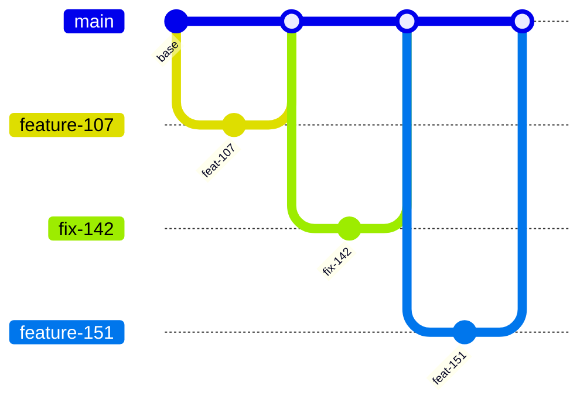

# Guía práctica de GitHub Flow

La guía de estudio del equipo compara cuatro modelos de ramas y adopta uno —tronco con ramas de
release— para su contexto. Esta guía práctica ejercita **otro**: GitHub Flow, el más simple de los
cuatro, con una sola rama de vida larga y nada más.

Practicar el modelo que el equipo **no** adoptó no es un ejercicio ocioso. GitHub Flow es la línea
de base contra la que se mide cualquier otro modelo: todo lo que un modelo agrega —una rama de
release, una candidata numerada, un cherry-pick— hay que justificarlo contra lo que costaría no
tenerlo. Quien recorrió los ocho escenarios de acá sabe exactamente qué se gana y qué se paga.

Este documento reúne los ocho escenarios completos. Se lee de punta a punta o se entra por la tabla
de contenido; no hace falta abrir ningún otro documento para ejecutarlo, salvo los enlaces
explícitos a la guía de estudio, que son ampliaciones y no requisitos.

## Convención de marcas

Cada afirmación no trivial lleva una marca que dice de dónde sale. Es la convención del repositorio,
y sirve para discutir una decisión propia del equipo sin discutir de paso el estándar que la rodea.

| Marca | Significado |
|---|---|
| **[F: ID]** | Fundamentada en una fuente externa verificable; el ID resuelve en el [Anexo A](#anexo-a--fuentes-citadas) |
| **[C]** | Convención de este equipo: deliberada, discutible y cambiable |
| **[E]** | Comprobada leyendo o ejecutando algo del propio workspace; cuando la comprobación tiene fecha, va escrita |

## Tabla de contenido

- [1. Cómo usar esta guía](#1-cómo-usar-esta-guía)
  - [1.1 El modelo en una página](#11-el-modelo-en-una-página)
  - [1.2 Las tres consecuencias que hay que sentir en la práctica](#12-las-tres-consecuencias-que-hay-que-sentir-en-la-práctica)
  - [1.3 Los tres integrantes y su rotación](#13-los-tres-integrantes-y-su-rotación)
  - [1.4 Estructura de cada escenario](#14-estructura-de-cada-escenario)
  - [1.5 Orden de ejecución](#15-orden-de-ejecución)
  - [1.6 Qué hace falta](#16-qué-hace-falta)
  - [1.7 Los escenarios de un vistazo](#17-los-escenarios-de-un-vistazo)
- [2. Escenario 00 — Preparación](#2-escenario-00--preparación)
- [3. Escenario 01 — Funcionalidad nueva (E-01)](#3-escenario-01--funcionalidad-nueva-e-01)
- [4. Escenario 02 — Corrección hacia adelante (E-05, sin rama de hotfix)](#4-escenario-02--corrección-hacia-adelante-e-05-sin-rama-de-hotfix)
- [5. Escenario 03 — Pull request que rompe la regresión (E-08)](#5-escenario-03--pull-request-que-rompe-la-regresión-e-08)
- [6. Escenario 04 — Cambio grande con feature flag](#6-escenario-04--cambio-grande-con-feature-flag)
- [7. Escenario 05 — Reversión](#7-escenario-05--reversión)
- [8. Escenario 06 — Vista previa para demostración (E-06)](#8-escenario-06--vista-previa-para-demostración-e-06)
- [9. Escenario 07 — Cierre y auditoría](#9-escenario-07--cierre-y-auditoría)
- [10. Estado de verificación](#10-estado-de-verificación)
- [Anexo A — Fuentes citadas](#anexo-a--fuentes-citadas)
- [Anexo B — Documentos que este documento reemplaza](#anexo-b--documentos-que-este-documento-reemplaza)

---

## 1. Cómo usar esta guía

Cada escenario se puede hacer de a uno, pero rinde mucho más con las tres personas en simultáneo:
buena parte de lo que hay que aprender —esperar una revisión, descubrir que alguien mergeó antes,
discutir si lo que está mal es el cambio o la prueba— solo aparece cuando hay más de una persona
tocando el repositorio.

### 1.1 El modelo en una página

#### El ciclo de seis pasos

Una sola rama de larga vida, la rama por defecto, y ramas cortas que entran por pull request.
**[F: GH-1]** El ciclo documentado tiene seis pasos: crear una rama con nombre corto y descriptivo,
hacer los cambios y commitearlos, abrir un pull request —que puede marcarse como borrador si se
busca opinión temprana—, atender los comentarios de la revisión, mergear una vez aprobado, y borrar
la rama. La documentación agrega que la configuración de protección de rama puede impedir el merge
si no se cumplen los requisitos definidos, por ejemplo una cantidad mínima de aprobaciones.



No hay una segunda línea. Cada merge a la rama por defecto es, en el modelo puro, un despliegue.

#### Lo que el modelo no define

Lo que no define es igual de importante: **nada sobre versiones ni ambientes**. GitHub Flow asume
que lo mergeado se despliega. Todo lo que este equipo llama corte, candidata, promoción o
autorización queda fuera del modelo, y si hace falta, hay que decidirlo aparte.

### 1.2 Las tres consecuencias que hay que sentir en la práctica

Los escenarios están ordenados alrededor de las tres cosas que cambian cuando se saca la rama de
release del medio:

**La corrección de un defecto de producción se hace en la rama principal**, no en una rama de
mantenimiento. La comparación de la guía de estudio lo dice para los cuatro modelos: en GitHub Flow
el lugar donde se corrige un defecto de producción es la rama principal.

**Hacen falta feature flags.** Sin una rama larga donde esconder trabajo a medio hacer, lo
incompleto entra igual a la rama principal y se oculta con un interruptor. La misma tabla marca
GitHub Flow como modelo que **necesita** feature flags.

**Hace falta automatización de pruebas fuerte.** También está en la tabla, y es la condición que
más pesa: sin una regresión en la que confiar, mergear al tronco expone el problema en vez de
resolverlo.

La ampliación de los tres puntos está en
[05 — Cómo elegir el modelo](../Estandares-Modelo-Ramas-Guide/Estandares-Modelo-Ramas.md#5-cómo-elegir-el-modelo).

### 1.3 Los tres integrantes y su rotación

Igual que en la [guía práctica de GitFlow](../GitFlow-Practice-Guide/README.md), los roles se
nombran **I1**, **I2** e **I3**, y rotan por escenario. Los actores —A-DEV, A-REV, A-QA, A-PO,
A-OPS— son los de
[01 — Marco de referencia](../Estandares-Modelo-Ramas-Guide/Estandares-Modelo-Ramas.md#1-marco-de-referencia).

| § | Escenario | I1 | I2 | I3 |
|---|---|---|---|---|
| [4](#3-escenario-01--funcionalidad-nueva-e-01) | 01 Funcionalidad nueva | A-DEV | A-REV | A-QA |
| [5](#4-escenario-02--corrección-hacia-adelante-e-05-sin-rama-de-hotfix) | 02 Corrección hacia adelante | A-QA | A-DEV | A-REV |
| [6](#5-escenario-03--pull-request-que-rompe-la-regresión-e-08) | 03 Pull request que rompe la regresión | A-DEV | A-REV | A-QA |
| [7](#6-escenario-04--cambio-grande-con-feature-flag) | 04 Cambio grande con feature flag | A-DEV | A-REV | A-PO |
| [8](#7-escenario-05--reversión) | 05 Reversión | A-OPS | A-DEV | A-QA |
| [9](#8-escenario-06--vista-previa-para-demostración-e-06) | 06 Vista previa para demostración | A-OPS | A-PO | A-DEV |
| [10](#9-escenario-07--cierre-y-auditoría) | 07 Cierre y auditoría | los tres | | |

En el escenario 00 el reparto es propio: I1 siembra, I2 configura la protección, I3 comprueba que
las pruebas corren en su máquina.

### 1.4 Estructura de cada escenario

Todos los escenarios tienen las mismas seis partes, y por un motivo: quien recorrió la guía de
GitFlow no tiene que aprender a leer de nuevo.

1. **Objetivo** — qué se aprende, en una línea.
2. **Precondición** — en qué estado tiene que estar el repositorio antes de empezar.
3. **Pasos** — los comandos y las acciones en GitHub, en orden.
4. **Qué observar** — lo que hay que mirar mientras corre; es la parte formativa.
5. **Errores frecuentes** — lo que suele salir mal y qué significa.
6. **Verificación** — cómo se comprueba que el escenario quedó bien resuelto.

### 1.5 Orden de ejecución

Acá el orden de lectura **sí** es el orden de ejecución: **00 → 01 → 02 → 03 → 04 → 05 → 06 → 07**.
Es la primera diferencia palpable con GitFlow, donde el 03 tenía que ir antes que el 02 porque el
02 exigía una release que solo el 03 creaba. Sin ramas de release, las precondiciones se ordenan
solas. Anotarlo mientras se practica: esa simplicidad es exactamente lo que se compra al resignar
la ventana de estabilización.

### 1.6 Qué hace falta

- Acceso de escritura al repositorio de práctica y permiso para configurar protección de rama.
- El runner autoalojado `i7infra-dev` disponible, o un runner alojado sustituyendo el `runs-on:` de
  los workflows.
- Docker en la máquina de cada integrante, para correr las pruebas sin instalar .NET ni Node.

**Sobre el repositorio de práctica.** Los escenarios de esta guía y los de la de GitFlow trabajan
sobre el mismo `Lab-GitFlow` y dejan estados incompatibles: aquella crea `release/1.0` y tags de
versión, y esta parte de que no existe ninguna rama de larga vida fuera de la principal. Conviene
hacer una a la vez y reiniciar el repositorio entre ambas, o usar dos repositorios de práctica
distintos. **[C]**

### 1.7 Los escenarios de un vistazo

| § | Escenario | Ejercita |
|---|---|---|
| [2](#2-escenario-00--preparación) | 00 Preparación | Repositorio, protección de la rama por defecto, pipeline. Sin `release.yml` ni auditoría de convergencia |
| [3](#3-escenario-01--funcionalidad-nueva-e-01) | 01 Funcionalidad nueva | E-01: los seis pasos documentados del modelo **[F: GH-1]** |
| [4](#4-escenario-02--corrección-hacia-adelante-e-05-sin-rama-de-hotfix) | 02 Corrección hacia adelante | E-05 sin rama de hotfix: el defecto de producción se corrige en la rama principal |
| [5](#5-escenario-03--pull-request-que-rompe-la-regresión-e-08) | 03 Pull request que rompe la regresión | E-08: el control que sostiene todo el modelo |
| [6](#6-escenario-04--cambio-grande-con-feature-flag) | 04 Cambio grande con feature flag | Lo que reemplaza a la rama larga |
| [7](#7-escenario-05--reversión) | 05 Reversión | Cuando corregir hacia adelante no llega a tiempo |
| [8](#8-escenario-06--vista-previa-para-demostración-e-06) | 06 Vista previa para demostración | E-06 sin tag de demostración |
| [9](#9-escenario-07--cierre-y-auditoría) | 07 Cierre y auditoría | Higiene de ramas, y qué controles dejan de tener sentido |

---

## 2. Escenario 00 — Preparación

### Objetivo

Dejar el repositorio con la aplicación sembrada, las pruebas corriendo y la rama por defecto
protegida. Al terminar, un pull request no se puede mergear sin verificación en verde y una
aprobación: es la única barrera que este modelo tiene, y por eso se configura primero.

**Roles:** I1 siembra, I2 configura la protección, I3 comprueba que las pruebas corren en su
máquina.

### Precondición

- `Lab-GitFlow` existe y no tiene ramas de larga vida fuera de la principal. Si venís de la guía de
  GitFlow, el repositorio quedó con `release/1.0` y tags de versión: reiniciálo o usá otro.
- Los tres repositorios clonados **como hermanos** bajo un mismo directorio de trabajo:

  ```
  <directorio-de-trabajo>/
    Lab-GitFlow/                    ← el repositorio de práctica
    Lab-GitFlow.Documentacion/      ← este cuerpo documental
    Lab-E2E.WebBlazor/              ← la aplicación bajo prueba
  ```

- Docker instalado.
- `Lab-GitFlow` **privado y sin colaboradores externos**, por el runner autoalojado: en el evento
  `pull_request` se ejecuta el workflow *de la rama del pull request*, todavía sin revisar. Ver
  [el anexo de workflows](../Estandares-Modelo-Ramas-Guide/Anexos/workflows/README.md).

### Pasos

#### 1. Sembrar la aplicación (I1)

```bash
cd <directorio-de-trabajo>/Lab-GitFlow
git checkout -b chore/1-sembrar-aplicacion

# Lista positiva de lo que la práctica necesita. Las exclusiones evitan arrastrar la salida de
# compilación: medido, 472 MB con `bin/` y `obj/` contra 524 KB sin ellos.
rsync -a --relative --exclude='bin/' --exclude='obj/' \
      ../Lab-E2E.WebBlazor/./{Lab-E2E.WebBlazor.sln,pruebas.runsettings,.gitignore,README.md} \
      ../Lab-E2E.WebBlazor/./{src,tests,scripts,.github} \
      ./

du -sh .          # esperado: menos de 1 MB
test -x scripts/pruebas.sh && test -f Lab-E2E.WebBlazor.sln && echo "siembra ok"

git add .gitignore README.md Lab-E2E.WebBlazor.sln pruebas.runsettings .github src tests scripts
git commit -m "chore: sembrar la aplicación de práctica y sus pruebas E2E"
git push -u origin chore/1-sembrar-aplicacion
```

Se integra por pull request, aunque todavía no haya nada que lo obligue: es el primer recorrido de
los seis pasos del modelo, y conviene hacerlo antes de que la protección lo imponga.

#### 2. Comprobar que las pruebas corren (I3)

La suite es el proyecto .NET `tests/MovilidadUrbana.E2ETests`, configurado con
`pruebas.runsettings`.

```bash
scripts/pruebas.sh chromium   # publica la aplicación y corre las pruebas
```

**No hay que anteponer `scripts/publicar.sh`.** El fixture publica por su cuenta antes de la primera
prueba, dependiente del framework; si la carpeta ya tiene el binario autocontenido que deja
`publicar.sh`, la segunda publicación se superpone y el proceso muere con código 150 antes de
escuchar, con las 22 pruebas fallando en `OneTimeSetUp`. **[E: corrida local del 2026-08-24]** Para
ejercitar el artefacto autocontenido:

```bash
scripts/publicar.sh
PUBLICAR_ANTES_DE_PROBAR=false scripts/pruebas.sh chromium
```

#### 3. El pipeline: acá no hay nada que agregar (I2)

Este es el paso donde más se nota el modelo, y consiste en **no hacer nada**. El `ci.yml` que viene
con la aplicación sembrada se dispara con `push` a `main`, con `pull_request` hacia `main` o
`develop`, y con `merge_group`. **[E]** Para GitHub Flow eso es exactamente la cobertura necesaria:
no hay ninguna otra rama de larga vida a la que proteger.

Los tres workflows del [anexo](../Estandares-Modelo-Ramas-Guide/Anexos/workflows/README.md) —que la
guía de GitFlow sí instala— aquí **sobran**, y conviene entender por qué:

| Workflow del anexo | Por qué no aplica |
|---|---|
| `ci.yml` | Agrega disparadores sobre `release/**`, ramas que este modelo no tiene |
| `release.yml` | Se dispara con un tag `v*`; GitHub Flow no define versionado **[F: GH-1]** |
| `auditoria-convergencia.yml` | Audita que toda corrección de una rama de release tenga equivalente en la principal. Sin ramas de release, no hay divergencia posible que auditar |

Si el equipo igual quiere tags de versión sobre la rama principal, es una decisión propia y hay que
declararla como tal: el modelo no la trae. **[C]**

#### 4. Protección de la rama por defecto (I2)

En *Settings → Branches*, sobre `main`:

| Control | Valor |
|---|---|
| Require a pull request before merging | sí, con 1 aprobación |
| Require status checks to pass | sí, check obligatorio: `CI aprobada` |
| Require branches to be up to date | sí |
| Do not allow bypassing | sí, incluidos administradores |
| Automatically delete head branches | sí (*Settings → General*) |

La documentación del modelo menciona expresamente que la protección de rama puede impedir el merge
cuando no se cumplen los requisitos, por ejemplo una cantidad mínima de aprobaciones.
**[F: GH-1]** En GitHub Flow esa configuración no es un accesorio: es **el único** punto de control
del flujo, porque no hay ninguna otra etapa entre el merge y el despliegue.

### Qué observar

- Cuánto tarda el pipeline completo. Ese número es el costo fijo de cada cambio en este modelo, y
  el que decide si integrar varias veces por día es realista.
- Que el primer pull request corre el pipeline **antes** de que exista la protección: la diferencia
  entre «el pipeline informa» y «el pipeline bloquea» es el tema del
  [escenario 03](#5-escenario-03--pull-request-que-rompe-la-regresión-e-08).
- Cuántos controles hicieron falta comparado con la preparación de la guía de GitFlow. Es la
  primera medición honesta de lo que cuesta cada modelo.

### Errores frecuentes

| Síntoma | Causa habitual |
|---|---|
| Los jobs quedan en cola para siempre | El runner no tiene la etiqueta `i7infra-dev`, o está apagado |
| El check obligatorio nunca aparece en la lista | El nombre configurado no coincide exactamente con el `name:` del job |
| Las 22 pruebas fallan en `OneTimeSetUp` con código 150 | Se corrió `publicar.sh` antes de `pruebas.sh` sin `PUBLICAR_ANTES_DE_PROBAR=false` |

### Verificación

1. `git ls-remote --heads origin` muestra solo `main`.
2. Un push directo a `main` es rechazado por el servidor.
3. Un pull request de prueba dispara el pipeline y el botón de merge queda bloqueado hasta que
   termina.
4. `scripts/pruebas.sh chromium` pasa en verde en la máquina de cada integrante.
5. No hay ningún workflow de release ni de auditoría en `.github/workflows/`.

---

## 3. Escenario 01 — Funcionalidad nueva (E-01)

### Objetivo

Recorrer los seis pasos documentados del modelo sobre un cambio real, y ver que en GitHub Flow el
merge es el final del recorrido: no hay ninguna etapa posterior donde el cambio espere.

**Roles:** I1 es A-DEV, I2 es A-REV, I3 es A-QA y escribe el criterio junto a A-PO.

### Precondición

[Escenario 00](#2-escenario-00--preparación) terminado, `main` protegida, sin ninguna otra rama
viva.

### Pasos

Los seis pasos son los de la documentación del modelo **[F: GH-1]**, y acá se ejecutan con la
aplicación sembrada.

#### 1. El issue, antes que el código (I3 + A-PO)

**#107 — Filtrar el listado de localidades por provincia**, con criterio de aceptación explícito:

> Dado un valor seleccionado en el filtro de provincia, el listado muestra únicamente las
> localidades de esa provincia. Con el filtro vacío, muestra todas. Si no hay coincidencias, se
> muestra el mensaje de listado vacío.

El modelo no exige el issue: es convención de este equipo **[C]**, y sostiene el paso 6, donde
alguien tiene que verificar contra algo escrito.

#### 2. Rama con nombre corto y descriptivo (I1)

```bash
git checkout main
git pull --ff-only
git checkout -b filtro-por-provincia
```

La documentación pide un nombre **corto y descriptivo** **[F: GH-1]**; no impone prefijos. Este
equipo mantiene igual la convención `feature/`, `fix/`, `chore/` con el número de issue adelante,
porque es lo que hace rastreable un commit hasta su ticket sin abrir el tablero **[C]**. Elegí una
de las dos formas y sostenela: mezclarlas hace inútil cualquier filtro por nombre de rama.

#### 3. Cambios, commits y pull request en borrador

```bash
git commit -m "feat: agregar el filtro de provincia al listado de localidades

Refs #107"
git push -u origin filtro-por-provincia
```

El pull request se abre **en borrador** con el primer commit. La documentación contempla
explícitamente marcarlo como borrador cuando se busca opinión temprana **[F: GH-1]**, y en este
laboratorio hay un motivo adicional: el pipeline arranca ahí, no al final.

#### 4. Las pruebas, con el cambio

Tres casos del criterio —filtro con resultados, sin resultados y vacío—, con selectores por
`data-testid`, como el resto de la suite. En este modelo esa suite es lo único que separa un merge
de una regresión en producción: no hay homologación después.

#### 5. Revisión (I2)

I2 revisa dentro del día hábil. **[F: GOOG-2]** Un pull request demasiado grande para saber cuándo
habrá tiempo de revisarlo se pide partido, no se deja esperando.

#### 6. Merge y borrado de la rama

Con el pipeline en verde y la aprobación registrada, se mergea y **la rama se borra**. Los dos
últimos pasos del ciclo documentado son exactamente esos **[F: GH-1]**, y el borrado no es
cosmético: es lo que mantiene el repositorio con pocas ramas activas, que es la condición asociada
al buen desempeño de entrega **[F: DORA-1]**.

#### 7. Cierre (I3)

I3 verifica el criterio sobre el ambiente donde quedó desplegado el merge y recién entonces cierra
el issue. Mergeado no es verificado, y en este modelo la distancia entre una cosa y la otra se mide
en minutos: razón de más para que la verificación exista.

### Qué observar

- **Que después del merge no queda nada pendiente.** En la guía de GitFlow, el commit de una
  funcionalidad quedaba esperando a ver si entraba o no en la release abierta. Acá esa pregunta no
  existe. Anotar el contraste: es el beneficio central del modelo.
- **Cuánto tiempo pasó entre el primer commit y el merge.** Con ramas de uno o dos días el modelo
  funciona; con ramas de dos semanas, la rama se vuelve la rama larga que el modelo dice no tener.
- **Qué pasa si I2 aprueba y mientras tanto alguien mergeó otra cosa.** Con «require branches to be
  up to date» activo, hay que actualizar la rama y el pipeline vuelve a correr.
- **Qué se desplegó, exactamente.** El modelo asume que lo mergeado se despliega, pero no dice
  quién lo hace ni cómo se sabe qué versión está arriba. Si el equipo no lo definió, esa pregunta
  queda sin respuesta y conviene registrarla para el
  [escenario 07](#9-escenario-07--cierre-y-auditoría).

### Errores frecuentes

| Síntoma | Causa | Corrección |
|---|---|---|
| El pull request muestra archivos que I1 no tocó | La rama no nació de `main` actualizado | Rehacer la rama desde `main` y volver a aplicar el cambio |
| La rama sobrevive al merge | Falta *Automatically delete head branches* | Activarlo y borrarla a mano esta vez |
| El issue queda abierto tras el merge | Falta `Closes #107` en la descripción | Cerrarlo a mano; corregir la plantilla la próxima vez |

### Verificación

1. `main` tiene el commit de la funcionalidad y las pruebas nuevas.
2. La rama remota ya no existe.
3. El pipeline corrió sobre `main` después del merge, con la matriz completa.
4. El issue está cerrado por I3, con nota de qué verificó y dónde.

---

## 4. Escenario 02 — Corrección hacia adelante (E-05, sin rama de hotfix)

### Objetivo

Corregir un defecto que ya está en producción usando el único camino que este modelo ofrece: una
rama corta desde la rama principal, con su pull request. Sin rama de hotfix, sin tag del que
partir, sin retorno que recordar.

**Roles:** I1 es A-QA y reporta, I2 es A-DEV y corrige, I3 es A-REV.

### Precondición

[Escenario 01](#3-escenario-01--funcionalidad-nueva-e-01) terminado y mergeado. Hay una
funcionalidad en producción con la que romper algo.

### Pasos

#### 1. El reporte (I1)

**#142 — El filtro de provincia distingue mayúsculas.** Buscando `corrientes` no aparece nada,
mientras que `Corrientes` sí. El reporte lleva pasos de reproducción y qué se esperaba.

En este modelo el reporte no necesita decir «en qué versión»: hay una sola cosa desplegada, la
punta de la rama principal. Es una simplificación real, y también una pérdida —cuando el defecto
aparece y se corrige el mismo día, después nadie puede reconstruir qué estuvo mal y por cuánto
tiempo, salvo que el equipo registre los despliegues por su cuenta **[C]**.

#### 2. Reproducir con una prueba que falla (I2)

```bash
git checkout main
git pull --ff-only
git checkout -b fix/142-filtro-ignora-mayusculas
```

Primero la prueba, y tiene que fallar. Si pasa en verde a la primera, no se entendió el defecto: se
está probando otra cosa.

```bash
scripts/pruebas.sh chromium   # la prueba nueva en rojo, el resto en verde
```

#### 3. La corrección, y solo eso

Nada de refactores oportunistas en el mismo pull request. Un cambio que toca quince archivos es
imposible de revisar y, sobre todo, imposible de revertir —y en este modelo el revert es el plan de
contingencia, como muestra el [escenario 05](#7-escenario-05--reversión)—.

```bash
git commit -m "fix: comparar la provincia sin distinguir mayúsculas

Refs #142"
git push -u origin fix/142-filtro-ignora-mayusculas
```

#### 4. Revisión y merge (I3)

Mismo circuito que una funcionalidad: pipeline en verde, una aprobación, merge, rama borrada.

**Acá está la diferencia que da nombre al escenario.** En la guía de GitFlow, esta misma corrección
exigía decidir a qué rama de release iba, hacer el cherry-pick, generar una candidata nueva y
comprobar que el arreglo volviera al tronco —con un workflow dedicado a auditar que no se olvidara—.
Nada de eso ocurre acá: la corrección está en el único lugar donde puede estar, y por eso no puede
perderse. Es literalmente lo que la comparación de la guía de estudio resume en una celda: en
GitHub Flow, un defecto de producción se corrige en la rama principal.

#### 5. Verificación en producción (I1)

I1 revalida el caso reportado sobre lo desplegado y cierra el issue.

### Qué observar

- **Cuánto tardó desde el reporte hasta la corrección desplegada.** Comparalo con el escenario 02
  de la guía de GitFlow, que necesita cherry-pick, candidata nueva y promoción. La diferencia es lo
  que este modelo compra.
- **Qué no se pudo hacer.** No hubo forma de corregir la versión anterior sin llevar también todo
  lo que se integró después. Si alguien pide exactamente eso, el modelo no alcanza y la respuesta
  está en [05 — Cómo elegir el modelo](../Estandares-Modelo-Ramas-Guide/Estandares-Modelo-Ramas.md#5-cómo-elegir-el-modelo):
  GitHub Flow soporta una sola versión viva.
- **Cuánto se confió en la suite.** Nadie probó a mano toda la aplicación antes de desplegar. Esa
  confianza es la condición del modelo, no un descuido.

### Errores frecuentes

| Síntoma | Causa | Corrección |
|---|---|---|
| La prueba nueva pasa antes de aplicar la corrección | No reproduce el defecto reportado | Volver al reporte y reproducir a mano primero |
| El pull request corrige y además refactoriza | Oportunismo | Partirlo: el arreglo primero, el refactor en otro |
| Se corrige sin prueba «porque es urgente» | El [escenario 05](#7-escenario-05--reversión) es el que corresponde, no este | Si de verdad es urgente, revertir; corregir con prueba después |

### Verificación

1. La prueba que reproduce el defecto está en `main` y falla si se revierte la corrección.
2. La rama se borró al mergear.
3. El issue lo cerró I1 tras revalidar, no I2 al mergear.
4. No existe ninguna rama de mantenimiento: `git ls-remote --heads origin` sigue mostrando solo
   `main`.

---

## 5. Escenario 03 — Pull request que rompe la regresión (E-08)

### Objetivo

Ver al pipeline rechazar un cambio plausible que rompe otra pantalla, y discutir si lo que está mal
es el cambio o la prueba. Es el escenario que motivó todo este cuerpo documental, y en GitHub Flow
importa más que en cualquier otro modelo: es la **única** barrera entre el pull request y
producción.

**Roles:** I1 es A-DEV y rompe a propósito, I2 es A-REV, I3 es A-QA y lee el reporte.

### Precondición

Escenarios [01](#3-escenario-01--funcionalidad-nueva-e-01) y
[02](#4-escenario-02--corrección-hacia-adelante-e-05-sin-rama-de-hotfix) terminados. La suite
completa en verde sobre `main`.

### Pasos

#### 1. Un cambio plausible que rompe otra cosa (I1)

El ejemplo sale del comportamiento real de la aplicación sembrada. El listado del ABM de
localidades se ordena por antigüedad —`RepositorioDeLocalidades.ListarAsync` usa
`.OrderBy(l => l.Id)`—, y el desplegable de localidades de la **encuesta** se alimenta de ese mismo
listado. **[E]**

El cambio: mostrar primero las altas más recientes, o sea `.OrderByDescending(l => l.Id)`. Es una
mejora de usabilidad defendible y no rompe ninguna prueba del ABM, porque `LocalidadesTests` ubica
sus filas por texto con `Filter(HasText = "Goya")` y no por posición. **[E]**

Lo que rompe está en la otra pantalla:
`EncuestaTests.ElDesplegableDeLocalidadesSeAlimentaDelAbm` afirma que la primera opción real del
desplegable es `"Corrientes (Corrientes)"` usando `opciones.Nth(1)`. Invertido el orden, la primera
pasa a ser `"Resistencia (Chaco)"` y esa prueba —y solo esa— falla. **[E]**

```bash
git checkout main
git pull --ff-only
git checkout -b feature/151-listado-mas-recientes-primero
# src/MovilidadUrbana.Web/Infraestructura/Persistencia/RepositorioDeLocalidades.cs
#   .OrderBy(l => l.Id)  →  .OrderByDescending(l => l.Id)
git push -u origin feature/151-listado-mas-recientes-primero
```

#### 2. Abrir el pull request y esperar

Sin tocar nada más.

#### 3. Leer la evidencia antes que el código (I3)

La evidencia de la corrida es el **TRX** de cada configuración, que el workflow sube como artefacto,
más la tabla de contadores del resumen. El TRX trae, por cada caso fallido, el mensaje de la
aserción y su pila: dice qué texto esperaba y cuál encontró. No hay reporte HTML ni traza navegable
—eso es del runner de JavaScript, y esta suite es el proyecto .NET
`tests/MovilidadUrbana.E2ETests`—. **[E]**

#### 4. Decidir qué está mal (los tres)

No tiene respuesta única, y esa es la discusión formativa:

- Si el orden nuevo es el correcto, la prueba de la encuesta afirmaba por posición algo que nunca
  fue regla de negocio. Se corrige la prueba —que ubique la opción por texto, como las del ABM— y se
  documenta que el orden del listado no es contractual.
- Si el desplegable sí depende del orden del ABM, el cambio está incompleto: se ordena el
  desplegable por su cuenta.

#### 5. El merge, bloqueado mientras tanto

Con la protección del [escenario 00](#2-escenario-00--preparación), el botón no está disponible.
Comprobar que **nadie** puede saltearlo, administradores incluidos.

### Qué observar

- **Que el rojo aparece antes del merge, no después.** En este modelo no hay una segunda red: si el
  pipeline no lo hubiera detenido, el cambio estaría desplegado.
- **Cuánto tardó el pipeline en dar el rojo.** Ese tiempo es lo que un desarrollador espera para
  saber si rompió algo; si es demasiado, la gente empieza a mergear sin mirar.
- **Que falló una prueba de otra pantalla.** Es el argumento entero a favor de la regresión
  automatizada: nadie de los tres habría probado la encuesta al revisar un cambio en el ABM.

### Errores frecuentes

| Síntoma | Causa | Corrección |
|---|---|---|
| La corrida queda en rojo por intermitencia y no por el cambio | Espera fija o dependencia de orden entre pruebas | Corregir la prueba: una regresión intermitente termina ignorada, y ahí se pierde el control entero |
| Se «arregla» borrando la prueba que molesta | Confundir el síntoma con la causa | Decidir explícitamente cuál de las dos cosas estaba mal, y dejarlo escrito en el pull request |
| El check no bloquea el merge | El nombre del check obligatorio no coincide con el `name:` del job | Corregir la regla de protección |

### Verificación

1. Quedó registro de una corrida en rojo con el TRX descargable.
2. El merge estuvo bloqueado mientras el pipeline estuvo en rojo.
3. La decisión —corregir el cambio o corregir la prueba— está escrita en el pull request, con su
   motivo.

---

## 6. Escenario 04 — Cambio grande con feature flag

### Objetivo

Integrar en tres pull requests una funcionalidad que no está terminada, sin que ningún usuario la
vea. Es el ejercicio que reemplaza a la rama larga, y la razón por la que la comparación de la guía
de estudio marca a GitHub Flow como modelo que **necesita** feature flags.

**Roles:** I1 es A-DEV, I2 es A-REV, I3 es A-PO y decide cuándo se enciende.

### Precondición

[Escenario 03](#5-escenario-03--pull-request-que-rompe-la-regresión-e-08) resuelto y `main` en
verde.

### Pasos

#### 1. Partir el trabajo (I1 + I3)

**#160 — Exportar el listado de localidades a CSV**, estimado en cuatro o cinco días. En un modelo
con rama larga, esa rama viviría una semana y llegaría con conflictos. Acá se parte en incrementos
que entren cada uno o dos días:

| Pull request | Qué entra | Visible para el usuario |
|---|---|---|
| 1 | El interruptor, apagado, y su lectura desde configuración | No |
| 2 | La generación del CSV y sus pruebas, alcanzable solo con el interruptor encendido | No |
| 3 | El botón en la pantalla, detrás del mismo interruptor | No, hasta que I3 lo encienda |

La guía de estudio ya enuncia el principio para el modelo adoptado: una funcionalidad que tarda
semanas se parte en incrementos que entren cada uno o dos días, ocultos tras un feature flag; si no
se puede partir, el problema es de diseño de la solución y no del modelo de ramas.

#### 2. El interruptor, primero (I1)

El valor sale de configuración por ambiente, nunca de compilación condicional ni del nombre de la
rama. En esta aplicación, la configuración ya viaja por variables de entorno y `appsettings`, que es
el mecanismo que corresponde.

```bash
git checkout main
git pull --ff-only
git checkout -b feature/160-interruptor-exportar-csv
```

Este pull request es chico y aburrido, y esa es la idea: **[F: GOOG-1]** los cambios chicos se
revisan más rápido y más a fondo, tienen menos probabilidad de introducir defectos, desperdician
menos trabajo si son rechazados y son más simples de revertir.

#### 3. La funcionalidad, apagada (I1)

Segundo pull request. Las pruebas de la funcionalidad nueva encienden el interruptor por
configuración en su propio contexto; las de regresión siguen corriendo con el interruptor apagado y
tienen que seguir dando exactamente lo mismo que antes. Esa doble corrida es la prueba de que el
cambio está realmente oculto.

#### 4. La entrada en la interfaz (I1)

Tercer pull request. Al terminar, la funcionalidad está completa en la rama principal y desplegada,
y ningún usuario la ve.

#### 5. Encender (I3)

I3 cambia la configuración del ambiente. **No hay merge, no hay despliegue, no hay pull request**:
es el momento en que desplegar y liberar se separan de verdad, y conviene detenerse a mirarlo,
porque es el concepto que sostiene todo el modelo.

#### 6. Retirar el interruptor

Un flag que nadie apaga es deuda. Una vez que la funcionalidad se dio por buena, el interruptor se
saca en un pull request propio. **[C]**

### Qué observar

- **Que `main` estuvo desplegable todo el tiempo**, incluso con la funcionalidad a medio hacer
  adentro. Es lo que permite que el modelo no necesite una rama de integración.
- **Cuántos conflictos hubo.** Con tres pull requests de uno o dos días, ninguno. Comparalo con lo
  que habría pasado con una rama de una semana.
- **Qué pasa si alguien enciende el flag en producción antes de tiempo.** Si la respuesta es «se ve
  a medio hacer», falta un control: quién puede tocar esa configuración es una decisión que hay que
  escribir. **[C]**

### Errores frecuentes

| Síntoma | Causa | Corrección |
|---|---|---|
| El flag se lee desde una constante en el código | Se resolvió con compilación en vez de configuración | Moverlo a configuración por ambiente: si no, encender exige desplegar |
| Las pruebas de regresión empiezan a fallar con el flag apagado | El cambio no quedó realmente oculto | Es un defecto, no un ajuste de pruebas |
| El flag sigue ahí seis meses después | Nadie lo agendó | Retirarlo es parte del trabajo, no un extra |

### Verificación

1. Tres pull requests mergeados, ninguno de más de dos días de vida.
2. La suite pasa en verde con el flag apagado y con el flag encendido.
3. Encender la funcionalidad no requirió ningún despliegue.
4. Existe un issue abierto para retirar el interruptor, con responsable.

---

## 7. Escenario 05 — Reversión

### Objetivo

Sacar de producción un cambio que rompió algo, cuando corregir hacia adelante no llega a tiempo.
En GitHub Flow la reversión ocupa el lugar que en GitFlow ocupa la rama de hotfix, y conviene
haberla practicado antes de necesitarla.

**Roles:** I1 es A-OPS y decide, I2 es A-DEV y ejecuta, I3 es A-QA y confirma.

### Precondición

[Escenario 04](#6-escenario-04--cambio-grande-con-feature-flag) terminado. Un cambio reciente
mergeado en `main`, con su pull request identificable.

### Pasos

#### 1. La decisión, y su criterio (I1)

Frente a un defecto en producción hay dos caminos, y elegir mal cuesta caro en las dos direcciones:

| Camino | Cuándo | Costo |
|---|---|---|
| Corregir hacia adelante ([escenario 02](#4-escenario-02--corrección-hacia-adelante-e-05-sin-rama-de-hotfix)) | La causa está identificada y la corrección es chica y verificable | Un ciclo completo de pull request: reproducir, corregir, revisar, pipeline |
| Revertir | La causa no está clara, o el ciclo de corrección no entra en el tiempo tolerable | Se pierde también lo bueno que traía ese cambio |

El criterio que conviene fijar de antemano, porque en la emergencia no se discute bien: **si la
causa no está identificada en el tiempo que tolera el usuario, se revierte**. **[C]** Revertir no
es admitir derrota; es devolver el sistema a un estado conocido para poder pensar sin apuro.

#### 2. Revertir el pull request (I2)

GitHub ofrece el botón *Revert* en el pull request mergeado, que abre uno nuevo con el cambio
inverso. Se prefiere esa vía a un `git revert` local por dos razones: queda enlazado al pull request
original, y pasa por el mismo pipeline que cualquier otro cambio.

```bash
# El equivalente por línea de comandos, si el botón no está disponible:
git checkout main
git pull --ff-only
git checkout -b revert/160-exportar-csv
git revert --no-edit <sha-del-merge> -m 1
git push -u origin revert/160-exportar-csv
```

El `-m 1` indica cuál de los dos padres del commit de merge se conserva: el de la rama principal.
Sin ese parámetro, `git revert` sobre un merge falla porque no puede adivinarlo solo.

#### 3. El pipeline corre igual (I2)

Es tentador saltear la verificación «porque solo estamos volviendo atrás», y es un error: el revert
es un cambio como cualquier otro, y puede romper algo por su cuenta si en el medio entraron otros
cambios que dependían de lo revertido. Que la protección no admita excepciones, tampoco acá.

#### 4. Confirmar en producción (I3)

I3 comprueba que el síntoma desapareció y que lo demás sigue funcionando.

#### 5. Reabrir el trabajo (los tres)

El revert deja el problema resuelto y la funcionalidad perdida. Se reabre el issue original con lo
aprendido y, cuando vuelva, vuelve con la prueba que habría detectado esto. Un revert sin ese paso
garantiza que el mismo cambio se vuelva a mergear igual dentro de dos semanas.

### Qué observar

- **Cuánto tardó desde la decisión hasta el sistema sano.** Ese número es el que hay que comparar
  contra el del [escenario 02](#4-escenario-02--corrección-hacia-adelante-e-05-sin-rama-de-hotfix):
  define cuál de los dos caminos es realista para este equipo.
- **Qué se perdió además del defecto.** Si el pull request revertido traía tres cosas y solo una
  estaba rota, se perdieron las otras dos. Es el argumento práctico a favor de los pull requests
  chicos: **[F: GOOG-1]** son más simples de revertir.
- **Si el revert fue limpio.** Cuando no lo es, casi siempre significa que otro cambio posterior se
  apoyó en el revertido, y ahí hay una lección sobre acoplamiento.

### Errores frecuentes

| Síntoma | Causa | Corrección |
|---|---|---|
| `git revert` falla con «commit is a merge but no -m option was given» | Falta indicar el padre a conservar | Agregar `-m 1` |
| El revert entra sin pasar por el pipeline | Alguien levantó la protección «por la urgencia» | Registrar la excepción y reverificar; ver la vía de excepción del [escenario 00](#2-escenario-00--preparación) |
| La funcionalidad revertida vuelve idéntica semanas después | Nadie reabrió el issue con lo aprendido | El paso 5 no es opcional |

### Verificación

1. El síntoma desapareció de producción, confirmado por I3.
2. El revert entró por pull request, con el pipeline en verde.
3. El issue original está reabierto, con el motivo del revert y la prueba que falta.
4. `git log --oneline -3` en `main` muestra el commit de revert enlazado al pull request original.

---

## 8. Escenario 06 — Vista previa para demostración (E-06)

### Objetivo

Mostrarle a alguien de afuera del equipo un trabajo que todavía no está integrado, sin tocar lo que
está en producción ni inventar una rama que sobreviva a la demostración.

**Roles:** I1 es A-OPS, I2 es A-PO y pide la demo, I3 es A-DEV y expone el trabajo.

### Precondición

Un pull request abierto con trabajo mostrable. Sirve el tercero del
[escenario 04](#6-escenario-04--cambio-grande-con-feature-flag), antes de encender el interruptor.

### Pasos

#### 1. El pedido (I2)

«Necesito mostrar la exportación a CSV en la reunión del jueves.» En un modelo con ramas de release
la respuesta sería un tag de demostración sobre un commit elegido. Acá no hay versionado que
aprovechar —el modelo no lo define **[F: GH-1]**—, así que la unidad de demostración es **el pull
request**.

#### 2. Levantar la aplicación desde la referencia del pull request (I1)

La aplicación se publica y se corre desde el commit de la rama del pull request, no desde `main`:

```bash
git fetch origin
git checkout -b demo/160 origin/feature/160-boton-exportar-csv
scripts/publicar.sh
```

Y se prueba contra ese binario, o se lo despliega en una máquina aparte. El workflow reutilizable de
la aplicación ya acepta una referencia arbitraria: `e2e.yml` declara la entrada `referencia` —«Rama,
tag o SHA a probar»—, de modo que la corrida se puede pedir sobre el commit del pull request. Y para
verificar un ambiente ya levantado está `verificacion-entorno.yml`, que invoca al mismo `e2e.yml`
pasándole `url-base`. **[E]** Con eso, la demostración se puede verificar antes de
mostrarla, que es lo que evita el papelón.

#### 3. Encuadrar la demostración (I3)

Decir en voz alta tres cosas antes de empezar, y no es formalidad: es lo que evita que una demo se
convierta en un compromiso.

- Qué se está mostrando: el pull request número tanto, no la aplicación en producción.
- Que no está verificado por A-QA ni autorizado por nadie.
- Que puede cambiar o no llegar a integrarse.

#### 4. Desarmar (I1)

El ambiente de demostración se destruye y la rama local se borra. Lo que **no** hay que hacer es
dejar una rama `demo/…` viva en el remoto: una rama de demostración que sobrevive a la demostración
se convierte, en dos semanas, en la rama larga que este modelo dice no tener.

### Qué observar

- **Que nada de esto tocó `main`.** La demostración no es un despliegue.
- **Qué se pierde sin versionado.** Nadie puede volver a levantar exactamente lo que se mostró el
  jueves, salvo que se anote el SHA. Anotarlo en el issue es la compensación barata. **[C]**
- **Cuánto costó levantar el ambiente.** Si cuesta media jornada, la próxima demo se va a hacer
  sobre producción, y ahí empiezan los problemas.

### Errores frecuentes

| Síntoma | Causa | Corrección |
|---|---|---|
| La demo se hace mergeando a `main` «para que se vea» | No había ambiente de vista previa | Es exactamente lo que este escenario evita: levantar desde la referencia del pull request |
| Queda una rama `demo/…` en el remoto | Nadie la borró al terminar | Borrarla; revisarlo en el [escenario 07](#9-escenario-07--cierre-y-auditoría) |
| Lo mostrado no se puede reproducir después | No se registró el SHA | Anotarlo en el issue junto con la fecha |

### Verificación

1. La demostración corrió sobre el commit del pull request, no sobre `main`.
2. `git ls-remote --heads origin` no muestra ninguna rama `demo/…`.
3. El SHA mostrado quedó anotado en el issue.
4. Producción no cambió durante todo el escenario.

---

## 9. Escenario 07 — Cierre y auditoría

### Objetivo

Revisar en qué estado quedó el repositorio, comprobar los pocos controles que este modelo admite, y
—lo más formativo— decidir con evidencia propia si GitHub Flow le sirve a este equipo.

**Roles:** los tres, juntos.

### Precondición

Escenarios 00 a 06 terminados.

### Pasos

#### 1. Higiene de ramas

```bash
git fetch --all --prune
git ls-remote --heads origin
```

Lo esperable: **solo `main`**. Cualquier otra cosa es un hallazgo. En este modelo el criterio es más
estricto que en el de tronco con releases, donde conviven las ramas de release vivas; acá no hay
excepción posible, y una rama corta con más de una semana de vida se revisa en la reunión de equipo
**[C]**.

#### 2. Los controles que acá no existen

Vale la pena recorrer explícitamente lo que **no** se puede auditar, porque es la contracara del
modelo:

| Control de la guía de GitFlow | Estado en GitHub Flow |
|---|---|
| Auditoría de convergencia release → tronco | Sin sentido: no hay ramas de release de las que algo pueda no volver |
| Trazabilidad de qué artefacto está en producción | Sin respuesta, salvo que el equipo registre despliegues por su cuenta **[C]** |
| Criterios de admisión a una versión | Sin objeto: no hay versión que cerrar |
| Autorización previa al pase | Sin lugar en el modelo: el merge es el pase |

Las dos últimas filas son las que deciden si este modelo es viable para un equipo con homologación
formal y autoridad de cambio. En este caso no lo es, y por eso la guía de estudio adopta otro; el
ejercicio sirve para que esa conclusión sea propia y no heredada.

#### 3. Medir lo que pasó (los tres)

Con el repositorio a la vista, completar una tabla con datos, no con impresiones:

| Medición | Cómo se obtiene |
|---|---|
| Vida media de una rama | Fecha del primer commit contra fecha del merge, en los pull requests de los escenarios 01 a 04 |
| Tiempo del pipeline | Duración de las corridas en la pestaña *Actions* |
| Cuántas veces bloqueó el check | Corridas en rojo sobre pull requests: acá alcanza con el escenario 03 |
| Cuánto tardó una corrección de producción | Escenario 02, del reporte al despliegue |
| Cuánto tardó una reversión | Escenario 05, de la decisión al sistema sano |

#### 4. La conversación que cierra la práctica

Tres preguntas, con las mediciones sobre la mesa:

1. **¿La suite alcanza?** El escenario 03 detuvo un cambio que rompía otra pantalla. ¿Qué defectos
   reales de los últimos meses habría detenido, y cuáles no? Lo que no cubre es lo que en otro
   modelo haría una etapa de homologación.
2. **¿El tiempo del pipeline permite integrar varias veces por día?** Si no, el modelo empuja a
   acumular, y una rama que acumula es la rama larga que este modelo dice no tener.
3. **¿Alguien necesita una versión anterior?** Con una sola respuesta afirmativa, GitHub Flow queda
   descartado: soporta una sola versión viva.

### Qué observar

- **Cuánto menos hubo que configurar.** Comparado con la preparación de la guía de GitFlow: sin
  workflow de release, sin auditoría de convergencia, sin protección sobre `release/*`, sin
  `CODEOWNERS` para archivos de release.
- **Qué preguntas quedaron sin respuesta** durante los escenarios. Cada una es un requisito que
  este modelo no cubre y que el equipo tendría que resolver por convención propia.
- **Si alguien extrañó la ventana de estabilización.** Es la pregunta central, y conviene
  responderla con el escenario 02 fresco.

### Errores frecuentes

| Síntoma | Causa | Corrección |
|---|---|---|
| Quedan ramas viejas en el remoto | *Automatically delete head branches* apagado, o merges hechos a mano | Activarlo y borrarlas |
| Se concluye «GitHub Flow no sirve» sin datos | Se discutió con impresiones | Volver al paso 3: sin las mediciones, la discusión la gana quien habla más fuerte |
| Se concluye «GitHub Flow alcanza» ignorando la autorización de cambio | Se practicó en un laboratorio sin autoridad de cambio real | Revisar la tabla del paso 2: el modelo no tiene dónde ubicarla |

### Verificación

1. `git ls-remote --heads origin` muestra únicamente `main`.
2. La tabla de mediciones del paso 3 está completa, con números.
3. Las tres preguntas del paso 4 tienen respuesta escrita, con el dato que la sostiene.
4. Quedó registrada la conclusión del equipo sobre si este modelo le sirve, y en qué condiciones
   cambiaría.

---

## 10. Estado de verificación

| Elemento | Estado |
|---|---|
| Descripción del modelo | Fundada en la documentación de GitHub, a través de [05 — Cómo elegir el modelo](../Estandares-Modelo-Ramas-Guide/Estandares-Modelo-Ramas.md#5-cómo-elegir-el-modelo) **[F: GH-1]** |
| Comandos de git | Escritos para correrse; **no ejecutados** en esta redacción |
| Pipeline | El `ci.yml` que trae la aplicación sembrada cubre este modelo sin agregados, comprobado leyendo sus disparadores **[E]** |
| Escenarios | **No ejecutados.** Igual que la guía de GitFlow, se escribieron para `Lab-GitFlow` con la aplicación de `Lab-E2E.WebBlazor` |
| Consolidación en un solo documento | Hecha el **2026-09-01**. Reorganizó y unificó el texto de los ocho documentos previos; **no volvió a ejecutar ni a verificar nada**. Las fechas de las marcas **[E]** son las que ya estaban registradas |

---

## Anexo A — Fuentes citadas

Las marcas **[F]** de este documento resuelven acá. Es el subconjunto del
[anexo de fuentes](../Estandares-Modelo-Ramas-Guide/Estandares-Modelo-Ramas.md#anexo-e--fuentes) de la guía de estudio que
esta guía práctica usa; ese anexo registra además con qué fuerza está verificada cada una y cuáles
provienen del documento del equipo en vez de una lectura directa.

| ID | Fuente | URL | Estado registrado |
|---|---|---|---|
| GH-1 | GitHub Docs — *GitHub flow* | https://docs.github.com/en/get-started/using-github/github-flow | 200, texto leído |
| GOOG-1 | Google Engineering Practices — *Small CLs* | https://google.github.io/eng-practices/review/developer/small-cls.html | 200 |
| GOOG-2 | Google Engineering Practices — *Speed of Code Reviews* | https://google.github.io/eng-practices/review/reviewer/speed.html | citada por el insumo |
| DORA-1 | DORA — *Trunk-based development* | https://dora.dev/capabilities/trunk-based-development/ | 200 |

Las URL se comprobaron accesibles el **2026-08-23**, según ese mismo anexo; «citada por el insumo»
significa que la afirmación proviene del documento `Flujo-De-Trabajo-Ramas.md` del equipo y que la
fuente original no se volvió a abrir.

---

## Anexo B — Documentos que este documento reemplaza

Hasta el **2026-09-01** esta guía estaba repartida en ocho archivos. Se unificaron acá sin quitar
contenido; los `doc_id` viejos se conservan en esta tabla para que una referencia externa se pueda
resolver.

| doc_id | Archivo anterior | Sección de este documento |
|---|---|---|
| GHF-IDX | `README.md` (parte conceptual) | [§1](#1-cómo-usar-esta-guía) |
| GHF-00 | `00-Preparacion.md` | [§2](#2-escenario-00--preparación) |
| GHF-01 | `01-Funcionalidad-Nueva.md` | [§3](#3-escenario-01--funcionalidad-nueva-e-01) |
| GHF-02 | `02-Correccion-Hacia-Adelante.md` | [§4](#4-escenario-02--corrección-hacia-adelante-e-05-sin-rama-de-hotfix) |
| GHF-03 | `03-PR-Que-Rompe-La-Regresion.md` | [§5](#5-escenario-03--pull-request-que-rompe-la-regresión-e-08) |
| GHF-04 | `04-Cambio-Grande-Con-Feature-Flag.md` | [§6](#6-escenario-04--cambio-grande-con-feature-flag) |
| GHF-05 | `05-Reversion.md` | [§7](#7-escenario-05--reversión) |
| GHF-06 | `06-Vista-Previa-Para-Demostracion.md` | [§8](#8-escenario-06--vista-previa-para-demostración-e-06) |
| GHF-07 | `07-Cierre-Y-Auditoria.md` | [§9](#9-escenario-07--cierre-y-auditoría) |

El `README.md` de la carpeta sigue existiendo como presentación de la guía.

---

Comparar con la [guía práctica de GitFlow](../GitFlow-Practice-Guide/README.md), que ejercita el
modelo que el equipo sí adoptó.
