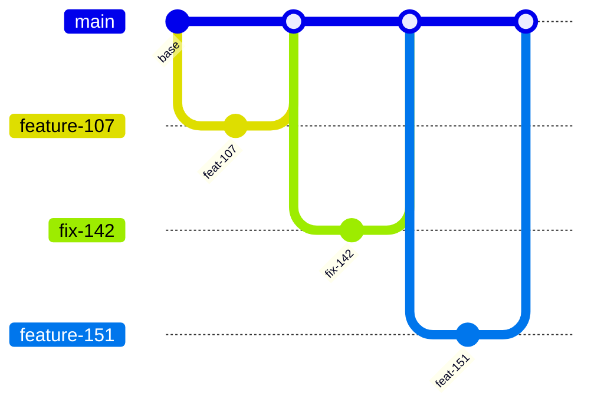

# Guía práctica de GitHub Flow

La guía de estudio compara cuatro modelos de ramas y adopta uno —tronco con ramas de release— para
el contexto de este equipo. Esta guía práctica ejercita **otro**: GitHub Flow, el más simple de los
cuatro, con una sola rama de vida larga y nada más.

Practicar el modelo que el equipo **no** adoptó no es un ejercicio ocioso. GitHub Flow es la línea
de base contra la que se mide cualquier otro modelo: todo lo que un modelo agrega —una rama de
release, una candidata numerada, un cherry-pick— hay que justificarlo contra lo que costaría no
tenerlo. Quien recorrió los ocho escenarios de acá sabe exactamente qué se gana y qué se paga.

## Qué es GitHub Flow, en una página

Una sola rama de larga vida, la rama por defecto, y ramas cortas que entran por pull request.
**[F: GH-1]** El ciclo documentado tiene seis pasos: crear una rama con nombre corto y descriptivo,
hacer los cambios y commitearlos, abrir un pull request —que puede marcarse como borrador si se
busca opinión temprana—, atender los comentarios de la revisión, mergear una vez aprobado, y borrar
la rama. La documentación agrega que la configuración de protección de rama puede impedir el merge
si no se cumplen los requisitos definidos, por ejemplo una cantidad mínima de aprobaciones.

Lo que no define es igual de importante: **nada sobre versiones ni ambientes**. GitHub Flow asume
que lo mergeado se despliega. Todo lo que este equipo llama corte, candidata, promoción o
autorización queda fuera del modelo, y si hace falta, hay que decidirlo aparte.

No hay una segunda línea. Cada merge a la rama por defecto es, en el modelo puro, un despliegue.

## Las tres consecuencias que hay que sentir en la práctica

Los escenarios están ordenados alrededor de las tres cosas que cambian cuando se saca la rama de
release del medio:

**La corrección de un defecto de producción se hace en la rama principal**, no en una rama de
mantenimiento. La comparación de la guía de estudio lo dice para los cuatro modelos: en GitHub Flow
el lugar donde se corrige un defecto de producción es la rama principal.

**Hacen falta feature flags.** Sin una rama larga donde esconder trabajo a medio hacer, lo
incompleto entra igual a la rama principal y se oculta con un interruptor. La misma tabla marca
GitHub Flow como modelo que **necesita** feature flags.

**Hace falta automatización de pruebas fuerte.** También está en la tabla, y es la condición que
más pesa: sin una regresión en la que confiar, mergear al tronco expone el problema en vez de
resolverlo.

## Los tres integrantes y su rotación

Igual que en la [guía práctica de GitFlow](../GitFlow-Practice-Guide/README.md), los roles se
nombran **I1**, **I2** e **I3**, y rotan por escenario. Los actores son los de
[01 — Marco de referencia](../Estandares-Modelo-Ramas-Guide/Estandares-Modelo-Ramas.md#1-marco-de-referencia).

| Escenario | I1 | I2 | I3 |
|---|---|---|---|
| [01 Funcionalidad nueva](Guia-Practica-GitHubFlow.md#3-escenario-01--funcionalidad-nueva-e-01) | A-DEV | A-REV | A-QA |
| [02 Corrección hacia adelante](Guia-Practica-GitHubFlow.md#4-escenario-02--corrección-hacia-adelante-e-05-sin-rama-de-hotfix) | A-QA | A-DEV | A-REV |
| [03 Pull request que rompe la regresión](Guia-Practica-GitHubFlow.md#5-escenario-03--pull-request-que-rompe-la-regresión-e-08) | A-DEV | A-REV | A-QA |
| [04 Cambio grande con feature flag](Guia-Practica-GitHubFlow.md#6-escenario-04--cambio-grande-con-feature-flag) | A-DEV | A-REV | A-PO |
| [05 Reversión](Guia-Practica-GitHubFlow.md#7-escenario-05--reversión) | A-OPS | A-DEV | A-QA |
| [06 Vista previa para demostración](Guia-Practica-GitHubFlow.md#8-escenario-06--vista-previa-para-demostración-e-06) | A-OPS | A-PO | A-DEV |
| [07 Cierre y auditoría](Guia-Practica-GitHubFlow.md#9-escenario-07--cierre-y-auditoría) | los tres | | |

## Cómo se usa

Los ocho escenarios viven en un único documento autocontenido, con su propia tabla de contenido:
[**la guía completa**](Guia-Practica-GitHubFlow.md). Este README es la presentación; para ejecutar
la práctica se entra ahí.

Cada escenario tiene la misma estructura que los de la guía de GitFlow, y por el mismo motivo: quien
ya recorrió aquella no tiene que aprender a leer de nuevo.

1. **Objetivo** — qué se aprende, en una línea.
2. **Precondición** — en qué estado tiene que estar el repositorio antes de empezar.
3. **Pasos** — los comandos y las acciones en GitHub, en orden.
4. **Qué observar** — lo que hay que mirar mientras corre; es la parte formativa.
5. **Errores frecuentes** — lo que suele salir mal y qué significa.
6. **Verificación** — cómo se comprueba que el escenario quedó bien resuelto.

Acá el orden de lectura **sí** es el orden de ejecución: **00 → 01 → 02 → 03 → 04 → 05 → 06 → 07**.
Es la primera diferencia palpable con GitFlow, donde el 03 tenía que ir antes que el 02 porque el
02 exigía una release que solo el 03 creaba. Sin ramas de release, las precondiciones se ordenan
solas. Anotarlo mientras se practica: esa simplicidad es exactamente lo que se compra al resignar
la ventana de estabilización.

## Escenarios

Cada fila enlaza a su sección dentro de [la guía completa](Guia-Practica-GitHubFlow.md).

| # | Escenario | Ejercita |
|---|---|---|
| [00](Guia-Practica-GitHubFlow.md#2-escenario-00--preparación) | Preparación | Repositorio, protección de la rama por defecto, pipeline. Sin `release.yml` ni auditoría de convergencia |
| [01](Guia-Practica-GitHubFlow.md#3-escenario-01--funcionalidad-nueva-e-01) | Funcionalidad nueva | E-01: los seis pasos documentados del modelo **[F: GH-1]** |
| [02](Guia-Practica-GitHubFlow.md#4-escenario-02--corrección-hacia-adelante-e-05-sin-rama-de-hotfix) | Corrección hacia adelante | E-05 sin rama de hotfix: el defecto de producción se corrige en la rama principal |
| [03](Guia-Practica-GitHubFlow.md#5-escenario-03--pull-request-que-rompe-la-regresión-e-08) | Pull request que rompe la regresión | E-08: el control que sostiene todo el modelo |
| [04](Guia-Practica-GitHubFlow.md#6-escenario-04--cambio-grande-con-feature-flag) | Cambio grande con feature flag | Lo que reemplaza a la rama larga |
| [05](Guia-Practica-GitHubFlow.md#7-escenario-05--reversión) | Reversión | Cuando corregir hacia adelante no llega a tiempo |
| [06](Guia-Practica-GitHubFlow.md#8-escenario-06--vista-previa-para-demostración-e-06) | Vista previa para demostración | E-06 sin tag de demostración |
| [07](Guia-Practica-GitHubFlow.md#9-escenario-07--cierre-y-auditoría) | Cierre y auditoría | Higiene de ramas, y qué controles dejan de tener sentido |

## Qué hace falta

- Acceso de escritura al repositorio de práctica y permiso para configurar protección de rama.
- El runner autoalojado `i7infra-dev` disponible, o un runner alojado sustituyendo el `runs-on:` de
  los workflows.
- Docker en la máquina de cada integrante, para correr las pruebas sin instalar .NET ni Node.

**Sobre el repositorio de práctica.** Los escenarios de esta guía y los de la de GitFlow trabajan
sobre el mismo `Lab-GitFlow` y dejan estados incompatibles: aquella crea `release/1.0` y tags de
versión, y esta parte de que no existe ninguna rama de larga vida fuera de la principal. Conviene
hacer una a la vez y reiniciar el repositorio entre ambas, o usar dos repositorios de práctica
distintos. **[C]**

## Estado de verificación

| Elemento | Estado |
|---|---|
| Descripción del modelo | Fundada en la documentación de GitHub, a través de [05 — Cómo elegir el modelo](../Estandares-Modelo-Ramas-Guide/Estandares-Modelo-Ramas.md#5-cómo-elegir-el-modelo) **[F: GH-1]** |
| Comandos de git | Escritos para correrse; **no ejecutados** en esta redacción |
| Pipeline | El `ci.yml` que trae la aplicación sembrada cubre este modelo sin agregados, comprobado leyendo sus disparadores **[E]** |
| Escenarios | **No ejecutados.** Igual que la guía de GitFlow, se escribieron para `Lab-GitFlow` con la aplicación de `Lab-E2E.WebBlazor` |
