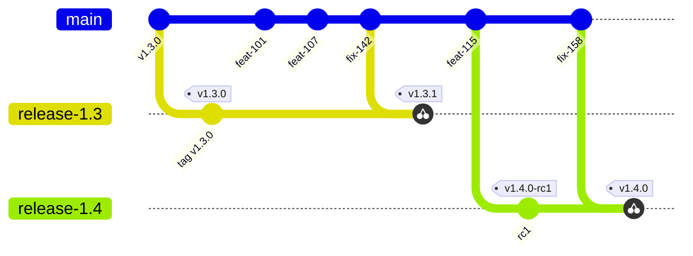
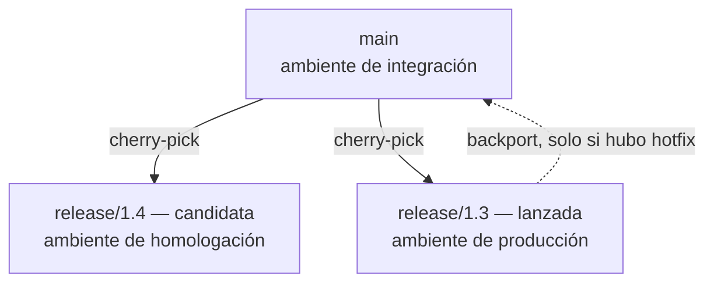
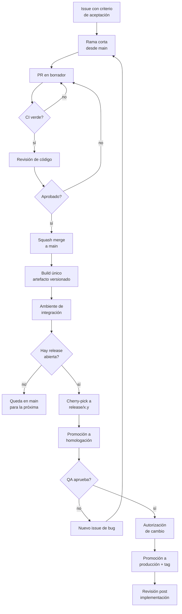
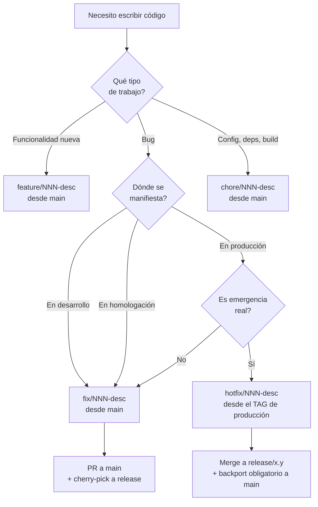
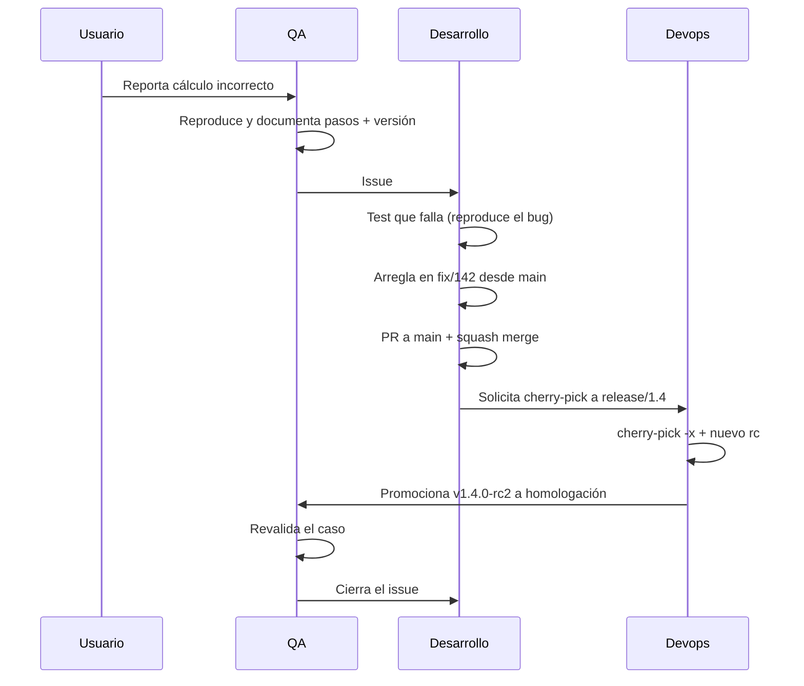

# Flujo de trabajo de ramas, PRs y releases

> **Estado del documento:** propuesta para discusión con el equipo.
> **Alcance:** repositorio de aplicación, equipo con desarrollo, QA, diseño, devops y una instancia de autorización de cambios.

---

## Regla de lectura de este documento

Cada afirmación está clasificada con una de estas dos marcas:

| Marca | Significado |
|---|---|
| **[F]** *Fundamentado* | Respaldado por una fuente externa verificable, listada en la sección [10. Fuentes](#10-fuentes). El identificador entre corchetes remite a esa tabla. |
| **[C]** *Convención* | Decisión de diseño de este equipo. No está respaldada por ningún estándar: es una elección deliberada que se puede discutir y cambiar. |

Esta separación es intencional. Un documento de proceso pierde autoridad cuando presenta preferencias del autor como si fueran estándares de la industria.

---

## 1. Definiciones

Antes de cualquier regla, el vocabulario. La mayoría de las discusiones sobre ramas se traban porque dos personas usan la misma palabra para cosas distintas.

### 1.1. Objetos de control de versiones

| Término | Definición |
|---|---|
| **Tronco (`main`)** | Rama única de larga vida donde converge todo el trabajo. Su garantía es *integrable*: compila y el CI está verde. No garantiza *probado por QA*. |
| **Rama corta** | Rama de vida breve para un cambio autocontenido. Nace del tronco y muere al mergear. |
| **Rama de release** | Rama creada desde un punto elegido del tronco para estabilizar y liberar una versión. Es la "rama estable". |
| **Tag** | Puntero inmutable a un commit específico. `v1.4.0`. Una rama se mueve; un tag no. Cuando se pregunta "qué hay en producción", la respuesta correcta es un tag. |
| **Línea base** | Configuración formalmente revisada y aprobada que sirve de referencia para el desarrollo posterior; su modificación pasa por control de cambios formal. **[F: ISO-12207]** |

### 1.2. Objetos de despliegue

| Término | Definición |
|---|---|
| **Artefacto** | El resultado compilado y versionado del build (imagen de contenedor, paquete). Es lo que se despliega. |
| **Ambiente** | La infraestructura donde corre un artefacto: integración, homologación, producción. **Un ambiente no es una rama.** |
| **Promoción** | Mover *el mismo artefacto ya construido* de un ambiente al siguiente. No implica recompilar. |
| **Build hermético** | Build insensible a las bibliotecas y herramientas instaladas en la máquina que lo ejecuta: dos personas que construyen la misma revisión en máquinas distintas obtienen resultados idénticos. **[F: SRE-1]** |
| **Candidata (RC)** | Artefacto propuesto para liberación, todavía no aprobado. `v1.4.0-rc2`. |

### 1.3. Operaciones sobre ramas

| Término | Definición |
|---|---|
| **Cherry-pick** | Aplicar un commit específico sobre otra rama, salteando los commits que ocurrieron antes de él pero después del corte de la rama. |
| **Fix forward** | Política de arreglar siempre primero en el tronco y propagar hacia las ramas de release, nunca al revés. |
| **Backport** | Traer a la rama principal un cambio que se hizo primero en una rama de release. En este modelo es la excepción, no la norma. |
| **Feature flag** | Interruptor de configuración que permite mergear código incompleto al tronco manteniéndolo inactivo. Reemplaza a la rama larga como mecanismo de ocultamiento. |

### 1.4. Distinción crítica: desplegar ≠ liberar

Son dos actos separados:

- **Desplegar** es una operación técnica: poner un artefacto a correr en un ambiente.
- **Liberar** es una decisión de negocio: exponer una funcionalidad a los usuarios.

Los feature flags son lo que permite separarlos. Sin esa separación, la rama larga se vuelve el único mecanismo disponible para ocultar trabajo incompleto, y de ahí nace toda la complejidad que este documento intenta evitar.

---

## 2. Modelo de ramas

### 2.1. El inventario completo

Tres tipos de rama. No hay un cuarto.

| Rama | Vida | Nace de | Quién escribe |
|---|---|---|---|
| `main` | permanente | — | nadie directamente: solo merges de PR |
| `feature/*`, `fix/*`, `chore/*` | 1–2 días **[C]** | `main` | el desarrollador asignado |
| `release/x.y` | semanas, luego se borra | `main` (o un commit anterior elegido) | solo cherry-picks |

**No existe** una rama `develop`, ni `homologacion`, ni `produccion`. Homologación y producción son **ambientes**, y lo que se mueve entre ellos son artefactos, no ramas. **[C]**

> **Fundamento de las ramas cortas [F: DORA-1]:** el análisis de datos de DORA de 2016 y 2017 asocia mejor desempeño de entrega con mantener tres o menos ramas activas en el repositorio, mergear al tronco al menos una vez por día, y no tener code freezes ni fases de integración separadas.
>
> **Salvedad metodológica honesta:** los estudios de DORA son transversales y basados en encuesta autorreportada. Muestran correlación, no causalidad. Es razonable sospechar que los equipos de alto desempeño *pueden* trabajar así porque ya tienen buena automatización de pruebas, y no necesariamente al revés.

### 2.2. Diagrama del modelo



Lo que muestra: el desarrollo nunca se detiene en `main`; las ramas de release son ventanas de estabilización; los fixes viajan del tronco hacia las releases por cherry-pick, nunca al revés.

### 2.3. Cuándo se corta una release

Justo antes de necesitarla, no antes. **[F: TBD-1]** Los equipos de desarrollo basado en tronco crean la rama de release *just in time* —unos días antes de la liberación— precisamente para que se convierta en un lugar estable mientras los desarrolladores siguen enviando commits al tronco a máxima velocidad.

Un matiz útil y poco conocido: **la rama se puede cortar retroactivamente**. **[F: TBD-1]** Quien corta la rama puede alcanzar un commit anterior —un SHA conocido como bueno, o simplemente el último commit antes del trabajo no deseado— y ramar desde ahí. La rama de release es una foto de un punto elegido del tronco, y "elegido" no significa obligatoriamente "el último".

Esto elimina la ansiedad del corte: no hace falta congelar nada ni correr para "entrar en la release".

### 2.4. Cuántas releases vivas

Dos como máximo: la que está en producción y la candidata. **[F: TBD-1]** Las ramas de release se borran después de caer en desuso, y conviene tener solo un par en juego a la vez para que nadie cherry-pickee a la rama equivocada.



---

## 3. Reglas invariantes

Siete reglas. Todo el resto del documento es consecuencia de estas.

1. **Toda rama nace de `main` actualizado.** **[C]** Única excepción: hotfix de emergencia (§5.3).
2. **`main` está protegida.** Sin push directo; se entra por PR con CI verde y al menos una aprobación. **[C]**
3. **Un issue → una rama → un PR → un commit en `main`.** **[C]** Si un issue necesita dos ramas, estaba mal escrito.
4. **Los bugs se reproducen y arreglan en el tronco, con un test, y recién después se cherry-pickean a la rama de release.** **[F: TBD-1, SRE-2, GL-1]**
5. **No se arreglan bugs en la rama de release esperando cherry-pickearlos de vuelta al tronco.** **[F: TBD-2]**
6. **Se construye una sola vez; se promociona el artefacto, no se recompila por ambiente.** **[F: SRE-1]**
7. **La configuración depende del ambiente por variable de entorno, nunca de la rama ni de compilación condicional.** **[C]**

> **Sobre la regla 4 y 5, que son el corazón del documento.** La convergencia entre fuentes independientes es fuerte:
> - **[F: TBD-1]** La mejor práctica para equipos de desarrollo basado en tronco es reproducir el bug en el tronco, arreglarlo ahí con un test, ver que el servidor de CI lo verifique, y después cherry-pickearlo a la rama de release, esperando que un CI dedicado a esa rama lo verifique también.
> - **[F: SRE-2]** Google describe que la mayoría de sus proyectos grandes rama desde el tronco en una revisión específica y nunca mergea esa rama de vuelta; los arreglos se envían al tronco y se cherry-pickean a la rama de release.
> - **[F: GL-1]** GitLab documenta arreglar hacia adelante empujando el cambio a la rama principal y después cherry-pickeando a la rama de patch release, porque el problema clásico es arreglar el bug en la versión recién liberada y olvidarse de arreglarlo en la principal.
>
> **Contrapunto, para no presentar esto como unanimidad [F: NVIE-1]:** el modelo GitFlow propone lo contrario —estabilizar y arreglar sobre la rama de release, mergeando después a la de desarrollo—. Su autor agregó en 2020 una nota aclarando que ese modelo fue diseñado para software con múltiples versiones en producción, y que si se entrega continuamente una aplicación web, conviene otro enfoque. Es decir: el desacuerdo entre modelos es real, pero se resuelve por contexto, y el contexto de una aplicación web con despliegue frecuente apunta al modelo de este documento.

---

## 4. Flujo de trabajo extremo a extremo



### 4.1. Etapas y responsables

| # | Etapa | Responsable | Salida verificable |
|---|---|---|---|
| 1 | Definición del issue | PO / analista | Criterio de aceptación escrito |
| 2 | Diseño de la solución visual | Diseño / UX | Prototipo o especificación |
| 3 | Desarrollo | Desarrollador | Rama + PR + tests |
| 4 | Revisión de código | Otro desarrollador | Aprobación registrada |
| 5 | Verificación automática | Pipeline | Reporte de CI |
| 6 | Corte y promoción | Release / devops | Tag `rc` + artefacto |
| 7 | Verificación funcional | QA | Reporte de pruebas |
| 8 | Autorización | Autoridad de cambio | Registro de aprobación |
| 9 | Despliegue | Devops | Tag de versión |
| 10 | Revisión post implementación | Todo el equipo | Acta breve |

---

## 5. De dónde nace cada rama

### 5.1. Árbol de decisión



### 5.2. Tabla de nomenclatura **[C]**

| Prefijo | Uso | Nace de | Ejemplo |
|---|---|---|---|
| `feature/` | Funcionalidad nueva | `main` | `feature/107-filtro-por-partida` |
| `fix/` | Corrección de defecto | `main` | `fix/142-superficie-con-fraccion` |
| `chore/` | Dependencias, build, config | `main` | `chore/119-actualizar-sdk` |
| `hotfix/` | Emergencia en producción | tag de producción | `hotfix/199-timeout-consulta` |

El número de issue adelante permite rastrear cualquier commit hasta su ticket sin abrir el tablero.

### 5.3. La única excepción: hotfix de emergencia

Se activa **solo** cuando se cumple alguna de estas condiciones:

- El servicio está caído o degradado para los usuarios.
- Hay una vulnerabilidad de seguridad siendo explotada.
- El cherry-pick desde `main` no aplica limpio porque el tronco divergió demasiado.

Procedimiento:

```bash
# Ramar desde el TAG, no desde la punta de release/1.3:
# la punta puede tener fixes ya mergeados pero no liberados
git checkout -b hotfix/199-timeout-consulta v1.3.2
# ... arreglo + test ...
git push -u origin hotfix/199-timeout-consulta
# PR contra release/1.3 → tag v1.3.3 → despliegue
# Y EN EL MISMO DÍA: PR de backport a main
```

**Si el fix no vuelve a `main`, el bug reaparece en la próxima versión.** Es el único error de este modelo que es realmente caro, y por eso la §8.2 propone automatizar su detección. **[C]**

---

## 6. Gestión de pull requests

### 6.1. Ciclo de vida

1. Se abre **en borrador** con el primer commit. El CI empieza a correr temprano y el diseñador puede revisar el preview mientras el trabajo avanza. **[C]**
2. La descripción vincula el issue (`Closes #142`), lo que cierra el ticket automáticamente al mergear.
3. El CI ejecuta build, análisis estático, escaneo de dependencias, unitarias e integración.
4. Se marca como listo para revisión.
5. Revisión: una aprobación para cambios normales; dos para infraestructura, seguridad o migraciones de datos. **[C]**
6. **Squash merge**. La rama se borra automáticamente.

### 6.2. Por qué squash

Deja **un solo commit por issue en `main`**, lo que hace que el cherry-pick a una release sea de un único SHA y no falle por commits intermedios. No es una preferencia estética: es lo que sostiene mecánicamente la regla 4. **[C]**

Además, el borrado de la rama tras el merge funciona como prueba de convergencia. **[F: TBD-2]**

### 6.3. Tamaño del PR

Es la variable con más impacto sobre la calidad de la revisión.

**[F: GOOG-1]** El fundamento que da Google para preferir cambios chicos: se revisan más rápido y más a fondo, tienen menos probabilidad de introducir bugs, desperdician menos trabajo si son rechazados, generan menos conflictos al mergear y son más simples de revertir. El tamaño correcto es un cambio autocontenido, y el revisor tiene la potestad de rechazar un PR únicamente por ser demasiado grande.

**[F: GOOG-2]** Del lado del revisor, la contrapartida es el tiempo de respuesta: un día hábil es el máximo para responder a un pedido de revisión. Si el revisor está en medio de una tarea de concentración, no debe interrumpirse. Y si un PR es tan grande que no se sabe cuándo habrá tiempo de revisarlo, la respuesta correcta es pedir que se parta en varios chicos encadenados.

### 6.4. Plantilla de PR **[C]**

```markdown
Closes #142

## Qué cambia
Una o dos líneas.

## Cómo probarlo
Pasos concretos, escritos para QA.

## Checklist
- [ ] Tests agregados o actualizados
- [ ] Sin configuración dependiente del ambiente en el código
- [ ] Migración de datos reversible (o no aplica)
```

El bloque "cómo probarlo" es el de mayor rendimiento: es literalmente el caso de prueba que QA va a ejecutar en homologación.

### 6.5. Estados del issue **[C]**

**Backlog → Listo para tomar → En curso → En revisión → En homologación → Cerrado**

Dos reglas sobre las transiciones:

- Un issue pasa a *Listo para tomar* solo si tiene criterio de aceptación escrito.
- Un issue pasa a *Cerrado* cuando QA lo valida, no cuando se mergea el PR. **Mergeado no es verificado.**

### 6.6. Criterios de admisión a una release

Una vez cortada la rama de release, no todo lo que entra a `main` entra a esa release. Conviene tener criterios explícitos y por escrito.

**[F: PYT-1]** Ejemplo real del proyecto PyTorch: el equipo de release usa el proceso de cherry-pick para gestionar el riesgo de calidad, portando a la rama de release un conjunto mínimo de commits considerados imprescindibles; no todo lo que un desarrollador integra al tronco llega a la release. En su fase tardía solo admiten arreglos críticos que bloquean la liberación: corrupción silenciosa de datos, compatibilidad hacia atrás, caídas, deadlocks y fugas grandes de memoria. Su procedimiento exige además que el PR ya haya aterrizado en el tronco antes de crear el PR contra la rama de release.

Adaptación propuesta **[C]**: en la primera semana de la release se admite cualquier bug reportado por QA; en los últimos días previos al pase, solo bloqueantes.

---

## 7. Releases, ambientes y QA

### 7.1. Correspondencia rama–ambiente–tag

| Ambiente | Contenido | Tag típico | Actualización |
|---|---|---|---|
| Integración | punta de `main` | ninguno | automática en cada merge |
| Homologación | candidata activa | `v1.4.0-rc2` | promoción del artefacto |
| Producción | último liberado | `v1.3.2` | promoción previa autorización |

### 7.2. Qué prueba QA en cada lugar

| Ambiente | Tipo de prueba | Ejecutor |
|---|---|---|
| Integración | Regresión automatizada, humo | Pipeline, sin intervención manual |
| Homologación | Exploratorio, casos nuevos, aceptación con el PO | QA + PO. **Es el 90% del trabajo manual de QA** |
| Producción | Humo post-despliegue, validación de hotfixes | QA, alcance acotado |

Respuesta directa a la pregunta frecuente: **el trabajo normal de QA es sobre la candidata activa**; la versión ya liberada solo se toca cuando hay un hotfix que validar.

### 7.3. El pipeline de la rama de release

**[F: TBD-1]** El pipeline de CI que protege al tronco se duplica para proteger también a las ramas de release activas. Un cherry-pick que aplica limpio no es garantía de que el resultado funcione: hay que verificarlo en el contexto de la release.

### 7.4. Requisitos formales del ambiente de homologación

**[F: ISO-29119]** Para cada elemento del ambiente de prueba, el estándar de documentación de pruebas pide registrar: identificador único para trazabilidad, descripción, responsable de proveerlo, período durante el cual se necesita, y **fidelidad**, entendida como en qué medida se parece o se desvía del ambiente de producción.

En la práctica, ese último punto es el que evita la discusión de "en homologación andaba": si está documentado que los datos son anonimizados y que la integración con el sistema X está simulada, nadie se sorprende después.

### 7.5. Conflicto de ambiente

**Situación:** homologación está ocupada con `v1.4.0-rc2` y aparece un hotfix urgente para `v1.3.2`. ¿Dónde se valida?

| Opción | Cuándo usarla | Costo |
|---|---|---|
| Ambiente efímero desde el artefacto del hotfix | Preferida, si hay infraestructura como código | Minutos de cómputo |
| Pausar la candidata y usar homologación | Si no hay ambientes efímeros | Horas de retraso en la candidata |
| Despliegue progresivo en producción con monitoreo | Si hay observabilidad madura y capacidad de revertir | Riesgo controlado |

La cuarta opción —desplegar sin probar porque "es urgente y es chico"— es la que se elige por defecto cuando esto no está definido de antemano. **Definir cuál se usa antes de que ocurra es el punto de esta sección.** **[C]**

---

## 8. Roles y situaciones

### 8.1. Matriz de responsabilidades

| Situación | Desarrollo | QA | Diseño | Devops / Release | PO | Autoridad de cambio |
|---|---|---|---|---|---|---|
| Feature nueva | Implementa, escribe tests | Define casos, prueba en homologación | Itera sobre el preview del PR | Provee ambiente efímero | Escribe criterio de aceptación | No interviene |
| Bug en homologación | Reproduce, arregla en `main`, cherry-pick | Reporta con pasos y versión, revalida | Interviene si es defecto visual | Regenera `rc` y promociona | Prioriza | No interviene |
| Bug en producción, ritmo normal | Igual que arriba, sobre la release lanzada | Valida el fix | — | Publica versión de parche | Prioriza | Aprueba según riesgo |
| Emergencia en producción | Hotfix desde el tag + backport | Valida acotado | — | Despliegue y monitoreo | Informado | Aprobación de emergencia, revisión posterior |
| Corte de release | Congela alcance | Prepara plan de pruebas | Confirma entregables visuales | Crea rama y `rc1` | Define alcance | Recibe notificación |
| Pase a producción | — | Emite reporte de pruebas | — | Ejecuta despliegue | Acepta | **Autoriza** |

### 8.2. Notas por rol

**Desarrollo.** Su responsabilidad no termina en el merge: termina cuando QA valida. La disciplina de PRs chicos es lo que hace posible todo el resto.

**QA.** No es una compuerta al final de una rama, sino una función distribuida: define casos antes del desarrollo, automatiza regresión que corre en cada merge, y hace exploratorio sobre la candidata. **[F: ISTQB-1]** El cuerpo de certificación de pruebas distingue funciones diferenciadas —gestión de pruebas, análisis de pruebas, y análisis técnico de pruebas orientado a pruebas basadas en riesgo, técnicas de caja blanca, análisis estático y dinámico y automatización— y tiene además una certificación específica de pruebas de aceptación centrada en la colaboración entre product owners o analistas de negocio y testers. "QA" como rol único suele esconder tres funciones distintas.

**Diseño.** **[F: ISO-9241]** El estándar de diseño centrado en el ser humano establece seis principios, entre ellos que los usuarios se involucren a lo largo de todo el diseño y el desarrollo, que el proceso sea iterativo, y que el equipo incluya habilidades y perspectivas multidisciplinarias. Un flujo donde el diseñador solo ve el resultado cuando ya está en homologación contradice el principio de iteración: por eso el ambiente de preview por PR es la pieza que lo integra al ciclo.

**Devops / release engineering.** **[F: SRE-3]** La ingeniería de releases es descripta como una disciplina propia que requiere conocimiento de gestión de código fuente, compiladores, lenguajes de configuración de build, herramientas automatizadas de build, gestores de paquetes e instaladores, y se apoya en cuatro principios: modelo de autoservicio, alta velocidad, builds herméticos, y aplicación de políticas y procedimientos. Es el rol que hace cumplir la regla 6.

**Seguridad.** **[F: NIST-1]** El marco de desarrollo de software seguro organiza las prácticas en cuatro grupos —preparar la organización, proteger el software, producir software bien asegurado y responder a las vulnerabilidades—, es agnóstico de metodología y está pensado para integrarse en el pipeline de CI/CD.

**Autoridad de cambio.** **[F: ITIL-1]** El marco de gestión de servicios recomienda asignar la autoridad de aprobación en función del riesgo del cambio, en lugar de rutear todo cambio por un comité central; los cambios estándar son de bajo riesgo y están preaprobados, y enviarlos al comité está identificado explícitamente como antipatrón. La revisión post-implementación forma parte del ciclo, no es opcional.

**Gestión de configuración.** **[F: ISO-12207]** Responsable de líneas base, control de cambios y trazabilidad; en este modelo se materializa en tags, protección de ramas y el registro de qué artefacto está en qué ambiente. **[F: SWEBOK-1]** Es un área de conocimiento propia del cuerpo de conocimiento de la ingeniería de software.

---

## 9. Ejemplos completos

### 9.1. Ejemplo A — Funcionalidad nueva

**Issue #107:** "Permitir filtrar el listado de inmuebles por número de partida."

```bash
git checkout main
git pull --ff-only
git checkout -b feature/107-filtro-por-partida
```

1. El PO deja escrito el criterio: *dado un número de partida válido, el listado muestra solo ese inmueble; si no existe, mensaje de vacío.*
2. Diseño define el comportamiento del campo de búsqueda; se revisa sobre el preview del PR.
3. Se abre PR en borrador tras el primer commit.
4. Se escriben tests del filtro (caso encontrado, caso vacío, entrada inválida).
5. CI verde → revisión → squash merge.
6. Si hay una release abierta y la funcionalidad estaba en su alcance, se cherry-pickea; si no, viaja en la próxima.

### 9.2. Ejemplo B — Bug reportado, con release abierta

**Issue #142:** "La superficie de un inmueble con fracción se calcula mal."



**Paso 0 — Reproducir.** Si no se puede reproducir, el issue vuelve al reportante pidiendo el dato que falta. No se debuggea a ciegas.

**Paso 1 — Ramar desde `main`.**

```bash
git checkout main
git pull --ff-only
git checkout -b fix/142-superficie-con-fraccion
```

El `--ff-only` es deliberado: si el `main` local divergió del remoto, conviene que falle ruidosamente en lugar de generar un merge silencioso.

**Paso 2 — Escribir primero el test que falla.**

```csharp
[Fact]
public void CalcularSuperficie_ConFraccion_DevuelveSuperficieProporcional()
{
    var inmueble = new Inmueble { SuperficieTotal = 1000m, Fraccion = 0.25m };
    var resultado = _service.CalcularSuperficie(inmueble);
    Assert.Equal(250m, resultado);
}
```

Debe fallar. Si pasa en verde a la primera, no se entendió el bug: se está probando otra cosa. Este paso está en la práctica recomendada, no es un agregado: el bug se reproduce en el tronco y se arregla ahí *con un test*. **[F: TBD-1]**

**Paso 3 — Arreglar, y solo eso.** Nada de refactors oportunistas en el mismo PR: si el PR de un fix toca quince archivos, es imposible de revisar y, sobre todo, imposible de revertir.

**Paso 4 — Commit.**

```bash
git commit -m "fix: contemplar fracción en el cálculo de superficie

La superficie se calculaba sobre el total sin aplicar el
porcentaje de fracción del inmueble.

Refs #142"
```

El cuerpo explica **por qué**; el *qué* ya está en el diff.

**Paso 5 — PR, revisión, squash merge.**

**Paso 6 — Cherry-pick a la release abierta.**

```bash
git checkout release/1.4
git pull --ff-only
git cherry-pick -x a3f9c21
git push
```

El `-x` deja registrado el SHA original en el mensaje del commit, lo que habilita la auditoría automática de la §10.2.

**Paso 7 — Nuevo `rc`, promoción, revalidación por QA, cierre del issue por QA.**

### 9.3. Ejemplo C — Emergencia en producción

**Issue #199:** consultas con timeout, servicio degradado, 19:40 de un viernes.

```bash
git checkout -b hotfix/199-timeout-consulta v1.3.2
# arreglo mínimo + test
git push -u origin hotfix/199-timeout-consulta
# PR a release/1.3 → aprobación de emergencia → tag v1.3.3 → despliegue
```

Y el mismo día, sin excepción:

```bash
git checkout main
git pull --ff-only
git checkout -b fix/199-backport-timeout
git cherry-pick -x <sha-del-hotfix>
# PR a main
```

Después: revisión post-implementación breve, con foco en por qué no se detectó antes.

---

## 10. Preguntas que forman criterio

Esta sección existe para que, ante una situación no prevista, el equipo pueda razonar en vez de buscar una regla.

**¿Por qué no puedo ramar desde la rama en la que ya estaba parada?**
Porque arrastrás cambios ajenos sin querer: el PR va a mostrar archivos que no tocaste y el revisor no va a poder distinguir tu trabajo del que viene de atrás. Además el cherry-pick posterior deja de ser de un solo commit.

**Si el fix nace de `main`, ¿no arrastro features nuevas a la release?**
No, porque no mergeás `main` a la release: cherry-pickeás solo el commit del fix. Ese es exactamente el mecanismo por el cual el cherry-pick saltea commits anteriores a él pero posteriores al corte de la rama. La objeción de "arrastro features" es válida contra el *merge* de rama a rama, no contra el cherry-pick.

**¿Y si el cherry-pick no aplica limpio?**
Es una señal, no un accidente: significa que el tronco divergió mucho de la release, o sea que la release lleva demasiado tiempo abierta. Se resuelve puntualmente ramando desde la release, pero el aprendizaje es acortar la ventana de estabilización.

**¿Por qué no arreglar directamente en la rama de release, que es más rápido?**
Porque el fix queda solo ahí y el bug reaparece en la próxima versión. Es la razón explícita por la cual se recomienda arreglar hacia adelante. **[F: GL-1, TBD-2]** El ahorro de cinco minutos se paga con un bug que vuelve dentro de tres meses sin que nadie entienda por qué.

**¿`main` está siempre lista para producción?**
Está siempre lista para *desplegar*, que no es lo mismo que *aprobada para liberar*. La diferencia la marca la validación de QA y la autorización de cambio, no el estado del pipeline.

**¿Necesito una rama estable?**
Ya la tenés: es `release/x.y`. Y lo verdaderamente estable no es ni siquiera esa rama —que se mueve al recibir cherry-picks— sino el tag y su artefacto, que son inmutables.

**¿Qué hago con una funcionalidad que tarda tres semanas?**
Se parte en incrementos que entren al tronco cada uno o dos días, ocultos tras un feature flag. Si no se puede partir, el problema es de diseño de la solución, no del modelo de ramas.

**¿Cuándo corto la rama de release?**
Lo más tarde posible, unos días antes de liberar. **[F: TBD-1]** Y si te olvidaste de cortarla en el momento justo, podés cortarla retroactivamente desde el commit que corresponda: no hace falta que nadie congele nada.

**¿Qué pasa si entra un commit al tronco que no quiero en la release?**
Nada: el corte retroactivo y el cherry-pick selectivo existen justamente para eso. Lo que queda afuera puede venir después por el mismo mecanismo que los fixes. **[F: TBD-1]**

**¿QA mira la versión lanzada o la candidata?**
La candidata, salvo cuando hay un hotfix de la versión lanzada que validar. Ver §7.2.

**¿Quién cierra el issue?**
QA o quien lo reportó, cuando lo valida en homologación. Nunca el desarrollador al mergear.

**¿Puedo saltear la revisión si el cambio es de una línea?**
No, pero la revisión de una línea toma un minuto. El problema real no es la revisión, es que se acumulen cambios grandes que la vuelven costosa. **[F: GOOG-2]** Si la revisión es el cuello de botella, la respuesta es achicar los PRs, no saltear el control.

**¿Cuántas ramas de release puedo tener abiertas?**
Dos. Con más, aumenta el riesgo de cherry-pickear a la rama equivocada. **[F: TBD-1]**

**Este modelo, ¿sirve para cualquier equipo?**
No. Está pensado para una aplicación con despliegue frecuente y un ambiente de homologación formal. Un producto instalable con cinco versiones soportadas en paralelo necesita un modelo con más ramas de larga vida, y ahí GitFlow sigue siendo razonable. **[F: NVIE-1]**

---

## 11. Guardarraíles

Sin estos controles, el modelo se degrada solo en dos meses.

### 11.1. Protección de rama

- `main` y `release/*`: sin push directo.
- PR obligatorio con CI verde y aprobación registrada.
- Archivo `CODEOWNERS` que asigne revisor automáticamente por carpeta. Las migraciones de base de datos y los archivos de pipeline deberían tener dueño explícito: son los dos lugares donde un error no se resuelve con un revert. **[C]**

### 11.2. Auditoría de convergencia

Un chequeo automático que verifique que **todo commit en `release/*` tenga su equivalente en `main`**. Como `cherry-pick -x` deja el SHA original en el mensaje, la verificación es directa. **[C]**

Si un commit de release no tiene origen en el tronco, es un hotfix sin backport: hay que alertarlo.

### 11.3. Higiene de ramas

- Las ramas cortas se borran al mergear. **[F: TBD-2]**
- Las ramas de release se borran cuando caen en desuso. **[F: TBD-1]**
- Una rama corta con más de una semana de vida se revisa en la reunión de equipo. **[C]**

### 11.4. Convenciones auxiliares **[C]**

- Versionado: `MAJOR.MINOR.PATCH` según versionado semántico. **[F: SEMVER-1]**
- Mensajes de commit según Conventional Commits, lo que permite generar el changelog automáticamente. **[F: CC-1]**

---

## 12. Antipatrones

| Antipatrón | Por qué falla |
|---|---|
| Ramas de ambiente (`homologacion`, `produccion` como ramas) | El código de cada ambiente diverge y deja de ser cierto que se probó lo que se libera |
| Recompilar por ambiente | Se libera un binario distinto del que se probó; el build hermético existe para evitarlo **[F: SRE-1]** |
| Arreglar en la release y prometer backport | El backport se olvida y el bug regresa **[F: TBD-2]** |
| PRs de más de mil líneas | La revisión se vuelve simbólica **[F: GOOG-1]** |
| Cerrar el issue al mergear | Se pierde la trazabilidad de la verificación |
| Enviar todo cambio al comité de cambios | Identificado explícitamente como antipatrón **[F: ITIL-1]** |
| Tres o más releases vivas | Cherry-picks a la rama equivocada **[F: TBD-1]** |
| Refactor oportunista dentro de un fix | Imposible de revertir sin perder el arreglo |

---

## 13. Fuentes

### 13.1. Verificables en línea

| ID | Fuente | URL |
|---|---|---|
| DORA-1 | DORA — *Trunk-based development* (capability) | https://dora.dev/capabilities/trunk-based-development/ |
| TBD-1 | Trunk Based Development — *Branch for release* | https://trunkbaseddevelopment.com/branch-for-release/ |
| TBD-2 | Trunk Based Development — *You're doing it wrong* | https://trunkbaseddevelopment.com/youre-doing-it-wrong/ |
| GOOG-1 | Google Engineering Practices — *Small CLs* | https://google.github.io/eng-practices/review/developer/small-cls.html |
| GOOG-2 | Google Engineering Practices — *Speed of Code Reviews* | https://google.github.io/eng-practices/review/reviewer/speed.html |
| SRE-1 · SRE-2 · SRE-3 | Google SRE Book — *Release Engineering* | https://sre.google/sre-book/release-engineering/ |
| GL-1 | GitLab — *GitLab Flow best practices* | https://about.gitlab.com/topics/version-control/what-are-gitlab-flow-best-practices/ |
| NVIE-1 | Vincent Driessen — *A successful Git branching model* (con la nota de 2020) | https://nvie.com/posts/a-successful-git-branching-model/ |
| PYT-1 | PyTorch — Release tracker con criterios de cherry-pick | https://github.com/pytorch/pytorch/issues/113962 |
| NIST-1 | NIST SP 800-218 — Secure Software Development Framework | https://www.cisa.gov/resources-tools/resources/nist-sp-800-218-secure-software-development-framework-v11-recommendations-mitigating-risk-software |
| ISO-9241 | ISO 9241-210 — Diseño centrado en el ser humano | https://www.iso.org/standard/77520.html |
| SWEBOK-1 | IEEE Computer Society — SWEBOK v4.0 | https://www.computer.org/education/bodies-of-knowledge/software-engineering |
| SEMVER-1 | Semantic Versioning | https://semver.org/ |
| CC-1 | Conventional Commits | https://www.conventionalcommits.org/ |

### 13.2. Referencias normativas (acceso pago)

| ID | Norma | Uso en este documento |
|---|---|---|
| ISO-12207 | ISO/IEC/IEEE 12207 — Procesos del ciclo de vida del software | Gestión de configuración, líneas base, control de cambios |
| ISO-29119 | ISO/IEC/IEEE 29119 (parte 3, documentación de pruebas) | Requisitos del ambiente de prueba, incluida la fidelidad |
| ITIL-1 | ITIL 4 — práctica de habilitación de cambios | Autoridad de cambio según riesgo, cambios estándar preaprobados, revisión post-implementación |
| ISTQB-1 | Esquema de certificación ISTQB (niveles avanzados y pruebas de aceptación) | Diferenciación de funciones dentro de QA |

De estas cuatro solo es públicamente accesible el alcance y el índice; el texto completo requiere licencia.

### 13.3. Advertencia sobre la fuerza de la evidencia

Las fuentes de este documento no son homogéneas y conviene no tratarlas como si lo fueran:

- **DORA** aporta datos empíricos de encuesta, con diseño transversal y autorreporte: establece correlación, no causalidad.
- **Google, GitLab, PyTorch y Trunk Based Development** aportan práctica documentada de organizaciones concretas: son experiencia validada a escala, no investigación controlada.
- **ISO, IEEE, NIST e ITIL** aportan marcos normativos de proceso: definen qué debe existir y quién responde, no qué modelo de ramas usar.
- **SWEBOK** aporta consenso académico sobre las áreas de conocimiento de la disciplina.

Ninguna de ellas prescribe literalmente el modelo de este documento. Lo que hace este documento es componer un modelo concreto a partir de ellas, y las decisiones de esa composición están marcadas **[C]** a lo largo del texto para que puedan discutirse por separado de su fundamento.
