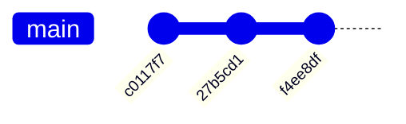
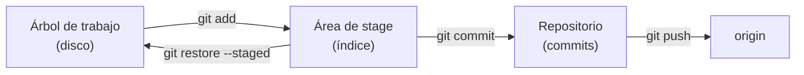
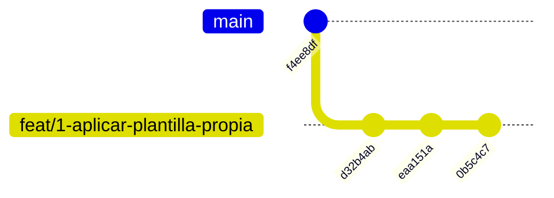
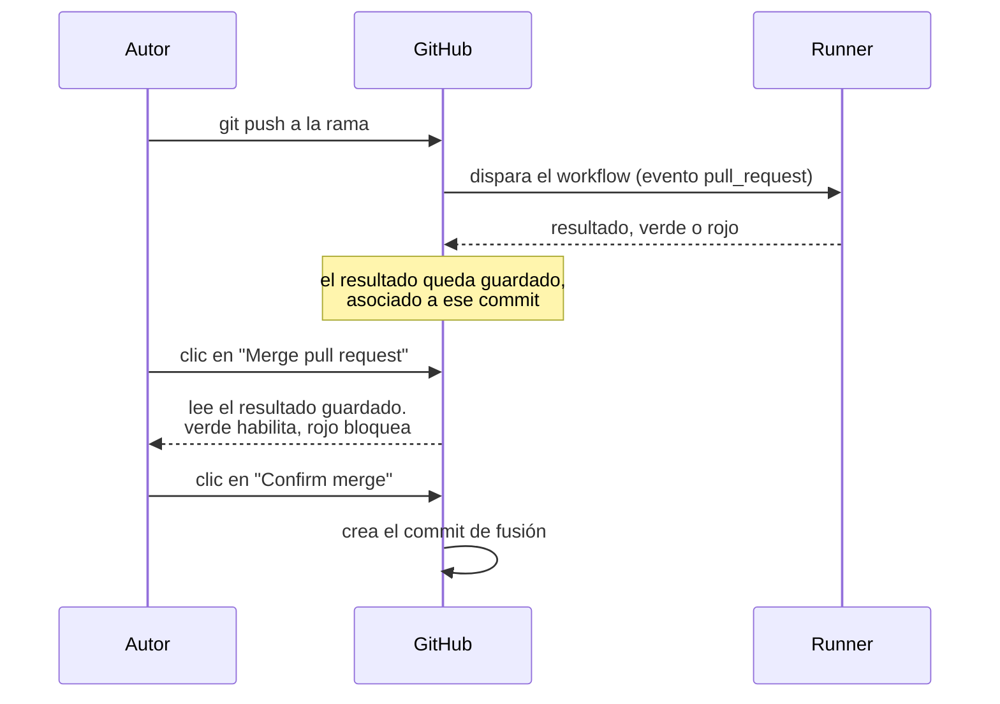

# Experiencia — GitHub Flow paso a paso

Bitácora de una ejecución real y guiada de GitHub Flow, hecha a mano (sin `gh`, sin scripts de
conveniencia) sobre el repositorio de práctica `LAB/Lab-E2E.WebBlazor.Base`.

El documento se escribe **mientras** se practica: cada paso se anota con el comando que se dio, lo
que devolvió y lo que había que aprender de ahí. No es una guía de referencia —esa es
[la guía práctica](../../../../Guides/GitHubFlow-Practice-Guide/Guia-Practica-GitHubFlow.md)— sino
el registro de qué pasó cuando se aplicó a un repositorio que ya tenía trabajo encima.

## Convención de marcas

Se hereda la de la guía práctica.

| Marca | Significado |
|---|---|
| **[F: ID]** | Fundamentada en fuente externa verificable |
| **[C]** | Convención de este equipo: deliberada y discutible |
| **[E]** | Evidencia observada en esta misma corrida; se transcribe la salida |

---

## Tabla de contenido

1. [Punto de partida](#1-punto-de-partida)
2. [Cómo se adapta la guía a este repositorio](#2-cómo-se-adapta-la-guía-a-este-repositorio)
3. [Bitácora de pasos](#3-bitácora-de-pasos)
4. [El pull request como punto de control](#4-el-pull-request-como-punto-de-control)
5. [Cómo se abre un pull request desde la terminal](#5-cómo-se-abre-un-pull-request-desde-la-terminal)
6. [Preguntas formadoras de criterio](#6-preguntas-formadoras-de-criterio)
7. [Estado de verificación](#7-estado-de-verificación)

---

## 1. Punto de partida

### 1.1 El estado observado

Antes de empezar, el repositorio estaba así **[E: `git status`, `git branch -a`, 2026-09-01]**:

| Hecho | Valor observado |
|---|---|
| Rama actual | `main`, actualizada con `origin/main` |
| Ramas existentes | solo `main` (local y remota); no hay ninguna otra |
| Último commit | `f4ee8df login fix` |
| Remoto | `origin` → `https://github.com/hdcm-dev/Lab-E2E.WebBlazor.Base.git` |
| Entradas modificadas | 139 en total; 16 de ellas sin seguimiento |
| Diferencia contra `HEAD` | 123 archivos, 186 líneas agregadas y 120.563 borradas |
| Workflows | uno solo: `.github/workflows/e2e.yml` |
| Proyectos de prueba | `tests/WebBlazor.E2E.Base.HolaMundo.E2ETests`, `tests/WebBlazor.E2E.Base.Login.E2ETests` |

Las 120.563 líneas borradas no son una pérdida de trabajo: casi todas vienen de sacar el Bootstrap
vendorizado (`wwwroot/lib/bootstrap/**`, minificados y sus `.map`) de los dos proyectos. El trabajo
real está en las 16 entradas sin seguimiento —`Theme/`, `Servicios/`, `Paginas/`, `Componentes/`,
`wwwroot/css/`, `Endpoints/`— que reemplazan la plantilla por defecto de Blazor por una propia.

### 1.2 Por qué este punto de partida es el interesante

La guía práctica arranca de un repositorio limpio: el escenario 00 siembra la aplicación y recién
después empieza el ciclo. Acá el punto de partida es el opuesto y es el que se da en la vida real:
**hay trabajo a medio hacer, y está sobre `main`**.

Eso convierte el primer paso en la lección central del modelo. GitHub Flow tiene una sola rama de
larga vida **[F: GH-1]**, y precisamente por eso `main` no es un lugar donde trabajar: es el lugar
donde el trabajo *llega*, revisado y verificado. Un árbol de trabajo sucio sobre `main` no viola
todavía ninguna regla —nada se integró— pero está a un `git commit` de hacerlo.



Al día de hoy el grafo es una línea recta sin ramas: no hay ningún recorrido del ciclo de seis pasos
hecho todavía. Todo lo que sigue lo construye.

---

## 2. Cómo se adapta la guía a este repositorio

La guía práctica está escrita para tres integrantes rotando roles sobre `Lab-GitFlow`. Esta corrida
es de una sola persona sobre `Lab-E2E.WebBlazor.Base`. Las diferencias se declaran acá para que
después no se lean como desvíos silenciosos.

| Aspecto | La guía supone | Esta corrida | Consecuencia |
|---|---|---|---|
| Integrantes | I1, I2, I3 rotando | uno solo | La revisión es autorrevisión; se hace igual, y se anota que no sustituye una revisión real |
| Repositorio | `Lab-GitFlow`, vacío | `Lab-E2E.WebBlazor.Base`, con historia y trabajo pendiente | El escenario 00 no siembra: la aplicación y las pruebas ya están |
| Workflows | `ci.yml` del anexo | `e2e.yml` propio | Se verifica su disparador antes de exigirlo como check obligatorio |
| Escenario 00 | siembra + protección + pruebas | protección + pruebas + **sacar el trabajo de `main`** | Se agrega un paso previo que la guía no necesita |

El orden de ejecución sí se respeta: **00 → 01 → 02 → 03 → 04 → 05 → 06 → 07**.

---

## 3. Bitácora de pasos

> Esta sección crece de a un paso. Cada entrada se cierra con la salida real del comando antes de
> pasar a la siguiente.

### Paso 1 — Sacar el trabajo pendiente de `main` (cerrado)

**Qué se buscaba.** Mover los 139 cambios pendientes a una rama corta, sin perder nada y sin dejar
rastro en `main`.

**El concepto.** En Git una rama es un puntero a un commit, no una copia de archivos. El árbol de
trabajo y el área de stage son **de la copia local**, no de la rama: por eso `git switch -c` crea la
rama nueva sobre el commit actual y los cambios pendientes *siguen ahí*, ahora bajo el nombre nuevo.
No hay que guardar nada aparte ni hacer un commit de emergencia.

**Lo que se ejecutó:**

```bash
git switch -c feat/1-aplicar-plantilla-propia
git status --short | wc -l
git branch
```

**Lo que devolvió [E: 2026-09-01]:**

```
Cambiado a nueva rama 'feat/1-aplicar-plantilla-propia'
139
* feat/1-aplicar-plantilla-propia
  main
```

**Lo que confirma.** El `139` es la prueba de que no se perdió nada: es el mismo recuento de antes
del cambio de rama. Y el `git status` posterior mostró que hasta la distinción entre las cuatro
entradas ya preparadas (`Cambios a ser confirmados`) y el resto sobrevivió intacta — el área de
stage tampoco pertenece a la rama.

**Sobre el nombre de la rama.** `feat/1-aplicar-plantilla-propia`: prefijo de tipo, número
correlativo y descripción corta. El modelo solo pide «un nombre corto y descriptivo» **[F: GH-1]**;
la forma con prefijo y número es convención del equipo **[C]**, y su valor es que el nombre sirva de
índice cuando hay varias ramas abiertas a la vez.

---

### Paso 2 — Decidir qué entra y armar el primer commit (cerrado)

**Qué se buscaba.** Convertir 139 entradas sueltas en commits con sentido propio, después de revisar
que todo lo que entra tiene que entrar.

**El concepto — las tres áreas.** Git tiene tres lugares donde vive un cambio: el **árbol de
trabajo** (los archivos como están en disco), el **área de stage** o índice (lo que entraría en el
próximo commit) y el **repositorio** (los commits ya hechos). `git add` mueve del primero al
segundo; `git commit`, del segundo al tercero. El índice existe precisamente para esto: para elegir
un subconjunto y no confirmar todo lo que hay tocado.



**El reparto elegido.** Los 139 cambios se agruparon en tres commits reversibles por separado **[C]**:

| # | Alcance | Contenido |
|---|---|---|
| 1 | `src/WebBlazor.E2E.Base.HolaMundo` | Plantilla propia en HolaMundo: `Theme/`, `Paginas/`, `Componentes/`, `wwwroot/css/`, y la baja del Bootstrap vendorizado |
| 2 | `src/WebBlazor.E2E.Base.Login` | Lo mismo en Login, más `Endpoints/` y `AccesoLayout.razor` |
| 3 | raíz + documentación + evidencia | `Ejemplos.WebBlazor.E2E.Base.slnx`, `README.md`, `Guides/Template-SDD-Aplicado.md`, `evidencia/` |

**Verificación previa [E]:** `grep -rn 'bootstrap\|app.css' src/*/Components/App.razor` no devuelve
nada, así que la baja de `wwwroot/lib/bootstrap/**` y de `wwwroot/app.css` no deja referencias
colgadas en el documento raíz de ninguna de las dos aplicaciones.

**Lo que se ejecutó y devolvió [E: 2026-09-01]:**

```
$ git add src/WebBlazor.E2E.Base.HolaMundo
$ git status --short | grep -c '^[MADR]'
80
$ git commit -m "feat: aplicar la plantilla propia en HolaMundo y quitar el Bootstrap vendorizado"
[feat/1-aplicar-plantilla-propia d32b4ab] ...
 80 files changed, 1486 insertions(+), 60184 deletions(-)
```

**Lo que se aprendió: Git no guarda renombres.** El commit lista `Components/Pages/HolaMundo.razor`
como baja y `Components/Paginas/HolaMundo.razor` como alta, cuatro veces. Git almacena contenido, no
operaciones de archivo: el renombre es una **inferencia** que hace el momento de mostrar el diff,
comparando similitud. Acá ni bajando el umbral la detecta **[E]**:

```
$ git show --stat -M50% d32b4ab -- 'src/WebBlazor.E2E.Base.HolaMundo/Components/Pa*'
 .../Components/Pages/HolaMundo.razor    |  55 --------
 .../Components/Paginas/HolaMundo.razor  | 157 +++++++++++++++++++++
```

De 55 a 157 líneas: el archivo se reescribió, no se movió, y el diff lo refleja con honestidad. La
consecuencia práctica es que `git log <archivo>` no va a cruzar ese punto sin `--follow`, y ni así
cuando la similitud es tan baja.

---

### Paso 3 — Cerrar los otros dos commits (cerrado)

**Qué se buscaba.** Dejar el árbol limpio, con los 139 cambios repartidos en los tres commits
planificados.

**Lo que se ejecutó y devolvió [E: 2026-09-01]:**

```
$ git add src/WebBlazor.E2E.Base.Login
$ git commit -m "feat: aplicar la plantilla propia en Login y quitar el Bootstrap vendorizado"
[feat/1-aplicar-plantilla-propia eaa151a] 90 files changed, 1808 insertions(+), 60378 deletions(-)

$ git add Ejemplos.WebBlazor.E2E.Base.slnx README.md Guides/Template-SDD-Aplicado.md evidencia
$ git commit -m "docs: documentar la aplicación de la plantilla y versionar la evidencia de verificación"
[feat/1-aplicar-plantilla-propia 0b5c4c7] 16 files changed, 278 insertions(+), 1 deletion(-)

$ git status --short | wc -l
0
$ git log --oneline -4
0b5c4c7 (HEAD -> feat/1-aplicar-plantilla-propia) docs: documentar la aplicación ...
eaa151a feat: aplicar la plantilla propia en Login y quitar el Bootstrap vendorizado
d32b4ab feat: aplicar la plantilla propia en HolaMundo y quitar el Bootstrap vendorizado
f4ee8df (origin/main, origin/HEAD, main) login fix
```

**El grafo después de los tres commits:**



`main` y `origin/main` siguen apuntando a `f4ee8df`: los tres commits existen **solo en la copia
local**. Nada se integró todavía, y nada del modelo se ejecutó todavía más allá del primero de los
seis pasos.

---

### Paso 4 — El archivo que no entró (cerrado)

**El hallazgo.** El tercer commit informó 16 archivos, pero `evidencia/` tiene 14 en disco y solo 13
quedaron versionados **[E]**:

```
$ ls evidencia/2026-09-01-aplicacion-template/ | wc -l
14
$ git ls-files evidencia | wc -l
13
$ comm -23 <(find evidencia -type f | sort) <(git ls-files evidencia | sort)
evidencia/2026-09-01-aplicacion-template/verificacion.log
$ git check-ignore -v evidencia/2026-09-01-aplicacion-template/verificacion.log
.gitignore:121:*.log    evidencia/2026-09-01-aplicacion-template/verificacion.log
```

**Por qué importa más de lo que parece.** `git add <carpeta>` **omite en silencio** lo que
`.gitignore` descarta: no advierte, no falla, no cambia el código de salida. El commit se hizo
creyendo que llevaba la evidencia completa y llevaba trece catorceavos de ella. Es el mismo
mecanismo que hace que un `git add -A` parezca seguro cuando no lo es, solo que en la dirección
inversa: acá se perdió algo que se quería, y en el caso simétrico se sube algo que no se quería.

**La corrección elegida.** Regla de negación en vez de `git add -f`, para que el `verificacion.log`
de la próxima corrida no se vuelva a perder. Va **después** de la línea 121, porque `.gitignore` se
evalúa en orden y gana la última coincidencia **[E]**:

```
$ printf '\n# La evidencia de verificación se versiona completa, incluido su log\n!evidencia/**/*.log\n' >> .gitignore
$ git check-ignore -v evidencia/2026-09-01-aplicacion-template/verificacion.log; echo "salida: $?"
.gitignore:432:!evidencia/**/*.log      evidencia/2026-09-01-aplicacion-template/verificacion.log
salida: 0
$ git status --short
 M .gitignore
?? evidencia/2026-09-01-aplicacion-template/verificacion.log
$ git add .gitignore evidencia
$ git commit -m "fix: versionar el log de verificación, excluido por el patrón general de .gitignore"
[feat/1-aplicar-plantilla-propia f8a2a04] 2 files changed, 15 insertions(+)
$ git ls-files evidencia | wc -l
14
```

**Cómo se lee la salida de `check-ignore`.** El código de salida `0` **no** significa «sigue
ignorado»: `git check-ignore -v` sale con 0 cuando encuentra cualquier regla que decida el destino
del archivo, incluidas las de negación. Lo que hay que mirar es el `!` al principio de la regla
informada —`!evidencia/**/*.log`— que es lo que dice que el archivo queda incluido. La comprobación
inequívoca es otra: el archivo pasó a aparecer como `??` en `git status`, o sea visible para Git.

**Sobre no haber usado `--amend`.** Los tres commits anteriores todavía no habían salido de la
máquina, así que reescribirlos habría sido inofensivo. Se prefirió el commit nuevo porque deja el
hallazgo en la historia, que es lo que esta práctica documenta. La regla dura empieza después del
push: una vez que otros tienen los commits, reescribirlos rompe sus copias.

---

### Paso 5 — Publicar la rama (cerrado)

**Qué se buscaba.** Subir los cuatro commits a `origin` y ver qué hace —y qué no hace— la
infraestructura del repositorio cuando aparece una rama nueva.

**Lo que se sabía de antemano [E].** El repositorio tiene un solo workflow,
`.github/workflows/e2e.yml`, y su bloque `on:` declaraba **un único disparador**:

```yaml
on:
  workflow_dispatch:
    inputs:
      navegadores: ...
```

No había `push`, ni `pull_request`, ni `merge_group`. Los jobs corren sobre
`runs-on: [self-hosted, i7infra-dev]`.

**Lo que devolvió [E: 2026-09-01]:**

```
$ git branch -a
* feat/1-aplicar-plantilla-propia
  main
  remotes/origin/HEAD -> origin/main
  remotes/origin/feat/1-aplicar-plantilla-propia
  remotes/origin/main
```

Y en la vista de comparación de GitHub: **4 commits, 188 archivos, 1 contribuyente**, con el cartel
*Able to merge. These branches can be automatically merged.* **[E]**

**Lo que NO pasó, y es el dato.** Ninguna corrida nueva en la pestaña *Actions*. La rama llegó al
servidor y no se verificó nada, porque no hay disparador que reaccione a un push ni a un pull
request. La ausencia es la evidencia del hueco.

**Un riesgo detectado en el camino.** El repositorio es **público** —`GET
/repos/hdcm-dev/Lab-E2E.WebBlazor.Base` devuelve `200` **[E]**— y los jobs corren en un runner
autoalojado. Activar el disparador `pull_request` en esas condiciones hace que un pull request desde
un fork ejecute *el workflow de esa rama, todavía sin revisar*, sobre la máquina propia. La guía
práctica pide expresamente el repositorio **privado** por esta razón. Las tres salidas posibles:

| Opción | Qué implica |
|---|---|
| Poner el repositorio privado | Lo que pide la guía; cierra el tema |
| *Settings → Actions → Fork pull request workflows* → require approval for all outside collaborators | Conserva público y runner propio; se aprueba cada corrida ajena |
| Descomentar `runs-on: ubuntu-latest` | El riesgo se va del hardware; se paga en minutos de runner alojado |

---

### Paso 6 — Instalar el disparador `pull_request` (en curso)

**Qué se busca.** Que el pull request ejecute la verificación. El disparador se agrega **en la rama
del propio pull request**, así que ese pull request estrena el control que instala: en un evento
`pull_request` GitHub ejecuta el workflow tal como está en la rama de origen, no el de `main`.

**El cambio, en el bloque `on:` de `.github/workflows/e2e.yml`:**

```yaml
on:

  pull_request:
    branches: [main]

  workflow_dispatch:
    inputs:
      navegadores:
```

**Lo que deliberadamente no se toca: `NAVEGADORES`.** En un evento `pull_request` el contexto
`inputs` viene vacío, así que la variable toma su valor por defecto —los cuatro navegadores— y la
corrida es larga. Se deja así a propósito: la guía práctica manda observar cuánto tarda el pipeline
completo, porque **ese número es el costo fijo de cada cambio en este modelo** y es el que decide si
integrar varias veces por día es realista. Se optimiza después de medirlo, no antes.

*(Resultado pendiente de ejecución.)*

---

## 4. El pull request como punto de control

Esta sección reúne lo que se fue aclarando durante la práctica sobre qué bloquea qué, y cuándo.
Es el núcleo conceptual del modelo: GitHub Flow no tiene ninguna otra etapa entre el trabajo y la
rama principal.

### 4.1 Las dos funciones del pull request, que no son la misma

Un pull request es dos cosas a la vez, y confundirlas es la fuente de casi todos los malentendidos:

| Función | Existe… |
|---|---|
| **Espacio de conversación** sobre un cambio: diff, comentarios, revisión, historial de la discusión | Siempre, sin configurar nada |
| **Punto de control** antes de la rama principal | **Solo si alguien lo configuró** |

Un repositorio sin protección de rama tiene pull requests que son pura conversación: útiles, pero no
controlan nada. Es el estado en que está `Lab-E2E.WebBlazor.Base` mientras se escribe esto.

**Ejemplo, con el pull request de esta práctica.** El pull request abierto sobre
`feat/1-aplicar-plantilla-propia` muestra 188 archivos, cuatro commits y el diff completo: eso es la
función de conversación, y funcionó sin que nadie configurara nada. La caja de merge, en cambio,
dice *Able to merge* sin consultar absolutamente nada — ni pruebas, ni aprobación. La segunda
función no está: el mismo pull request que sirve para discutir el cambio no impide integrarlo roto.

### 4.2 Los dos mecanismos, que tampoco son el mismo

| Pieza | Qué hace | Qué NO hace |
|---|---|---|
| Disparador `pull_request` en el workflow | Hace que la verificación **corra** y su resultado aparezca en el pull request | No bloquea nada: con la cruz roja el botón *Merge* sigue habilitado |
| Protección de rama con *required status checks* | **Deshabilita el botón** hasta que el check exigido esté en verde | No hace correr nada; espera un resultado que otro produce |

El disparador es condición previa de la protección: sin algo que corra, no hay resultado que exigir.
Además, GitHub solo ofrece como check obligatorio los que **ya reportaron alguna vez** en el
repositorio, de modo que el orden de instalación no es opcional:

**disparador → una corrida → protección.**

**Ejemplo de por qué el orden no es opcional.** Si ahora mismo se entrara a *Settings → Branches* y
se buscara `Reporte unificado` en la lista de checks obligatorios, **no aparecería**: ese job nunca
reportó en este repositorio, porque el único disparador es `workflow_dispatch` y nadie lo lanzó a
mano sobre esta rama. El buscador de GitHub se alimenta de los checks vistos en los últimos días. De
ahí que el paso 6 —instalar el disparador— tenga que preceder al paso 8 —exigirlo—.

### 4.3 Cuándo corre el test, y cuándo se lo consulta



Los checks se disparan por **eventos sobre la rama** —al abrir el pull request y en cada push
posterior, evento `synchronize`—, no por el clic de merge. Cuando se aprieta *Merge*, la
verificación terminó hace rato: GitHub no lanza nada, solo consulta si el commit en la punta de la
rama tiene su check en verde. Por eso el botón puede aparecer deshabilitado con *waiting for status
checks*: no están corriendo por el clic, están corriendo por el push.

**Ejemplo de la confusión que esto evita.** Al abrir el pull request de esta práctica sin el
disparador, la caja de merge queda limpia: ni verde ni roja, sin checks. Después del paso 6, un push
a la misma rama dispara el evento `synchronize` y la caja pasa a mostrar el amarillo de *waiting*
sin que nadie haya tocado el botón *Merge*. Es la prueba directa de que el clic no lanza nada: la
verificación ya estaba corriendo cuando se llegó a la caja.

### 4.4 Los tres botones

| Botón | Qué hace realmente |
|---|---|
| **Create pull request** | Crea el pull request. No toca ninguna rama |
| **Merge pull request** | **No fusiona.** Abre el formulario del commit de fusión, con título y cuerpo editables |
| **Confirm merge** | Acá sí: se crea el commit de fusión y la rama principal avanza |

Los dos últimos son una sola acción en dos tiempos, con un *Cancel* en el medio. El bloqueo por check
fallido pega sobre **Merge pull request**, o sea **aguas arriba de los dos**: nunca se llega al
*Confirm*. Y **Delete branch** aparece recién después del merge, en la misma caja: es el sexto y
último paso del ciclo del modelo **[F: GH-1]**.

### 4.5 Qué se bloquea y qué no

Un check en rojo **no** impide crear el pull request, ni comentarlo, ni revisarlo, ni cerrarlo sin
mergear. Lo único que puede impedir es que su contenido entre a la rama principal. Y «puede» es
literal: depende del estado del repositorio.

| Estado del repositorio | Check en rojo → ¿se puede mergear? |
|---|---|
| Sin protección de rama | **Sí.** Cruz roja y botón verde conviviendo |
| Con protección + `Reporte unificado` obligatorio | **No.** Botón gris, *Required statuses must pass* |
| Con protección pero **sin** *Do not allow bypassing* | **Sí, si quien mergea es administrador.** GitHub avisa y deja pasar |

El tercer caso es el que muerde en un repositorio de una sola persona: el dueño es administrador, y
sin esa casilla la protección es una advertencia que él mismo puede ignorar sin darse cuenta.

**Ejemplo del tercer caso, que es el de este repositorio.** `Lab-E2E.WebBlazor.Base` tiene un solo
contribuyente **[E]**, que es además el dueño. Si se configura la protección sin marcar *Do not allow
bypassing*, el botón de merge aparece con un cartel del tipo «you're bypassing branch protections» y
un botón rojo que **igual deja mergear**. La barrera existe para todos menos para la única persona
que la va a usar.

### 4.6 Cuál check exigir: la trampa de la matriz

Lo que se exige como obligatorio **no es el nombre del workflow** (`E2E`), sino el `name:` de un
**job**. Y `e2e.yml` tiene una matriz: sus jobs de prueba se llaman `Pruebas (chromium)`,
`Pruebas (firefox)`, `Pruebas (webkit)`, `Pruebas (mobile-chrome)` — el nombre incluye el valor de la
matriz **[E]**.

Exigir esos nombres es un error caro: si una corrida usa solo `chromium`, el check
`Pruebas (webkit)` nunca reporta, y el pull request queda bloqueado **indefinidamente** esperando
algo que no va a llegar.

El job correcto ya existe en el workflow **[E]**:

```yaml
reporte:
  name: Reporte unificado
  needs: [preparar, pruebas]
  if: ${{ !cancelled() }}          # corre aunque las pruebas fallen
  ...
  - name: Reflejar el resultado de las pruebas
    if: ${{ needs.pruebas.result != 'success' }}
    run: exit 1                     # y falla si alguna falló
```

Tiene las tres propiedades que necesita un check obligatorio: **siempre corre**, **su nombre es
fijo** y **falla cuando falla cualquier configuración**. El único a exigir es `Reporte unificado`.

**Ejemplo del bloqueo permanente.** Supongamos que se exige `Pruebas (webkit)` y después alguien
lanza el workflow a mano con la opción `chromium`, que es el valor por defecto del `workflow_dispatch`
**[E]**. Esa corrida jamás crea un job llamado `Pruebas (webkit)`. GitHub no lo interpreta como
«no aplica»: lo interpreta como «todavía no llegó», y deja el pull request en *Expected — Waiting for
status to be reported*, para siempre. La única salida es editar la regla de protección.

### 4.7 El resultado precalculado puede quedar viejo

Si el check se calcula en el push y se consulta en el merge, hay una ventana: un pull request
verde el martes, un merge ajeno el miércoles que cambia una firma, y el check sigue verde —es de
martes, sobre un código que ya no es el que va a quedar—. Se mergea algo que rompe la rama principal
sin que ningún control lo haya visto.

| Mecanismo | Cómo lo tapa | ¿Está en este repositorio? |
|---|---|---|
| *Require branches to be up to date* | Obliga a traer la rama principal a la rama del pull request antes de mergear; ese push vuelve a disparar la verificación sobre el código combinado | No todavía; va en la protección |
| Merge queue (evento `merge_group`) | GitHub encola los pull requests aprobados y verifica cada uno contra el resultado de los anteriores justo antes de entrar. Es verificación **en** el momento del merge | No, y para un repositorio de una persona no hace falta |

**Ejemplo concreto de la ventana.** El commit `f8a2a04` de esta rama agregó
`!evidencia/**/*.log` al `.gitignore`. Si en paralelo otra rama hubiera reorganizado ese mismo
archivo, las dos verificaciones darían verde por separado —cada una sobre su propia versión— y la
segunda en mergear dejaría un `.gitignore` fusionado que ninguna de las dos corridas evaluó. No hay
conflicto de Git que lo detecte: las líneas están en lugares distintos del archivo. Eso es
exactamente lo que *Require branches to be up to date* obliga a resolver antes del merge.

---

## 5. Cómo se abre un pull request desde la terminal

La convención del framework para esto está en
[`Git-Workflow-Agente.md`](../../../../../../IA/SDD/IA.SDD.Documentacion/Analisis/Git-Workflow-Agente/Git-Workflow-Agente.md),
y consiste en cuatro pasos sin nada mágico: derivar `<owner>/<repo>` de `git remote get-url origin`,
armar la URL de comparación, redactar título y cuerpo para pegarlos, y opcionalmente abrirla con
`xdg-open`.

```
https://github.com/<owner>/<repo>/compare/main...<tipo>/<slug>?expand=1
```

El `?expand=1` es lo único no evidente: abre el formulario de creación en lugar de la vista de
comparación a secas.

**La mejora aplicada en esta práctica.** `title` y `body` también se aceptan como parámetros de
consulta, así que el formulario llega relleno y desaparece el paso de pegar a mano. La URL resultante
midió 1970 caracteres **[E]**, muy por debajo de cualquier límite práctico.

```python
import urllib.parse
base = "https://github.com/hdcm-dev/Lab-E2E.WebBlazor.Base/compare/main...feat/1-aplicar-plantilla-propia"
url = base + "?expand=1&title=" + urllib.parse.quote(titulo) + "&body=" + urllib.parse.quote(cuerpo)
```

**Lo que una URL no puede hacer, y no es una limitación rodeable.** Crear un pull request es un
`POST`. Una URL que se abre en el navegador es un `GET`, y un `GET` que crea recursos sería un
agujero de CSRF: cualquier página que enlazara abriría pull requests en nombre de quien la visita.
El máximo que da la URL es **el formulario relleno**; el `POST` lo hace GitHub al apretar *Create
pull request*.

**Las tres vías, comparadas:**

| Vía | Quién crea el pull request | Cuándo conviene |
|---|---|---|
| URL de comparación con `title` y `body` | La persona, apretando el botón | Cuando se quiere mirar el diff antes de crear. Es la convención del framework |
| API REST: `POST /repos/{owner}/{repo}/pulls` | El agente, sin intervención | Cuando el ciclo es automático de punta a punta. Acepta `draft` y el objeto completo |
| `gh pr create` | La persona o el agente | Lo más cómodo si se hace seguido; agrega una herramienta entre quien opera y el mecanismo |

En este workspace no hay `gh` ni `hub` instalados **[E]**, pero la credencial de git sirve para la
API: `git credential fill` devuelve un token con alcance `repo`.

**Ojo con la frontera de responsabilidades.** El conocimiento
`Knowledge-Conformacion-Pull-Request-Manual.md` exige que el cierre de unidad lleve **el enlace del
pull request**, y prohíbe al agente **fusionar y borrar la rama** — no crear el pull request. Crear
por API y fusionar por API son decisiones distintas: la primera es una comodidad, la segunda elimina
el único control que no es del agente.

---

## 6. Preguntas formadoras de criterio

> Se agregan a medida que los pasos las van generando.

**P1. El árbol de trabajo estaba sucio sobre `main`. ¿Eso ya es una violación de GitHub Flow?**

No todavía, y la distinción importa. GitHub Flow regula lo que **se integra**: el ciclo de seis
pasos empieza cuando se crea una rama y termina cuando se mergea y se borra **[F: GH-1]**. Un
archivo modificado sin commitear no integró nada; es estado local. Lo que sí sería una violación es
commitear sobre `main` y empujarlo: ahí el cambio entró a la rama de larga vida sin pull request,
sin revisión y sin verificación. La protección de rama del escenario 00 existe justamente para que
esa violación sea imposible aunque alguien se distraiga.

**P2. ¿Por qué mover el trabajo a una rama no requiere `git stash`?**

Porque `git stash` resuelve un problema distinto: guardar los cambios para volver a un árbol limpio
cuando hay que ir a un commit **incompatible** con ellos. Crear una rama sobre el commit actual no
mueve el `HEAD` a otro contenido —apunta al mismo commit— así que no hay conflicto posible y los
cambios se conservan tal cual. Usar `stash` acá agrega dos pasos y un lugar más donde perder
trabajo.

---

**P3. ¿Por qué no confirmar los 139 cambios en un solo commit, si son de una sola tarea?**

Porque el commit es la unidad con la que después se revierte, se revisa y se busca una regresión.
Un commit que toca dos aplicaciones, la solución, el README y catorce archivos de evidencia no se
puede revertir en partes: si algo de ahí adentro falla, el `git revert` se lleva todo lo demás. La
regla operativa es que cada commit sea **reversible por separado** y tenga un mensaje que se pueda
escribir sin la palabra «y». En GitHub Flow esto pesa más que en otros modelos, porque no hay rama
de release donde reacomodar la historia antes de publicarla.

**P4. ¿Va la evidencia de verificación al repositorio?**

Acá sí, y es una decisión declarada **[C]**: `evidencia/2026-09-01-aplicacion-template/` ocupa 428 KB
en 14 archivos —doce capturas, el guion `verificar.mjs` y el `verificacion.log`— y es lo que
respalda que la plantilla quedó aplicada y funcionando **[E]**. Versionarla la ata al commit que la
produjo. El límite es el tamaño: si la evidencia creciera a decenas de megabytes por corrida, el
criterio se invierte y pasa a un almacenamiento externo referenciado desde el commit.

**P5. Si `git add` sirve para «agregar», ¿por qué se usa también para archivos borrados?**

Porque `git add` no agrega archivos: sincroniza el índice con el árbol de trabajo para las rutas
indicadas. Desde Git 2.0, `git add <ruta>` registra altas, modificaciones **y** bajas dentro de esa
ruta. Por eso un `git add src/WebBlazor.E2E.Base.HolaMundo` alcanza para preparar de una vez los
archivos nuevos de `Theme/` y la eliminación de los cincuenta y pico de Bootstrap, sin necesidad de
`git rm`.

---

**P6. Un `git add` de una carpeta no incluyó un archivo. ¿Cómo se detecta eso *antes* del commit?**

Comparando lo que hay en disco con lo que quedó preparado, no confiando en el recuento del commit.
`git status --short --ignored` muestra las rutas descartadas junto a las demás; `git check-ignore -v
<ruta>` dice exactamente qué línea de qué `.gitignore` la descartó, y es la herramienta correcta
cuando ya se sospecha. Lo que **no** funciona es leer la salida del `git commit`: informa lo que
entró, y nada de lo que faltó.

**P7. ¿Se corrige aflojando el `.gitignore` o forzando el archivo?**

Depende de si el caso es una excepción o una regla. `git add -f` resuelve este archivo y ninguno
más: el próximo `verificacion.log` de la próxima corrida se va a volver a perder, en silencio, igual
que este. Una regla de negación en el `.gitignore` —`!evidencia/**/*.log`— declara la intención
donde se lee: *los `.log` se ignoran, salvo los que son evidencia*. La primera es una corrección; la
segunda es una decisión. Para algo que se va a repetir en cada verificación, corresponde la segunda
**[C]**.

**P8. ¿Por qué las reglas de negación tienen que ir después de la regla que niegan?**

Porque `.gitignore` se evalúa en orden y **gana la última coincidencia**. Un `!evidencia/**/*.log`
escrito antes del `*.log` de la línea 121 no tendría ningún efecto: la regla general lo pisaría
después. Hay además una limitación documentada de Git que conviene conocer: no se puede reincluir un
archivo si alguno de sus **directorios** padres está ignorado, porque Git ni siquiera desciende a
listarlo. Acá no aplica —lo ignorado es el patrón de archivo, no la carpeta— pero es la causa
habitual de que una negación «no funcione».

---

**P9. ¿Alcanza con un workflow de `workflow_dispatch` para practicar GitHub Flow?**

No, y es la diferencia entre «el pipeline informa» y «el pipeline bloquea». Un workflow manual
puede correr las mismas pruebas y dar el mismo resultado, pero como nadie garantiza que alguien lo
lance antes de mergear, no puede configurarse como check obligatorio de la protección de rama. En un
modelo con rama de release eso se sobrelleva: hay una ventana de estabilización donde el defecto
aparece antes de producción. En GitHub Flow no hay ventana —cada merge a la rama principal es, en el
modelo puro, un despliegue **[F: GH-1]**— así que la automatización disparada por evento no es un
accesorio, es la condición de posibilidad del modelo.

**P10. ¿Por qué `push` y `pull_request` son disparadores distintos si parecen cubrir lo mismo?**

Porque responden preguntas distintas. `push` verifica el commit tal como quedó en la rama de origen;
`pull_request` verifica, por defecto, un commit de fusión hipotético entre la rama y el destino. La
segunda es la que importa para decidir un merge: contesta «¿funciona **después** de integrar?», no
«¿funcionaba aislado?». Es también por qué la protección de rama ofrece *require branches to be up
to date*: sin eso, dos pull requests verdes por separado pueden romper la rama principal al
entrar uno detrás del otro.

**P11. ¿Un check en rojo impide crear el pull request?**

No. No impide crearlo, ni comentarlo, ni revisarlo, ni cerrarlo sin mergear. Lo único que puede
impedir es que su contenido entre a la rama principal, y solo si hay protección configurada. Es
deliberado: el pull request es el lugar donde el código roto **se muestra**, no donde se rechaza. Si
crear el pull request estuviera bloqueado, no habría dónde ver el fallo ni dónde discutirlo. El
autor corrige con commits nuevos en la misma rama —cada push vuelve a disparar la verificación— y el
pull request pasa a verde sin cerrarse ni reabrirse.

**P12. Con el check en rojo, ¿en qué momento exacto aparece el bloqueo?**

Sobre el botón *Merge pull request*, que es el primero de los dos pasos de la fusión, no sobre
*Confirm merge*. El botón aparece gris con el cartel *Required statuses must pass before merging* y
nunca se llega al formulario. Dicho de otro modo: el bloqueo está aguas arriba de los dos botones, no
entre ellos.

**P13. Si el resultado del check ya está calculado, ¿para qué sirve *Require branches to be up to
date*?**

Para cerrar la ventana entre el cálculo y el uso. El check verde certifica el código de **la rama del
pull request**, no el de la fusión con la rama principal tal como está *ahora*. Esa casilla obliga a
traer la rama principal antes de mergear, y ese push vuelve a disparar la verificación sobre el
código combinado. Es la versión barata del problema; la versión completa —verificar en el momento
del merge, encolando— es la merge queue.

**P14. ¿Por qué exigir el job agregador y no los jobs de prueba?**

Porque el nombre del check obligatorio es un contrato con GitHub, y tiene que ser un nombre que
**siempre** se cumpla. Los jobs de una matriz aparecen y desaparecen según los valores de esa matriz,
así que exigirlos convierte una variación legítima de configuración en un bloqueo permanente. Un job
agregador con `needs:` sobre la matriz, `if: !cancelled()` para correr aunque haya fallos, y un paso
final que devuelve `exit 1` si algo falló, ofrece un nombre estable con la misma información. Es un
patrón general, no una particularidad de este workflow.

---

## 7. Estado de verificación

| Ítem | Estado |
|---|---|
| Estado inicial del repositorio registrado con evidencia | verificado **[E]** |
| Trabajo pendiente movido fuera de `main` | verificado **[E]** — rama `feat/1-aplicar-plantilla-propia`, 139 entradas intactas |
| Trabajo confirmado en commits | verificado **[E]** — `d32b4ab`, `eaa151a`, `0b5c4c7`; árbol limpio |
| Evidencia versionada completa | verificado **[E]** — 14 de 14, tras la regla de negación en `.gitignore` (`f8a2a04`) |
| CI disparada por evento | en curso (paso 6) — `e2e.yml` solo tenía `workflow_dispatch` |
| Riesgo del runner autoalojado en repositorio público | **abierto** — decisión pendiente entre privado, aprobación de forks o runner alojado |
| Rama publicada en `origin` | verificado **[E]** — `remotes/origin/feat/1-aplicar-plantilla-propia`, 4 commits, 188 archivos |
| Pull request abierto | pendiente |
| Protección de `main` configurada | pendiente |
| Pruebas E2E corriendo localmente | pendiente |
| Ciclo de seis pasos recorrido al menos una vez | pendiente |
