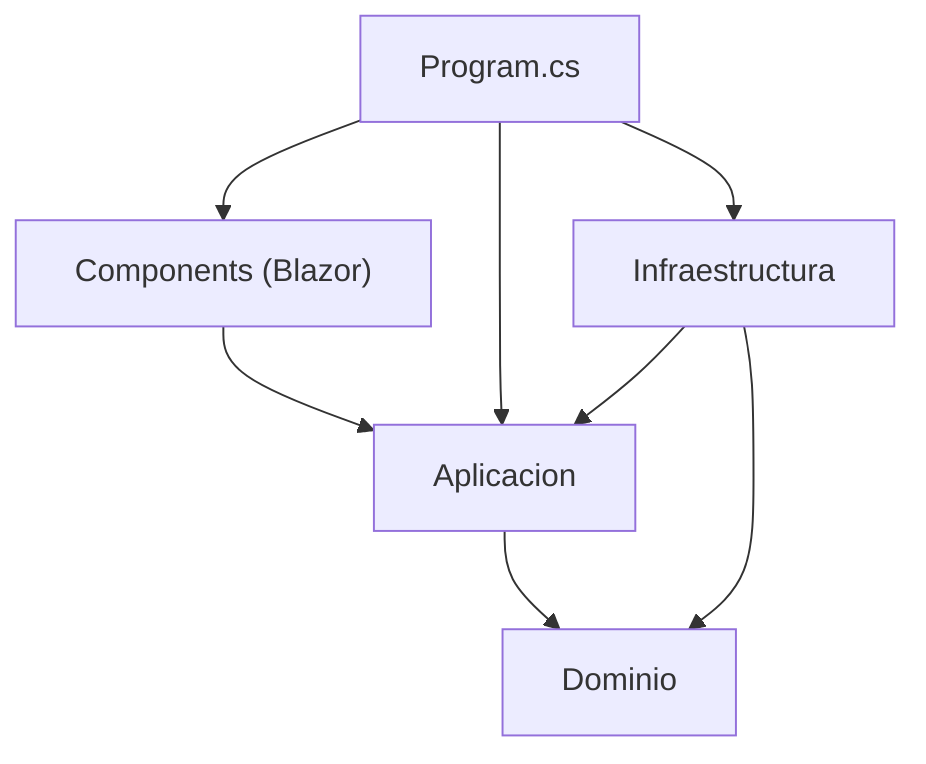

# 00 — Índice maestro

> **Propósito**: dar la visión general de `Lab-Documentos` —qué es, con qué está construido, cómo
> se relaciona con los demás repositorios del laboratorio y qué decisiones lo definen— para poder
> ubicar cualquier tema sin abrir el código.
> **Fuente primaria**: `Lab-Documentos/README.md`, `Lab-E2E.WebBlazor.sln`, historial de `git log`.

## Qué es este repositorio

`Lab-Documentos` es el **repositorio de práctica** del laboratorio de modelo de ramas. Su
documentación —la guía del procedimiento, los escenarios y el análisis— vive en el repositorio
hermano `Lab-Documentos.Documentacion`, que es donde reside también esta ia-db.

Para que los escenarios de ramas se ejerciten sobre algo real, el repositorio está **sembrado** con
la aplicación *Movilidad Urbana* y su suite E2E, tomadas del laboratorio `Lab-E2E.WebBlazor`. De ahí
que la solución conserve el nombre `Lab-E2E.WebBlazor.sln` aunque el repositorio se llame
`Lab-Documentos`.

| Repositorio | Rol |
| --- | --- |
| `Lab-Documentos` | Este. Código de práctica: aplicación, pruebas y workflows |
| `Lab-Documentos.Documentacion` | Guía del procedimiento, escenarios, prompts y esta ia-db |
| `Lab-E2E.WebBlazor` | Origen de la aplicación sembrada y de la definición reutilizable de E2E |

Fuente: `Lab-Documentos/.git` (remote `hdcm-dev/Lab-Documentos`), `Lab-Documentos.Documentacion/README.md`.

## Qué hace la aplicación

Dos pantallas de gestión, elegidas por ser las que mejor ejercitan una suite E2E:

| Pantalla | Ruta | Qué ejercita |
| --- | --- | --- |
| ABM de localidades | `/localidades` | Alta, modificación, baja con confirmación, validación en servidor, filtro por provincia, persistencia |
| Encuesta de transporte | `/encuesta` | Asistente de tres pasos con validación por paso, barra de progreso y resumen final |
| Portada | `/` | Accesos a las dos pantallas |
| No encontrado | `/no-encontrado` | Re-ejecución de códigos de estado |
| Error | `/Error` | Manejador de excepciones fuera de Development |

Detalle en [04_Presentacion-Blazor.md](04_Presentacion-Blazor.md).

## Stack y versiones

| Componente | Versión | Dónde se declara |
| --- | --- | --- |
| .NET / TargetFramework | `net10.0` | ambos `.csproj` |
| EF Core SQLite | 10.0.11 | `src/MovilidadUrbana.Web/MovilidadUrbana.Web.csproj` |
| Playwright para .NET (NUnit) | 1.62.0 | `tests/MovilidadUrbana.E2ETests/MovilidadUrbana.E2ETests.csproj` |
| NUnit / NUnit3TestAdapter | 4.3.2 / 5.0.0 | ídem |
| Microsoft.NET.Test.Sdk | 17.14.0 | ídem |
| Imagen SDK (scripts) | `mcr.microsoft.com/dotnet/sdk:10.0` | `scripts/dotnet.sh` |
| Imagen Playwright (scripts) | `mcr.microsoft.com/playwright:v1.62.1-noble` | `scripts/pruebas.sh` |
| Bootstrap | 5.3.8 vendorizado, sin bundle JS | `src/MovilidadUrbana.Web/wwwroot/vendor/bootstrap/` |

## Decisiones clave

Las cinco que explican la forma del proyecto. El detalle y las alternativas descartadas están en
[08_Decisiones-Y-Glosario.md](08_Decisiones-Y-Glosario.md).

| Decisión | Consecuencia |
| --- | --- |
| Las E2E son un proyecto **de la solución**, con el binding .NET de Playwright | Se depuran desde Visual Studio; se pierden `--shard`, reporter `blob` y reporte HTML del runner JS |
| **Aislamiento por cookie de sesión**, no por base por prueba | Las clases de prueba corren en paralelo contra una sola instancia y un solo archivo SQLite |
| **Publicar e instalar navegadores en el fixture**, no en el build | Corre igual en consola, IDE y CI; se desactiva con `PUBLICAR_ANTES_DE_PROBAR` / `INSTALAR_NAVEGADORES` |
| **Sin JavaScript de Bootstrap**: menú y modal por estado del componente | Desaparece la clase de carrera click-durante-animación de la versión estática |
| **`EnsureCreated`, no migraciones** | El binario publicado arranca en cualquier máquina sin pasos previos; el esquema no se versiona |

## Mapa de dependencias entre capas

`Dominio` no depende de nada; `Program.cs` es el único punto que conoce las cuatro.
Detalle en [01_Arquitectura.md](01_Arquitectura.md).

## Historia del repositorio

Cuatro pull requests fusionados sobre `main`, en orden:

| PR | Commit | Qué aportó |
| --- | --- | --- |
| #1 | `4d4d637` | Sembrar la aplicación de práctica y sus pruebas E2E |
| #2 | `9867aa2` | Workflows de release y auditoría de convergencia |
| #3 | `ae91bde` | `CODEOWNERS` |
| #4 | `e744ccf` | Filtro de provincia en el listado de localidades |

Fuente: `git log --oneline` sobre `main` (`e1a39bf`).

## Divergencias detectadas

Hechos verificados el 2026-09-01, entre el `README.md` del repositorio y el estado del código.
No se corrigieron: la ia-db documenta, no modifica el proyecto indexado.

| # | El README dice | El repositorio tiene | Evidencia |
| --- | --- | --- | --- |
| 1 | «el Explorador de pruebas descubre los **22** casos» y «22 pruebas por configuración: 88 en total» | **25** casos: 4 en `NavegacionTests`, 12 en `LocalidadesTests`, 9 en `EncuestaTests` | `grep -c '\[Test\]'` sobre los tres archivos |
| 2 | Una carpeta `Guides/` con `Beginner-Guide.md` y `Quick-Guide-ABM.md`, también declarada como carpeta de solución | La carpeta **no existe** ni está versionada; la referencia quedó en el `.sln` | `git ls-files`, `ls Guides` |
| 3 | `ci.yml` corre en `ubuntu-latest`, tiene job `compilacion` y job `comentario-en-pr` | `ci.yml` corre en `[self-hosted, i7infra-dev]`, sus jobs son `verificacion-rapida`, `e2e` y `ci-ok`, y no comenta en el PR | `.github/workflows/ci.yml` |

La divergencia 1 se explica por el PR #4, que agregó tres pruebas de filtro sin actualizar el
conteo. Las divergencias 2 y 3 provienen de que el README llegó con la aplicación sembrada desde
`Lab-E2E.WebBlazor` y describe aquel repositorio, no este: el PR #2 reemplazó el `ci.yml` original
por el del modelo de ramas.

Sobre la divergencia 2: los dos archivos existen, pero en el repositorio de documentación, bajo
`Lab-Documentos.Documentacion/Guides/E2E-Guide/` —carpeta todavía sin versionar al momento de
indexar—. La referencia del `.sln` apunta a una ruta relativa al repositorio de código, donde no
están.

**No verificado desde esta indexación**: la ejecución real de las pruebas y de los workflows. Las
cifras de la sección «Evidencia» del README corresponden a una corrida del 2026-08-23 sobre el
estado anterior al PR #4.
