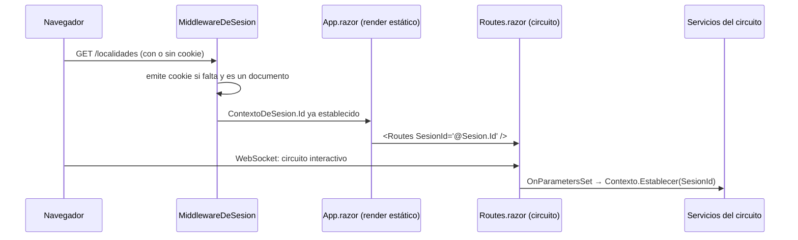

# 01 — Arquitectura

> **Propósito**: describir cómo está organizado el código de la aplicación, qué responsabilidad
> tiene cada capa, hacia dónde apuntan las dependencias y dónde se compone todo.
> **Fuente primaria**: `src/MovilidadUrbana.Web/Program.cs` y el árbol de `src/MovilidadUrbana.Web/`.

## Forma general

Un **único proyecto** (`MovilidadUrbana.Web`, SDK `Microsoft.NET.Sdk.Web`) con las capas de Clean
Architecture separadas en carpetas y no en ensamblados. La regla de dependencia se sostiene por
convención de `namespace` y por revisión, no por el compilador.

| Capa | Carpeta | Responsabilidad | Depende de |
| --- | --- | --- | --- |
| Dominio | `Dominio/` | Entidades, reglas de negocio y catálogos | nada |
| Aplicación | `Aplicacion/` | Casos de uso, modelos de pantalla, abstracciones de salida | Dominio |
| Infraestructura | `Infraestructura/` | EF Core sobre SQLite, cookie de sesión, siembra | Aplicación, Dominio |
| Presentación | `Components/` | Páginas y layout Blazor | Aplicación, Dominio |
| Composición | `Program.cs` | Registro de servicios y pipeline HTTP | todas |

## Árbol comentado

```
src/MovilidadUrbana.Web/
├── Program.cs                    Composición: cultura, DI, pipeline, render mode
├── MovilidadUrbana.Web.csproj    net10.0, nullable, implicit usings, EF Core Sqlite
├── appsettings*.json             Solo logging y AllowedHosts; la cadena de conexión no está acá
├── Properties/launchSettings.json  Perfil `http` en localhost:5232 (solo `dotnet run` local)
├── Dominio/
│   ├── Catalogos.cs              Provincias, medios, frecuencias, motivos + sus etiquetas
│   ├── Entidades/                Localidad · RespuestaDeEncuesta · Sesion
│   └── Reglas/                   ReglasDeLocalidad · ReglasDeEncuesta
├── Aplicacion/
│   ├── Resultado.cs              Salida de un caso de uso: éxito, mensaje, errores por campo
│   ├── Abstracciones/            IRepositorioDeLocalidades · IRepositorioDeEncuestas · IContextoDeSesion
│   ├── Localidades/              ServicioDeLocalidades + ModeloDeLocalidad
│   └── Encuestas/                ServicioDeEncuestas + ModeloDeEncuesta
├── Infraestructura/
│   ├── Persistencia/             ContextoDeDatos · Repositorios · SembradorDeSesion · PreparadorDeBaseDeDatos
│   └── Sesiones/                 ContextoDeSesion · MiddlewareDeSesion
├── Components/
│   ├── App.razor                 Documento HTML; único lugar que lee la cookie
│   ├── Routes.razor              Router + puente del identificador de sesión al circuito
│   ├── _Imports.razor            Usings compartidos por todos los componentes
│   ├── Layout/                   MainLayout (menú, testigo de interactividad) · ReconnectModal
│   └── Pages/                    Inicio · Localidades · Encuesta · NoEncontrado · Error
└── wwwroot/                      Bootstrap vendorizado + estilos propios
```

## Composición: `Program.cs`

El orden importa y explica varias decisiones. Secuencia real del archivo:

1. **Cultura fija `es-AR`** en `DefaultThreadCurrentCulture` y `DefaultThreadCurrentUICulture`.
   Los separadores de miles y decimales forman parte de lo que verifican las pruebas E2E, así que
   no pueden depender de la cultura del servidor.
2. `AddRazorComponents().AddInteractiveServerComponents()`.
3. **Cadena de conexión**: `ConnectionStrings:BaseDeDatos`, con respaldo
   `Data Source=datos/movilidad.db;Default Timeout=30`. No está en `appsettings.json`: la
   definen la variable de entorno del fixture de pruebas o el despliegue.
4. `AddDbContextFactory<ContextoDeDatos>` — **fábrica**, no `DbContext` con alcance de ámbito
   (ver [03_Persistencia-Y-Sesiones.md](03_Persistencia-Y-Sesiones.md)).
5. Servicios de infraestructura con alcance de ámbito: `ContextoDeSesion` (registrado dos veces,
   como concreto y como `IContextoDeSesion` resuelto sobre la misma instancia), `SembradorDeSesion`
   y los dos repositorios.
6. Servicios de aplicación: `ServicioDeLocalidades`, `ServicioDeEncuestas`.
7. `PreparadorDeBaseDeDatos.Preparar(app.Services)` — crea archivo, esquema y activa WAL.
8. `UseExceptionHandler("/Error")` fuera de Development · `UseStatusCodePagesWithReExecute("/no-encontrado")`.
9. `UseMiddleware<MiddlewareDeSesion>()` **antes** de `UseAntiforgery()`.
10. `MapStaticAssets()` · `MapRazorComponents<App>().AddInteractiveServerRenderMode()`.

`ContextoDeSesion` registrado dos veces sobre la misma instancia es lo que permite que el
middleware —que necesita el tipo concreto para escribir— y los repositorios —que solo leen a través
de la interfaz— compartan el mismo valor dentro del ámbito.

## El circuito de Blazor y el puente de sesión

Es la particularidad arquitectónica del proyecto: **un circuito de Blazor Server no tiene acceso a
la petición HTTP que lo originó**, así que la cookie no se puede leer desde una página.



El parámetro debe ser serializable, por eso es un `string`. Detalle del middleware y de la
validación del identificador en [03_Persistencia-Y-Sesiones.md](03_Persistencia-Y-Sesiones.md).

## Frontera de la solución

```
Lab-E2E.WebBlazor.sln
├── src/            → MovilidadUrbana.Web
├── tests/          → MovilidadUrbana.E2ETests   (sin ProjectReference a la aplicación)
├── github-workflow → ci.yml, e2e.yml, verificacion-entorno.yml   (carpeta de solución)
├── Guides          → dos .md que no existen en el repositorio (ver divergencia 2 del maestro)
└── scripts         → los tres .sh (carpeta de solución)
```

Las carpetas de solución no se compilan ni afectan el build; solo agrupan archivos sueltos en el
Explorador de soluciones. **El proyecto de pruebas no referencia al de la aplicación**: la ejercita
como proceso externo sobre el binario publicado, no en memoria
(ver [05_Pruebas-E2E.md](05_Pruebas-E2E.md)).

Las tres carpetas de solución declaradas en el `.sln` no incluyen `release.yml` ni
`auditoria-convergencia.yml`, agregados después por el PR #2.
