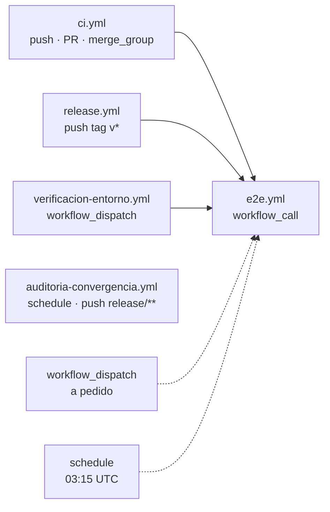

# 06 — Integración continua y workflows

> **Propósito**: describir los cinco workflows de GitHub Actions del repositorio, quién invoca a
> quién, en qué runner corre cada uno y qué controla cada pieza del modelo de ramas.
> **Fuente primaria**: `.github/workflows/` y `.github/CODEOWNERS`.

## Mapa

`e2e.yml` es **el único lugar donde está escrito cómo se corren las pruebas**; los otros deciden
*cuándo* y *con cuánto alcance*.

## `e2e.yml` — definición reutilizable

Tres disparadores:

| Disparador | Para qué |
| --- | --- |
| `workflow_call` | Lo invocan `ci.yml`, `release.yml` y `verificacion-entorno.yml`; también otro repositorio |
| `workflow_dispatch` | Corrida a pedido desde *Actions*, eligiendo configuraciones y entorno |
| `schedule` | Regresión completa a las 03:15 UTC (≈00:15 en Argentina) |

Entradas de `workflow_call`: `navegadores` (por defecto `chromium`), `url-base`, `referencia`,
`retencion-dias` (7). Salida: `resultado`, tomado de `jobs.reporte.outputs.resultado`.

Los valores por defecto se repiten en `env` porque **`inputs` está vacío en `schedule`**: ahí
`NAVEGADORES` cae en las cuatro configuraciones.

### Jobs

| Job | Runner | Qué hace |
| --- | --- | --- |
| `publicar` | `ubuntu-latest` | Solo si `url-base` está vacío. Checkout, `setup-dotnet 10.0.x`, **verifica que el SDK coincida con el `TargetFramework`**, publica autocontenido `linux-x64` y sube el artefacto `aplicacion-publicada` |
| `preparar` | `ubuntu-latest` | Traduce la lista separada por comas en la matriz JSON del job siguiente |
| `pruebas` | `ubuntu-latest`, matriz | Una configuración por job, `fail-fast: false`, `timeout 30 min` |
| `reporte` | `ubuntu-latest` | Junta los TRX en una tabla del resumen y refleja el resultado |

Pasos del job `pruebas`, en orden: checkout → SDK → **traducir la configuración** (`mobile-chrome`
se convierte en `NAVEGADOR=chromium` + `EMULAR_MOVIL=true`) → compilar las pruebas → caché de
navegadores → instalar el navegador con `--with-deps` invocando el CLI que viene dentro del paquete
→ descargar el artefacto → **`chmod +x`** (los artefactos se empaquetan en zip y pierden el bit de
ejecución) → `dotnet test` con `PUBLICAR_ANTES_DE_PROBAR=false` y logger TRX → subir `resultados-*`.

La condición de `pruebas` es
`!cancelled() && needs.preparar.result == 'success' && needs.publicar.result != 'failure'`: que
`publicar` se saltee al probar un entorno desplegado no debe arrastrar al job.

La clave de caché de navegadores se apoya en el hash del `.csproj` de pruebas, que es lo que cambia
cuando cambia la versión de Playwright —y con ella las builds de los navegadores—.

El job `reporte` usa un script `node -e` que parsea el bloque `<Counters>` de cada TRX y arma una
tabla por configuración: el binding de .NET no tiene el `merge-reports` del runner de JavaScript.

## `ci.yml` — lo que se ata a la protección de rama

Cubre el modelo de tronco **con ramas de release**. Reemplazó al `ci.yml` que traía la aplicación
sembrada, que solo protegía `main`.

| Disparador | Alcance |
| --- | --- |
| `push` a `main` o `release/**` (con `paths-ignore` de `**/*.md`, `docs/**`, `.gitignore`) | Matriz completa |
| `pull_request` hacia `main` o `release/**` (`opened`, `synchronize`, `reopened`, `ready_for_review`) | Solo `chromium` |
| `merge_group` | Matriz completa |

`concurrency: ci-${{ github.ref }}` cancela la corrida anterior **solo en pull requests**: en `main`
y en las releases conviene conservar el historial de verificación.

| Job | Runner | Qué hace |
| --- | --- | --- |
| `verificacion-rapida` | `[self-hosted, i7infra-dev]` | `dotnet restore` → `dotnet build -warnaserror` → `dotnet test --list-tests` |
| `e2e` | (heredado de `e2e.yml`) | `chromium` en PR; `chromium,firefox,webkit,mobile-chrome` en lo ya integrado |
| `ci-ok` | `[self-hosted, i7infra-dev]` | Único check que la protección de rama necesita exigir |

`--list-tests` es el equivalente del `playwright test --list`: comprueba que el descubrimiento
funcione sin levantar navegadores ni la aplicación.

`verificacion-rapida` corre **también con el pull request en borrador**, a propósito: si se salteara,
`e2e` se saltearía por `needs` y el check obligatorio quedaría en verde sin haber verificado nada.
Coherente con eso, `ci-ok` trata **`skipped` como fallo**: solo da verde con evidencia positiva de
ejecución.

`ci-ok` existe para que la regla de protección de rama no haya que actualizarla cada vez que cambia
la matriz: resume todos los jobs en un único check.

## `release.yml` — publicación de una versión

Se dispara al empujar un tag `v*`, que es el acto que numera una candidata o una versión.
`permissions: contents: write`.

1. `verificacion` — invoca `e2e.yml` con la **matriz completa** sobre la referencia etiquetada y
   `retencion-dias: 30`.
2. `publicar` (`[self-hosted, i7infra-dev]`) — publica autocontenido `linux-x64`, empaqueta
   `movilidad-urbana-<tag>-linux-x64.tar.gz`, lo sube como artefacto con 90 días de retención y
   crea la publicación en GitHub con `actions/github-script`, `generate_release_notes: true`.

El artefacto se construye **una sola vez**: los ambientes promocionan ese binario, no lo recompilan.
Recompilar por ambiente liberaría un binario distinto del que se probó.

Todo tag con sufijo —`-rc1`, `-demo.1`— se marca como **preliberación**: en versionado semántico
tiene menor precedencia que la versión limpia.

## `auditoria-convergencia.yml` — release → main

Detecta el error más caro del modelo: una corrección aplicada en una rama de release que nunca
volvió a `main`. Cuando eso pasa, el defecto reaparece en la versión siguiente y en la release
figura corregido.

Se dispara por `schedule` diario (06:15 UTC ≈ 03:15 en Argentina), por `push` a `release/**` y a
pedido. Corre en `[self-hosted, i7infra-dev]` con `fetch-depth: 0` —`git cherry` necesita la
historia entera—.

El control se apoya en **`git cherry`, que compara por contenido y no por SHA**: tras un cherry-pick
el hash siempre difiere. Los commits marcados con `+` están en la release y no tienen equivalente en
`main`. Se excluyen los que llevan una línea `Convergencia:` en el mensaje, que es la única forma
declarada de explicar un retorno resuelto a mano —así el rojo significa siempre lo mismo—.

Deja una tabla por rama en el resumen, un `::error::` por commit huérfano, y **falla** si hay alguno.

## `verificacion-entorno.yml` — prueba de humo

`workflow_dispatch` con `entorno` (tipo `environment`) y `url-base`, ambos obligatorios. Invoca
`e2e.yml` con `navegadores: chromium` y `retencion-dias: 30`. Con `url-base` cargada el workflow ni
siquiera compila: prueba la aplicación que ya está corriendo. Deja comentado el encadenamiento por
`workflow_run` después de un despliegue.

## Runners

| Workflow | Runner |
| --- | --- |
| `e2e.yml` (los cuatro jobs) | `ubuntu-latest`; la línea `[self-hosted, i7infra-dev]` queda comentada encima de cada uno |
| `ci.yml` (`verificacion-rapida`, `ci-ok`) | `[self-hosted, i7infra-dev]` |
| `release.yml` (`publicar`) | `[self-hosted, i7infra-dev]` |
| `auditoria-convergencia.yml` | `[self-hosted, i7infra-dev]` |

**Nada corre dentro de un contenedor de job.** El runner `i7infra-dev` es él mismo un contenedor y
no tiene montado el socket de Docker: un job con `container:` falla en *Initialize containers* con
`failed to connect to the docker API at unix:///var/run/docker.sock` antes de ejecutar un solo paso.
No hace falta: ese runner ya trae el SDK de .NET 10 sobre Ubuntu 24.04.

El uso de runners de GitHub en `e2e.yml` trajo dos ajustes, ambos anotados en el propio archivo: el
SDK se pide explícitamente con `actions/setup-dotnet` —la imagen de GitHub no garantiza la versión— y
los navegadores se cachean con `actions/cache`, porque los runners de GitHub arrancan limpios y sin
caché bajarían el navegador en cada job de la matriz.

Sobre `/dev/shm`: dentro de un contenedor queda en 64 MB y es la causa clásica de que Chromium muera
a mitad de una corrida. Se midió y a esta escala la suite pasa igual, así que no se usa
`--disable-dev-shm-usage`. Si apareciera esa intermitencia, las salidas son ese argumento de
lanzamiento o más `--shm-size` en el contenedor del runner.

## Prácticas aplicadas

- `permissions` mínimos: `contents: read` salvo `release.yml`, que necesita `contents: write`.
- `timeout-minutes` en todos los jobs y `fail-fast: false` en la matriz, para ver todas las
  combinaciones que fallan y no solo la primera.
- `paths-ignore` en `ci.yml` para no disparar la CI por cambios de documentación.
- Compilar una vez, probar muchas: la aplicación se publica en un job y se reutiliza como artefacto.
- Un paso comprueba que el SDK del runner coincida con el `TargetFramework` del `.csproj`; si
  divergen la corrida falla con un mensaje claro en vez de un error de compilación confuso.

## `CODEOWNERS`

| Ruta | Dueño |
| --- | --- |
| `.github/workflows/` | `@equipo/devops` |
| `src/**/Persistencia/` | `@equipo/datos` |

Son los dos lugares donde un error no se arregla con un revert: el pipeline y las migraciones de
datos. Con «Require review from Code Owners» activo en la protección de rama, esa aprobación es
obligatoria.

> **Nota de trazabilidad**: `@equipo/devops` y `@equipo/datos` son equipos de ejemplo. No se
> verificó que existan en la organización `hdcm-dev`; si no existen, GitHub ignora la línea en
> silencio.
